# 论文关系图谱

> 记录论文之间的引用、对比、演进、互补关系。每次精读后更新。

---

## 关系图（Mermaid）

```mermaid
graph TD
    %% 长期行为序列建模谱系
    MIMN["MIMN\n离线memory压缩\nKDD'19 阿里"]
    SIM["SIM\n两阶段GSU-ESU\nCIKM'20 阿里"]
    ETA["ETA\nSimHash检索\n2021 阿里"]
    SDIM["SDIM\nhash碰撞采样\nCIKM'22"]
    TWIN["TWIN\nGSU-ESU一致性\nKDD'23 快手"]
    GenLI["GenLI ★\n生成+O(1)查表\n美团 2026"]

    MIMN -->|"启发：离线解耦"| SIM
    SIM -->|"改进检索效率"| ETA
    SIM -->|"改进检索效率"| SDIM
    SIM -->|"改进一致性"| TWIN
    TWIN -->|"替代GSU范式"| GenLI

    %% Semantic ID 谱系
    RQVAE["RQ-VAE / TIGER\n层级量化基础\nNeurIPS'23"]
    SPM["SPM / Prefix-Ngram\nSID特征化\nRecSys'24"]
    QuaSID["QuaSID\n固定碰撞惩罚"]
    AdaSID["AdaSID ★\n自适应碰撞处理\n电子科大&快手 2026"]
    SIDCoord["SID-Coord ★\nHID-SID协调\n快手 SIGIR'26"]
    SIDCollision["SID-Collision ★\nCCE+ZCR评估纠偏\n奥塔哥&UNSW 2026"]
    DRQ["DRQ ★\nOπ/Keff诊断框架+解耦量化\nShopee 2026"]

    RQVAE -->|"基础量化方法"| SPM
    RQVAE -->|"基础量化方法"| SIDCoord
    RQVAE -->|"碰撞问题"| QuaSID
    RQVAE -->|"量化失效问题"| DRQ
    QuaSID -->|"静态→自适应"| AdaSID
    QuaSID -.->|"碰撞问题→评估纠偏"| SIDCollision
    SPM -->|"SID集成到排序"| SIDCoord
    AdaSID -.->|"同为碰撞方向"| SIDCollision
    AdaSID -.->|"同为SID量化质量方向"| DRQ
    SIDCollision -.->|"评估纠偏↔诊断框架，互补"| DRQ

    %% 架构创新谱系
    Transformer["标准Transformer\n固定权重残差"]
    AttnRes["Attention Residuals ★\n深度维度注意力\nKimi 2026"]
    ContDLM["连续DLM\n有per-step离散监督"]
    ELF["ELF ★\n无约束Flow Matching\nMIT 2026"]

    Transformer -->|"深度维度问题"| AttnRes
    ContDLM -->|"去除离散约束"| ELF

    %% AI科研自动化 / Agentic系统
    AutoSOTA["AutoSOTA ★\n端到端研究自动化\n清华等 2026"]
    HarnessDesign["harness-design ★\nGenerator-Evaluator分离\nAnthropic 2026"]
    ClaudeCodeArch["claude-code-arch ★\n四层架构+五步压缩\n小林 2026"]

    AutoSOTA -.->|"同为自动化编程方向"| HarnessDesign
    HarnessDesign -->|"官方实现细节"| ClaudeCodeArch

    %% LLM 知识融合谱系
    KAR["KAR\n固定 prompt + MoE融合\nRecSys'24"]
    SeRALM["SeRALM\n固定 prompt + 向量融合\nSIGIR'24"]
    LWGR["LWGR ★\n并行码本软指令 + 拉格朗日约束\n中科院&阿里 2026"]

    RQVAE -->|"生成式ID基础"| LWGR
    KAR -->|"固定指令→个性化"| LWGR
    SeRALM -->|"固定指令→个性化"| LWGR

    %% 推荐 Scaling / embedding collapse 谱系
    RankMixer["RankMixer\n块转置混合+GELU-FFN\n字节 CIKM'25"]
    RankElastor["RankElastor ★\n参数化全混合+GLU-FFN\n腾讯&HKUST-GZ KDD'26"]
    RankUp["RankUp ★\n输入端多样性扩充\n腾讯 2026"]
    TokenFormer["TokenFormer ★\n统一建模+SCP对抗\n腾讯 2026"]

    RankMixer -->|"发现阻尼振荡collapse"| RankElastor
    RankMixer -->|"baseline架构"| RankUp
    RankMixer -->|"baseline架构"| TokenFormer
    RankElastor -.->|"同一团队，互补视角\n架构内部修复"| RankUp
    RankElastor -.->|"同一团队，互补视角\n架构内部修复"| TokenFormer
    RankUp -.->|"同一团队，互补视角\n输入端扩充"| TokenFormer

    %% LLM 评估谱系
    eRankBase["eRank [Roy&Vetterli 2007]\n有效秩基础概念\n奇异值分布熵的指数"]
    DiffeRank["Diff-eRank ★\nLLM降噪能力量化\n上交大&清华 NeurIPS'24"]

    eRankBase -->|"应用到LLM表示评估"| DiffeRank
    eRankBase -->|"应用到推荐collapse诊断"| RankElastor
    eRankBase -->|"应用到推荐collapse诊断"| TokenFormer
    eRankBase -->|"应用到推荐collapse诊断"| RankUp

    %% 长期历史 RAG 谱系
    Memento["Memento ★\nRAG范式+MMR检索\nMeta AI 2026"]

    TWIN -->|"超长历史建模前作"| Memento
    SIM -->|"GSU-ESU框架启发"| Memento
    GenLI -.->|"同为长期历史建模\n不同范式：生成vs检索"| Memento

    %% 生成式重排序谱系
    PRM["PRM\n单阶段个性化重排序\nRecSys'19 阿里"]
    GReF["GReF\n端到端生成式重排序\nCIKM'25 阿里"]
    NLGR["NLGR\n邻居列表+稀疏奖励\nWWW'25 阿里"]
    GoalRank["GoalRank\nGRPO+奖励模型\n2025 阿里"]
    DeGRe["DeGRe ★\n离线探索+稠密监督蒸馏\n浙大&阿里 KDD'26"]

    PRM -->|"单阶段→生成式"| GReF
    GReF -->|"启发式标签偏差问题"| DeGRe
    NLGR -->|"稀疏奖励问题"| DeGRe
    GoalRank -->|"最强baseline"| DeGRe

    %% 召回排序统一谱系
    PinRec["PinRec\n生成式召回基础\nPinterest 2025"]
    HSTU2["HSTU\n统一架构但分开训练\nMeta ICML'24"]
    OnePiece["OnePiece\n统一训练但未同时部署\nShopee 2025"]
    OneRec["OneRec\n端到端生成绕过漏斗\n快手 2025"]
    RelayGR["RelayGR\nKV缓存跨阶段（独立训练）\n2026"]
    UniPinRec["UniPinRec ★\n全栈统一：MAM+混合训练+KV缓存共享\nPinterest 2026"]

    PinRec -->|"直接基础，扩展为统一模型"| UniPinRec
    HSTU2 -->|"统一架构但输入格式不兼容"| UniPinRec
    OnePiece -->|"统一训练但未同时部署"| UniPinRec
    OneRec -.->|"端到端生成路线，替换整条流水线"| UniPinRec
    RelayGR -.->|"KV缓存跨阶段思路，但独立训练"| UniPinRec

    %% 生成式推荐推理谱系
    OneRecBase["OneRec\n只会一口气生成(System-1)\n快手 2025"]
    OpenOneRec["OneRec-Think/OpenOneRec\n硬接CoT，思考≤不思考\n快手 2025-26"]
    TIGER2["TIGER/LC-Rec\nitemic token基础+对比基线\nNeurIPS'23 / ICDE'24"]
    OneReason["OneReason ★\n感知+认知地基+specialize-then-unify\n首次思考>不思考\n快手 2026"]
    CaLIR["CaLIR ★\n类目引导潜在意图推理\n隐式推理+动态前缀树约束解码\n北航&美团 2026"]
    Coconut["Coconut\n连续潜在推理范式\nHao et al. 2024"]

    OneRecBase -->|"System-1→加入思考"| OpenOneRec
    OpenOneRec -->|"诊断思考失效，补感知+认知地基"| OneReason
    TIGER2 -->|"itemic token基础与对比基线"| OneReason
    TIGER2 -->|"基础框架与主要基线"| CaLIR
    OneRecBase -.->|"同源体系，线上Fast-Slow协同"| OneReason
    DiffeRank -.->|"同为表示/推理能力分析，跨领域"| OneReason
    HSTU2 -.->|"ID-based对比基线"| OneReason
    Coconut -->|"连续潜在推理范式启发"| CaLIR
    RQVAE -->|"SID量化基础"| CaLIR
    OneReason -.->|"显式CoT vs 隐式潜在推理\nCaLIR RQ4证明显式CoT最差"| CaLIR

    %% 自监督视觉表示学习谱系
    DeepCluster["DeepCluster\n离线聚类自监督\nFBAI 2018"]
    MoCo["MoCo/MoCov2\nmomentum encoder+memory bank\nFBAI 2020"]
    SimCLR["SimCLR\npairwise对比+大batch\nGoogle 2020"]
    SwAV["SwAV ★\n在线聚类+交换预测+multi-crop\nInria&FBAI NeurIPS'20"]
    BYOL["BYOL\nmomentum encoder+无负样本\nDeepMind 2020"]
    DINO["DINO ★\nself-distillation+centering+sharpening\nFBAI&Inria ICCV'21"]

    DeepCluster -->|"离线→在线聚类"| SwAV
    MoCo -->|"对比学习baseline"| SwAV
    SimCLR -->|"multi-crop对SimCLR也有效"| SwAV
    SwAV -->|"multi-crop直接继承"| DINO
    BYOL -->|"momentum encoder启发"| DINO
    MoCo -->|"momentum encoder启发"| DINO
    SwAV -->|"同一作者Caron\n聚类→蒸馏演进"| DINO

    %% CTR 知识蒸馏谱系
    GDCN["GDCN\n门控深度交叉网络\n2023"]
    FinalMLP["FinalMLP\n双流MLP+特征门控\nAAAI'23"]
    ECKD["ECKD\n多教师集成蒸馏\n2024"]
    DSMLP["DS-MLP ★\n蒸馏显式交互进MLP+双流对齐\n人大&字节&美团 TKDD'26"]

    GDCN -->|"作为Teacher模型"| DSMLP
    FinalMLP -.->|"同为双流MLP方向"| DSMLP
    ECKD -.->|"同为KD-based CTR方向"| DSMLP

    %% 跨领域关联
    AdaSID -.->|"同为SID方向"| SIDCoord
    GenLI -.->|"对比：离线vs在线"| MIMN
    GenLI -.->|"同为LLM增强推荐"| LWGR
    GenLI -.->|"同为推荐工业落地"| RankElastor
    TokenFormer -.->|"同为推荐工业落地"| GenLI
    RankUp -.->|"同为推荐工业落地"| GenLI
    DiffeRank -.->|"eRank降低=成功 vs eRank降低=失败"| RankElastor
    GenLI -.->|"同为阿里系工业推荐\n不同阶段：CTR预估vs重排序"| DeGRe
    GenLI -.->|"同为美团CTR工业落地"| DSMLP
```

---

## 关系详解

### GenLI ↔ MIMN
**关系类型**：同一问题的不同解法，互补而非竞争

MIMN 把序列处理搬到离线，用 Memory Network 增量更新 K 个兴趣向量，在线不碰原始序列。GenLI 在线生成兴趣分布，用 O(1) 查表替代 pairwise 内积，仍然访问原始序列但极其便宜。

核心分歧：MIMN 用离线计算换在线速度（有损压缩，有延迟）；GenLI 用 O(1) 查表换在线速度（保留原始行为细节，实时响应）。

适用场景：MIMN 适合序列极长（万级）且对实时性要求不高；GenLI 适合序列中等长（千级）且需要实时捕捉最新兴趣。

---

### GenLI ↔ TWIN
**关系类型**：GenLI 是 TWIN 的直接竞争者，替代 GSU 范式

TWIN 的核心贡献是让 GSU 和 ESU 使用相同的 attention 机制，保证两阶段一致性。但 GSU 仍然是 target-centered 的，复杂度仍然是 O(L·d)。GenLI 直接替换掉 GSU 的设计哲学，把 target-centered 检索变成 target-independent 生成+查表。

实验对比：工业数据集 GenLI AUC 0.7463 vs TWIN 0.7441（+0.22%），推理时间 4.6ms vs 7.9ms。

---

### SID-Coord ↔ AdaSID
**关系类型**：同一技术方向（SID）的不同子问题

SID-Coord 关注的是"如何把 SID 集成到排序模型里"（集成问题），AdaSID 关注的是"如何让 SID 的量化质量更好"（量化问题）。两者可以叠加：先用 AdaSID 训练出更好的 SID，再用 SID-Coord 的方式集成到排序模型。

---

### Attention Residuals ↔ ELF
**关系类型**：同为基础架构创新，问题域不同

两篇都在挑战现有架构的某个"理所当然"的设计：Attention Residuals 挑战的是"残差连接应该是固定权重的"，ELF 挑战的是"连续 DLM 必须在中间步骤做离散监督"。都是"把一个已有机制（注意力/Flow Matching）用到一个新的地方"的思路。

---

### LWGR ↔ KAR / SeRALM
**关系类型**：LWGR 是 KAR/SeRALM 的直接竞争者，解决了它们的两个核心缺陷

KAR 和 SeRALM 都用固定的手工设计 prompt 来提取 LLM 知识，再直接融入 GR。LWGR 的两个核心改进：（1）把固定 prompt 换成个性化软指令（并行码本量化用户上下文）；（2）把无约束融合换成拉格朗日约束优化。实验中 LWGR 在最强 baseline（TIGER+SeRALM）基础上进一步提升 7%~11%。

---

### LWGR ↔ GenLI
**关系类型**：同为“LLM/外部信息增强推荐”，路径不同，可叠加

GenLI 解决的是“如何把长期行为序列的信息压缩成 target-independent 兴趣分布”，LWGR 解决的是“如何把 LLM 的世界知识通过个性化软指令提取出来”。两者处理的信息源不同（历史行为 vs LLM 知识），理论上可以叠加使用。

---

### claude-code-arch ↔ harness-design
**关系类型**：claude-code-arch 是 harness-design 的源码级实现细节补充

harness-design 是 Anthropic 官方工程博客，描述了 Generator-Evaluator 分离架构和 Context Reset 等高层设计原则。claude-code-arch 基于泄漏的 Claude Code 源码，揭示了这些原则在实际代码中的具体实现：Tool-Use Loop 的 while(true) 循环、五步上下文压缩策略、四类型记忆系统、System Prompt 的三级缓存体系。两者互补：harness-design 讲"为什么这么设计"，claude-code-arch 讲"具体怎么实现的"。

---

### harness-design ↔ AutoSOTA
**关系类型**：同为"自动化编程/AI 科研"方向，路径不同，互补

AutoSOTA 的目标是"从论文 PDF 出发，自动复现并超越 SOTA"，核心是八 Agent 架构 + 红线系统，强调科研流程的端到端自动化。harness-design 的目标是"从简短 Prompt 出发，自动构建完整全栈应用"，核心是 Planner + Generator + Evaluator 三 Agent 架构，强调工程质量的持续保证。

两者的共同洞察：任务分解（把大任务拆成可管理的子任务）和专职 Agent（不同角色用不同 Agent）是长时间自动化任务的关键。核心差异：AutoSOTA 的验证是客观的（benchmark 分数），harness-design 的验证需要把主观质量操作化为可评分标准。

---

### RankElastor ↔ RankMixer
**关系类型**：RankElastor 是 RankMixer 的直接改进，针对 embedding collapse 问题的架构级修复

RankMixer 的核心问题是"阻尼振荡"：token mixing（块转置）小幅扩张有效秩，P-FFN（GELU-based）大幅收缩有效秩，净效果是 collapse 没有被根本解决。RankElastor 的两个改动精准对应这两个问题：参数化全混合（可学习 W 替换固定置换 P）解决"扩得不够多"，GLU 改进的 P-FFN（乘法门控替换 GELU）解决"缩得太多"。

关键数字：Criteo AUC RankElastor 0.81482 vs RankMixer 0.81375（+0.00107）；Avazu AUC 0.79323 vs 0.79270（+0.00053）。Scaling 实验显示 RankElastor 在参数量增大时优势进一步扩大，说明 collapse 修复对 scaling 行为有根本性影响。

---

### RankElastor / TokenFormer / RankUp 三篇串联
**关系类型**：同一腾讯团队，同一核心诊断（有效秩 / embedding collapse），三个互补的解法

三篇论文共享同一个诊断框架——用有效秩（Effective Rank）量化表示空间的利用率，并把 collapse 定位为推荐模型 scaling 失效的根本原因。但三篇的切入点完全不同：

- **RankElastor**（架构内部修复）：在 token mixing 和 FFN 两个模块上做手术，用参数化全混合 + GLU 门控从"计算路径"上阻止 collapse。
- **TokenFormer**（统一建模 + SCP 对抗）：发现静态特征（低秩）和序列特征（高秩）混合建模时，低秩特征会通过 SCP（Sequential Collapse Propagation）污染序列特征。解法是 BFTS（底层全注意力-顶层滑动窗口）+ NLIR（乘法门控）从"信息流"上隔离 collapse 传播。
- **RankUp**（输入端多样性扩充）：不改架构，从"输入端"入手，用随机置换分割、多 embedding、全局 token、预训练 embedding 交叉集成、任务 token 解耦五种策略，在数据进入模型之前就提升有效秩。

三者可以叠加：先用 RankUp 扩充输入多样性，再用 TokenFormer 的统一建模隔离 SCP，最后用 RankElastor 的架构修复防止内部 collapse。

---

### TokenFormer ↔ RankElastor
**关系类型**：互补，TokenFormer 解决"跨模态污染"，RankElastor 解决"模块内收缩"

RankElastor 的视角是"FFN 的 GELU 激活函数导致有效秩收缩"，修复在 FFN 内部。TokenFormer 的视角是"静态特征和序列特征统一建模时，低秩静态特征通过注意力机制污染高秩序列特征"，修复在注意力层的信息流设计上。两者的 collapse 来源不同，修复机制不重叠，理论上可以同时应用。

---

### RankUp ↔ TokenFormer / RankElastor
**关系类型**：正交，RankUp 是"输入端"解法，另两篇是"架构端"解法

RankUp 的核心洞察是：即使架构设计完美，如果输入特征本身的有效秩就很低（大量 ID 特征共享同一 embedding 空间），collapse 仍然会发生。五种策略（随机置换分割、多 embedding、全局 token、预训练 embedding 交叉集成、任务 token 解耦）都是在"喂给模型的数据"层面提升多样性，与架构无关，可以叠加在任何 Transformer 推荐模型上。

---

### Diff-eRank ↔ RankElastor / TokenFormer / RankUp
**关系类型**：同一数学工具（eRank），完全相反的使用目的

Diff-eRank 把 eRank 用于 LLM 预训练评估：训练后 eRank 降低 = 模型把随机噪声压缩成了结构化知识 = 成功。腾讯三部曲把 eRank 用于推荐模型诊断：embedding 层 eRank 降低 = 表示多样性丧失、模型退化 = 失败，需要对抗。

这个对比揭示了 eRank 是一个中性的几何量：它的好坏完全取决于语境。在 LLM 预训练中，"降噪"（eRank 降低）是目标；在推荐模型的 embedding 层，"collapse"（eRank 降低）是需要治疗的病。两者的共同点是：eRank 是一个比 loss 更直接反映表示空间几何结构的指标，值得在模型训练中常规监控。

---

### Memento ↔ GenLI
**关系类型**：同一问题（长期用户历史建模）的两种不同范式，互补而非竞争

GenLI 的路径是"生成+查表"：用短期行为生成 target-independent 兴趣分布，用 O(1) 查表替代 pairwise 检索，主要解决中短期序列（千级）的检索效率问题。Memento 的路径是"RAG 检索"：把全部历史作为文档库，用 MMR 从 365 天历史里检索最相关片段，主要解决超长历史（百万级事件）的信息稀释和灾难性遗忘问题。

核心分歧：GenLI 在推理时生成兴趣分布（实时性强，但历史窗口有限）；Memento 在推理前预计算历史索引（有 12 小时新鲜度延迟，但可以处理 365 天历史）。两者可以叠加：GenLI 处理近期行为的精细建模，Memento 处理超长历史的宏观兴趣信号。

---

### SID-Collision ↔ AdaSID / QuaSID
**关系类型**：SID-Collision 是 AdaSID/QuaSID 的"评估层伴侣"，解决的是不同层次的问题

AdaSID 和 QuaSID 都在"训练时"减少碰撞——通过修改 tokenizer 的损失函数，让量化过程尽量避免把不同商品映射到同一 SID。SID-Collision 则在"评估时"纠偏——不管 tokenizer 的碰撞率是多少，都能给出可靠的 item-level 指标。

两者的关系是正交的：AdaSID/QuaSID 减少碰撞（治本），SID-Collision 的 CCE 修正碰撞带来的评估偏差（治标），ZCR 在评估前消除碰撞（另一种治本）。理想的评估流程是：先用 AdaSID/QuaSID 训练低碰撞 tokenizer，再用 CCE 或 ZCR+标准指标 进行公平比较。

关键发现：SID-Collision 的实验显示，即使是 QuaSID（专门设计来减少碰撞的 tokenizer），在某些数据集上碰撞率仍高达 6.23%，Hit@10 虚高 8.40%。这说明"减少碰撞"和"消除评估偏差"是两个独立的问题，都需要解决。

---

### DeGRe ↔ GenLI
**关系类型**：同为阿里系工业推荐论文，解决推荐系统不同阶段的问题，共享"离线计算换在线效率"的工程哲学

GenLI 在 CTR 预估阶段解决长期兴趣建模：用短期行为生成 target-independent 兴趣分布，用 O(1) 查表替代 pairwise 检索，把计算密集的兴趣建模搬到离线预计算。DeGRe 在重排序阶段解决序列优化：用 Lookahead Evaluator 在离线探索排列空间，把规划能力蒸馏进在线生成器，让在线推理只需单次贪心解码。

两者的共同工程哲学：**把计算密集的部分搬到离线，让在线推理尽可能轻量。** GenLI 的"target-independent 预计算"和 DeGRe 的"离线-在线解耦"是同一思路在不同阶段的体现。两者可以在同一个推荐系统里叠加使用：GenLI 负责 CTR 预估阶段的长期兴趣建模，DeGRe 负责重排序阶段的序列优化。

---

### DeGRe ↔ GReF / NLGR / GoalRank
**关系类型**：DeGRe 是这三篇的直接竞争者，针对它们的两个核心缺陷提出系统性解决方案

GReF 用 MLE 拟合启发式标签（点击商品提到最前），本质上在学习有偏分布。NLGR 和 GoalRank 引入奖励模型，但奖励是列表级稀疏标量，信用分配困难。DeGRe 的两个核心改进精准对应：（1）用 beam search 在未曝光空间主动挖掘高价值序列，替代启发式标签；（2）用累积回归提供逐步价值估计，替代稀疏列表奖励。

关键数字：在 Taobao Flash Shopping 数据集上，DeGRe-G (B=8) 的 HR@1% 为 88.72%，而最强 baseline GoalRank 仅为 35.53%，绝对提升 53.19%。

---

### SwAV → DINO
**关系类型**：同一作者（Mathilde Caron）的直接演进，从"在线聚类"到"自蒸馏"

SwAV 的核心贡献是用 prototype 做中间桥梁实现在线聚类，避免了 pairwise 比较的计算开销。DINO 继承了 SwAV 的两个关键组件：multi-crop 策略（global views 过 teacher，local views 过 student）和"不需要负样本"的设计哲学。但 DINO 把 SwAV 的 Sinkhorn-Knopp 均匀分配替换为更简洁的 centering + sharpening，把可训练 prototype 替换为 momentum teacher 的 softmax 输出。

核心演进逻辑：SwAV 证明了"不需要 pairwise 比较也能做自监督"，DINO 进一步证明了"不需要任何显式的 contrastive 或 clustering 机制，只需要 self-distillation + 防 collapse 就够了"。DINO 的方法更简洁，且在 ViT 上发现了 SwAV 没有观察到的涌现属性（语义分割）。

---

### SwAV / DINO 与推荐系统的关联
**关系类型**：技术迁移价值

SwAV 的 prototype（可训练聚类中心）和 DINO 的 momentum teacher 对推荐系统有直接迁移价值：prototype 类似于推荐中的 interest cluster / codebook（如 LWGR 的并行码本），momentum teacher 类似于推荐中的 target network（如 DQN 的 target Q-network）。DINO 的 centering + sharpening 防 collapse 机制对推荐系统中的 embedding collapse 问题（RankElastor/TokenFormer/RankUp 关注的核心问题）也有启发：centering 防止某一维度主导（类似推荐中的 feature normalization），sharpening 防止 uniform collapse（类似推荐中的 temperature scaling）。

---

### UniPinRec ↔ GenLI
**关系类型**：同为工业推荐系统的"计算效率"方向，解决不同层次的重复计算问题

GenLI（美团）解决的是 CTR 预估阶段的"长期兴趣建模"重复计算：把 target-centered 的 pairwise 检索替换为 target-independent 的生成+查表，把计算密集的兴趣建模搬到离线预计算，在线只需 O(1) 查表。UniPinRec（Pinterest）解决的是"召回-排序"两个阶段之间的重复计算：两个阶段都在编码同一份用户历史，UniPinRec 通过 MAM + KV 缓存共享让历史只编码一次，排序以边际成本复用。

两者的共同工程哲学：**识别系统中的重复计算，找到让计算只发生一次的方法**。GenLI 的"target-independent 预计算"和 UniPinRec 的"KV 缓存跨阶段共享"是同一思路在不同粒度上的体现。

---

### UniPinRec ↔ RelayGR
**关系类型**：UniPinRec 是 RelayGR 的"联合训练"升级版

RelayGR 也做了 KV 缓存跨阶段共享，但假设召回和排序是独立训练的模型。UniPinRec 的核心进步是：通过 MAM 和混合训练样本，让召回和排序**联合训练**，使得 KV 缓存共享不仅是工程优化，更是模型质量提升的来源（排序监督信号反向传播到召回 backbone，召回的广泛语料暴露正则化排序）。

---

### DRQ ↔ SID-Collision
**关系类型**：互补，DRQ 是"训练时诊断"，SID-Collision 是"评估时纠偏"

DRQ 的 $O_\pi$/$K_\text{eff}$ 框架在训练完成后、部署之前，通过注入 Gaussian 噪声来量化 tokenizer 的符号鲁棒性——它回答的是"这个 tokenizer 的 codebook 有多少有效容量"。SID-Collision 的 CCE/ZCR 在评估阶段，通过修正碰撞带来的指标虚高来保证评估公平性——它回答的是"这个 tokenizer 的评估结果有多可信"。

两者的关系是正交的：DRQ 诊断 tokenizer 的内在质量，SID-Collision 保证评估的外在公平性。理想的 SID 研究流程是：用 DRQ 的 $O_\pi$/$K_\text{eff}$ 选择最优 tokenizer，再用 SID-Collision 的 CCE 或 ZCR 进行公平的最终评估。

---

### DRQ ↔ AdaSID
**关系类型**：同一问题（SID 量化质量）的不同切入点，互补

AdaSID 从"训练时减少碰撞"入手：通过语义相容性门控和局部拥挤度感知的自适应排斥损失，在 RQ-VAE 的训练过程中主动减少不同商品被映射到同一 SID 的概率。DRQ 从"诊断框架"入手：不修改训练过程，而是提供 $O_\pi$/$K_\text{eff}$ 这两个量化指标来度量任意 tokenizer 的鲁棒性，并通过解耦 VAE 和 K-Means 来同时改善分布和几何两个维度。

两者可以叠加：先用 AdaSID 的自适应排斥损失训练低碰撞 tokenizer，再用 DRQ 的 $O_\pi$/$K_\text{eff}$ 诊断其符号鲁棒性，最后用 SID-Collision 的 CCE 进行公平评估。

---

### DS-MLP ↔ FinalMLP
**关系类型**：DS-MLP 是 FinalMLP 的直接竞争者，解决了 FinalMLP 的核心缺陷

FinalMLP 用特征门控（feature gating）和多头双线性融合来增强双流 MLP，但两路 MLP 的训练目标完全对称，没有明确的分工——两路都在学"什么都有"的混合特征交互。DS-MLP 的核心改进是引入**非对称训练**：Main MLP 通过知识蒸馏专门化为"显式交互学习器"，Parallel MLP 自由学习隐式交互，两路有明确的功能分工。

关键数字：Criteo AUC DS-MLP 0.8152 vs FinalMLP 0.8147（+0.0005）；Avazu AUC 0.7670 vs 0.7659（+0.0011）；MovieLens AUC 0.9752 vs 0.9716（+0.0036）。

---

### DS-MLP ↔ GDCN
**关系类型**：GDCN 是 DS-MLP 的 Teacher，DS-MLP 是 GDCN 的"轻量化继承者"

GDCN 用门控深度交叉网络（GCN）显式建模高阶特征交叉，在 Criteo 上 AUC 0.8137，推理延迟 45ms。DS-MLP 以 GDCN 为 Teacher，通过知识蒸馏把 GDCN 的显式交叉能力内化进 Main MLP，最终 AUC 0.8152（+0.0015），推理延迟 59ms（略高，因为跑两个 MLP）。

核心洞察：GDCN 的 Hadamard 积交叉操作导致显式路数值范围指数增长，在 Teacher-Student 蒸馏中，Student MLP 自然地主要学习显式路的行为（因为显式路主导了 Teacher 的输出）。DS-MLP 把这个"副作用"变成了设计原则：让 Main MLP 专门化为显式交互学习器，再用 Parallel MLP 补充被忽视的隐式交互。

---

### DS-MLP ↔ GenLI
**关系类型**：同为美团 CTR 工业落地，解决不同层次的问题，可叠加

GenLI 解决的是"如何高效建模长期用户行为序列"（用户兴趣建模层），DS-MLP 解决的是"如何高效学习特征交互"（特征交互建模层）。两者在推荐系统的不同模块发力，理论上可以叠加：GenLI 负责长期兴趣的高效提取，DS-MLP 负责特征交互的高效建模。

两篇论文都体现了美团推荐系统的工程哲学：**在保持推理效率的前提下，把复杂计算搬到训练时**。GenLI 的"target-independent 预计算"和 DS-MLP 的"蒸馏+推理时丢弃 Teacher"是同一思路的不同体现。

---

### OneReason ↔ OneRec-Think / OpenOneRec
**关系类型**：OneReason 是同源探路工作的“收官”，修复了前作的核心失效

OneRec-Think 和 OpenOneRec 都是快手在生成式推荐里接入文本 CoT 的探路尝试，但都撞上了同一个尴尬现象：**开思考模式反而不如不思考**。OneReason 把这个失败归因为感知（itemic token 读不懂语义）和认知（行为没组织成兴趣）两块地基未打牢，然后用预训练补感知、SFT 补认知、RL 调思考。它还引用了一篇专门测量 OpenOneRec 思考/不思考差距的诊断工作（Zhang et al. 2026b），该工作把差距归因为“itemic token 嵌入被通用文本先验稀释”，OneReason 等于在训练阶段系统性地修这个病。

最关键的实验结果：正是“specialize-then-unify（先四个专科 GRPO 教师，再用 RFT/MOPD 合炉）”之后，思考模式才第一次稳定超过不思考模式。

---

### OneReason ↔ Diff-eRank
**关系类型**：跨领域呼应——都在问“模型是否真的掌握了结构”

Diff-eRank 用表示有效秩的变化量量化 LLM 的“降噪能力”，是一种对表示质量的内在衡量；OneReason 的 R0–R3 诊断阶梯本质上也是在问“模型是否真的“感知+认知”到了推荐对象”。两者理路同构：表面的损失/准确率不够，要拆到能力的“地基层”去诊断。OneReason 的四准则 CoT 诊断框架（ΔLL/ℓ_t/γ_legal/γ_hist）与 Diff-eRank 的“用可量化指标看穿黑盒”精神一致。

---

### CaLIR ↔ OneReason
**关系类型**：同为"生成式推荐/检索推理"，但走完全相反的路线——显式 CoT vs 隐式潜在推理

OneReason（快手）走显式 CoT 路线：靠 578B 预训练补感知地基 + specialize-then-unify RL 调思考，第一次让"思考模式 > 不思考"在推荐场景成立。CaLIR（北航美团）走隐式潜在推理路线：在 SID 生成前插入 L 步连续隐状态，用类目层级逐层监督，不输出任何推理 token。

最关键的对照：CaLIR 的 RQ4 直接做了显式 CoT 对照实验，结果显式 CoT（R@100=24.05）是三种方案中最差的，甚至比不推理的 TIGER（25.98）还差。这和 OneReason 的"思考 > 不思考"形成了有趣的张力——但两者的场景不同：OneReason 是推荐（用户行为序列→物品），CaLIR 是电商检索（自然语言查询→物品 SID）。这暗示：**显式推理在"行为→兴趣"的认知跳跃中有价值（OneReason），但在"查询→SID"的编码跳跃中反而有害（CaLIR）。** 场景决定推理形式。

---

### CaLIR ↔ TIGER
**关系类型**：CaLIR 是 TIGER 的直接改进，TIGER 是 CaLIR 的基础框架和主要基线

TIGER 建立了"RQ-VAE 量化 SID + T5 自回归生成"的基础范式。CaLIR 完全继承这个框架，但在 T5 解码器的"查询编码→SID 生成"之间插入了一段潜在推理缓冲区。CaLIR 的消融实验（RQ2）中 `w/ empty reasoning` 几乎等于 TIGER（R@100: 26.38 vs 25.98），干净地证明了"光有框架没有推理监督 ≈ TIGER"。

关键数字：CaLIR R@100=36.15 vs TIGER R@100=25.98，相对提升 39.1%，延迟仅增加 14.7%（0.296s vs 0.258s），参数只多 5%。

---

### CaLIR ↔ Coconut
**关系类型**：Coconut 是 CaLIR 的"连续潜在推理"范式源头

Coconut（Hao et al. 2024）首先提出"在 Transformer 解码器中用连续隐状态替代显式 CoT token"的思路，证明了在数学推理等任务上，连续潜在推理可以比显式 CoT 更高效。CaLIR 把这个范式迁移到电商生成式检索，核心创新在于"用什么去监督这些潜在状态"——Coconut 用任务损失端到端训练，CaLIR 用商品类目层级逐层监督（HSR）+ 多正例对比（QRE），给潜在状态提供了结构化的 grounding。

---

## 待补充关系

- [ ] AdaSID 和 TIGER/QARM 的具体关系（AdaSID 是否在 QARM 的 SID 上做实验？）
- [ ] GenLI 的 p_R（相对兴趣）和 DIN 的 target attention 的关系
- [ ] AutoSOTA 和 autoresearch skill 的设计异同
- [ ] TokenFormer 的 BFTS 和标准 Longformer 滑动窗口注意力的具体差异
