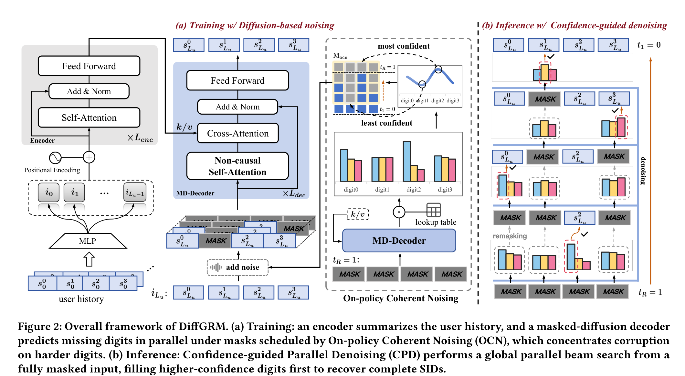

# DiffGRM: Diffusion-based Generative Recommendation Model

- **日期**：2025-10-21
- **来源**：https://arxiv.org/abs/2510.21805
- **作者**：Zhao Liu*, Yichen Zhu*, Yiqing Yang, Guoping Tang, Rui Huang, Qiang Luo†, Xiao Lv†, Ruiming Tang, Kun Gai, Guorui Zhou†
- **发表**：arXiv 预印本（2025），快手技术

---

## 缺口：自回归解码器与 SID 结构的根深蒂固之错

生成式推荐（GR）把每个物品编码成一个 n 位 Semantic ID（SID），然后用自回归模型（ARM）逐位从左到右预测目标物品的 SID。这个范式已经被 TIGER、HSTU、OneRec 等系列工作验证有效。然而，SID 的两个结构特性让 ARM 从一开始就走错了路：

**intra-item consistency**：一个物品的 n 位 SID 共同指定唯一物品（比如 Dior Rouge 999 Velvet = `<233><134><56><90>`），这 n 位之间天然存在双向语义验证关系——第 2 位"Spalding"和第 3 位"Basketball"互为佐证。但 ARM 的因果注意力强制从左到右，每个 digit 只能看到前面的 prefix，完全无法利用后面 digit 的验证信号。监督信号被迫坍缩到唯一的因果路径上。

**inter-digit heterogeneity**：SID 各位编码不同粒度的语义（类别、品牌、型号、尺码），预测难度天差地别——"Category"是 easy digit，"Brand"是 hard digit。但 ARM 的 next-token objective 给所有 digit 分配相等的监督权重，结果 easy digit 被过度训练，hard digit 被欠训练。

更致命的是，一旦某个 hard digit 被错判（比如把 Spalding 预测为 Adidas `<131>`），因果链会把这个错误沿 prefix 向后传播，导致后续 digit 全部建立在错误的基础上——这正是误差传播（error propagation）的经典表现。

这两个问题的根源是同一个：ARM 的从左到右因果结构，与 SID 的双向交叉验证结构和非均衡难度结构根本不匹配。

---

## 增量：用 masked discrete diffusion 替代自回归，让 SID 各位并行、双向、任意顺序生成

DiffGRM 是第一个把 masked discrete diffusion model（MDM）引入生成式推荐的框架，用一个非因果的、双向注意力的扩散解码器替代 ARM，从而彻底解除从左到右的因果约束。同时，DiffGRM 不是简单地把 NLP 的 DDM 搬过来，而是针对推荐的三大特殊性做了量身定制：

- **分词层**：PSE（Parallel Semantic Encoding）用 OPQ 子空间量化替代主流的 RQ 残差量化，消除 digit 间的残差依赖，让每位独立可预测、信息量均衡
- **训练层**：OCN（On-policy Coherent Noising）用模型自身的 uncertainty 排序来选择 mask 位置，把有限的监督预算集中在 hard digit 上，避免随机 mask 的组合爆炸
- **推理层**：CPD（Confidence-guided Parallel Denoising）用置信度引导的全局并行 beam search，先填最有把握的 digit，再逐步补全，生成多样化的 Top-K 候选

实验结果：NDCG@10 在三个 Amazon 数据集上相对最强 baseline 提升 **6.9%~15.5%**（Sports +15.53%, Beauty +8.19%, Toys +6.94%）。

---

## 核心机制图



上图展示了 DiffGRM 的训练和推理两阶段。左半 (a) Training：Encoder 编码用户历史，MD-Decoder 以非因果双向注意力并行预测被 mask 的 SID 位，OCN 按模型 uncertainty 排序选择最难的位置做 mask。右半 (b) Inference：从全 mask 输入出发，CPD 每步选最高置信度的 digit-codeword 对填入，逐步去噪直到恢复完整 SID。

**Napkin 速写——旧框架 vs 新框架的位移**：

```
ARM（旧）：                              DiffGRM（新）：
                                        
  第1位 ─→ 第2位 ─→ 第3位 ─→ 第4位        第?位 ←──→ 第?位
  (easy)   (hard!)  (easy)   (easy)        ↑ 双向注意力，任意顺序 ↑
    │         │                          ┌─────────┼─────────┐
    │     错了！                          │  高置信→先填  低置信→后填  │
    │         ↓                          │  OCN集中监督hard digit   │
    │    误差传播 ─→ ─→ ─→               │  并行生成，无因果依赖     │
                                          └───────────────────────────┘
  
  监督：所有位等权重                     监督：按难度分配权重
  信息：只看左边 prefix                  信息：双向交叉验证
  顺序：固定从左到右                     顺序：按置信度任意顺序
```

---

## 白话方法：拼图式推荐

想象你在拼一幅 4 块拼图，每块代表物品的一个属性维度（类别、品牌、型号、尺码）。

ARM 的做法是：**从左到右依次拼**。先拼类别，再拼品牌，再拼型号，最后拼尺码。问题在于，一旦品牌拼错了（把 Spalding 拼成了 Adidas），后面型号和尺码都会跟着错——因为你只能看到左边已经拼好的部分，看不到右边还缺什么来验证。

DiffGRM 的做法是：**先拼最有把握的那块**。你扫一眼所有空位，发现"这是篮球"（型号位）最有把握，就先填上。填完篮球，旁边的品牌位就更有线索了——"哦，篮球+球类 = Spalding 而不是 Adidas"。每填一块，其他空位都获得新的交叉验证信号，因为所有位可以互相看到（双向注意力）。OCN 就是"训练时专门练你最不擅长的那几块"，CPD 就是"推理时先填最确定的那块"。

---

## 关键概念（费曼讲解）

### 1. Masked Discrete Diffusion Model（MDM）

**从零讲起**：扩散模型的核心思想是"破坏-修复"——先往数据上加噪声（破坏），再学习从噪声恢复原数据（修复）。在离散空间里，"加噪声"就是把某些位的真实值替换成特殊的 [MASK] 符号，"修复"就是根据上下文预测被 mask 掉的真实值。

**和 ARM 的本质区别**：ARM 每个 digit 只能看左边的 prefix，训练时每个 sample 只产生 n 个因果方向的监督信号。MDM 允许任意子集被 mask，每个被 mask 的 digit 都能看到所有未被 mask 的上下文（包括右边），训练时通过不同的 mask pattern 可以产生 n·2^(n-1) 种目标-上下文组合——监督信号密度指数级增长。

**具体例子**：4 位 SID = `<233><134><56><90>`。ARM 只能产生 4 种监督：预测第 1 位看空上下文、预测第 2 位看第 1 位、预测第 3 位看前 2 位、预测第 4 位看前 3 位。MDM 可以 mask 任意子集：比如 mask 第 2、4 位，预测第 2 位时能看到第 1、3 位（"已知类别=球类、型号=篮球，品牌=？"），预测第 4 位时能看到第 1、2、3 位——这就是双向交叉验证。

### 2. On-policy Coherent Noising（OCN）

**问题**：MDM 的 mask pattern 有 2^n - 1 种（n=4 时 15 种），但推荐系统的物品目录远大于自然语言词汇表，且极度长尾，大多数物品被观察次数很少。随机 mask 会把有限的训练预算打散到海量 pattern 上，导致每个 pattern 的监督信号稀疏。

**解决方案**：不要随机选 mask 位置，而是让模型自己告诉训练器"哪些位我最不确定"。具体做法：先跑一次全 mask 前向传播，得到每个 digit 的预测分布，最大概率 p_max 就是模型对该位的置信度，1 - p_max 就是难度 δ。然后按 δ 从大到小排序，构造一组嵌套的 view：view 1 只 mask 最难的 1 位，view 2 mask 最难的 2 位……view R mask 最难的 R 位。这些 view 的 mask 集合是嵌套的（nested），避免了组合爆炸，而且梯度集中在同一组 hard digit 上，从轻 mask 到重 mask 逐步提供更丰富的上下文来帮助预测。

**具体例子**：4 位 SID，模型在当前 sample 上的难度排序为 δ(2) > δ(0) > δ(3) > δ(1)（第 2 位最难）。OCN 构造 4 个 view：view 1 只 mask 第 2 位，view 2 mask 第 2、0 位，view 3 mask 第 2、0、3 位，view 4 mask 全部 4 位。每个 view 的被 mask 位都能获得更丰富的可见上下文——view 1 里第 2 位能看到第 0、1、3 位，view 2 里第 0、2 位能看到第 1、3 位。

### 3. Confidence-guided Parallel Denoising（CPD）

**问题**：NLP 的 MDM 通常用贪心解码只输出一个 Top-1 结果，但推荐系统需要 Top-K 候选集。

**解决方案**：从全 mask 输入出发，CPD 维护一个活跃分支集合（类似 beam search），但与传统 left-to-right beam search 不同，CPD 在每一步从**所有分支的所有空位**中选出置信度最高的 B_act 个 (分支, digit, codeword) 三元组。这样，不同分支可以在不同位置同时填入 digit，不受固定顺序约束。

**具体例子**：n=4, B_act=2。初始全 mask，MD-Decoder 对所有 4×M 个 (digit, codeword) 对打分，取 Top-2：分支 1 在第 3 位填 `<56>`，分支 2 在第 0 位填 `<233>`。下一步，每个分支各自对剩余 mask 位预测，从中选出全局 Top-2 个最高分填入。如此迭代 4 步，得到 2 条完整的 SID 候选。

---

## 实验

### 整体结果（RQ1）

| 数据集 | 最强 baseline | DiffGRM NDCG@10 | 提升 |
|--------|-------------|----------------|------|
| Sports | RPG (0.0264) | **0.0305** | **+15.53%** |
| Beauty | RPG (0.0464) | **0.0502** | **+8.19%** |
| Toys | RPG (0.0490) | **0.0524** | **+6.94%** |

DiffGRM 在 12 个指标中拿下 11 个第一。Recall@10 在 Sports (+10.00%) 和 Beauty (+8.28%) 上也大幅领先，Toys 的 Recall@10 略低于 RPG（-4.03%），但 NDCG 仍更高。

### OCN 的样本效率（RQ2）

用 ESP（有效样本遍数）统一衡量训练预算。OCN 在相同或更低 ESP 下超越了 k-times coherent-path noising（k=1~10）的对数拟合趋势线——说明 OCN 把有限的监督预算花在了刀刃上。

### 消融实验（RQ3）

| 变体 | Sports | Beauty | Toys |
|------|--------|--------|------|
| PSE → RQ-KMeans | 0.0200 | 0.0305 | 0.0368 |
| w/o OCN（随机 mask） | 0.0250 | 0.0385 | 0.0430 |
| w/o On-policy | 0.0263 | 0.0430 | — |
| w/o CPD（随机顺序 beam） | 0.0273 | 0.0496 | 0.0499 |
| **DiffGRM（完整）** | **0.0305** | **0.0502** | **0.0524** |

三个组件各有贡献：PSE（+53% on Sports vs RQ-KMeans）、OCN（+22% vs 随机 mask on Sports）、CPD（+12% vs 随机顺序 on Sports）。

### OCN 策略分析

四组 OCN 变体对比：**least-static**（选最低置信位、不刷新）> least-refresh > most-static > most-refresh。最关键的发现：most-refresh 方案在去掉 CPD 后性能暴跌 19~24%，因为 stepwise 刷新让模型严重依赖 easy-first 推理顺序，一旦顺序改变就崩——这恰好验证了 hard-first 策略的鲁棒性。

---

## 假设与局限

1. **PSE 与 MDM 的耦合假设**：论文假设 OPQ 的独立子空间量化天然适配 masked diffusion，但 PSE 对推荐精度的贡献是否纯粹来自"去除残差依赖"，还是也来自 OPQ 本身更优的量化质量？消融中缺少"OPQ + ARM"的对照。
2. **组合爆炸的近似解**：MDM 的 mask pattern 有 2^n - 1 种，OCN 用嵌套 view 做了近似，但这本质上只探索了 1 条难度排序路径。对于 n 较大（如 n=8, Toys 数据集用 4 层 codebook 但 8 heads）的场景，一条路径是否足够？
3. **推理复杂度**：CPD 的解码复杂度为 O(B_act · n² · N · d_m)，相比 ARM 的 O(B_act · n · N · d_m) 多了一个 n 因子。论文论证"n 小所以影响不大"，但在工业级 n 可能到 8~12 时，这个额外因子的权重会上升。
4. **评估范围**：仅在 Amazon Reviews 三个中小规模数据集上验证，缺少工业级大规模数据的在线实验。

---

## 启发

**对我最大的启发是：当生成目标的结构特性与生成器的归纳偏置不匹配时，与其在旧框架上打补丁，不如换一个归纳偏置更匹配的生成器。** SID 的双向交叉验证需求与 ARM 的因果约束天然矛盾，DiffGRM 直接换掉 ARM 而不是试图修复它（比如 curriculum learning、loss weighting 等都是"打补丁"思路）。

更具体地，OCN 的"让模型自己选练什么"的设计哲学，和 curriculum learning 的思路一脉相承，但 OCN 更优雅——它不是在 epoch 粒度上调度难度，而是在 sample 粒度上、digit 粒度上调度，且 mask 集合嵌套保证了梯度的一致性。这种"细粒度 on-policy 难度调度"的思路可以迁移到其他多 token 并行生成的场景（如 VQ-VAE 的并行解码、multi-label 分类）。

另一个观察：DiffGRM 和 RPG（同时期工作）都指向同一个方向——打破 AR 的从左到右约束——但走的路不同。RPG 用 multi-token objective + graph-guided decoding 保留无序集合预测，DiffGRM 用 masked diffusion + confidence-guided denoising 实现任意顺序并行生成。两条路都绕过了误差传播，但 DiffGRM 的 OCN 提供了更精细的难度感知训练信号，这可能解释了 DiffGRM 比 RPG 更大的 NDCG 提升幅度。
