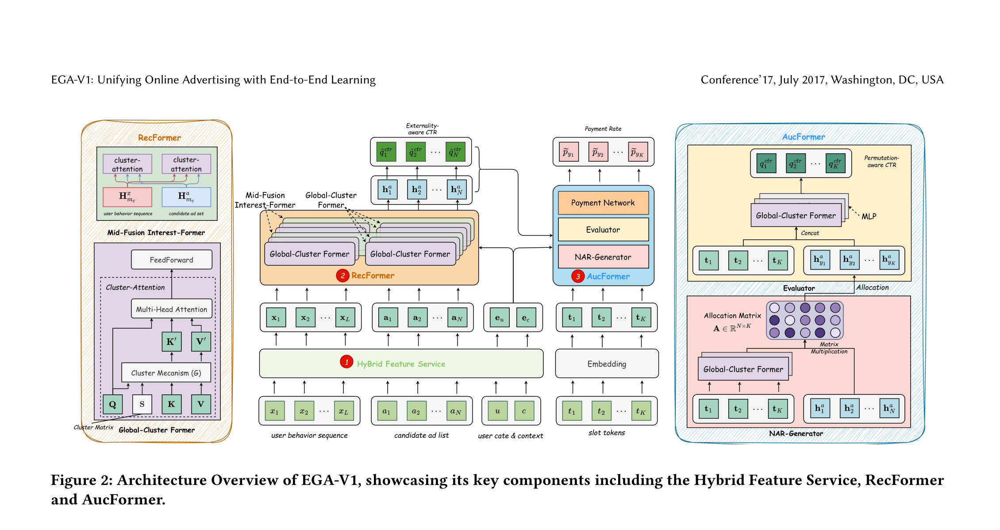

# EGA-V1: Unifying Online Advertising with End-to-End Learning

- **日期**：2025-06-02
- **来源**：arXiv 2505.19755
- **作者**：Junyan Qiu, Ze Wang, Fan Zhang, Zuowu Zheng, Jile Zhu, Jiangke Fan, Teng Zhang, Haitao Wang, Yongkang Wang, Xingxing Wang
- **发表**：ACM 会议论文（2025），美团

---

## 缺口

工业广告系统靠多阶段级联架构（MCA）运转：召回→粗排→精排→拍卖，每层筛掉一批候选。这套范式稳了十年，但两道裂缝从未真正弥合。

**裂缝一：目标打架。** 召回模型为速度牺牲精度，精排模型为精度堆叠复杂度，粗排在中间两头不靠。各阶段的优化目标从根上就不一致，导致预测偏差沿管线逐级放大，最终展现的广告质量被上游的错误筛选永久锁定。

**裂缝二：外部性失明。** 绝大多数排序模型假设广告之间独立（independent CTR assumption），即一个广告被点击的概率与它周围放了什么广告无关。现实完全相反：用户是否点第二条广告，强烈受第一条广告的内容和位置影响。但 MCA 在粗排阶段就筛掉了 99% 的候选，拍卖机制永远只能在小得可怜的子集里建模外部性。

已有的修补努力（FS-LTR 的样本重标签、COPR 的一致性约束、RankFlow 的联合优化）都在 MCA 框架内打补丁——缓解症状，但无法治愈结构性病因。

## 增量

EGA-V1 用一个端到端生成模型直接从全量候选广告中生成最优广告序列，把「四个阶段各干各的」替换为「一个模型统管全局」——同时消除目标冲突，同时建模全空间外部性。

## 核心机制图



上图展示了 EGA-V1 的三大组件：左侧 Hybrid Feature Service 解耦用户/广告特征处理；中间 RecFormer 用 cluster-attention 建模用户深度兴趣和候选间外部性；右侧 AucFormer 通过非自回归生成和排列感知评估完成广告分配与计费。

**数据流速写（自己画的逻辑图）：**

```
全量候选 ~10^5 广告
        │
   ┌────▼────┐
   │  HFS    │  用户特征(RPC一次) + 广告特征(本地SSD/RAM)
   │ 解耦服务 │  去掉交叉特征 → 靠模型内部补回来
   └────┬────┘
        │ E_ad(N×d)  E_bhvr(L×d)
   ┌────▼──────────────────┐
   │  RecFormer            │
   │  ┌─────────────────┐  │
   │  │ GCF ×m层         │  │  cluster-attention: O(N²d) → O(NN_cd)
   │  │ N个广告 → Nc个簇 │  │  可学习簇矩阵S把K,V聚合
   │  └────────┬────────┘  │
   │  ┌────────▼────────┐  │
   │  │ MIF ×mk层        │  │  中间融合：每隔mc层做一次跨序列交互
   │  │ user ↔ ad 交叉   │  │  target-attn + context-attn 双向
   │  └────────┬────────┘  │
   │  辅助任务：pCTR/pCVR  │
   └──────────┬────────────┘
             │ H_ad(N×d) 含外部性的广告表示
   ┌──────────▼────────────┐
   │  AucFormer             │
   │  ┌─────────────────┐  │
   │  │ NAR Generator    │  │  slot tokens + 竞价偏置
   │  │ 非自回归一次分配  │  │  A = H_ad · T^T → 分配矩阵
   │  └────────┬────────┘  │
   │  ┌────────▼────────┐  │
   │  │ Evaluator        │  │  排列感知pCTR（仅训练时）
   │  └────────┬────────┘  │
   │  ┌────────▼────────┐  │
   │  │ Payment Network  │  │  sigmoid费率 × bid → 满足IR约束
   │  └─────────────────┘  │
   └────────────────────────┘
        │
   广告序列 Y + 计费 p
```

## 白话方法

EGA-V1 像一场**交响乐团取代四支各自排练的乐队**。

旧 MCA 范式下，四支乐队（召回、粗排、精排、拍卖）各排各的谱、各调各的音，演出时按顺序上台，前面乐队选了什么曲目，后面乐队只能在此基础上改改节奏。问题在于：第一支乐队漏掉的好曲子，后面三支永远听不到；各乐队对「什么才是好曲子」的理解还不一致。

EGA-V1 让**一位指挥家**面对全量乐谱（~10^5 首候选），同时考虑所有曲目之间的和声搭配（外部性），一次排出最优演出顺序。为了让指挥不累死，三个工程技巧各管一头：HFS 把乐谱按「常换的」和「不常换的」分开放，不每次都翻全部谱子；cluster-attention 让指挥先按风格分组听（10^5 → 128 簇），从每簇抓代表曲快速判断全局布局，再做精细调整；非自回归生成让指挥同时把所有座位填满，不用一首一首按顺序排。

## 关键概念（费曼讲解）

### 1. Cluster-Attention

**从哪里来：** 标准自注意力让每个 query 跟所有 key 做内积，复杂度 O(N²)。当 N=10^5 时，内存和延迟爆炸。

**核心思想：** 别让 query 一个个去认 key 了。先把 key 分成 Nc=128 组（可学习簇矩阵 S 做"分类器"），每组选出一个"代言人"（surrogate token），query 只跟代言人交互。O(N²d) 降到 O(NN_cd)。

**具体怎么分：** 不是硬分，是软聚类。簇矩阵 S 把 N 个 key 投影成 Nc 个代理 key（A_k = KS^T），然后每个代理 key 是原始 key 的加权混合。权重不是手工设的，是由 query 和代理 key 的内积经 sigmoid 计算出的自适应比例 φ。这样 query 说"我对这组感兴趣"时，组内信息自然流入。

**一个例子：** 假设 10 万条广告分 128 簇，"附近火锅店"和"附近日料店"分到同一簇，用户如果对这一簇的代理 key 响应高，两个子类都会被激活。这比逐一和 10 万条广告算注意力快了约 780 倍。

### 2. Mid-Fusion Interest-Former (MIF)

**问题：** 用户行为序列（L=1000 步）和候选广告集（N=10^5 条）之间怎么做交互？

三种范式：
- **Early Fusion：** 把目标广告拼到用户行为序列后面，整体跑 self-attention。优点：信息完全交互。缺点：每个广告都要跑一遍，O(mN(L+1)²d)，不可接受。
- **Late Fusion：** 用户行为独立编码，最后一步才和广告交互。优点：快。缺点：编码时不知道要看什么广告，丢失"定向兴趣"。
- **Mid Fusion（EGA-V1）：** 折中。用户行为和广告各自先用 GCF 独立编码，然后每隔 m_c 层做一次跨序列交互（target-attention + context-attention 双向），让两边的信息在中间层逐步融合。只需 Early Fusion 的 1/104 FLOPs，却比 Late Fusion 多了"知道自己在看什么"的定向能力。

**一个例子：** 就像读论文——Early Fusion 是每读一行都停下来对照目标章节（太慢），Late Fusion 是先把整篇论文读完再想"我要找什么"（容易忘记重点），Mid Fusion 是每读完一节就对照一下目标（高效又聚焦）。

### 3. 非自回归（NAR）生成与拍卖机制

**问题：** 自回归生成一个一个出广告，延迟随位置线性增长，不满足广告系统的实时性要求。

**EGA-V1 的做法：** 预设 K 个 slot token（广告位），用 GCF 编码后与广告表示做矩阵乘法得到分配矩阵 A = H_ad · T^T，一次性为所有位置选广告。竞价偏置（e^{w_z} · q_ctr · bid）确保出价高的广告分配概率更高（满足 IC 约束）。推理时不需要 Evaluator 和 Payment Network 的复杂计算，只用 Generator + Payment 的轻量前向。

**一个例子：** 自回归生成像填字游戏——从左到右一个一个填，填第 5 个时必须先确定前 4 个。NAR 生成像多选题——同时看所有空位和所有选项，一步匹配出全局最优分配。

## 餐巾纸速写

```
         以前（MCA）                          现在（EGA-V1）
  ┌──────────────────┐              ┌──────────────────────────────┐
  │ 召回 10^5→10^4   │ 独立优化     │                              │
  │   ↓ 目标：速度    │ ↓ 目标打架   │    一个模型                   │
  │ 粗排 10^4→10^3   │ 独立优化     │   ┌────────────────────┐     │
  │   ↓ 目标：平衡    │ ↓ 外部性盲   │   │  RecFormer         │     │
  │ 精排 10^3→10^2   │ 独立优化     │   │  全量10^5广告      │     │
  │   ↓ 目标：精度    │ ↓ 信息损耗   │   │  cluster-attention │     │
  │ 拍卖 10^2→10^1   │ 独立优化     │   │  建模外部性        │     │
  │   ↓ 目标：收入    │              │   └────────┬───────────┘     │
  │ 最终10条广告      │              │   ┌────────▼───────────┐     │
  │                   │              │   │  AucFormer         │     │
  │ ·99%候选在粗排   │              │   │  NAR生成+拍卖      │     │
  │  就被扔了，永远   │              │   │  一致目标          │     │
  │  无法建模外部性   │              │   └────────────────────┘     │
  │ ·四套模型四套目标 │              │    一个目标：平台收入最大    │
  └──────────────────┘              └──────────────────────────────┘
```

位移方向：**从"分阶段筛"到"全局生成"**，从"四套模型各管一段"到"一个模型统管全链路"。

## 训练策略：预训练 + 强化学习后训练

EGA-V1 借鉴 LLM 的训练范式，分两阶段：

**预训练：** 用用户点击信号训练 RecFormer 的表示学习能力。每个请求采样 N_s=2995 条未曝光广告 + K=5 条曝光广告，对曝光广告用当前请求的点击做标签，对未曝光广告用用户在整个平台的点击行为做标签。BCE 损失覆盖全候选集。

**后训练（RLAF）：** 冻结 RecFormer，只用强化学习优化 AucFormer。三步走：
1. **训练 Reward Model：** 用预训练模型的 Evaluator 做排列感知 pCTR 评估
2. **RL from Auction Feedback：** 用策略梯度优化 Generator，奖励信号 = 该广告对平台收入的边际贡献
3. **优化 Payment Network：** 拉格朗日对偶方法平衡收入最大化和 IC 约束

关键设计：后训练时冻结 RecFormer，只动 AucFormer，保证用户兴趣建模不被商业目标污染。

## 实验

**离线（Meituan 工业数据集，2亿请求，2百万用户，千万广告）：**

| 方法 | Recall@50 | AUC | eCTR(%) | eRPM | Ψ(IC) |
|------|-----------|-----|---------|------|-------|
| MCA | 0.289 | 0.741 | 6.043 | 185.2 | 9.4% |
| FS-LTR | 0.426 | 0.743 | 6.140 | 194.9 | 9.1% |
| EGA-V1 | **0.513** | **0.754** | **6.652** | **217.1** | **2.3%** |

Recall@50 +20.4%，AUC +1.48%，eRPM +11.4%，IC 指标 Ψ 从 9.1% 骤降到 2.3%。

**在线 A/B（美团 LBS 广告，2024.11.18-24）：**
- CTR +5.2%
- RPM +13.6%
- ROI +3.1%
- 响应时间仅增加 5ms（+2.2%）

**消融实验关键发现：**
- 去 GCF：eCTR -1.3%，eRPM -1.1%（全局外部性建模是核心贡献）
- 去 MIF：eCTR -2.5%，eRPM -2.1%（用户深度兴趣建模不可替代）
- 去 AucFormer：eRPM -4.2%（拍卖机制和 RL 训练是收入增益的最大来源）

**交叉特征分析：** 去掉 18 个交叉特征后，MCA 的 AUC 暴跌 0.8%，EGA-V1 只跌 0.3%。MIF 的 target-attention 和 context-attention 能在模型内部隐式恢复交叉特征信息。

**Scaling Law：** 增加 GCF/MIF 层数和计算量，性能持续提升，边际收益递减但仍为正。

## 与 EGA-V2 的关系

论文标题 "EGA-V1" 暗示已有或计划 V2 版本。结合美团后续工作（OneSearch、OneRanker 等同平台的生成式推荐/搜索论文），EGA-V2 可能的演进方向包括：（1）从 LBS 场景扩展到通用广告场景（N 从 10^5 增大到 10^7 级别）；（2）将 SID（Semantic ID）引入广告表示，替代当前的 embedding 拼接，实现更高效的候选表示和检索；（3）引入更强的 RL 对齐策略（如 GRPO 取代策略梯度），参考快手 GR4AD 的 RSPO。EGA-V1 选择的非自回归生成路线（而非 AR 逐 token 解码）是一个关键架构决策——它牺牲了 token 级细粒度但换来了推理速度，这在实时广告系统中是正确的权衡。

## 启发

**启发一：LBS 场景的候选集缩小是端到端生成的关键前提。** 美团 LBS 广告的候选集只有 ~10^5（同城广告），远小于通用电商的 ~10^7。这使得全量候选参与 cluster-attention 成为可能。如果候选集再大一个数量级，cluster-attention 的 Nc=128 是否仍然足够？这个边界条件值得深思。

**启发二：特征工程驱动的系统可以迁移到计算驱动。** HFS 去掉交叉特征、靠模型内部恢复，是一种"把特征工程的负担转嫁给模型架构"的思路。这和推荐 Scaling 方向（RankElastor/TokenFormer）的哲学一致：不是加更多特征，而是让模型有足够的参数自己学出来。

**启发三：非自回归生成在广告系统中可能优于自回归。** 广告序列的 K 通常很小（5-10 个广告位），广告之间没有严格的语义依赖关系，NAR 的一次性分配比 AR 的逐个生成更符合这个问题的结构。但 OneRanker 和 GPR 选择了 AR 解码，说明这个选择不是唯一的——不同的广告场景可能需要不同的生成范式。
