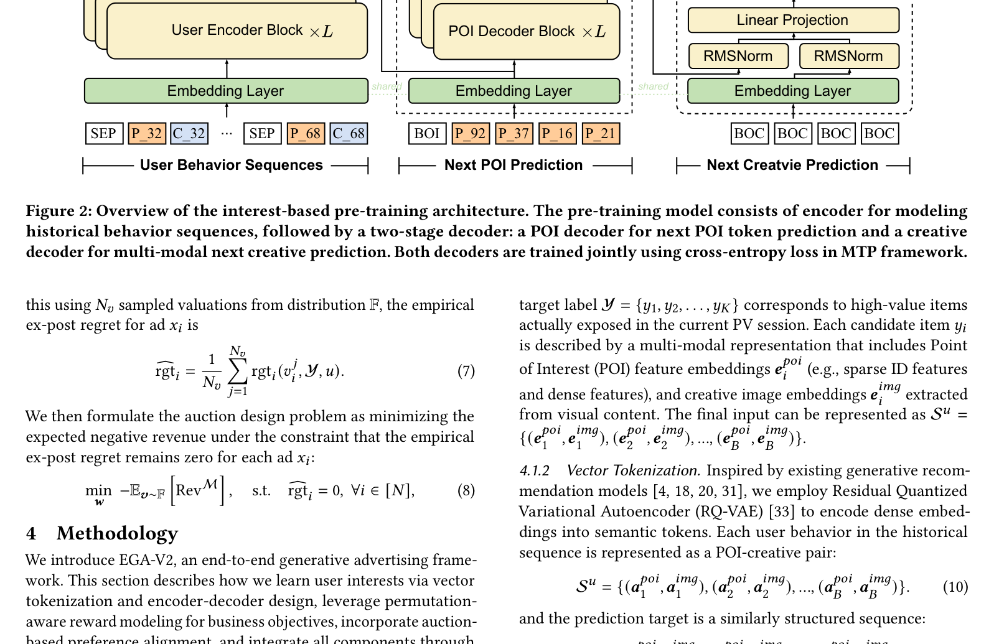

# EGA-V2: 首个端到端生成式工业广告框架

> **EGA-V2: An End-to-end Generative Framework for Industrial Advertising**
> Zuowu Zheng\*, Ze Wang\*, Fan Yang†, Jiangke Fan, Teng Zhang, Yongkang Wang, Xingxing Wang | 美团 | arXiv 2505.17549 | 2025-06



---

## 缺口：级联架构的阿喀琉斯之踵

工业广告系统的经典范式是多阶段级联架构（MCA）：召回 → 预排 → 精排 → 创意选择 → 拍卖。这个漏斗有一个致命缺陷——**上游的过滤是不可逆的**。一个在召回阶段被淘汰的广告，即便在最终分配中价值极高，也永远无法被下游恢复。这不仅是"信息损失"，更是一种**结构性目标不一致**：召回优化的是召回指标，精排优化的是精排指标，拍卖优化的是拍卖指标，但没有人对最终的 RPM（千次曝光收入）负责。

生成式推荐（OneRec、HSTU 等）已经在推荐场景验证了"端到端生成替代级联漏斗"的可行性。但直接把 GR 搬到广告场景，会撞上三堵墙：

1. **竞价缺失**：GR 没有出价机制，无法反映广告主的支付意愿
2. **分配失控**：GR 无法灵活控制广告与自然内容的混排比例
3. **激励不相容**：用 GSP 事后算价，IC regret 高达 8.4%，广告主有动机虚报出价

这三堵墙的本质是同一个问题：**生成式模型只关心"用户喜欢什么"，但广告系统必须同时回答"广告主愿意付多少、平台能赚多少、经济机制是否诚实"**。

## 增量：四个"首次统一"

EGA-V2 的核心贡献是在**单一生成模型**中首次统一了四件事：

| 维度 | 传统级联 | 生成式推荐 (GR) | EGA-V2 |
|------|----------|----------------|---------|
| 用户兴趣+POI生成 | 分阶段建模 | 端到端但只有POI | ✅ RQ-VAE分层tokenization + MTP联合生成POI和创意 |
| 创意选择 | 独立模块Peri-CR | 无 | ✅ Creative Decoder并行生成 |
| 广告分配 | 独立RL模块CrossDQN | 无 | ✅ Token级竞价 + softmax生成式分配 + beam search |
| 计费优化 | GSP/uGSP | GSP（IC=8.4%） | ✅ POI级Payment Network + 事后后悔最小化（IC=2.7%） |

这不是简单的"把四个模块拼在一起"，而是通过**分层 tokenization** 实现了从"item 级操作"到"token 级操作"的降维，从而让分配和竞价可以在生成过程中自然发生。

## 白话方法：从"挑商品"到"写代码"

把传统广告系统想象成一条流水线：先从十亿商品里筛出一万个（召回），再从一万个里挑出一千个（预排），再排序（精排），再选图片（创意），再决定谁付多少钱（拍卖），再决定放哪个位置（分配）。每个车间主任只看自己眼前的货，前面丢掉的好货后面再也捡不回来。

EGA-V2 做的事，相当于**把整条流水线替换成一个"写作文"的过程**——

1. **分词**：先用 RQ-VAE 把每个商品（POI）和它的广告图片（Creative）都编码成几个"词"（token）。就像汉字可以拆成偏旁部首，商品也可以拆成"品类意图→视觉风格"的层级 token。

2. **写作文**：模型看着用户的历史行为序列（"这个人去过按摩、KTV、酒吧"），像写作文一样逐个词地生成下一个推荐列表。关键创新：**同时生成 POI 词和 Creative 词**——不是先选商品再选图片，而是"POI decoder 先写品类意图词，Creative decoder 再接上视觉词"，两个 decoder 共享 embedding 空间，MTP 同时监督。

3. **竞价嵌入生成**：每个 token 背后可能对应多个商品（因为 token 是量化后的共享表示），EGA-V2 用 **max 聚合**取这些商品中的最高出价作为该 token 的竞价权重。然后在 softmax 分配上，出价高的 token 有更大概率被选中——这样竞价信号就**自然嵌入到了生成过程**中，不需要后置排序。

4. **收费单独算**：分配在 token 级别做，但收费回到 POI（商品）级别做。用一个 Payment Network 学习计费，约束是**事后后悔最小化**（ex-post regret minimization）：让广告主发现诚实出价永远不比虚报差。用拉格朗日乘子法迭代求解。

5. **两阶段训练**：先用真实曝光数据做兴趣预训练（让模型学会"用户喜欢什么"），再冻结 backbone 做拍卖后训练（让模型学会"怎么在竞价约束下分配和收费"）。两阶段解耦避免了兴趣信号和拍卖信号的相互干扰。

## 费曼概念

### RQ-VAE 分层 Tokenization
想象你要用有限的词汇描述无限的商品。RQ-VAE 的做法是**分层残差编码**：第一层用粗粒度词表捕捉"这是什么类"（比如"餐饮"），第二层用残差捕捉"具体什么风格"（"日料"），第三层再细分（"寿司"）。每一层都是在前一层编码的残差上继续量化。这样，语义相似的商品共享前面的 token，不同点编码在后面的 token 里——**知识共享和精确辨识两不误**。

### Multi-Token Prediction (MTP)
标准自回归是"一个一个词地预测"。MTP 是"在预测当前词的同时，顺便监督下一个词的预测"。EGA-V2 把这用在了 POI-Creative 联合生成上：主模块预测 POI token，MTP 模块预测对应的 Creative token。两个 loss 同时反向传播，但 MTP 模块不参与推理——它只在训练时提供额外梯度信号，帮助 POI decoder 在预测 POI 时就"意识到"后续要生成什么创意。

### Token 级竞价
传统竞价是"一个商品出一个价"。但 token 是多个商品共享的，怎么办？EGA-V2 的做法很直觉：**取 max**。如果一个 token 被 10 个商品对应，那就取这 10 个商品出价中最高的那个作为该 token 的竞价权重。为什么不是 average？因为 max 保证了"出价最高的商品不会被低价商品拉下来"，这在拍卖机制中是关键的激励相容保障——消融实验也验证了这一点（avg 替换 max 后 IC regret 从 2.7% 飙升到 4.1%）。

### 事后后悔最小化 (Ex-post Regret Minimization)
"后悔"的定义是：如果广告主虚报出价能比诚实出价赚更多，那"多赚的部分"就是后悔值。IC 约束要求所有广告主的后悔回归为零——即诚实出价永远是最优策略。EGA-V2 用**经验近似**（采样 N_v 个出价计算平均后悔）和**拉格朗日乘子法**迭代优化 Payment Network：先固定乘子优化网络参数，再根据后悔值调整乘子。虽然非凸问题不保证全局最优，但实验表明在实践中效果很好（IC=2.7%，远低于 GSP 的 8.2%）。

### 生成式分配 (Generative Allocation)
不是从候选集里挑，而是**在 softmax 概率空间里加权采样**：每个 token 的分配概率 = 出价权重 × 生成概率（归一化后）。然后用 beam search 生成 N_S=64 条候选序列，用 Reward Model 打分选最优。这实现了"生成即分配"——分配决策在生成过程中完成，不需要后置排序模块。

## 餐巾纸速写

```
传统级联 (MCA):
┌──────┐  ┌──────┐  ┌──────┐  ┌──────┐  ┌──────┐
│ Recall│→│PreRank│→│ Rank │→│Creat.│→│Auction│
│10^10  │  │10^4  │  │10^3  │  │选图  │  │算价   │
└──────┘  └──────┘  └──────┘  └──────┘  └──────┘
  ❌ 丢了好货                    ❌ 目标割裂

EGA-V2:
┌─────────────────────────────────────────────┐
│           单一 Encoder-Decoder               │
│                                              │
│  User Seq → Encoder → POI Decoder ──→ POI  │
│                       │                     │
│                       └→ Creative Decoder → Img│
│                                              │
│  + Token-level Bidding (max聚合)              │
│  + Softmax Allocation (bid×prob)             │
│  + Beam Search → Reward Model 选最优          │
│  + POI-level Pay Net (后悔最小化)            │
└─────────────────────────────────────────────┘
  ✅ 全链路统一  ✅ 竞价嵌入生成  ✅ IC≈2.7%
```

```
两阶段训练:
  Step 1: Interest-based Pre-training
    真实曝光序列 → CE Loss (POI + Creative) → 学"用户喜欢什么"

  Step 2: Auction-based Post-training (冻结backbone)
    2.1 Reward Model:  pCTR/pCVR双塔 ← 真实点击/转化标签
    2.2 Generative Allocation: Policy Gradient ← Reward评分
    2.3 Payment Network: 拉格朗日后悔最小化 ← IC约束
```

```
Token级竞价直觉:
  Token P_32 ←→ [商品A(bid=5), 商品B(bid=8), 商品C(bid=3)]
  Token P_32 的竞价权重 = max(5,8,3) = 8
  → 出价8的商品B不会出价3的商品C拉低
  → 分配时 P_32 有更强的竞争力
```

## 博导审稿

**优点：**
1. **系统完整度高**：从 tokenization 到分配到计费，首次在单一模型中覆盖广告全链路。这不是"把几个模块拼在一起"，而是通过 token 级操作实现了端到端可微分。
2. **分配-计费解耦设计精妙**：token 级分配 + POI 级计费，既利用了 token 共享带来的计算效率，又保持了与广告主交互的 POI 粒度。
3. **两阶段训练策略务实**：预训练用大量曝光数据学兴趣，后训练用少量拍卖数据对齐业务目标。数据利用效率高，避免信号干扰。
4. **消融实验扎实**：MTP、多阶段训练、max聚合、Payment Network 四个组件各有独立贡献，没有混在一起说不清。

**不足与开放问题：**
1. **仅有离线实验**：工业广告系统的终极验证是线上 A/B 测试。RPM+19.7% 的离线提升能否转化为线上收益？模型延迟是否满足在线服务要求？这些都是未回答的关键问题。
2. **IC 只是近似**：2.7% 的 regret 不是零，意味着存在约 2.7% 的激励偏差。在真金白银的广告拍卖中，这个偏差是否可接受？需要更严格的机制分析。
3. **Token 碰撞问题未讨论**：RQ-VAE 的码本碰撞（多个不相似商品映射到相同 token）在广告场景中可能更严重——出价差异大的商品如果共享 token，max 聚合是否公平？这是 token 级竞价特有的新问题。
4. **与 EGA-V1 的关系语焉不详**：V1 用 cluster-attention + NAR 生成，V2 改为 encoder-decoder + AR + MTP。架构范式完全不同，但论文没有系统对比。为什么放弃 NAR？cluster-attention 的可扩展性瓶颈在哪？
5. **Reward Model 的简化**：用 pCTR/pCVR 双塔做 reward model，本质还是判别式模型的点估计。没有考虑 list-wise 外部性在 reward 中的显式建模（只在 allocation 阶段通过 beam search 隐式考虑）。

## 启发

1. **Token 级操作是连接生成与经济的桥梁**：EGA-V2 最有启发的不是某个单一组件，而是"把 item 级的经济操作映射到 token 级"这个思路。Max 聚合只是最简单的映射，更复杂的 token 级竞价策略（比如加权聚合、上下文感知聚合）可能是未来的重要方向。

2. **分配-计费解耦的范式**：分配在细粒度（token）做，计费在粗粒度（POI）做——这种"异步粒度"设计可能适用于其他需要结合生成与机制设计的场景，比如生成式搜索中的排名与计费。

3. **与 EGA-V1 的关系折射出架构选择**：V1 用 NAR（非自回归）一次生成整个序列，V2 回到了 AR（自回归）+ beam search。这暗示 NAR 在广告场景的排列多样性要求下可能不如 AR + 约束解码灵活——beam search 可以方便地加入竞价约束，而 NAR 的并行生成难以做到这一点。

4. **生成式广告的理论边界**：EGA-V2 的 IC=2.7% 不是零，这引出一个深刻问题——**生成式模型的 IC 约束是否有理论下界？** 在传统拍卖中，Myerson 最优拍卖可以达到精确 IC；但在生成式框架中，token 共享和 softmax 分配是否引入了不可消除的 IC 违反？这值得理论研究。

5. **LBS 广告的特殊性**：美团到综/到店场景的广告有明显的地域性和时段性（论文 Figure 4 中的时间戳："15:00-17:00 盲人按摩→17:30-18:30 小美KTV→19:00-21:00 绅士酒吧→21:00-22:00 黑八台球厅"），这种时空上下文在传统级联中难以跨阶段传递，但生成式模型天然可以捕捉——这可能是 EGA-V2 在 LBS 场景比通用广告场景更有优势的原因。

---

## 核心公式

**概率分解（POI→Creative 两阶段生成）：**

\[P(a_{t+1}^{poi}, a_{t+1}^{img} | S_{1:t}^u) = P(a_{t+1}^{poi} | S_{1:t}^u) \cdot P(a_{t+1}^{img} | a_{t+1}^{poi}, S_{1:t}^u)\]

**Token 级竞价权重：**

\[w(a_i^j) = [\max(b^1, b^2, \ldots, b^{N_i})]^{\alpha} + \beta\]

**生成式分配概率（softmax 加权）：**

\[z(a_i^j) = \frac{w(a_i^j) \cdot e^{a_i^j}}{\sum_{k=1}^{W} w(a^{j,k}) \cdot e^{a^{j,k}}}\]

**事后后悔（IC 约束）：**

\[\text{rgt}_i(v_i, Y, u) = \max_{b_i'} [u_i(v_i; b_i', \mathbf{b}_{-i}, Y, u) - u_i(v_i; b_i, \mathbf{b}_{-i}, Y, u)]\]

**Payment Network 优化（拉格朗日形式）：**

\[L_{\text{Pay}} = -\frac{1}{|D|} \sum_{d \in D} \left[ \sum_{y_i \in S^*} p_i \hat{r}_i^{\text{pctr}} - \sum_{y_i \in S^*} \lambda_i \widehat{\text{rgt}}_i - \frac{\rho}{2} \sum_{y_i \in S^*} (\widehat{\text{rgt}}_i)^2 \right]\]

---

## 实验结果

| 模型 | RPM | CTR-poi | CTR-img | Ψ (IC) |
|------|-----|---------|---------|---------|
| MCA (级联) | 192.45 (-16.5%) | 0.0558 (-8.8%) | 0.0529 (-9.3%) | 3.6% |
| GR (生成推荐+GSP) | 206.73 (-10.3%) | 0.0582 (-4.9%) | 0.0546 (-6.3%) | 8.4% |
| **EGA-V2** | **230.41** | **0.0612** | **0.0583** | **2.7%** |

**消融实验关键发现：**
- 去 MTP → RPM -2.1%, CTR-poi -3.1%, CTR-img -3.6%：联合建模 POI+创意确实有增益
- 去多阶段训练 → RPM -5.3%：两阶段解耦贡献最大
- Max→Avg 聚合 → IC 从 2.7%→4.1%：max 聚合对激励相容至关重要
- 去 Payment Network → IC 从 2.7%→8.2%：学习型计费网络不可替代

---

## 与 EGA-V1 的关系

EGA-V1 和 EGA-V2 都是美团广告团队的工作，都试图用端到端生成模型替代多阶段级联，但架构路线差异显著：

| 维度 | EGA-V1 | EGA-V2 |
|------|--------|--------|
| 架构 | Cluster-Attention + NAR | Encoder-Decoder + AR + MTP |
| 生成方式 | 非自回归，一次性生成整个序列 | 自回归，逐 token 生成 + beam search |
| 创意选择 | 无（只生成 POI 序列） | 有，Creative Decoder 并行生成 |
| 拍卖机制 | RLAF 强化学习后训练 | Token 级竞价 + Payment Network + 后悔最小化 |
| 分配 | 隐式（NAR 输出即分配） | 显式（softmax 加权 + beam search） |
| 计费 | 无独立模块 | POI 级 Payment Network |
| IC 保障 | 未明确报告 | 近似 IC（2.7%） |

V1 是"生成式推荐的广告适配"（核心是 cluster-attention 建模全量候选的外部性），V2 是"生成式广告的原生设计"（核心是从 tokenization 就开始考虑竞价和计费）。V1 的 NAR 在排列多样性上受限（无法灵活加入约束），V2 的 AR + beam search 则可以在解码时自然嵌入竞价权重和经济约束。

---

*精读日期：2026-06-11 | 论文 arXiv: 2505.17549v3 | 资产目录：`papers-pdf/2505.17549-assets/`*
