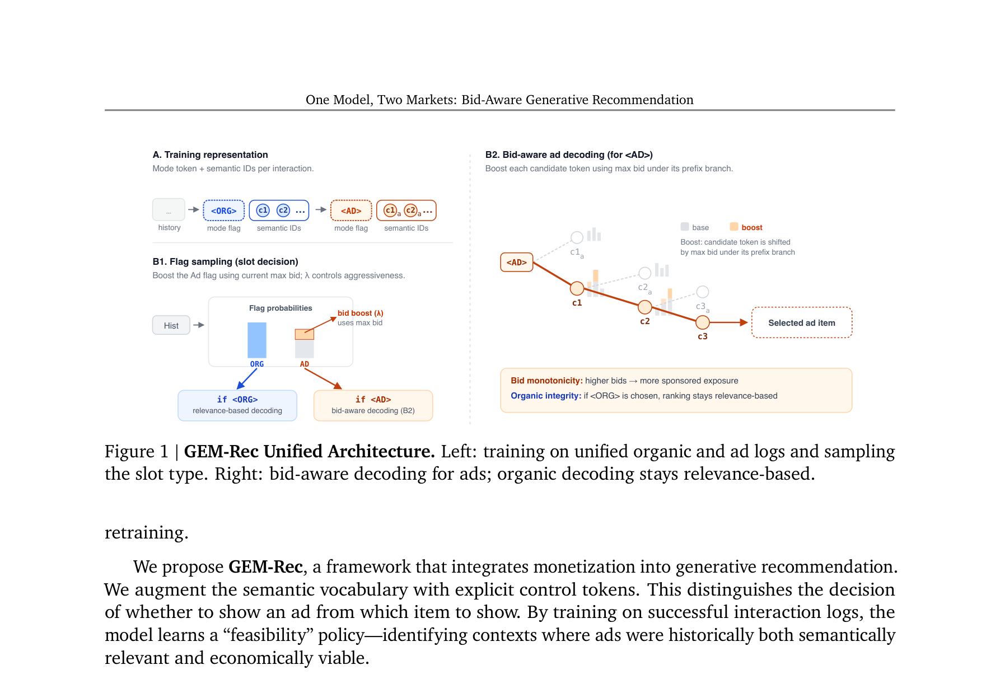
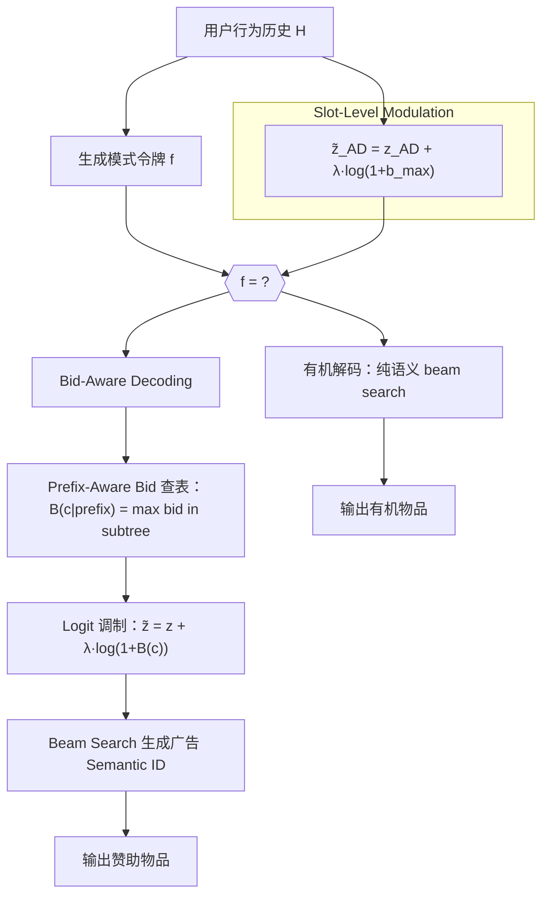

# One Model, Two Markets: Bid-Aware Generative Recommendation

- **日期**：2026-03-23
- **来源**：https://arxiv.org/abs/2603.22231
- **作者**：Yanchen Jiang (Harvard/Google), Zhe Feng (Google), Christopher P. Mah (Google), Aranyak Mehta (Google), Di Wang (Google)
- **发表**：arXiv 预印本 (2026)

---

## 生成式推荐只懂「用户喜欢什么」，不懂「谁在出价」

生成式推荐系统（Generative Recommender）正在取代传统的判别式排序范式。以 TIGER 为代表的模型用 Semantic ID 将物品表示为分层离散码的序列，把推荐变成了一个序列生成问题——给定用户历史行为序列，自回归地生成下一个物品的 Semantic ID。这条路已经在纯"有机推荐"场景上取得了 SOTA 效果。

但工业平台不存在纯有机推荐。任何真实信息流都同时包含两个市场：用户偏好驱动的**有机内容**（Organic）和广告主出价驱动的**赞助内容**（Sponsored/Ad）。现有的生成式推荐模型完全无视这一现实——它们把所有物品一视同仁，只优化语义相关性的似然，没有机制处理出价信号、没有能力区分有机物品和广告物品、更无法在推理时动态响应广告主实时变动的竞价。

这造成了一个结构性缺口：生成式推荐在"语义检索"这条线上越走越好，但在"变现"这条线上是零分。工业界的解法一直是两套独立系统（推荐系统 + 广告系统）在服务端通过 blending 层拼合，这种架构笨重、信号割裂、无法端到端学习用户对广告的接受度。

## GEM-Rec：用控制令牌把「是否投放广告」和「投放哪个广告」拆开

GEM-Rec 的核心增量用一句话概括：**在单个生成式序列模型内，用控制令牌将"广告位决策"从"物品检索"中显式剥离，再用推理时的竞价注入（Bid-Aware Decoding）让模型实时响应广告出价——无需重新训练。**

这不是简单地把广告日志混入训练数据。GEM-Rec 的设计有两个关键洞察：（1）"是否在这个位置展示广告"应该从历史日志中学习（学什么场景下用户接受过广告）；（2）"展示哪个广告"应该在推理时由实时出价来决定（因为出价每秒都在变）。前者是训练时解决的，后者是推理时解决的。

## 论文主模型架构

Figure 1 展示了 GEM-Rec 的三个模块：左侧（A）是训练表示——每次交互被表示为 [模式令牌] + [Semantic ID 序列]；左下（B1）是 Flag Sampling，决定当前槽位是有机还是广告；右侧（B2）是 Bid-Aware Decoding，在广告模式下用出价 boost 每个候选 token 的 logit。

## GEM-Rec 机制流程图

## 控制令牌：Semantic ID 是什么？

**Semantic ID**（语义标识）是 TIGER 系列工作的基础表示方法。传统推荐系统用原子整数 ID 标识物品（如 item_42），这种 ID 没有任何语义信息。Semantic ID 则用一个分层离散码元组 $(c_1, c_2, ..., c_D)$ 来标识物品——这些码通过 RQ-VAE（残差量化变分自编码器）从物品的内容嵌入中学出来，第一层码 $c_1$ 捕获粗粒度语义类别（如"动作游戏"），后续码逐层精细化（如"多人在线动作游戏"→"具体某款游戏"）。共享前缀的物品在语义上相似，这为后面的"前缀级 bid 聚合"提供了结构基础。

**控制令牌（Control Token）** 是 GEM-Rec 在 Semantic ID 词汇表中新增的两个特殊 token：`<ORG>` 和 `<AD>`。每个用户交互被表示为 $[\text{控制令牌}] \oplus [\text{Semantic ID 序列}]$。控制令牌在内容码之前生成，相当于先"声明意图"（这个位置是有机的还是赞助的），再决定具体物品。

## 控制令牌如何学习「什么场景适合投放广告」？

GEM-Rec 的生成概率被显式分解为两个因子：

$$P_\theta(\mathbf{x}_t | H_{<t}) = \underbrace{P_\theta(f_t | H_{<t})}_{\text{广告可行性建模}} \cdot \underbrace{\prod_{k=1}^{D} P_\theta(c_{t,k} | H_{<t}, f_t, c_{t,<k})}_{\text{模式条件检索}}$$

第一个因子学习"在当前上下文中，展示广告的可行性有多高"。训练数据来自真实交互日志——一条记录能出现在日志里，意味着它同时通过了两道关卡：平台过滤器（出价够高才能竞得展示位）和用户过滤器（足够相关才能引发点击）。因此，$P(f=\text{<AD>})$ 高，代表模型学到了"在这类上下文中，历史上广告曾被成功展示且用户接受过"。

第二个因子学习"在给定模式下，哪个物品最匹配"。如果 $f=\text{<ORG>}$，模型进入纯偏好模式；如果 $f=\text{<AD>}$，模型进入变现模式，检索那些"历史上既语义相关又具备商业可行性"的物品。

## Bid-Aware Decoding：推理时如何注入实时出价？

训练完成后，模型已经学到了一条"安全基线"——它知道什么场景下展示广告是安全的，以及广告应该在什么语义范围内选取。但这条基线是"历史快照"，不知道当前哪个广告主在大力出价。

Bid-Aware Decoding 在推理时分两个层级注入出价信号：

**Slot-Level（广告位层）**：用当前所有可选广告中的最高出价 $b_{max}$ 来 boost `<AD>` 令牌的 logit：

$$\tilde{z}_{\text{<AD>}} = z_{\text{<AD>}} + \lambda \cdot \log(1 + b_{max})$$

直觉：如果当前市场上有人在出高价，就适当倾向于开一个广告位。

**Item-Level（物品层）**：在广告分支内部，用前缀级 bid 聚合来 boost 每个候选 token：

$$\tilde{z}_c = z_c + \lambda \cdot \log(1 + \mathcal{B}(c))$$

其中 $\mathcal{B}(c|c_{<k})$ 是"以当前前缀 $c_{<k} \oplus c$ 为根的子树中，所有合法广告物品的最高出价"。这是一个预计算的查找表。直觉：在语义上可行的候选中，偏向那些包含高出价物品的分支，尽早剪掉低价值路径。

$\lambda \geq 0$ 是一个标量旋钮：$\lambda=0$ 时系统退化为纯历史基线（等价于标准 TIGER），$\lambda$ 越大越激进地偏向高出价物品。

## 为什么 log(1+b) 而不是直接加 b？

一个自然的疑问是：为什么 logit boost 用 $\log(1+b)$ 而不是直接用 $b$？这是因为 logit 空间中的加法最终通过 softmax 映射为概率的乘法缩放。$\log(1+b)$ 保证了：（1）当 $b=0$ 时 boost 为 0（无出价无 boost）；（2）对高 bid 进行压缩，避免单个极高出价完全压倒语义相关性；（3）在数学上保证了分配单调性的证明可以成立。如果直接加 $b$，高出价物品会获得过于线性的优势，容易让系统退化为"只看谁出价高"的纯竞价排名，丧失语义相关性。

## 那直接在推荐列表最后插一条广告不就行了？

这是最直觉的 baseline：先用标准生成式模型产出有机推荐列表，然后在后处理阶段根据出价插入一条广告。这种"后混合"（post-blending）方案有三个致命问题：

第一，它无法学习上下文依赖的广告可行性。用户对广告的接受度是高度上下文相关的——连续看了 5 条有机内容后可能愿意接受一条广告，但刚看过一条广告就再来一条会引发反感。后混合方案对此一无所知，因为生成模型根本没见过"带广告的序列"。

第二，它破坏了端到端的建模。生成式模型的优势在于自回归地捕捉用户轨迹的深层结构——前面展示了什么会影响后面应该展示什么。后插广告意味着打断了这条因果链，模型无法预判广告对后续推荐质量的影响。

第三，它不具备推理时可控性。后混合方案的"广告密度"需要通过规则硬编码（如每 N 条有机内容后插一条广告），无法像 GEM-Rec 那样通过 $\lambda$ 平滑调节广告率、并让系统自己在"安全"上下文中优先展示广告。

## 为什么不给每个物品直接加一个出价特征？

另一个看起来更简单的方案：在训练时把 bid 作为物品的一个额外特征输入模型，让模型自己学会权衡语义相关性和出价。

这行不通，原因有二：

第一，出价是实时变化的。今天 A 商家出价 10 元，明天可能变成 1 元。如果把 bid 编进训练特征，模型学到的是"历史出价分布"，无法响应当前此刻的出价。每次 bid 变化都要重新训练模型，这在实际中不可接受。GEM-Rec 的关键设计正是把"学习广告可行性"（训练时）和"响应当前出价"（推理时）分离开。

第二，混入 bid 特征会污染语义表示。Semantic ID 的核心价值在于其分层语义结构——共享前缀意味着内容相似。如果训练目标同时包含"语义匹配"和"出价高低"两个目标，学出的表示会把这两个维度混在一起，破坏有机推荐的质量。GEM-Rec 通过 Proposition 2（Organic Integrity）在数学上证明了：$\lambda$ 只作用于 `<AD>` 分支，有机分支的 logit 完全不受影响。

## 为什么不用强化学习来做广告插入决策？

已有工作（如 DEAR, Cross-DQN）用 RL 来优化"在推荐列表的哪些位置插入广告"。这条路线的问题是：

它不是生成式检索模型。RL-based 方法操作的是"已有的候选排序列表"上的插入决策，不提供语义 ID 解码器——它无法从零生成一个物品，只能在已有候选中选择。因此无法直接在解码过程中通过 bid 调制来产出高价值物品。GEM-Rec 则直接把 bid 信号注入到 token 级的生成过程中，在生成的同时就偏向高出价分支，本质上是"一边生成一边竞价"。

## 餐巾纸速写：思想框架的位移

**以前**：生成式推荐 = 纯语义检索。模型看到用户历史，自回归生成下一个最相关物品的 Semantic ID。广告和有机推荐是两个独立系统，在服务端拼合。

**现在（GEM-Rec）**：生成式推荐 = 双市场统一生成。模型先决定"这个位置的意图"（有机 vs 赞助），再在对应模式下生成物品。广告决策是序列的一部分，而非后处理。出价信号在推理时通过 logit 调制注入，让同一个模型同时服务两个市场。

**位移的本质**：把"是否展示广告"从一个外部规则变成了模型学到的上下文概率；把"展示哪个广告"从静态排名变成了推理时可实时调节的动态解码。

**边界条件**：GEM-Rec 的 Bid-Aware Decoding 仅在模型采样出 `<AD>` flag 后才激活。如果上下文中 $P(\text{<AD>})$ 本身就很低（比如用户刚看过广告，处于疲劳期），即使有广告主出天价，Slot-Level boost 也只是在一个很低的基准概率上加一点，不会强行插入广告。反过来，如果上下文对广告友好（$P(\text{<AD>})$ 已经较高），中等出价就能触发广告展示。这是"上下文安全性"的体现。而一旦 flag 采样为 `<ORG>`，Item-Level 的 bid 调制完全不激活——有机推荐的排序纯粹由语义决定，与所有广告出价无关。

## 实验如何论证设计选择

### 为什么看这些指标

GEM-Rec 的核心主张是"一个模型同时服务两个市场，且广告注入不损害有机质量"。为论证这一点，论文设计了三轴评估体系：

**Total NDCG**（总体策略拟合）：衡量模型能否准确复现混合市场策略——只有当模型同时预测对了槽位类型（Ad/Organic）和物品 ID 时才算 hit。这验证的是"模型是否学到了市场策略的全貌"。

**Conditional Organic NDCG**（条件有机质量）：只看模型选择生成有机物品的那些位置，有机排名质量是否保持。这直接验证 Proposition 2（Organic Integrity）——$\lambda$ 再大也不应该损害有机推荐的相对排序。

**Ad Rate / Revenue / Ad Relevance**（经济可控性三元组）：验证 $\lambda$ 能否平滑可控地调节广告密度和收入，以及高出价是否会以牺牲广告相关性为代价。

### 论文自造的关键指标：Prefix Match Depth

这个指标特别值得注意——**Prefix Match Depth**（前缀匹配深度）衡量的是生成的广告物品与用户有机目标物品共享了多少层 Semantic ID 前缀。深度 ≥ 2 意味着子类别级别的对齐。这个指标之所以必须存在，是因为传统 NDCG 只能评估"是否命中了精确物品"，而在广告场景中关键问题是"推的广告是否在语义上与用户兴趣相关"——即使不是完全一样的物品，只要在同一子类别下就算"好广告"。没有这个指标，"广告注入是否损害用户体验"这个核心主张就无法量化。

### 最锋利的那张表：Bid Shock 实验（Table 2）

Table 2 是全文论证的命门。它模拟了一个真实场景：5% 的库存突然获得 10× 的 bid 涨幅（类似双 11 期间广告主突然加大投放）。结果：

- $\lambda=0$（纯历史基线）：只有 21.8% 的展示广告来自高价值组——系统对市场变化"视而不见"
- $\lambda=0.5$（轻度调制）：High-Value Share 跳到 81.5%，收入 9× 提升，而 Ad Rate 仅从 2.4% 升到 7.1%

这张表直接回应了前面"为什么不给物品加 bid 特征"的反方案：一个把 bid 编入训练的模型面对新的 bid shock 无法做出任何反应（需要重新训练），而 GEM-Rec 仅通过调整 $\lambda$ 就能实时捕获新的高价值机会。它还证明了系统不是简单地"加大广告量"，而是在保持低广告率的同时精准替换低价值广告为高价值广告。

### Organic Integrity 的实证验证

Figure 3a 是另一张关键图：随着 $\lambda$ 从 0 增大到 10，Total NDCG 明显下降（预期内，因为更多位置被广告占据），但 Conditional Organic NDCG 几乎保持水平。在 Steam 数据集上，O.Recall@10 在 $\lambda=0$ 时为 0.1857，$\lambda=1.0$ 时为 0.1853——基本无损。这在实证上确认了 Proposition 2 的数学保证：bid 调制严格限制在 `<AD>` 分支内，不会"泄漏"到有机分支。

### 100% 生成有效性

Table 4 报告了一个看似简单但实际上很重要的结果：所有数据集、所有 $\lambda$ 设定下，广告 ID 的生成有效率均为 100%——模型不会"幻觉"出不存在的物品 ID。这意味着即使 bid 压力 $\lambda$ 很大，强制模型偏向高出价分支时，Semantic ID 的分层结构约束依然有效，不会产生非法序列。

## 启发

**对我最大的启发是"训练学时机、推理学响应"的分离设计哲学。** 在推荐系统中，有些信号是稳定的（用户偏好模式、广告可接受上下文），有些信号是实时变化的（出价、库存、预算）。GEM-Rec 的架构把前者编进模型权重（通过训练），把后者留给推理时的参数化注入（通过 $\lambda$ 和 bid 查表）。这种分离比端到端把所有信号塞进一个训练目标更优雅，因为它让系统无需重训就能适应市场动态。

**第二个启发是"控制令牌作为意图声明"的范式。** 在物品 ID 前面加一个 mode token 来显式声明"这个位置的意图"，本质上是在序列生成框架中引入了一个可控的"分发器"。这个思路可以推广到任何需要多目标混合的推荐场景——比如在同一信息流中混合短视频、图文、直播等不同内容形态，每种形态有不同的优化目标。

**局限性**：实验全部在合成市场环境上进行（从 Steam/Amazon 数据集构造的模拟广告日志），缺少真实工业系统的在线验证。合成数据中的"用户疲劳模型"和"竞价分布"是否能反映真实市场的复杂性，需要进一步验证。此外，论文采用第一价格拍卖（first-price auction），但没有实现激励兼容性（DSIC），即广告主有动机进行出价博弈（bid shading），这在实际部署中可能引发策略性行为。
