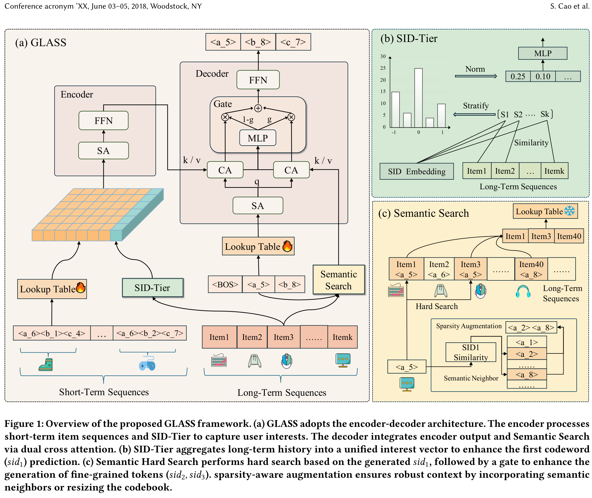
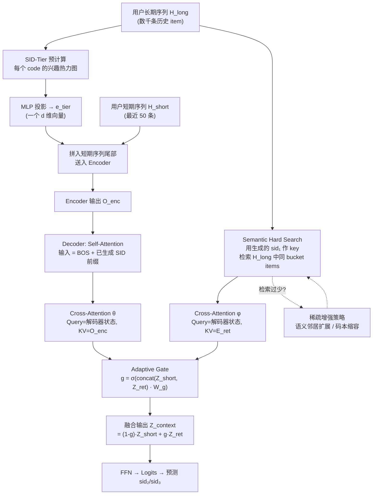

# GLASS: A Generative Recommender System for Long-sequence Modeling via SID-Tier and Semantic Search

- **日期**：2026-02-05
- **来源**：https://arxiv.org/abs/2602.05663
- **作者**：Shiteng Cao, Junda She, Ji Liu, Bin Zeng, Chengcheng Guo, Kuo Cai, Qiang Luo, Ruiming Tang, Han Li, Kun Gai, Zhiheng Li, Cheng Yang
- **发表**：arXiv 预印本（清华大学深圳国际研究院 & 快手）

---

## 缺口：生成式推荐的长序列困境——既缺目标又缺算力

生成式推荐（Generative Recommendation, GR）用自回归方式逐层生成 Semantic ID（SID），把推荐重新构造为"token 预测"任务。这一范式在短序列上已验证有效（TIGER、OneRec、OneSearch），但面对用户真实行为序列——往往数千甚至上万条交互——时，遭遇一个结构性难题。

难题由两层构成。第一层是**计算壁垒**：自注意力的 O(n²) 复杂度使得 GR 模型只能吃进约 50 条近期行为，大量长期兴趣信号被截断丢弃。第二层更根本——**目标缺失困境（target-absent dilemma）**。在排序阶段（Ranking），目标 item 已知，可作为 query 激活历史中的相关行为（如 SIM 的 GSU-ESU 范式）；但在检索阶段（Retrieval），推理时没有显式 target，模型被迫用近期行为充当代理查询（proxy query），与真实意图之间存在系统性偏差。

已有的长序列方案（SIM、TWIN、LONGER）都假设 target 已知，属于 Ranking 阶段；而 Retrieval 阶段的长序列建模——尤其是生成式检索中的长序列——几乎是空白。DualGR 尝试在 GR 中引入长序列，但仅用平均池化压缩长序列、且采用简单的单路 cross-attention 融合，未能利用 SID 层级结构的固有属性。

---

## 增量：用 SID 本身的层级属性做"两段式长序列注入"——第一层给热力图，后续层给精确检索

GLASS 的核心洞察是：SID 的层级本身就是一个从粗到细的意图明确化过程。第一层 SID（sid₁）相当于"我大致要去哪个语义族群"，后续层（sid₂, sid₃）是"在那个族群里具体找哪一个"。于是长序列注入可以**按层级分治**：

- **生成 sid₁ 之前**（无路径可循）：把长期历史与所有 sid₁ 码本条目做交叉，压缩成一张"兴趣热力图"（SID-Tier），前置注入。
- **生成 sid₂/sid₃ 时**（sid₁ 已确定）：用已生成的 sid₁ 作为 key，从长序列中硬检索同 bucket 的历史 item，做 RAG 式融合，修正后续轨迹。

这一方案的代价极低：SID-Tier 在线上是预计算的 O(1) 查表；Semantic Hard Search 的检索空间被限制在单个码本 bucket 内（平均仅 ~8 items），远小于全序列。

---

## 论文主模型架构（Figure 1）

图中左(a)为整体 encoder-decoder 框架；右上(b)为 SID-Tier 模块将长序列压缩为兴趣向量的过程；右下(c)为 Semantic Hard Search 在 sid₁ 确定后检索并门控融合的细节。

---

## 机制流程图：GLASS 的数据流与决策路径

---

## SID-Tier：从长序列到热力图的压缩机制

SID-Tier（Semantic ID Tier）解决的是"在没有任何生成路径之前，如何从长序列中提取对 sid₁ 的先验偏好"。它的做法不是学一个 dense 表示再做注意力，而是走了一条统计直方图的路线。

首先，每个第一层码字（code）被赋予一个**原型向量（prototype embedding）**——它等于数据集中所有 sid₁ 为该码字的 item 的 embedding 均值。这一步把"码字"拉回到与 item 相同的语义空间。

然后，对每个码字 a，遍历用户长期历史中所有 item，计算 cosine 相似度，将相似度区间 [-1, 1] 切成 N 个等宽 tier（如 N=20），统计每个 tier 中落入的 item 数量。得到的就是一个 N 维向量 t_a，刻画了"这个用户对码字 a 的兴趣强度分布"。

最后，把所有 K₀ 个码字的兴趣向量拼接为一个 K₀×N 的矩阵，经 MLP 投影为一个 d 维 token 嵌入 e_tier，追加到短期序列末尾一起送入 encoder。

关键点在于：K₀ 远小于 item 总数（论文中 K₀=64 或 128），所以"码字×用户"的交叉特征是可计算的；而传统 retrieval 中"item×用户"的交叉特征因 item 空间过大而不可行。SID-Tier 利用了 SID 码本的紧凑性，把排序阶段的"交叉特征"技巧下沉到了检索阶段。

---

## Semantic Hard Search：用 sid₁ 做"即时 RAG"

Semantic Hard Search（语义硬检索）的触发条件是：sid₁ 已经生成完毕。此时 sid₁ 代表一个粗粒度语义桶，起到了"隐式 target"的作用。

检索规则极其简洁：在用户长期历史中，找出所有第一层 SID 等于刚生成的 sid₁ 的 item，组成检索集 H_ret。这些 item 和当前生成目标处于同一语义族群，是"高相关历史证据"。

检索集经 embedding lookup 后，作为 key/value 送入一个独立的 cross-attention 模块。与此同时，encoder 输出（代表短期兴趣）也通过另一个 cross-attention 提供短期信号。两路输出通过一个 sigmoid 门控向量 g ∈ [0,1]^d 动态融合：当检索序列长且信息丰富时，g 偏大，更多依赖长期证据；当检索序列短或噪声大时，g 偏小，回退到短期行为。

---

## 稀疏增强：确保检索到足够的"弹药"

一个实际问题：如果第一层码本大小为 128，用户长序列有 1000 条 item，平均每个 bucket 只有约 8 条。这点"弹药"信噪比堪忧。GLASS 提出两种互补策略：

**语义邻居扩展（Semantic Neighbor Augmentation）**：预先为每个码字计算 top-k 最近邻。推理时若 H_ret 长度低于阈值 τ，则将邻居码字对应的 item 也纳入检索集。语义相近，不会引入太多噪声。

**码本缩容（Codebook Resizing）**：缩小第一层码本（如从 128 降到 64），迫使更多 item 挤进同一个 bucket，天然增大检索集。牺牲的是 sid₁ 的区分度，但论文发现这部分区分度可以由 sid₂/sid₃ 补回来——本质是把"定位负担"从第一层卸载到后续层。

---

## 那为什么不直接把长序列全部送进 encoder 做注意力？

读者第一反应可能是：既然长序列重要，直接扩大 encoder 的输入窗口不就行了？这是最 naive 的做法，但它正好撞上 GR 系统的核心痛点——自注意力复杂度为 O(n²)。用户序列从 50 拉长到 1000，计算量暴增 400 倍，在线延迟完全不可接受。工业级 GR（如 OneRec）为保持线上 TP99 稳定，通常把短期序列硬限在 50~100。GLASS 的设计正是为了在"不扩窗"的前提下把长序列信息注入进来：SID-Tier 是 O(1) 的预计算 token，Semantic Hard Search 的检索集平均只有个位数到十几条 item，远低于全序列 attention 的开销。

---

## 那直接用 Q-Former 压缩长序列不就行了？

OneRec 的做法是：用 Q-Former（固定数量的 learnable queries 对长序列做 cross-attention）把长期行为压缩为固定长度的向量。这确实能把长序列"塞进来"，但问题出在**压缩的粒度**：Q-Former 输出的是用户级别的兴趣聚类，丢失了 item 级别的细节。GLASS 的 Semantic Hard Search 则在 sid₁ 确定后检索的是**具体 item 的完整 SID**，保留了 item 粒度的信息，能为 sid₂/sid₃ 的生成提供精确的参照。论文消融实验表明，SID-Tier（粗粒度统计）和 Semantic Hard Search（item 粒度检索）缺一不可——前者帮 sid₁ 选对方向，后者帮后续 token 走准路径。

---

## 那为什么不像 DualGR 那样直接用 average pooling 再拿来做 cross-attention？

DualGR 对长序列的处理是：全部 item embedding 做平均池化，得到一个用户兴趣向量，然后用单路 cross-attention 融合。这里有两个问题。第一，平均池化彻底抹平了"用户对不同语义桶的偏好差异"——一个用户可能在美妆领域频繁互动而在数码领域偶尔点击，池化后两者被等权混合。SID-Tier 的 tier 直方图精确保留了这种差异性分布。第二，DualGR 的融合发生在 decoder 内，但它对所有层（sid₁/sid₂/sid₃）用同一个固定的 cross-attention，没有利用层级之间的因果依赖——sid₁ 确定后本可缩小搜索空间，DualGR 浪费了这个信息。实验结果上，GLASS 在 Taobao-MM 上 H@1 比 DualGR 高出 21.57%。

---

## 餐巾纸速写：思想位移

**以前的做法（DualGR / Tiger / Q-Former 压缩）**：长序列 → 一把梭压缩成一个向量 → 所有解码层统一使用 → 粗粒度、无法区分层级需求。

**GLASS 的做法**：长序列 → **按 SID 层级分治**：第一层"无路径"时给统计热力图（SID-Tier），后续层"有路径"时给精确检索（Semantic Hard Search）→ 粗细配合、各取所需。

思想位移的本质：**从"一次性全局压缩"到"按生成进度渐进注入"**。GR 的自回归过程本身是一个意图逐步明确化的过程（粗 → 细），长序列注入应当跟着这个进度走——在模糊时给全局偏好，在明确时给精准证据。这比"不管你现在生成到哪一步都给你同一个压缩向量"要合理得多。

**边界条件**：SID-Tier 对所有用户无条件生效（它是预计算的全局热力图）；Semantic Hard Search 仅在 sid₁ 确定后才被触发——若 sid₁ 预测错误，检索出的 item 就是错误语义桶里的证据，会误导后续生成。因此 SID-Tier 先确保 sid₁ 尽可能正确，是 Semantic Hard Search 的前提条件。稀疏增强策略也只在检索集过小时触发（低于阈值 τ），否则不扩展，避免引入噪声。

---

## 实验论证链：看哪些指标、每张表在证什么

### 指标选择本身就是论证

论文使用 Hit@K 和 NDCG@K 作为主要评估指标，K 取 1/3/5/10/20。这是生成式检索的标准指标组合：Hit@K 衡量"ground truth 是否出现在 beam size=K 的候选列表中"，直接反映 beam search 质量。NDCG 则进一步考量排序位置。

值得注意的是，论文还自造了一个分析指标：**Conditional Rank Progression (CRP)**。这个指标衡量的是"在 beam search 过程中，ground truth 的排名随解码层数加深是变好还是变差"。这个指标的存在本身就在为 Semantic Hard Search 的核心主张服务——"vanilla GR 存在 rank degradation（排名退化），我们的方法能遏制退化"。如果没有 CRP，"error accumulation effect"就只是一个定性观察，无法量化论证。

### RQ1（Table 3）：整体性能 — 论证 GLASS 框架的综合有效性

Table 3 是全文的门面表格，对比 9 个 ID-based baseline 和 2 个 SID-based baseline。GLASS 在 Taobao-MM 上 H@1 达 0.0372（相对 DualGR +21.57%），在 KuaiRec 上 H@1 达 0.0467（+4.94%）。两个数据集提升差异明显：Taobao-MM 使用了监督对比学习的高质量多模态特征（语义对齐好 → SID 质量高 → SID-Tier 和 Semantic Search 都更有效），KuaiRec 仅用简单文本编码（多模态信号弱 → SID 语义质量有限 → 提升受限）。这印证了"方法的上界取决于 SID 本身的语义质量"这一隐含假设。

### RQ2（Figure 2）：消融 — 每个组件各自证什么

消融设计是递增式的：Tiger → +SID-Tier → +SHS → +Both。关键发现：

- SID-Tier 将 acc₁（第一层训练准确率）从 0.2410 提到 0.2485，对应推理精度 P₁ 从 0.1470 到 0.1587。这直接论证了"热力图前置注入对 sid₁ 预测有效"。
- SHS 主要提升 acc₂ 和 P₂——符合设计意图：它在 sid₁ 确定后才介入，主攻后续 token。
- 两者叠加后 Recall@10 达到最高，验证了"分层分治"的必要性。

### RQ3（Figure 4）：门控值 vs 检索长度 — 论证自适应门控的必要性

论文对比了 learnable gate 和 fixed weight (0.5)。当码本较小（检索集较大）时固定权重尚可，但码本增大后固定权重性能反而下降——原因是检索集变短时信噪比低，固定权重把噪声无衰减地注入 beam search 概率链。而 learnable gate 值随检索长度单调递增（短则抑制、长则信赖），验证了"模型学会了根据检索质量调整融合权重"。

### RQ4（CRP 分析）：最锋利的证据 — 直接回应"为什么不能不做 Semantic Hard Search"

CRP 指标揭示了 vanilla GR 的 rank degradation：在 beam size=20 的条件下，baseline 模型第二层 CRP 上升 1.25（排名恶化），而 Semantic Hard Search 限制到 0.98（减少 22%退化）；第三层减少 31%退化。这张分析**是全文最锋利的论证命门**——它直接说明了"不做 Semantic Hard Search 的代价是什么"（后续 token 越生成越偏），从而回应了前文"为什么不能只靠 SID-Tier"的反方案。

### Figure 3：稀疏增强消融 — 论证两种增强策略的适用边界

Codebook Resizing (CR) 在所有配置下都有显著增益（Recall@10 接近 0.13），而 Semantic Neighbor (SN) 在粗粒度码本下反而引入噪声（语义桶本身已经很宽，再扩邻居会模糊边界），在细粒度码本下有效。这说明两种策略不是"越多越好"的关系，而是有明确的适用条件。

---

## 启发

这篇论文带来三个值得迁移的思想：

第一，**"按生成进度渐进注入"比"一次性全局压缩"更适合自回归系统**。任何自回归生成过程都是意图逐步明确化的过程，辅助信息的注入粒度应当跟着这个进度走。这一思路可以推广到所有层级式生成任务（如 text-to-image 的分层去噪）。

第二，**SID 码本的紧凑性打开了"交叉特征下沉到 Retrieval"的通道**。传统 Retrieval 阶段因 item 空间太大而无法做交叉特征（计算量 = users × items），但 SID 把 item 空间压缩到了码本大小（64~128），使得"用户 × 码字"的交叉特征变得可行。这是 SID 范式带来的结构性红利，GLASS 是第一个系统性利用它的工作。

第三，**CRP 指标是一个通用的 GR 诊断工具**。它量化了"自回归生成过程中 ground truth 的排名变化趋势"，可以用来诊断任何 GR 系统是否存在 rank degradation，进而指导改进方向。这比只看最终 Recall/NDCG 提供了更多 actionable insight。

不过也应注意：Semantic Hard Search 的效果高度依赖 sid₁ 的正确性——若 sid₁ 预测错误，检索出的历史 item 属于错误语义桶，会加速而非遏制偏离。论文没有报告 sid₁ 预测错误时的性能退化程度，这是未来可以深入分析的方向。
