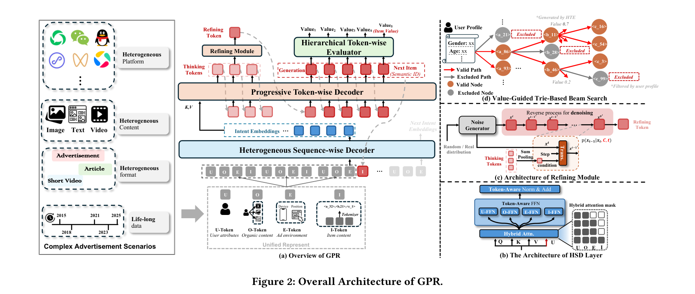

# GPR: Towards a Generative Pre-trained One-Model Paradigm for Large-Scale Advertising Recommendation

- **日期**：2025-11-15（arXiv v1），2026-02-12（v3）
- **来源**：arXiv:2511.10138
- **作者**：Jun Zhang*, Yi Li*, Yue Liu*, Changping Wang*, Yuan Wang*, Yuling Xiong*, Xun Liu*, Haiyang Wu*, Qian Li*, Enming Zhang, Jiawei Sun, Xin Xu, Zishuai Zhang, Ruoran Liu, Suyuan Huang, Zhaoxin Zhang, Zhengkai Guo, Shuojin Yang, Meng-Hao Guo, Huan Yu, Jie Jiang, Shi-Min Hu
- **发表**：arXiv 预印本（腾讯×清华，已部署于微信视频号广告系统）

---

## 缺口

广告推荐系统长期困在一个结构性的"不可能三角"里：级联漏斗天然目标错位（召回求覆盖、精排求精准，两者永不同步）、行为异质性极高（广告和自然内容交织，点击和转化信号量级差万倍）、多方利益诉求对冲（用户体验 vs 广告主 ROI vs 平台收入，三个方向各自为战）。

生成式推荐（HSTU、OneRec 等）用自回归统一了任务格式，但面临两道工业级硬墙：**效率-灵活性悖论**——decoder-only 高效训练但解码受限，encoder-decoder 解码灵活但训练成本爆炸；**价值对齐鸿沟**——纯似然训练只学"用户会点什么"，不学"什么对全局生态最优"。

到 GPR 之前，没有一个生成式框架能同时翻过这两道墙并在广告场景全量部署。

## 增量

**GPR 是第一个在工业级广告系统中全量部署的端到端生成式 One-Model 框架，用"理解-思考-精炼-生成"四阶段范式替代级联漏斗，通过统一 Token 化、异构分层解码、三阶段联合训练三重创新，在微信视频号实现 GMV +5.81%（累计五轮 A/B）。**

## 核心机制图



上图是 GPR 的整体架构，包含四个核心子模块：**(a)** GPR 全局概览——从异构输入经 Tokenizer 统一编码，HSD 生成意图嵌入，PTD 按"Thinking-Refining-Generation"生成目标 SID，HTE 逐级估价值；**(b)** HSD 层内部结构——混合注意力 + Token 感知 FFN/LN + MoR 深度增强；**(c)** Refining Module——基于扩散范式的去噪精炼，将 Thinking Token 经 Sum Pooling 条件化后迭代去噪；**(d)** Value-Guided Trie-Based Beam Search——Trie 树约束合法路径 + HTE 值引导动态调整束宽。

下面是核心数据流和模块关系的逻辑速写：

```
┌──────────────────────────────────────────────────────────────────┐
│                     GPR 核心机制逻辑速写                         │
├──────────────────────────────────────────────────────────────────┤
│                                                                  │
│  ┌──────────┐    ┌──────────────────────┐    ┌───────────────┐  │
│  │ 四类Token │    │    HSD (理解层)      │    │  PTD (生成层) │  │
│  │ U/O/E/I  │───→│ Hybrid Attn          │───→│ Thinking      │  │
│  │          │    │ Token-Aware FFN/LN    │    │   ↓           │  │
│  │ 统一序列  │    │ MoR (共享参数深推理)  │    │ Refining(扩散)│  │
│  │          │    │ LLM外部知识注入       │    │   ↓           │  │
│  └──────────┘    └──────────────────────┘    │ Generation    │  │
│                       │  意图嵌入 h           └───────┬───────┘  │
│                       ↓                               ↓          │
│               ┌───────────────┐              ┌───────────────┐  │
│               │   HTE (价值层) │              │ Trie+Value    │  │
│               │ 逐级 eCPM/CTR  │←─────────────│ Beam Search   │  │
│               │ /CVR 估计      │   值引导剪枝   │ 合法路径约束   │  │
│               └───────────────┘              └───────────────┘  │
│                                                                  │
│  训练管线:  MTP预训练(多兴趣) → VAFT(eCPM对齐) → HEPO(RL优化)   │
└──────────────────────────────────────────────────────────────────┘
```

## 白话方法

想象你是一个**餐厅大堂经理**，以前你有一套复杂流程：先让实习生筛客人（召回），再让领班挑座位（粗排），最后你亲自决定谁坐哪（精排）。三个环节目标不一致——实习生只管"人够多"，领班只管"别坐错区"，你才管"谁坐哪儿最赚钱"。结果好客人常被实习生误拒。

GPR 的做法是你一个人全包，但把决策分成四步：**看**（理解客人身份和偏好）→ **想**（在心里盘算几套方案）→ **琢**（用直觉再打磨一下方案）→ **定**（选定座位并估价）。"看"对应 HSD，用混合注意力理解异构行为；"想"对应 Thinking Token，在隐空间蒸馏意图；"琢"对应 Refining Module，用扩散去噪打磨初步判断；"定"对应 Generation，输出 SID 并由 HTE 估价。整条链路目标一致——最大化"客人满意 × 消费金额"。

## 关键概念费曼讲解

### 概念一：统一 Token 化（Four-Token Schema + RQ-Kmeans+）

**问题**：广告系统的用户行为由异构信号拼成——用户属性、自然内容浏览、广告交互、环境上下文——格式各异、语义各异。怎么喂进一个 Transformer？

**解法**：发明四种 Token 类型把整个用户旅程编成一条统一序列。U-Token 编用户属性（性别、年龄），O-Token 编自然内容（短视频、文章），E-Token 编环境上下文（设备、广告位），I-Token 编广告交互。O-Token 和 I-Token 的内容都通过 RQ-Kmeans+ 量化为多级语义 ID（如 `<a_0>, <b_2>, <c_4>`），广告和自然内容**共享同一个语义空间**。

RQ-Kmeans+ 解决了 RQ-VAE 的码本坍塌问题：先用 RQ-Kmeans 聚类初始化高质量码本，再用 RQ-VAE 损失微调保持灵活性，编码器加残差连接保分布稳定。碰撞率从 23.21% 降到 20.60%，码本利用率接近饱和（99.36%），碰撞内语义相似度 0.992。

**例子**：一个用户看了短视频 A（O-Token → `<a_5, b_12, c_3>`），点了广告 B（I-Token → `<a_5, b_8, c_17>`），两者第一级 SID 相同（`<a_5>`），说明模型认为这个短视频和广告在粗粒度语义上相关——这就是"广告和自然内容共享语义空间"的威力。

### 概念二：异构分层解码器（HHD）

**问题**：decoder-only 训练高效但解码受限，encoder-decoder 解码灵活但训练成本爆炸。广告场景同时需要两者。

**解法**：把"理解用户"和"生成物品"解耦成两个解码器。HSD（异构序列解码器）是主解码器，用混合注意力处理超长异构序列生成意图嵌入；PTD（渐进式逐 Token 解码器）是次解码器，基于意图嵌入做交叉注意力生成目标 SID。中间插入 Thinking Token（隐空间推理）和 Refining Token（扩散去噪精炼），形成"理解→思考→精炼→生成"四阶段范式。

HSD 的混合注意力在 prompt 区（U/O/E-Token）用双向注意力，在生成区（I-Token）用因果掩码——这是关键设计：理解上下文时允许自由交互，生成时保持自回归。Token-Aware FFN/LN 给每类 Token 独立的投影子空间，避免跨类型语义干扰。MoR（Mixture-of-Recursions）共享参数增加推理深度，不增加参数量。

**例子**：就像翻译工作流程——先通读全文写出摘要（HSD 理解），再在脑中打草稿（Thinking），再润色措辞（Refining），最后定稿（Generation）。每个阶段有独立的优化目标，但共享底层理解。

### 概念三：HEPO（层级增强策略优化）

**问题**：传统 RL 在层级 SID 生成中只给最终曝光动作奖励，中间层级的粗粒度决策（如选哪个大类）得不到直接反馈。一个用户对"手机→品牌 A→型号 X"不感兴趣，如果没有中间奖励，负信号会均匀地压低"手机"大类的概率，但用户明明对手机感兴趣——错误在品牌层级，不在大类层级。

**解法**：HEPO 为每个层级构造过程奖励（Process Reward）。具体来说，从用户历史成功交互中统计每个 Token 的受欢迎度分数 \(P_\ell(t)\)，然后比较选中 Token 的受欢迎度与同层级所有合法候选的平均受欢迎度，差值 \(\Delta_\ell\) 作为该层级的偏好信号。只有"比平均好"的决策才给正奖励（\(\alpha_\ell \max(0, \Delta_\ell)\)），最终层级用仿真环境返回的全局奖励 R。粗层级用 GAE（广义优势估计）做信用分配，最终层级用 z-score 归一化。

此外还有 ARR（Anticipatory Request Rehearsal）：根据用户当前状态构造合成请求，让模型提前"预演"未来可能遇到的场景，对抗数据滞后。

**例子**：一个用户拒绝了"手机→品牌 A→型号 X"的推荐。传统方法会让"手机"和"品牌 A"都受罚。HEPO 发现用户历史中"手机"大类的受欢迎度高于平均，所以"手机"层级不给负信号，只压低"品牌 A"层级的概率。

## 餐巾纸速写

```
以前（级联漏斗）              →    GPR（One-Model 生成范式）
                               
 召回：覆盖最优               →    HSD：统一理解（目标一致）
  ↓ 误杀好候选                     ↓ 意图嵌入
 粗排：速度优先               →    Thinking：多步蒸馏
  ↓ 目标错位                       ↓
 精排：精准预测               →    Refining：扩散精炼
  ↓ 三方利益割裂                    ↓
 出价：按 eCPM 排序            →    Generation + HTE：
                                   生成+估价同时完成
                                   Trie 约束合法路径
                                   值引导动态剪枝

核心位移：                    
"三阶段各自为战" → "理解-思考-精炼-生成 目标一致"
"事后排序"       → "生成即排序，价值嵌入解码"        
"静态码本"       → "RQ-Kmeans+ 高利用率共享语义空间"
```

## 实验

**离线实验**：

- **Tokenizer**：RQ-Kmeans+ 碰撞率 20.60%（vs RQ-VAE 23.21%），码本利用率 99.36%，碰撞内语义相似度 0.992。
- **架构消融**：Full GPR HitR@100 = 27.32%，vs HSTU 18.98%（+43.9%），vs OneRec 19.85%（+37.6%）。最大增量来自 MTP（+17.9%），其次 Thinking（+14.6%）、Hybrid Attention（+8.3%）。
- **训练策略**：HEPO 超越 DPO（nDCG 0.4413 vs 0.4383，归一化 max final_value 0.7619 vs 0.6659）。
- **Scaling**：0.02B → 2B 六个规模，训练损失持续下降，展示 robust scaling law。稀疏参数约 80B。

**在线 A/B（微信视频号，五轮迭代）**：

| 版本 | 核心改动 | GMV 增量 |
|------|---------|---------|
| v0.1 | HSD+NTP+DPO | +2.11% |
| v0.2 | +HEPO w/o ARR | +0.70% |
| v0.3 | +MTP+Thinking | +0.63% |
| v0.4 | +PTD | +0.58% |
| v0.5 | +HEPO w/ ARR | +0.58% |

累计 GMV +5.81%，CTCVR +3.72%（首轮低活跃用户）。冷启动优势明显：新广告（≤3天）GMV +2.97%，CTCVR +4.02%。

## 启发

1. **"四阶段范式"比"端到端黑盒"更可工程化**：GPR 没有走"一个大 Transformer 吃掉一切"的极简路线，而是把生成过程拆成理解→思考→精炼→生成四个可解释阶段。每个阶段可以独立消融、独立优化。这在工业部署中极其重要——出问题时你知道该查哪个模块。OneRanker 的"三步集成"和 GPR 的"四阶段"是同一个思路的不同实现，但 GPR 的扩散精炼（Refining）是全新设计。

2. **过程奖励（Process Reward）是层级 SID 生成的必需品**：HEPO 的层级过程奖励解决了层级解码中的信用分配问题。这个思路不只适用于广告——任何使用层级 SID 的生成式推荐系统（TIGER、OneRec、OneMall 等）都会遇到同样的问题：粗粒度决策得不到反馈。HEPO 给了一个可复用的解法模板。

3. **广告和自然内容共享语义空间是关键设计**：RQ-Kmeans+ 把广告和自然内容映射到同一个多级 SID 空间，解决了异构数据建模的根本困难。这意味着"用户看了什么视频"和"用户点了什么广告"在模型眼里是同一种信号——只是 Token 类型不同。这个思路值得在所有广告+内容混合推荐场景推广。

4. **对扩散精炼（Refining Module）持保留态度**：消融实验中 Refining 只带来 +3.3% 的 HitR@100 提升（vs Thinking 的 +14.6%），但引入了额外的扩散模型训练复杂度。这个模块的收益/复杂度比需要更多证据。不过思路本身很有趣——用条件扩散在隐空间精炼初步推理结果，是"System 2"推理的一种新形式。

5. **仿真环境 + ARR 是 RL 落地广告的关键基础设施**：GPR 构建了高保真仿真环境做离线奖励评估，配合 ARR 做前瞻训练。这套基础设施可能是比 HEPO 算法本身更重要的工程贡献——它让 RL 在广告场景变得可行（不需要在线探索的风险）。
