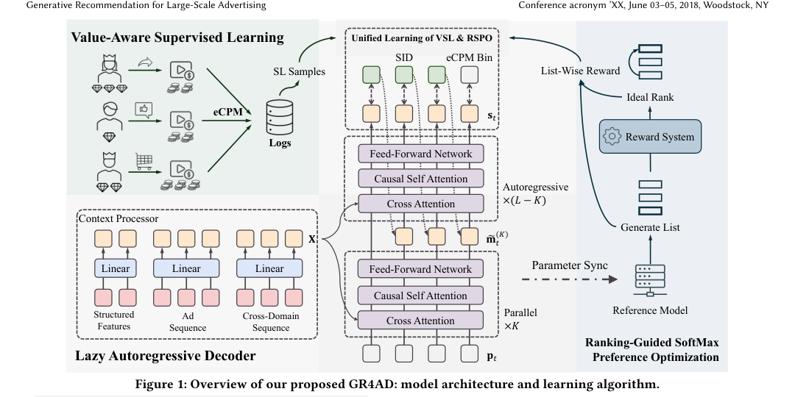

# Generative Recommendation for Large-Scale Advertising

- **日期**：2026-02-26
- **来源**：arXiv 2602.22732
- **作者**：Ben Xue*, Dan Liu*, Lixiang Wang*, Mingjie Sun*, Peng Wang*, Pengfei Zhang*, Shaoyun Shi*, Tianyu Xu*, Yunhao Sha*, Zhiqiang Liu* 等; 通讯作者 Peng Jiang†; Kun Gai
- **发表**：arXiv 预印本（快手广告系统已全量部署）

---

## 缺口：广告场景下的生成式推荐，为什么直接搬 LLM 不够？

生成式推荐（Generative Recommendation）在内容推荐场景已有突破性进展——OneRec、TIGER、LC-Rec 等工作证明了 Semantic ID + 自回归生成是一条可行路线。然而，把同一套架构搬到**大规模广告系统**，会遇到三道硬墙：

**第一道墙：广告 tokenization 远比内容推荐复杂。** 短视频广告融合了视频素材、产品属性、广告主元数据三类异构信息，而且平台还会暴露竞价类型、广告账户 ID 等纯数值型业务信号——这些信号没有语义内容，但对区分"同一个视频被不同广告主投放"至关重要。现有 SID 方案要么只看视频内容（QARM），要么拿通用 MLLM 出来零样本编码，都缺少对广告特有信息的端到端建模。

**第二道墙：LLM 式逐条监督无法优化广告排序目标。** 广告推荐优化的不是"你喜不喜欢这条"，而是"按 eCPM 排好的列表能赚多少钱"——这是一个 list-level 的排序优化问题（NDCG）。DPO/GRPO 等偏好优化方法虽然能做 pairwise 比较，但没有显式建模列表级的排序质量，更没有和 eCPM 这样的业务价值指标对齐。

**第三道墙：实时多候选生成的推理效率未系统解决。** 广告系统要求同时产出数十个高质量候选、延迟 <100ms、吞吐 500+ QPS。和 LLM 单条长文本生成不同，这里是**短序列、多候选、大 beam** 的解码场景，标准自回归解码在后续 level 上做 beam search 的计算量远大于首个 level，存在"难学的 level 贡献算力少，易学的 level 吃掉大部分算力"的错配。

三道墙归结为一个核心缺口：**广告推荐需要从 tokenization、学习范式到推理服务的全链路原生协同设计，而非简单复用 LLM 训练/推理配方。**

---

## 增量

**GR4AD 是首个面向大规模广告系统的生产级生成式推荐全链路协同设计，在 tokenization（UA-SID）、架构（LazyAR）、学习（VSL+RSPO）、服务（DBS）四个维度上同时适配广告场景特性，在线 A/B 取得 4.2% 广告收入提升。**

---

## 核心机制图



上图是 GR4AD 的整体架构。左侧是输入侧：用户结构化特征、广告交互序列、跨域序列经线性映射后送入 Context Processor 生成上下文向量 **X**。中间是 LazyAR 解码器：前 K 层并行计算所有 level 的表示（不依赖上一级 SID），K 层后通过门控融合注入上一级 SID 嵌入，再走剩余 L-K 层自回归解码。右侧是学习算法：VSL 负责拟合用户兴趣分布（含 eCPM token 预测），RSPO 在列表级优化 NDCG 上界，二者通过样本级对齐分数动态加权联合训练。

下面用 ASCII 速写看内部数据流和设计逻辑：

```
┌──────────────────── GR4AD 数据流 ────────────────────┐
│                                                        │
│  输入侧                                                │
│  ┌──────────┐ ┌──────────┐ ┌──────────┐               │
│  │结构化特征│ │广告序列  │ │跨域序列  │               │
│  └────┬─────┘ └────┬─────┘ └────┬─────┘               │
│       └────────────┼────────────┘                      │
│              Linear Projection                        │
│                    │                                    │
│              Context Processor ──→ X                   │
│                    │                                    │
│  ============== LazyAR Decoder ==============          │
│                                                    │   │
│   Level 1 (s₁):  BOS → [K层并行] → Fuse(s₀) → [L-K层] → s₁│
│   Level 2 (s₂):  pos₂ → [K层并行] → Fuse(s₁) → [L-K层] → s₂│
│   Level 3 (s₃):  pos₃ → [K层并行] → Fuse(s₂) → [L-K层] → s₃│
│                    ↑                                   │
│              前K层共享计算                               │
│              (不依赖 s_{t-1})                          │
│                                                    │   │
│  ============== 学习算法 ==============               │
│                                                    │   │
│  VSL:  L_SID + λ_e·L_eCPM + λ_mtp·L_MTP            │   │
│        (eCPM token 预测 + 值感知加权)                │   │
│                                                    │   │
│  RSPO: -E[log₂ σ(-Σ M_ij · (log π_θ/π_ref)·C_ij)]  │
│        (NDCG 上界, list-wise RL)                    │   │
│                                                    │   │
│  统一训练: w_VSL·L_VSL + w_RL·L_RSPO               │   │
│  w_VSL ∝ exp(A(i)·log(1+v_i))  ← 模型偏离大时↑      │
│  w_RL  ∝ Z_max·(1-A(i))        ← 模型对齐后↑       │
│                                                        │
│  ============== 在线服务 ==============                │
│                                                    │   │
│  DBS = DBW + TABS                                   │   │
│  DBW:  [128, 256, 512] 逐层递增 beam                │   │
│  TABS: 离峰加 beam, 高峰保延迟                       │   │
│  + Beam-Shared KV Cache + TopK Pre-Cut + FP8        │
│                                                        │
└────────────────────────────────────────────────────────┘
```

---

## 白话方法：核喻

GR4AD 就像一个**广告公司里的全能经纪人团队**：

- **UA-SID** 是经纪人的"客户档案编码"：不只是看客户长什么样（视频内容），还要记录"卖什么货"（产品属性）和"哪家公司的"（广告主元数据），最后用"身份证尾号"（hash 映射）区分同名不同人的情况。
- **LazyAR** 是经纪人的"分级决策流程"：面对多个客户，先花功夫做一轮通用背景调研（前 K 层并行），这轮调研不针对任何具体客户，但对所有客户都有用；然后才根据上一个客户的签约结果（上一级 SID），做精细判断（后 L-K 层自回归）。这样调研只做一次，后续客户复用，速度翻倍。
- **VSL+RSPO** 是经纪人的"考核体系"：VSL 是基础业绩考核——你有没有按客户喜好推荐（用户兴趣分布拟合）和按客户价值排序（eCPM 预测）；RSPO 是团队竞赛——不看你单个客户做得多好，而是看你整张推荐列表按收入排得好不好（NDCG 优化）。两者动态切换：如果推荐和收入排序差距大，先学好基础（VSL 权重高）；如果已经对齐了，就冲刺竞赛（RSPO 权重高）。
- **DBS** 是经纪人的"弹性排班"：闲时多接客户、深挖细选（大 beam）；忙时保底线、快速出货（小 beam），但始终保证交付不超时。

---

## 关键概念费曼讲解

### 概念一：UA-SID（统一广告语义 ID）

**从零讲起：** 生成式模型需要把"广告"变成一串 token 才能生成。在内容推荐里，一条视频 = 一串语义 ID，直接用视频内容的 embedding 做量化就行。但在广告里，同一条视频可能被不同广告主投放、推广不同产品、追求不同转化目标——如果只编码视频内容，这些"同一个视频但完全不同的广告"就会碰撞到同一个 SID 上。

**UA-SID 怎么做：** 三步走。第一步，用多模态大模型（Qwen3-VL-7B）做指令微调（6 条指令覆盖快手所有广告类型）+ 共现学习（Swing 协同信号），得到统一广告嵌入 UAE。第二步，做多分辨率多粒度 RQ-Kmeans 量化：底层用大 codebook 捕获粗粒度语义（如"美妆"），上层用小 codebook 做细粒度区分（如"口红"vs"卸妆巾"），最后一级**不做向量量化**，而是用 hash 把非语义的数值特征（账户 ID、转化类型）映射到离散码，彻底消除仅靠语义无法区分的碰撞。第三步，拼成 SID 序列 `(s₁, s₂, ..., s_T)`。

**具体例子：** 两个广告主都用同一条口红试色短视频投广告。A 是大牌官方店推广高端口红（转化目标：加购），B 是小商家引流直播间（转化目标：直播间停留）。如果只看视频，它们会分到同一个 SID——这是灾难，因为用户对官方店和引流直播间的反应完全不同。UA-SID 的最后一级 hash 把"账户 ID + 转化类型"编码进去，使得两个广告虽然前三层 SID 相同（都是美妆口红），但最后一级不同，成功分道扬镳。

### 概念二：RSPO（排序引导 Softmax 偏好优化）

**从零讲起：** DPO 做偏好优化时，对每一对 (chosen, rejected) 计算一个 loss，要求模型给 chosen 更大概率。但广告推荐要的是**一整张列表**按 eCPM 排好序，不是每对之间比大小。举个例子：列表里有 5 条广告，eCPM 分别是 10、8、6、4、2。DPO 只关心"eCPM=10 的比 eCPM=2 的好"这种成对关系，但不在乎 10 和 8 换位置后 NDCG 的下降。

**RSPO 怎么做：** 直接优化 NDCG 的上界。对列表中每个候选 i，找到所有 eCPM 比它低的候选集合 E_i，计算一个加权 softmax loss：让模型给 i 的排序分数高于 E_i 中所有候选，权重 M_ij 来自 Lambda 框架（同时考虑 relevance gain 差异和位置折扣）。同时引入参考模型 π_ref 作为 KL 约束防止训练崩溃，并通过门控 C_ij 在参考模型不可靠时自动关闭约束。

**具体例子：** 假设列表有 3 条广告，eCPM 分别为 v₁=10, v₂=4, v₃=1。对 i=1（eCPM 最高的），E₁ = {y₂, y₃}，RSPO 要求模型让 g₁ > g₂ 且 g₁ > g₃，且权重 M₁₂ > M₁₃（因为 |G₁-G₂| > |G₁-G₃|，即把第 1 名和第 2 名排反比把第 1 名和第 3 名排反的 NDCG 代价更大）。论文证明了这个 loss 是 NDCG_cost 的上界，所以最小化它就能改善 NDCG。

### 概念三：LazyAR（懒惰自回归解码器）

**从零讲起：** 标准自回归解码生成 SID 序列时，每个 level t 的计算必须等 level t-1 的结果出来才能开始——因为 s_{t-1} 的嵌入要从第 1 层就注入解码器。但观察到一个有趣现象：level 1 的 loss 最大（最难学），beam search 时 effective beam=1（因为从 BOS 开始），计算量最小；而 level 2、3 的 loss 小得多（更容易），但 beam 很大，计算量是瓶颈。

**LazyAR 怎么做：** 把前 K 层和后 L-K 层断开。前 K 层不依赖 s_{t-1}，只用位置嵌入就能算出中间表示 m_t^(K)，因此所有 level 的前 K 层可以**并行计算**。然后通过一个门控融合操作把 s_{t-1} 注入 m_t^(K)，再走剩余 L-K 层自回归。训练时还加了一个 MTP 辅助 loss：强迫 m_t^(K) 不经融合就能直接预测目标 token——这迫使前 K 层学到足够丰富的表示。

**具体例子：** L=9 层，K=6。生成 3 级 SID 时，传统方式需要 3 × 9 = 27 层前向计算（串行）。LazyAR 的前 6 层对 3 个 level 并行计算一次（6 层），后 3 层每个 level 分别做（3 × 3 = 9 层），总共 6 + 9 = 15 层等价计算，且前 6 层的结果在 beam search 中跨 beam 共享。实测 QPS 翻倍，收入仅微降。

---

## 餐巾纸速写

```
  以前（LLM 式生成式推荐）          现在（GR4AD）
  ──────────────────────          ──────────────────────
  SID = 视频内容 embedding        SID = 视频+产品+广告主
  量化 → 语义碰撞频发               + hash(非语义特征) → 碰撞消解

  每条广告独立打分                  一次生成整张列表
  DPO 做 pair 比较                 RSPO 做 list-wise NDCG 优化
  逐条 log(s_i) → 无排序意识       Σ M_ij · σ(log(π_θ/π_ref)) → 排序上界

  自回归每层串行                    前 K 层并行 + 跨 beam 共享
  beam 固定宽度                     DBS: 逐层递增 + 流量自适应

  离线训练 → 部署                   在线学习闭环
  模型更新 = 天级                    VSL+RSPO 联合更新 = 分钟级
```

**核心位移：从"把 LLM 配方搬到广告"到"广告场景原生协同设计"。** 不是哪个模块微调，而是 tokenization、架构、学习、服务四个维度同时适配广告的特有问题——异构信息融合、列表级价值优化、短序列多候选推理加速。

---

## 广告特有机制的融入方式

GR4AD 对广告场景特有机制的处理是这篇论文最值得关注的设计：

**竞价/计费 → eCPM Token 预测。** 广告系统的核心指标是 eCPM（expected Cost Per Mille），它由竞价（bid）和计费逻辑决定。GR4AD 没有在排序后单独预估 eCPM，而是把 eCPM 离散化成 equiprobable buckets，作为 SID 序列之后的**额外预测 token**，和 SID token 一起用交叉熵优化。这意味着模型在生成广告 ID 的同时就在预测其价值，生成的列表可以按 eCPM token 重排。

**eCPM 驱动的学习目标。** VSL 中每个样本的权重 w = w_user · w_behavior，w_user 捕获用户的长期广告价值，w_behavior 反映交互深度（购买 > 点击）。RSPO 直接以 eCPM 作为 reward，NDCG 中的 relevance gain G_i = 2^{v_i/Z} - 1 也由 eCPM 决定。整个学习管线从头到尾都在优化"按 eCPM 排好的列表"。

**竞价环境中的在线闭环。** Figure 4 展示了完整闭环：Reward System 用奖励模型给 GR4AD 生成的候选集打分（而非仅用线上曝光日志），缓解了推荐系统天然的数据偏差（只曝光了老模型选的，新模型想探索的没有标签）。在线学习模块实时混合 VSL 和 RSPO 更新，参数分钟级同步到推理服务器。

---

## 实验：不只是 4.2%

在线 A/B 核心数据：

| 组件叠加 | ΔRevenue | ΔQPS |
|----------|----------|------|
| DLRM (基线) | — | — |
| + OneRec-V2 (GR-Base) | +1.68% | — |
| + UA-SID | +1.92% | 0% |
| + VSL | +2.80% | -25% |
| + VSL + RSPO (统一训练) | +4.01% | -25% |
| + DBS | +4.32% | +20% |
| + LazyAR (完整 GR4AD) | +4.28% | +117% |

几个值得细看的点：

**RSPO 是最大的单项增益。** 从 VSL 的 +2.80% 到 VSL+RSPO 统一训练的 +4.01%，RSPO 贡献了 1.2 个百分点，超过了 DPO（+0.36%）和 GRPO（+0.41%）。这验证了 list-wise 排序优化比 pair-wise 偏好更适合广告场景。

**LazyAR 的精妙权衡。** 单独加 LazyAR 后收入从 +4.32% 微降到 +4.28%，但 QPS 从 +20% 飙到 +117%。对比之下，DeepSeek-MTP 方案虽然也提速，但收入掉了 +0.34%（+4.32% → +3.98%）。这体现了 LazyAR 的设计优势：不增加参数，前 K 层共享表示+MTP 辅助 loss 保证了性能不退化。

**Scaling Law 在两个维度都成立。** 模型从 0.03B 到 0.32B，收入提升从 +2.13% 单调增长到 +4.43%；beam 从 128 到 1024，收入从 +2.33% 增长到 +4.21%。这对资源规划和在线推理优化都有指导意义。

**业务健康度指标同样亮眼：** 中小广告主投放量 +17.5%，广告转化率 +10.17%，低活用户转化率 +7.28%。这归功于内容 SID 带来的泛化能力和实时索引对冷启的支持。

---

## 启发

1. **"全链路协同"比"单点创新"更适合生产落地。** GR4AD 的每个组件单独拿出来都不算全新——MGMR RQ-Kmeans 有 PLUM 的影子，LazyAR 受 DeepSeek-MTP 启发，RSPO 源于 LambdaLoss + DPO。但把 tokenization、架构、学习、服务四个维度**同时适配广告特性**做协同设计，才是从 OneRec-V2 的 +1.68% 跃升到 +4.28% 的关键。这提醒我：在工业场景做生成式推荐，不要只盯着模型架构，tokenization 和学习范式同等重要。

2. **广告 eCPM 的融入方式值得关注。** 把 eCPM 离散化成 token 和 SID 一起预测，比后处理排序更优雅。这对我做其他带价值约束的生成场景（如搜索广告混排）有启发——能不能把业务指标也变成 token？

3. **RSPO 的 list-wise 视角可能比 DPO/GRPO 更适合所有排序场景。** DPO 是 pair-wise 的，但推荐/搜索/广告本质上都在优化排序列表的质量。RSPO 直接优化 NDCG 上界的思路，是否也能用于搜索排序、信息检索的 preference optimization？

4. **LazyAR 揭示了一个通用规律：推荐场景的生成序列"头难尾易"。** 这和 LLM 的长文本生成正好相反，所以适用于推荐的解码加速策略应该是"头重脚轻"的——前面用深网络精细生成，后面用浅网络快速出结果。这个思路可能也适用于其他短序列生成场景。

---

## 局限与未解问题

- 论文没有和 GPR（快手自己的广告生成式推荐工作）做直接对比，只和 OneRec-V2 做了消融，缺少和同场景工作的 head-to-head 比较。
- RSPO 的参考模型门控 C_ij 中的阈值 δ 如何选取、对不同流量规模的敏感性，论文没有详细讨论。
- LazyAR 的 K 值选择（K = 2/3 L）是否有理论依据，还是纯实验调的？不同 SID depth 下 K 的最优值会不会变化？
- 0.16B 模型已经全量部署，0.32B 的 Scaling Law 结果是在线 A/B 还是离线？论文没有明确说明。
