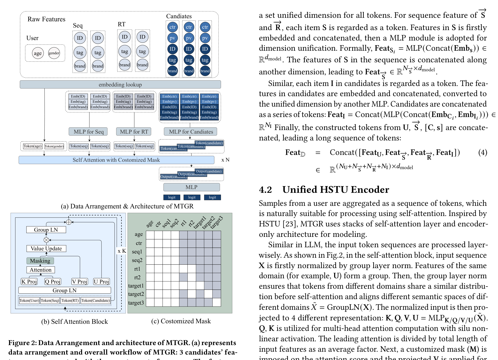

# MTGR: Industrial-Scale Generative Recommendation Framework in Meituan

- **日期**：2025-05-22
- **来源**：https://arxiv.org/abs/2505.18654
- **作者**：Ruidong Han, Bin Yin, Shangyu Chen, He Jiang, Fei Jiang, Xiang Li, Chi Ma, Mincong Huang, Xiaoguang Li, Chunzhen Jing, Yueming Han, Menglei Zhou, Lei Yu, Chuan Liu, Wei Lin
- **发表**：CIKM 2025

---

## 缺口：生成式推荐抛弃了交叉特征，性能断崖无法靠 scaling 弥补

推荐系统的排序模型走到一个分叉口。DLRM（深度学习推荐模型）统治工业界近十年，核心武器是一套精心构造的**交叉特征**——用户对目标候选的历史点击率、用户-品类交互统计、商品-时空联合特征。这些特征编码了用户与候选之间的先验关系，是排序精度的基石。但 DLRM 有两个致命瓶颈：用户行为序列只能截断或用低复杂度模块近似学习；推理成本随候选数线性增长，扩大交叉模块意味着不可接受的延迟。

生成式推荐模型（GRM）带来了可扩展性的希望。HSTU、OneRec 等工作证明，把所有特征组织成 token 序列、用 Transformer 架构统一建模，可以端到端地处理完整用户行为、实现跨用户计算复用。然而，GRM 的核心前提——next token prediction——要求每个 token 只依赖其左侧历史，这意味着**交叉特征无法自然融入**：交叉特征本身就需要"看到"候选才能计算，而候选出现在序列右侧。于是 GRM 的选择是丢弃交叉特征。

论文发现：**丢弃交叉特征导致的性能退化，无法通过任何程度的模型放大来弥补。** 这不是"少了一块拼图"的量级问题，而是"地基被抽走"的结构性问题。交叉特征在真实推荐系统中至关重要，它们往往是人工精心设计的用户-商品交互特征，信息密度远高于原始 ID embedding。

缺口就在这里：DLRM 有交叉特征但无法扩展；GRM 可扩展但必须抛弃交叉特征。两者各持一半真理，缺一个统一框架。

## 增量：保留交叉特征的生成式推荐，用户级压缩实现 65× FLOPs 且推理成本降 12%

MTGR 的核心洞察是：**交叉特征不需要被丢弃，只需要被重新安放。** 传统 DLRM 把交叉特征放在用户侧和候选侧之间的"桥"上，每个候选独立推理一次；MTGR 把交叉特征折叠进候选 token 内部，然后同一用户的所有候选聚合到同一条 token 序列里，用带掩码的 self-attention 统一处理。这样一来，交叉特征被保留、用户表示被复用、推理从"K 次独立前向"变成"1 次联合前向"。

## 核心机制图



上图是论文 Figure 2，展示了 MTGR 的三个关键组成部分：

- **(a) 数据排列与架构**：同一用户的 3 个候选被聚合到一条序列中。原始特征经过 embedding lookup 后，User/Seq/RT 各自通过独立 MLP 转换为统一维度的 token，候选特征（含交叉特征）也通过 MLP 转为 token。所有 token 拼接后送入带定制掩码的 self-attention，候选 token 的输出经 MLP 生成各候选的 logit。
- **(b) 自注意力块**：输入先经 Group-LN 归一化，然后投影到 Q/K/V/U 四路。注意力计算施加定制掩码后更新 V，更新后的 V 与 U 逐元素相乘，再经 Group-LN + MLP + 残差。
- **(c) 定制掩码**：静态特征（U, S）对全序列可见（全注意力），动态特征（R）遵守因果顺序（自回归掩码），候选 token 只能看到自己和比它早的动态 token（对角掩码）。

### 餐巾纸速写：新旧范式位移

```
  DLRM 传统范式                     MTGR 新范式
  ┌──────────────┐              ┌──────────────────────┐
  │  用户侧特征   │              │  用户 token 序列       │
  │  (独立推理×K) │              │  (推理1次,复用K次)     │
  │      │       │              │   ┌───┬───┬───┐       │
  │  ┌───┴───┐   │              │   │U  │S  │R  │       │
  │  │交叉MLP │←──│ 候选1       │   └─┬─┴─┬─┴─┬─┘       │
  │  └───┬───┘   │              │     │   │   │         │
  │  ┌───┴───┐   │              │  ┌──┴───┴───┴──┐      │
  │  │交叉MLP │←──│ 候选2       │  │ Self-Attn   │      │
  │  └───┬───┘   │              │  │ (GLN+Mask)  │      │
  │  ┌───┴───┐   │              │  └──┬───┬───┬──┘      │
  │  │交叉MLP │←──│ 候选K       │   C₁  C₂  C₃        │
  │  └───────┘   │              │  (交叉特征在token内)   │
  └──────────────┘              └──────────────────────┘
  推理: O(K) 次前向               推理: O(1) 次前向
  交叉特征: 候选间独立             交叉特征: 折入候选token
```

核心位移：从"每个候选独立走一遍完整流水线"到"所有候选共享用户表示、交叉特征折叠进 token、一次推理出全部 logit"。

## 白话方法：一个房产中介的类比

想象一个房产中介给客户推荐房子。传统方式（DLRM）是：每来一套房子，中介就把客户资料、客户历史偏好、客户与这套房的匹配度全部翻出来，从头到尾分析一遍。10 套房就分析 10 次，客户资料每次都要重新看——虽然客户是同一个人。

MTGR 的做法是：中介先把客户资料（用户 token）和历史偏好（序列 token）整理好，摊在桌上；然后把所有候选房子连同"客户对这套房的特殊偏好"（交叉特征）各写成一张卡片（候选 token），和客户资料放在一起。中介只需从头到尾看一遍（self-attention），就能给每张房子卡片打分。客户资料只整理一次，10 套房 100 套房都是一次过。

关键：那些"客户对这套房的特殊偏好"信息并没有丢——它被写在了每张房子卡片上，而不是像纯生成式方法那样被扔掉。

## 关键概念

### 1. 用户级压缩（User-Level Compression）

传统推荐中，一个用户有 K 个候选，就需要 K 次独立的前向推理。MTGR 发现：既然这些候选共享同一个用户表示（用户画像、历史行为序列、实时行为），完全可以把它们聚合到同一条 token 序列里，一次推理产出所有候选的打分。

形式化地说，传统 DLRM 的第 i 个样本是 `D_i = [U, S, R, C_i, I_i]`，每个候选独立处理；MTGR 把 K 个候选聚合为 `D = [U, S, R, [C,I]_1, ..., [C,I]_K]`，用户侧只计算一次。这个"压缩"在训练时按特定时间窗口聚合（同一用户的曝光样本合并），在推理时按请求聚合。

效果：训练样本数量大幅减少（同一用户的多次曝光合并为一条），推理从 K 次降为 1 次。这是 MTGR 能在 65× FLOPs 下保持训练成本不变、推理成本反降 12% 的基础。

### 2. Group-Layer Normalization（GLN）

标准 LayerNorm 对整条 token 序列做归一化，但 MTGR 的序列里混合了来自不同"语义域"的 token：用户画像 token、历史行为 token、实时行为 token、候选 token。它们的信息分布和数值范围可能差异巨大——用户 age 可能是个标量 embedding，候选的 ID embedding 维度可能完全不同。

GLN 的做法很直观：**同域 token 一起归一化，不同域各自归一化。** 具体来说，属于 U 的 token 组成一个 group，S 的 token 组成另一个 group，R 和候选各自也是 group。每个 group 独立计算均值和方差，做 layer normalization。

这样做的好处是：不同语义空间在进入 self-attention 之前被对齐到相似的数值分布，避免某个域的 token 因为数值范围过大或过小而主导或淹没注意力计算。消融实验表明，去掉 GLN 后 CTCVR GAUC 从 0.6603 降到 0.6585，退化幅度接近从 MTGR-small 到 MTGR-medium 的提升。

### 3. 动态掩码策略（Dynamic Masking）

因果掩码（causal mask）是语言模型的标配——每个 token 只能看到自己左边的。但在 MTGR 中，简单套用因果掩码会导致信息泄露或信息丢失：

- **静态信息**（用户画像 U、历史行为 S）来自聚合窗口之前，对所有候选都是"已知"的，应该对全序列可见（全注意力）。
- **动态信息**（实时行为 R）的时间戳可能与候选的曝光时间交叉——晚上 8 点的实时点击不应该泄露给下午 3 点的候选。所以 R 之间遵守严格的因果顺序。
- **候选 token** 之间应该互相不可见（对角掩码），否则候选 A 的信息泄露给候选 B，会导致训练时的标签泄露。

三条规则合起来形成"动态掩码"：静态→全注意力；动态→自回归；候选→只看自己。这个设计直接解决了 HSTU 原始因果掩码在推荐场景下的不适配问题。

## 实验：Scaling Law 验证与在线收益

### 离线实验

使用美团外卖真实数据集（10 天训练数据，2.1 亿用户，237 亿曝光），对比 DLRM 系列基线（DNN-SIM、MoE-SIM、Wukong-SIM、MultiEmbed-SIM、UserTower-SIM/E2E）：

| 模型 | CTR AUC | CTCVR GAUC |
|------|---------|------------|
| UserTower-SIM (最强DLRM) | 0.7593 | 0.6550 |
| MTGR-small | 0.7631 | 0.6603 |
| MTGR-medium | 0.7645 | 0.6625 |
| MTGR-large | 0.7661 | 0.6646 |

即使最小的 MTGR-small 也超过了最强 DLRM 基线。三个规模的模型呈现清晰的 scaling trend。

### 消融实验

去掉交叉特征后，CTCVR GAUC 从 0.6603 骤降到 0.6514——**退化幅度甚至抹掉了 MTGR-large 相对 DLRM 的全部增益**。这直接证明了交叉特征的不可替代性。去掉 GLN 和动态掩码同样导致显著退化。

### Scaling Law

论文验证了三个维度的可扩展性：HSTU block 数量（2→128）、`d_model`（128→1024）、序列长度（100→5000）。性能与 FLOPs 呈现近似 power-law 关系。

### 在线 A/B 实验

在美团外卖主流量 2% 上做 A/B 测试，对比已迭代 2 年的 DLRM 基线：

| 版本 | PV_CTR 提升 | UV_CTCVR 提升 |
|------|------------|---------------|
| MTGR-small | +1.04% | +0.04% |
| MTGR-medium | +2.29% | +0.62% |
| MTGR-large | +1.90% | +1.02% |

MTGR-large 带来了近两年最大的线上增益，训练成本与 DLRM 持平，推理成本降低 12%。

## 与 OneRec 路线的本质区别

MTGR 和 OneRec 都被称为"生成式推荐"，但路线有本质差异：

- **OneRec** 走的是纯生成路线：用 Semantic ID（SID）替代原始 item ID，用 next token prediction 建模完整用户行为序列，统一检索和排序。它的代价是必须丢弃交叉特征——因为 SID token 的自回归性质不允许候选信息在预测时泄露。
- **MTGR** 走的是"生成式架构 + 判别式损失"路线：保留了 DLRM 的全部特征（含交叉特征），但用 HSTU 架构和用户级压缩获得了生成式推荐的可扩展性。它的损失函数仍是判别式的（每个候选独立出 logit，做 CTR/CTCVR 预测），而不是 next token prediction。

一句话概括：**OneRec 用生成范式替换排序范式，MTGR 用生成架构升级排序范式。** MTGR 的选择更保守但更实际——在工业界，交叉特征经过多年积累，信息密度极高，丢弃的代价远超纯生成范式带来的收益。

## 启发

1. **"保留而非替换"的工程哲学**：MTGR 没有试图推翻 DLRM 的特征体系，而是重新安放它。这在工业系统中是更可行的路径——你已经有的东西通常比你想象的有价值，特别是经过多年人工打磨的交叉特征。

2. **用户级压缩是推荐系统 scaling 的关键杠杆**：LLM 的 scaling 之所以可行，是因为同一段文本只需要前向推理一次。推荐系统之前做不到这一点（每个候选独立推理），MTGR 通过用户聚合实现了类似的效果。这个思路可能适用于更多"一对多"的推理场景。

3. **Group-LN 启示了多源 token 序列的归一化问题**：当你把不同语义空间的 token 拼在一起时，全局归一化可能有害。这个 insight 不限于推荐——任何多模态序列建模（视觉+语言+音频）都可能遇到类似问题，需要考虑分组归一化。

4. **掩码设计需要理解数据的时间语义**：推荐系统中的"因果"比语言模型更复杂——实时行为和候选曝光之间可能存在时间交错，简单套用 causal mask 会泄露未来信息。这提醒我们在把 NLP 技术迁移到推荐时，必须仔细审视数据的时间结构。
