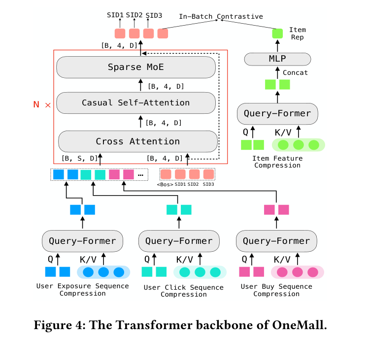

# OneMall: One Architecture, More Scenarios — End-to-End Generative Recommender Family at Kuaishou E-Commerce

- **日期**：2026-02-02
- **来源**：arXiv:2601.21770v2
- **作者**：Kun Zhang*, Jingming Zhang*, Wei Cheng*, Yansong Cheng*, Jiaqi Zhang*, Hao Lu, Xu Zhang, Haixiang Gan, Jiangxia Cao★, Tenglong Wang, Ximing Zhang, Boyang Xia, Kuo Cai, Shiyao Wang, Hongjian Dou, Jinkai Yu, Mingxing Wen, Qiang Luo, Dongxu Liang, Chenyi Lei, Jun Wang, Runan Liu, Zhaojie Liu, Ruiming Tang, Tingting Gao, Shaoguo Liu, Yuqing Ding, Hui Kong, Han Li, Guorui Zhou, Wenwu Ou, Kun Gai
- **发表**：arXiv 预印本 (Kuaishou Technology)

---

## 缺口：OneRec 证明了生成式推荐在短视频可行，但电商有三道墙还没翻

生成式推荐（Generative Recommendation）的工业落地已经有了一个成功的先例——快手的 OneRec 系列。OneRec 的核心洞察是：用 LLM 式的"预训练（NTP）+ 后训练（RL）"范式替代传统级联漏斗，在娱乐短视频场景取得了显著在线收益。但电商和短视频是两个完全不同的物种。

电商有三道短视频场景不曾面对的墙：

**第一道墙：品类异构。** 短视频场景只有一种物品类型——视频本身。但电商有三类：商品卡（用户进商城才看到的纯购物品）、电商短视频（既看又买，绑定一个商品）、直播（同时卖多个商品，而且卖的东西随时变）。一个 Tokenizer 怎么同时服务三种截然不同的推荐逻辑？

**第二道墙：正样本极度稀疏。** 短视频场景里用户可以无脑刷，点个赞就算正向行为，数据喂饱模型不愁。电商是"曝光→点击→加购→付款"的长漏斗，到付款那一步的正向行为已经是凤毛麟角，模型几乎看不到"用户真正买了什么"的信号。

**第三道墙：单目标高压。** 短视频可以同时优化观看时长和互动率，多目标各有余量。电商只认一个硬指标——GMV（成交额）。一个目标，没有退路，对模型能力的要求远高于多目标场景。

这三道墙的本质是同一个问题：**OneRec 的范式能不能从"一种物品、丰富信号、多目标缓冲"的舒适区，迁移到"多种物品、极稀信号、单目标高压"的电商战场？**

---

## 增量：电商场景下"一个 Tokenizer 服务三种品类 + 一个 Decoder-Only 统一召回 + RL 打通召回-排序"的全链路方案

OneMall 让我们知道了：**把 OneRec 的"预训练+后训练"范式完整迁移到电商是可行的，但必须对 Tokenizer 做品类适配、对架构做行为异构融合、对 RL 做排序信号引入——每个环节都要"电商化"改造，照搬短视频方案会死。**

---

## 核心机制图



上图是 OneMall 的 Transformer backbone，从下往上读：

- **底部三个 Query-Former**：分别压缩用户的曝光序列、点击序列、购买序列——电商用户的行为漏斗很长，不同行为代表不同强度的意图，必须分开压缩再融合，而不是简单拼接
- **Cross Attention 融合层**：用交叉注意力把多行为序列信息注入 SID 生成过程，用户侧做 Query，历史行为做 Key/Value
- **Causal Self-Attention + Sparse MoE**：自回归生成 Semantic ID 的核心模块，Sparse MoE 在保持 0.1B 激活参数的同时把总参数推到 1.3B
- **双路监督**：主路是 NTP（下一个 SID token 预测），辅助路是 In-Batch Contrastive（SID 最后一层输出和 item tower 嵌入做对比学习，精度超 98%）

下面用一张速写看清楚"传统级联漏斗"和"OneMall 端到端"的位移：

### 餐巾纸速写

```
之前（传统级联漏斗）：                 之后（OneMall 端到端）：
┌──────────┐                          ┌──────────────────────┐
│ 两塔召回  │ ← 独立训练，              │  E-commerce Tokenizer │
│ (ANN)    │   只用 user/item 特征      │  ┌─ Product: LLM emb │
└────┬─────┘   不知排序要什么            │  ├─ Short-Vid: 拼接   │
     ↓                                   │  └─ Live: 动态更新    │
┌──────────┐                          └──────────┬───────────┘
│ 排序模型  │ ← 独立训练，                         ↓
│ (全特征)  │   召回不知道什么好          ┌──────────────────────┐
└──────────┘                           │  Decoder-Only Model   │
                                       │  ┌─ Q-Former × N 行为  │
  两个模型各干各的，                      │  ├─ Cross-Att 融合    │
  召回不知道排序要什么                    │  ├─ Sparse MoE 生成   │
                                       │  └─ NTP+Contrastive   │
                                       └──────────┬───────────┘
                                                  ↓
                                       ┌──────────────────────┐
                                       │  RL (DPO/GRPO)       │
                                       │  排序模型做 Reward    │
                                       │  召回模型学"排序要啥" │
                                       └──────────────────────┘
```

位移的核心：**从"召回和排序各自为政"到"排序的品味通过 RL 反向注入召回"**。这不是简单的"两个模型合一个"，而是让召回模型在生成阶段就感知到排序模型的偏好——通过 RL 的 reward 信号。

---

## 白话方法：一个精准的"导购"培训体系

想象一个商场。以前商场有两个团队互不说话：

- **选品组**（召回模型）：从百万商品里初筛 500 个，按"用户可能感兴趣"选。但他们不知道收银台的数据，只凭经验猜
- **陈列组**（排序模型）：拿到 500 个候选后，根据完整信息（用户画像、商品属性、交叉特征）精确打分排列

OneMall 做了三件事把这两个团队打通：

1. **统一的商品编码器**（电商语义 Tokenizer）：以前选品组和陈列组各自有一套商品编码规则，商品卡、短视频、直播三种商品的编码方式还不同。OneMall 用 LLM 微调+Res-Kmeans+FSQ 做了一套统一编码——商品卡只编码商业语义，短视频拼上观看语义，直播靠检索塔嵌入动态更新。就像给三种商品发统一格式的"身份证"，但身份证上的信息按品类定制

2. **统一的导购骨干网络**（Decoder-Only 架构）：以前选品组用两塔模型、陈列组用复杂交叉网络，架构完全不兼容。OneMall 用一套 Transformer 变体统一——Q-Former 压缩长行为序列（因为电商用户决策链长，曝光/点击/购买三种行为强度不同，必须分开压缩），Cross Attention 融合多行为信息，Sparse MoE 做大规模自回归生成

3. **"跟收银台学"的培训机制**（RL 对齐）：选品组终于能听到陈列组的反馈了——每次选品后，陈列组会打分（CTR/CVR/GPM 加权融合为 reward），GRPO 从 768 个候选里归一化出优势分数，告诉选品组"哪些选得对、哪些选偏了"

---

## 关键概念费曼讲解

### 概念一：电商语义 Tokenizer（LLM 微调 + Res-Kmeans + FSQ）

**问题：** 生成式推荐需要把每个物品编码成一段"Semantic ID"（类似于 LLM 里的 token），但电商的三种物品类型对编码有截然不同的需求。

**解法三步走：**

**第一步：LLM 微调注入电商语义。** 拿 Qwen2.5-1.5B 做底座，用 Swin-Transformer 提取图片特征，冻结 ViT，只训 Projector 和 LLM，用 InfoNCE 对比损失让 LLM 学会"哪些商品相似"。训练数据来源有讲究：

- 商品卡之间的商业相似性（70M 对，从检索模型 item embedding 空间和 Swing 算法获取，降采样到每商品最多 40 对避免曝光偏差）
- 短视频与商品卡的观看关联性（12M 对，用户先看短视频后点商品卡，过滤了新闻/搞笑/舞蹈等低关联品类，降采样高频商品和同用户对）

**第二步：Res-Kmeans 做层级量化。** 经典的残差 K-means：先对全部商品 embedding 做第一层 K-means 得到 C₁，然后对残差（原始 embedding 减去最近码字）做第二层 K-means 得到 C₂，以此类推。关键创新在于不同品类用不同的输入 embedding：

- 商品卡：只用 LLM 生成的商品 embedding
- 短视频：拼接 LLM 商品 embedding + 短视频 embedding（兼顾商业和观看）
- 直播：用检索塔 item tower embedding（因为直播卖的商品随时变，无法离线编码），且对 item tower 用更低学习率避免语义码变化过快

**第三步：FSQ 止血碰撞。** 早期版本用纯三层 Res-Kmeans（4096 码本），碰撞率高达 36%（多个商品映射到同一组 Semantic ID），86% 的码字被独占但 14% 的码字有碰撞。根因是 K-means 只最小化簇内距离，不管簇间距离，导致码本中心坍缩。解法：最后一层换 FSQ（Finite Scalar Quantization），FSQ 预先固定码本中心位置保证均匀分布，虽然牺牲一点语义精度但把碰撞率从 36% 压到 11%，95% 的码字变为独占。

一个具体例子：三层 SID (0, 1220, 378) 的解码过程——第一层 Res-Kmeans 把你带到"女装"大类，第二层到"连衣裙"子类，第三层 FSQ 到"黑色连衣裙"具体款。如果纯用 Res-Kmeans 第三层，可能"黑色连衣裙"和"深蓝色连衣裙"被挤进同一个码字；FSQ 保证每个码字对应的空间更规整。

### 概念二：RL 打通召回-排序（DPO/GRPO + 排序 Reward）

**问题：** 传统级联系统中，召回模型不知道排序模型要什么——召回可能选出一堆"用户会点但不买"的商品，排序再怎么排也提不了 GMV。

**解法的核心思想：让排序模型当"裁判"，给召回模型的输出打分，分高的鼓励、分低的惩罚。**

具体流程：
1. 用 Reference Model（周期性同步自 Policy Model）对每个用户请求采样 768 个候选（beam search）
2. 排序模型对每个候选打分：r = α×ŷctr + β×ŷctcvr + γ×ŷegpm（α=1.0, β=30.0, γ=1.0，β 放大 30 倍是因为 CTCVR 的量级比 CTR 小两个数量级）
3. 对 reward 做 advantage 归一化：Aᵢ = (rᵢ - mean(r)) / std(r)
4. 两种策略选一种更新 Policy Model：
   - **DPO**：选最高分的做正例、最低分的做负例，做 pairwise 偏好学习。简单但只用了一对信息
   - **GRPO**：从 768 个候选里采 m 个，用 advantage 加权更新。更充分利用了全部候选的质量分布

实验结果很清晰：GRPO 在所有指标上都优于 DPO，尤其在 Top10 候选段（离排序最紧的候选），GRPO 比 DPO 的 CTR 高 +0.040%、CTCVR 高 +0.012%、GPM 高 +0.228%。原因在于 GRPO 用了全组归一化，让模型学会"768 个候选里谁好谁坏"的分布，而 DPO 只看了"最好的和最差的"一对。

最终训练损失 = 0.5·L_RL + L_NTP + L_contrastive，RL 损失权重只有 0.5 因为过大的 RL 权重会损害 SID 准确率、降低生成候选的有效率。

### 概念三：Query-Former 多行为序列压缩

**问题：** 电商用户的决策链长，同一用户有曝光序列（几百条）、点击序列（几十条）、购买序列（几条），直接拼在一起超过 Transformer 可处理的长度。

**解法：** 用 Query-Former 分别压缩每条序列。Query-Former 的核心是用 M 个可学习的 Query token 做"信息提取器"，从长序列 H 中提取关键信息到 M 个压缩 token 里。比如点击序列 H^click 有 500 个 token，用 10 个 Query token 压缩到 F^click ∈ R^{10×128}。

关键洞察：**不同行为的压缩比应该不同。** 曝光序列最长但信号最弱，需要更强的压缩；购买序列最短但信号最强，可以少压甚至不压。OneMall 用了多个独立的 Query-Former 分别处理，然后用 Cross Attention 融合，而不是简单拼接。

实验验证：Query-Former 把 GFLOPs 从 34.4 降到 9.2（降幅 73%），HR@50 只损失 0.5%。

---

## 实验：三场景全线正向

**Scaling 实验（表 1）：** 从 0.05B 到 1.3B-A0.1B（Sparse MoE），SID 准确率三档全升（Acc-SID1: 14.5%→16.2%，Acc-SID3: 61.0%→71.7%），HR@50 从 32.9% 升到 45.6%。最显著的跃迁是 dense 0.1B→sparse 0.5B-A0.1B（HR@50 +10%），说明 MoE 对 GR 的 scaling 效果立竿见影。

**模拟回放实验（表 2）：** 0.5B-A0.1B 版本在三个场景都超越了 SASRec（ANN 基线）和 TIGER（Encoder-Decoder GR 基线），商品卡场景 HR@50 高出 TIGER 4.8 个百分点。

**在线 A/B 实验（表 3）：**
- 商品卡：GMV +14.7%（用户进商城有明确购物意图，召回质量提升直接转化为成交）
- 电商短视频：GMV +10.3%（同时优化观看体验和商业意图）
- 直播：GMV +4.9%（直播场景更复杂，动态 SID 更新策略仍有效）

**RL 消融（表 4）：** GRPO 在 Top10/100/500 全线优于 DPO，尤其 Top10 的 reward 分数比 base 高 6.9%。

**Tokenizer 消融（表 5）：** ResKmeansFSQ 把碰撞率从 36% 压到 11%，独占率从 86% 升到 95%，HR@50 从 33.9% 升到 35.4%。加上辅助对比损失再提升 1.5%。

---

## 启发

**对做生成式推荐落地的团队最有价值的三个启示：**

1. **Tokenizer 是 GR 的地基，地基不牢楼会塌。** OneMall 踩的坑极具参考价值：纯 Res-Kmeans 的碰撞率高达 36%，最后一层换 FSQ 降到 11%。这个"前两层保语义 + 最后一层保均匀"的混合量化策略，对任何做 SID 的团队都是现成的解决方案。更重要的是，不同品类的 Tokenizer 输入要定制——商品卡只注入商业语义、短视频拼上观看语义、直播用检索塔动态编码——这是"一个 Tokenizer 服务多种品类"的正确做法

2. **RL 打通召回-排序是 GR 走向端到端的关键桥梁。** OneMall 证明了"用排序模型做 reward、GRPO 做策略优化"这条路在电商场景可行。但要注意 RL loss 权重不能太大（0.5），否则会损害 SID 准确率和候选有效率。这个"只蒸馏方向、不覆盖基础"的思路对工业场景很务实

3. **Q-Former 多行为序列压缩是电商 GR 的必要组件。** 电商用户的曝光/点击/购买序列强度差异大，必须分开压缩再融合。OneMall 用 GFLOPs 降 73% 的代价只损失 HR@50 0.5%，这比暴力拼接长序列做 self-attention 便宜得多，且效果不打折

**一个值得追踪的方向：** 论文结尾提到未来要"统一召回和排序能力到一个模型"和"text-based reasoning"。前者意味着 OneMall 当前仍是召回模型，排序是外部 reward provider；后者和 OneReason 的方向一致。如果 OneMall 的电商 Tokenizer + OneReason 的推理增强结合，可能是电商 GR 的下一个台阶。
