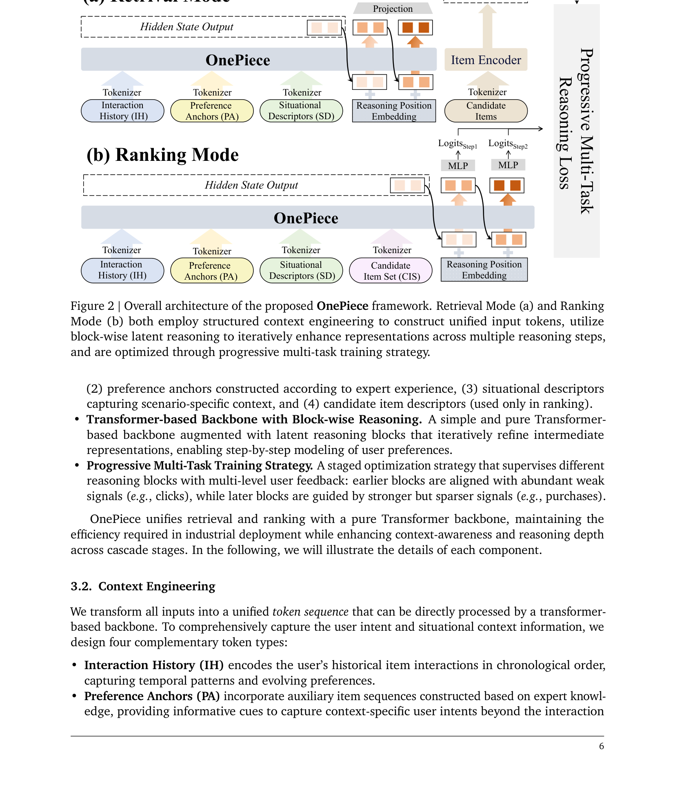

# OnePiece: Bringing Context Engineering and Reasoning to Industrial Cascade Ranking System

- **日期**：2025-09-22
- **来源**：arXiv:2509.18091
- **作者**：Sunhao Dai, Jiakai Tang, Jiahua Wu, Kun Wang, Yuxuan Zhu, Bingjun Chen, Bangyang Hong, Yu Zhao, Cong Fu, Kangle Wu, Yabo Ni, Anxiang Zeng, Wenjie Wang, Xu Chen, Jun Xu, See-Kiong Ng
- **发表**：arXiv preprint, 2025 (Shopee 工业落地)

---

## 缺口：Transformer 搬家了，但 LLM 的灵魂没带过来

工业级排序系统（搜索/推荐）对 LLM 的模仿，长期停留在"搬家"阶段：把 Transformer 架构搬过来，替换 DLRM 里的 MLP 和 attention module。但搬家≠升级——DLRM 本身已经深度集成了 attention、序列建模和特征交叉，Transformer 的边际改进极其有限。

论文从第一性原理出发，指出 LLM 的突破不仅来自架构，更来自两套互补机制：

1. **Context Engineering**（输入侧）：把原始 query 扩充为带外部知识、历史记忆和场景信号的丰富上下文，把模型的"起手牌"打好。
2. **Multi-Step Reasoning**（输出侧）：通过中间推理步骤迭代精炼输出，把"一步到位"变成"多步逼近"。

这两套机制在工业排序系统中几乎未被系统性探索。为什么？两个根本挑战挡在面前：排序模型没有 LLM 那样的 prompt 输入传统，怎么构造信息丰富的上下文？排序模型没有 chain-of-thought 标注，怎么训练多步推理？

**隐式假设**：排序系统的输入（用户行为+候选商品）可以被重新组织为类似 LLM prompt 的结构化 token 序列；用户行为链（曝光→点击→加购→下单）可以作为推理步骤的天然监督信号。

---

## 增量：首次把"context engineering + block-wise latent reasoning"同时引入工业级级联排序

**一句话**：OnePiece 把 LLM 的"输入侧上下文工程 + 输出侧多步推理"两套核心机制，首次统一适配到召回和排序两阶段，在 Shopee 十亿级搜索场景实现 GMV/UU +2% 以上和广告收入 +2.90% 的线上收益。

---

## 核心机制图



上图展示了 OnePiece 的两种模式（Retrieval / Ranking），共享同一套 Transformer backbone + block-wise latent reasoning。左侧通过 Context Engineering 将异构信号编码为统一 token 序列；右侧通过多步推理块逐步精炼表示，每步分配渐进式多任务监督。

### 自绘机制速写

```
┌──────────────────────────────────────────────────────────────┐
│                   OnePiece 统一框架                          │
│                                                              │
│  输入侧（Context Engineering）                                │
│  ┌────────┐ ┌────────────┐ ┌──────────┐ ┌───────────────┐    │
│  │ IH     │ │ PA         │ │ SD       │ │ CIS (仅排序)  │    │
│  │ 行为   │ │ 偏好锚点   │ │ 场景描述 │ │ 候选商品集    │    │
│  │ 序列   │ │ Top-K购买/ │ │ 用户画像 │ │ 分组setwise   │    │
│  │        │ │ 点击/曝光  │ │ 查询信息 │ │ C=12/组       │    │
│  └───┬────┘ └─────┬──────┘ └────┬─────┘ └───────┬───────┘    │
│      │            │             │               │            │
│      └────────────┴──────┬──────┴───────────────┘            │
│                          ▼                                    │
│              ┌─────────────────────┐                         │
│              │  Bi-Dir Transformer  │  ← 统一 backbone       │
│              │     Encoder (L层)    │                         │
│              └──────────┬──────────┘                          │
│                         ▼                                     │
│  输出侧（Block-wise Latent Reasoning）                       │
│              ┌─────────────────────┐                         │
│              │ Block 0 (初始)      │ ← M个token的推理块      │
│              │  ↓ 因果mask注意力   │                         │
│              │ Block 1 → Task 1    │ ← 曝光/点击(弱信号)     │
│              │  ↓ 因果mask注意力   │                         │
│              │ Block 2 → Task 2   │ ← 点击/加购             │
│              │  ↓ (排序模式续)     │                         │
│              │ Block 3 → Task 3   │ ← 加购/下单(强信号)     │
│              └─────────────────────┘                         │
│                         │                                    │
│                         ▼                                    │
│              Progressive Multi-Task Loss                     │
│              (BCE + Contrastive Learning)                    │
└──────────────────────────────────────────────────────────────┘
```

---

## 白话方法：一个"看病"的核喻

想象一个分诊医院：

**Context Engineering = 挂号时填的详细病历**。你不止说"我不舒服"（原始行为序列），还会被问到"之前同样症状大家常开什么药"（偏好锚点 PA）、"你多大、住哪、今天什么情况"（场景描述 SD）、"这几个药你选哪个"（候选商品集 CIS）。这样医生（模型）还没见到你就已经有了丰富预判。

**Block-wise Reasoning = 分级会诊**。不是一上来就下最终诊断，而是先做初筛（Block 1: 曝光/点击，信号多但浅），再专科复查（Block 2: 点击/加购，信号渐深），最后主任拍板（Block 3: 加购/下单，信号少但准）。每一步都看到前面所有检查结果，但不会"偷看"后面的步骤。

**Progressive Multi-Task Training = 按难度递进的教学大纲**。不让学生（模型）一开始就学最难的病例（下单预测），而是从简单但数据量大的任务开始，逐步过渡到稀少但关键的任务。每个推理块对应一级难度，梯度互不冲突。

**Block Size M = 会诊团队规模**。召回阶段 M=2（用户token+查询token，刚好管住个性化和相关性两个维度）；排序阶段 M=C（候选商品数），团队越大越能横向比较。

---

## 关键概念（费曼讲解）

### 1. Context Engineering in Ranking（排序中的上下文工程）

LLM 里有 prompt engineering——你在输入里加几句话，模型输出就截然不同。排序模型从来没有这个传统：输入就是用户行为序列 + 候选商品特征，怎么"加 prompt"？

OnePiece 的答案是：**把异构信号统一编码为 token 序列**。具体四类：

- **IH（Interaction History）**：用户按时间排列的行为序列，每个商品编码为 item ID + 类目 + 店铺 + 统计特征的 token
- **PA（Preference Anchors）**：基于领域知识构建的辅助序列，如"该查询下 Top-K 点击/购买的商品"。PA 的本质是**协作过滤信号**——许多用户的行为浓缩为几条锚点，给模型提供"在这个查询下大家通常喜欢什么"的参考
- **SD（Situational Descriptors）**：用户画像（年龄、地址）和查询信息（文本、热度），场景上下文
- **CIS（Candidate Item Set，仅排序）**：候选商品集合，分组 setwise 编码

**例子**：用户搜"运动鞋"，以前模型只能看到"这个用户之前买了A、B、C"。现在多了 PA："搜运动鞋的人通常点击了D、E、F"——模型立刻知道这不是买正装鞋的需求。再加上 SD："用户 25 岁、住在热带城市"——模型进一步缩小范围。

### 2. Block-wise Latent Reasoning（块级潜在推理）

"Latent reasoning"指在隐藏空间中做推理，不生成文本，只精炼表示。之前的 ReaRec 用单个 token 在步之间循环，信息压缩比太高——一个 d 维向量要传递所有推理结果，像用一根水管输洪水。

OnePiece 的创新是**用 M 个 token 组成的"块"作为推理介质**，M 可调：

- 召回模式：M = SD 长度（用户+查询 token），在个性化和相关性之间迭代平衡
- 排序模式：M = C（候选商品数），每个候选在推理块中有一个对应 token，块内 token 之间可以交互

每步推理使用**因果块级注意力 mask**：当前推理块可以看到基础输入和所有历史推理块，但不能看未来的块。这保证了推理方向的单向性，同时允许信息累积。

**例子**：排序 12 个候选商品。Block 0 从编码器输出取 12 个候选 token。Block 1 每个候选 token 先看一遍所有基础信息+之前的推理结果，尝试"初步印象"，输出 12 个精炼后的表示。Block 2 再在 Block 1 的基础上进一步对比和区分。每一步的推理块都是 12 个 token 同时进化，而不是 12 个独立循环。

### 3. Progressive Multi-Task Training（渐进式多任务训练）

推理步骤有了，谁来教每一步该学什么？LLM 有 CoT 标注，排序模型没有。OnePiece 的洞察是：**用户行为链本身就是天然的课程学习梯度**。

- 曝光 → 点击（简单但多）→ 分配给早期推理步
- 点击 → 加购（中等）→ 分配给中期推理步
- 加购 → 下单（难但少）→ 分配给晚期推理步

每步用 BCE + 对比学习（召回用双向对比学习 BCL，排序用集合对比学习 SCL）双重监督。关键设计：**不同任务分配到不同推理步，避免梯度冲突**。如果所有任务都在最后一步输出，点击预测的巨大梯度会淹没下单预测的微弱信号。

**例子**：假设 Block 1 学"这 12 个里哪些可能被点击"（简单），Block 2 学"被点击的那些里哪些会被加购"（中等），Block 3 学"加购的里哪些最终下单"（最难）。这样每一步都有针对性的监督，早学基础能力，晚练高阶判断。

---

## 餐巾纸速写：新旧范式位移

```
旧范式（DLRM/HSTU）              新范式（OnePiece）
─────────────────────            ─────────────────────
输入：行为序列 + 候选特征         输入：结构化上下文 token 序列
      ↓                                ↓
架构：手工特征交叉 + attention    架构：纯 Transformer 统一 backbone
      ↓                                ↓
推理：一步到位输出分数           推理：多步块级精炼表示
      ↓                                ↓
训练：单塔多任务共享最后层       训练：渐进式多任务分步监督
      ↓                                ↓
效果：增量式提升                  效果：GMV/UU +2%, 广告收入 +2.9%

核心位移：
"在 DLRM 框架里塞 Transformer"
       ↓ 变为
"从 LLM 的第一性原理出发，把上下文工程和推理机制适配到排序"
```

---

## 博导审稿

**判决：Accept**

**亮点**：
1. **第一性原理清晰**：不是"Transformer 搬家"，而是从 LLM 成功的根本机制出发（context engineering + reasoning），系统性地适配到排序场景。这比之前"在推荐里加个 CoT"的工作更完整、更有章法。
2. **Block-wise reasoning 设计优雅**：解决了 ReaRec 单 token 瓶颈问题，M 可调，召回/排序各有适配方案。分组 setwise 排序 + 随机化训练保证鲁棒性，工程考量成熟。
3. **Progressive multi-task training 巧妙**：利用天然行为链做课程学习监督，不需要额外标注，可解释性强。
4. **工业落地扎实**：Shopee 主搜索场景全量 A/B，召回 GMV/UU +1.08%，排序 GMV/UU +1.12% + 广告收入 +2.90%。效率分析（MFU 从 35%→80%，推理延迟仅增 10% for 12× reasoning）证明可部署性。
5. **Scaling 验证完整**：训练数据从 7 天到 60 天持续提升不饱和，block size 从 1 到 12 持续改善，都展示了 scaling 潜力。

**不足**：
1. **线上部署是降级版**：排序模型在线上用 M=1（pointwise），block-wise reasoning 的线上优势未直接验证。这是工业限制，但削弱了论文核心卖点的说服力。
2. **PA 的构造依赖领域专家知识**：论文承认 PA 的构建需要 expert knowledge（Top-K 点击/购买/曝光），这不是自动化的，迁移成本需要讨论。
3. **与纯生成式路线的对比缺失**：没有直接与 OneRec 系列在相同数据集上对比，只在 Related Work 里讨论。OnePiece 走"在判别式框架里加推理"，OneRec 走"纯生成式替代级联"，两条路线的临界点在哪里？
4. **Block size scaling 的边际收益递减**：M=1→4 跳跃最大（C-AUC 0.885→0.913），M=8→12 只差 0.007，暗示 reasoning 带宽的饱和点可能不远。

---

## 启发

**对我最大的启发：把"context engineering"这个概念从 LLM 搬到推荐系统的思路值得深思。**

之前在推荐里做特征工程，总觉得是"DLRM 时代的遗产"，生成式推荐应该用端到端学习替代手工特征。但 OnePiece 指出：LLM 的成功恰恰说明，**输入侧的精心组织**（prompt engineering → context engineering）和**输出侧的深度推理**（CoT → latent reasoning）是两条正交的优化路径，两者缺一不可。

具体到 reasoning 路线：
- **OneRec-Think / OneReason** 走"显式 CoT"，让模型生成文字推理链再输出推荐。问题是 token 成本高、推理速度慢，且"思考≤不思考"的问题尚未解决。
- **CaLIR** 走"隐式潜在推理"，在隐藏空间做推理，但推理介质是单个 token 的循环。
- **OnePiece** 也是隐式推理，但用 **block（M 个 token）** 做推理介质，带宽更大、信息压缩比更低。而且它没有走纯生成式路线——仍然在级联排序框架内，保留了 DLRM 的特征工程优势，通过 context engineering 把这些优势编码进 token 序列。

**OnePiece 在 reasoning 路线中的定位**：它不是 OneRec 系列的竞争对手，而是"判别式框架 + 推理增强"这条路线的代表。如果 OneRec/OneReason 是"革命派"（推翻级联、端到端生成），OnePiece 就是"改良派"（在级联框架内引入 LLM 的核心机制）。两条路线各有价值：革命派的 ceiling 更高但工程风险大，改良派的 floor 更高且迁移成本低。

**另一个启发是 PA（Preference Anchors）的设计**：本质上是用协作过滤信号做"提示词"。这和 UniRec 的 Chain-of-Attribute 是同一个思路的不同实现——都是用结构化先验收窄搜索空间。OnePiece 用外部检索的 Top-K 商品列表，UniRec 用属性 token 链。两种实现可能在本质上等价，只是粒度不同。

**值得验证的问题**：block-wise reasoning 的收益有多少来自推理本身，有多少来自"多步 = 更深的网络"（等价于堆更多 Transformer 层）？论文的消融（Table 4/5）把 bidirectional attention、candidate inter-visibility、reasoning steps 三个因素混在一起，没有单独控制"等参数量的深层网络 vs 多步浅层推理"的对比。
