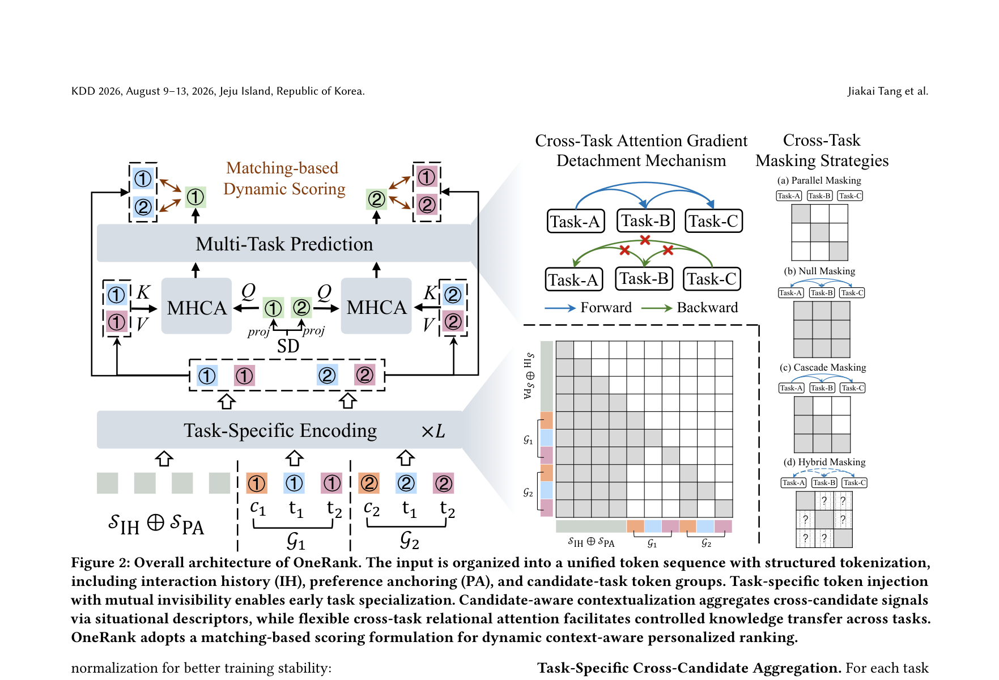
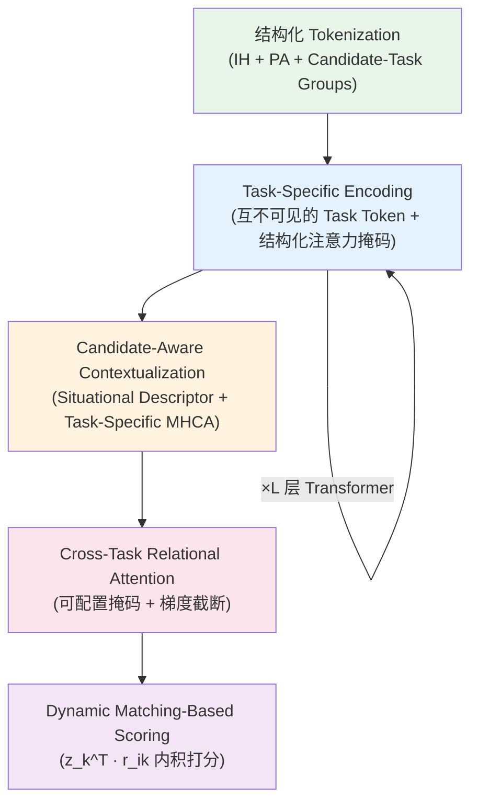

# OneRank: Unified Transformer-Native Ranking Architecture for Multi-Task Recommendation

- **日期**：2026-06-15
- **来源**：https://arxiv.org/abs/2606.16838
- **作者**：Jiakai Tang, Sunhao Dai, Kun Wang, Zhiluohan Guo, Yu Zhao, Cong Fu, Kangle Wu, Yabo Ni, Anxiang Zeng, Xu Chen, Jun Xu
- **发表**：KDD 2026

---

## 推荐系统的多任务排序，卡在了哪里？

工业推荐系统需要同时预测多种用户行为——点击、加购、下单。这些行为之间存在互补信号：点击数据量大但噪声多，下单数据稀疏但信号强。多任务学习（MTL）正是为了让这些信号互相帮助。

近年来，业界从传统 DNN 转向 Transformer 架构来做排序，因为 Transformer 在序列建模和规模扩展上有天然优势。但问题在于：**现有方案只是把 Transformer 当作一个"更强的编码器"，然后仍然接上独立的 MLP 预测头**。这个设计可以形式化为 G(Z = F(X))——F 是 Transformer 编码器，产出一个任务无关的共享表示 Z；G 是各任务的 MLP 预测器。

这种"编码器-预测器"分离架构有三个根本性缺陷：

**信息瓶颈**：共享表示 Z 把所有任务的信号混在一起，下游 MLP 必须从这团混合物中再拆出各任务需要的信息——但 MLP 的建模能力远不如 Transformer，拆不干净。

**跷跷板效应（Seesaw）**：多个任务的梯度在共享参数上打架。优化任务 A 的梯度可能恰好损害任务 B，导致此消彼长。

**设计范式断裂**：Transformer 内部是动态的、上下文自适应的注意力机制；MLP 预测头却是静态的、全局固定的非线性映射。从"动态路由"突然切换到"静态决策边界"，破坏了端到端的上下文感知能力，也阻断了模型的规模扩展路径。

---

## 增量：把多任务推理"内化"到 Transformer 里

OneRank 的核心增量是：**彻底消除编码器-预测器的分离，让多任务推理完全在 Transformer 内部完成**。每个任务拥有自己的"私有通道"（task-private channel），从输入层到预测层全程保持任务特异性，同时通过受控的跨任务注意力实现知识共享。最终的打分也不再用 MLP，而是用动态内积匹配——整个系统从头到尾都是 Transformer-native 的。

---

## 论文主模型架构（Figure 2）

OneRank 的整体架构分为四个层次：底部的结构化 Token 序列输入、中间的任务特异编码（Task-Specific Encoding）、候选感知上下文化（Candidate-Aware Contextualization）、以及顶部的多任务预测（Multi-Task Prediction）。右侧展示了跨任务注意力的梯度截断机制和四种可配置的掩码策略。

---

## OneRank 的内部流程是怎么转的？

---

## 结构化 Tokenization：把异构输入统一成 Token 序列

OneRank 的第一步是把所有输入组织成一条统一的 Token 序列。这条序列由三部分拼接而成：

**交互历史（IH）**：用户的行为序列，按时间排列，每个交互加上可学习的位置编码。

**偏好锚点（PA）**：借鉴 RAG 的思想，从外部检索与当前场景相关的高质量序列（如搜索场景下的 top-clicked 序列），用 BOS/EOS 边界 token 封装。

**候选-任务 Token 组**：对每个候选物品 c_i，构造一个 token 组 G_i = [e_i^C, t_1, t_2, ..., t_K]，其中 e_i^C 是候选物品的 embedding，t_1 到 t_K 是 K 个任务特异 token（所有候选共享同一组参数，但通过注意力掩码独立工作）。

最终输入：X_0 = [S_IH, S_PA, G_1, G_2, ..., G_N]。

---

## Task-Specific Encoding：互不可见的任务 Token 实现早期特化

这是 OneRank 解决跷跷板效应的第一道防线。核心设计是**结构化注意力掩码**，规则如下：

- 用户上下文（IH + PA）内部用因果注意力（causal）
- 每个候选组 G_i 与其他候选组互相隔离（支持单用户多候选并行）
- **同一候选组内的不同任务 token 互不可见**——t_1 看不到 t_2，t_2 看不到 t_3

这意味着每个任务 token 只能看到：用户上下文 + 自己所属候选的 embedding + 自己。不同任务从一开始就在独立的"通道"里提取信息，梯度不会在输入层打架。

经过 L 层 Transformer 编码后，从每个候选组中提取对应任务 token 的输出：r_i^k = Extract(X^(L), t_k^(i))，这就是候选 i 在任务 k 下的表示。

---

## Candidate-Aware Contextualization：用 Situational Descriptor 聚合跨候选信号

传统 point-wise 打分有一个训练-服务不一致问题：训练时每个样本独立打分，但服务时需要在整个候选集上排序。OneRank 通过"候选感知上下文化"来弥合这个 gap。

**Situational Descriptor（SD）**：一个向量 s ∈ R^d，编码用户画像、query 信息、session 元数据（时间、地点等），作为聚合的"锚点"。

**Task-Specific Cross-Candidate Aggregation**：对每个任务 k，用任务专属的投影函数 f_k 变换 SD，得到 query 向量 q_k；然后用任务专属的 Multi-Head Cross-Attention（MHCA_k）以 q_k 为 query、以所有候选的 r_i^k 为 key/value，聚合出任务 k 的全局表示 h_k。

h_k 编码的不仅是任务特异信息，还包含了候选池的分布特性——模型能感知到"竞争对手是谁"，从而做出相对排序而非绝对打分。

---

## Cross-Task Relational Attention：前向共享知识，反向隔离梯度

拿到各任务的全局表示 {h_k} 后，OneRank 用一层跨任务自注意力来实现受控的知识迁移。关键创新是**战略性梯度截断**：

**前向传播**：任务 k 可以通过注意力读取其他任务 j 的表示（知识迁移）。

**反向传播**：梯度只沿对角线流动——优化任务 k 时，来自任务 j 的梯度被截断（∂L/∂h_j = 0, j ≠ k）。

效果：跨任务注意力变成了一个"只读存储器"——每个任务可以从别人那里读信息，但自己的优化不会干扰别人。这从根本上消除了跷跷板效应在预测层的表现。

**四种可配置掩码策略**让这个机制适应不同业务场景：

- Parallel：任务间完全隔离，适合探索性场景
- Null：全连接，让模型自己学关系
- Cascade：单向级联（click → cart → order），适合电商漏斗
- Hybrid：混合模式，按业务知识自定义

---

## Dynamic Matching-Based Scoring：用内积替代 MLP

最后的打分不再用 MLP，而是：s_k^i = z_k^T · r_i^k，其中 z_k 是经过跨任务注意力增强后的任务全局表示，r_i^k 是候选 i 在任务 k 下的编码。

这个设计的好处：同一个 user-item pair 在不同 session 下会得到不同分数（因为 z_k 受 SD 和候选池影响），实现了真正的上下文感知排序。同时，内积打分让任务表示和候选表示在同一个几何空间中对齐，梯度流动更顺畅。

---

## 什么是 Situational Descriptor？

Situational Descriptor（情境描述符）是 OneRank 中一个关键但容易被忽略的概念。它不是用户的行为序列，也不是候选物品的特征，而是**当前请求的"场景快照"**——包括用户画像（年龄、性别、会员等级）、当前 query（搜索词）、session 元数据（时间、地点、设备）。

为什么需要它？因为在候选感知上下文化阶段，模型需要一个"锚点"来决定"从哪个角度看这批候选"。同一个用户在早上搜索"咖啡"和晚上浏览"睡衣"时，对候选集的关注点完全不同。SD 就是这个"角度"的编码。

它在架构中的位置：SD 被投影为 query 向量，通过 cross-attention 去"询问"所有候选的表示，聚合出一个全局视图。每个任务有自己的投影函数 f_k，所以同一个 SD 在不同任务下会产生不同的"提问方式"。

---

## 什么是 Task Token 的"互不可见"（Mutual Invisibility）？

在标准 Transformer 中，同一序列内的所有 token 可以互相看到。OneRank 打破了这个默认：**同一候选组内的不同任务 token 被注意力掩码强制隔离**。

具体来说，候选组 G_i = [e_i^C, t_1, t_2, t_3]（假设 3 个任务）中，t_1 的注意力范围是：用户上下文 + e_i^C + t_1 自己。它看不到 t_2 和 t_3。

这意味着：即使 t_1、t_2、t_3 共享同一个 Transformer 的参数（权重矩阵 W_Q, W_K, W_V 是共享的），它们提取的信息完全不同——因为它们"看到的世界"不同。这是一种**通过输入可见性来实现任务特化**的巧妙设计，不需要为每个任务复制一份 Transformer。

---

## 什么是梯度截断（Gradient Detachment）在跨任务注意力中的作用？

梯度截断是 OneRank 解决跷跷板效应的核心武器。它的实现方式是：在跨任务注意力的反向传播中，自定义 backward operator，只保留对角线梯度（任务 k 对自己的梯度），把非对角线梯度（任务 k 对任务 j 的梯度）置零。

直觉：想象三个人（任务 A/B/C）坐在一张桌子上，每个人可以看别人桌上的笔记（前向读取），但写自己的作业时不会碰别人的笔（反向隔离）。A 可以从 B 的笔记中获得灵感，但 A 的学习过程不会把 B 的笔记弄乱。

---

## 那直接给每个任务一个独立的 Transformer 不就行了？

读者可能会想：既然要任务隔离，为什么不直接给每个任务一个独立的 Transformer？

这个方案会在两个地方死掉：

**参数爆炸**：K 个任务 × L 层 Transformer × 全量参数 = 线上推理延迟不可接受。OneRank 的 task token 互不可见设计只需要一份 Transformer 参数，通过注意力掩码实现逻辑上的隔离，物理上共享计算。

**知识迁移断裂**：独立 Transformer 之间没有信息流动。但多任务学习的核心价值就在于任务间的互补信号（点击数据帮助下单预测）。OneRank 通过跨任务注意力 + 梯度截断，实现了"读取别人的知识但不干扰别人的学习"——这是独立模型做不到的。

消融实验 V1（去掉 task token）直接验证了这一点：A-AUC 从 0.8463 降到 0.8424，O-GAUC 从 0.8350 降到 0.8337。

---

## 那直接用 MMoE/PLE 这些经典多任务方法不就行了？

MMoE 和 PLE 确实也在做"任务特化 + 知识共享"，但它们的设计有一个根本局限：**它们只在预测层做任务分离，编码层仍然是共享的**。

这意味着：所有任务的梯度仍然会在编码器的共享参数上打架。MMoE 的 gating 机制只是在 expert 输出上做加权混合，并没有从根本上隔离梯度流。PLE 的 progressive extraction 稍好，但仍然是在 MLP 层面操作，无法利用 Transformer 的注意力机制做细粒度的信息选择。

实验数据直接说明了问题：在 OneTrans 编码器上，PLE 的 O-GAUC 是 0.8336，而 OneRank 达到 0.8350。更关键的是，当编码器从 DNN 换成 Transformer 时，DCMT 的性能反而崩溃（O-GAUC 从 0.8125 降到 0.7986），说明传统 MTL 方法无法适配高容量编码器——它们的设计假设与 Transformer 的工作方式不兼容。

---

## 那不做跨候选聚合，直接 point-wise 打分不行吗？

消融实验 V5 回答了这个问题：把 Situational Descriptor 替换为随机初始化参数（等价于去掉跨候选信息），C-AUC 从 0.7910 暴跌到 0.7872，O-GAUC 从 0.8350 降到 0.8318。

原因在于：point-wise 打分训练时每个候选独立评分，但服务时需要在整个候选集上排序。这个 gap 导致模型无法学到"相对偏好"——它不知道当前候选池里还有什么竞争对手。OneRank 的 SD + MHCA 设计让模型在训练时就能看到整个候选集，学到的是"在这批候选中，哪个最好"，而非"这个候选绝对好不好"。

---

## 范式位移：从"编码-预测分离"到"Transformer-Native 统一"

**以前的思路**：Transformer 是一个"更好的特征提取器"，提取完特征后交给 MLP 做任务预测。多任务学习是在 MLP 层面做文章（expert 混合、gating、残差连接）。

**OneRank 的思路**：Transformer 本身就是多任务推理引擎。任务特化、跨候选感知、跨任务知识迁移、动态打分——全部在 Transformer 的注意力机制内完成。没有 MLP 预测头，没有架构断裂，没有设计范式切换。

这个位移的深层含义：当排序模型的所有计算都统一在 Transformer 内部时，模型的规模扩展路径变得清晰——加深层数、加宽维度，性能单调提升（Figure 4 验证了这一点）。而传统的 encoder-predictor 分离架构，扩展编码器并不能等比例提升预测质量，因为瓶颈在 MLP 预测头。

---

## 边界条件：OneRank 的设计在什么情况下生效/不生效？

**触发条件（生效）**：

- 多任务之间存在互补信号（如电商的 click/cart/order 漏斗）
- 候选集较大（论文中线上每次请求 4096 个候选）
- 需要上下文感知的动态排序（同一用户在不同 session 下偏好不同）

**不触发条件（可能不适用）**：

- 单任务场景：没有跨任务知识迁移的需求，task token 和梯度截断的设计就是多余的开销
- 候选集极小（如只有 2-3 个候选）：跨候选聚合的价值有限，SD + MHCA 的计算开销可能不划算
- 任务之间完全无关（如推荐和内容审核）：跨任务注意力读不到有用信息，Parallel Masking 退化为独立模型

---

## 实验论证：看哪些指标、每张表在说什么

### 指标设计的逻辑

OneRank 选择 AUC 和 GAUC 作为核心指标。AUC 衡量全局排序质量，GAUC 是按用户分组后取平均——后者更贴近线上体验，因为推荐是"给每个用户排序"而非"全局排序"。三个任务（Click/Add-to-Cart/Order）分别报告，因为多任务学习的核心主张是"所有任务同时提升，不跷跷板"。

### Table 1 论证了什么？

这是全文的命门表。它的设计非常精巧：**把编码器和 MTL 策略正交组合**，形成 3×6 的网格。这让我们能分离两个因素的贡献：

- **纵向看**（固定 MTL 策略，换编码器）：Transformer 编码器（MTGR、OneTrans）比 DNN 强，但 DCMT 在 Transformer 上崩溃——说明传统 MTL 方法与 Transformer 不兼容。
- **横向看**（固定编码器，换 MTL 策略）：在 DNN 上 PLE 最好，但在 Transformer 上各方法差距缩小甚至反转——说明编码器变强后，预测层的 MTL 设计成为瓶颈。
- **OneRank 独占一行**：它不属于任何"编码器 + MTL 策略"的组合，因为它根本没有这个分离。O-AUC 0.9024 vs 最强 baseline OneTrans+PLE 的 0.8996，O-GAUC 0.8350 vs 0.8336。

这张表直接回应了"为什么不用 MMoE/PLE"的问题：在 Transformer 时代，预测层的 MTL 设计已经触顶，必须从架构层面统一。

### 消融实验（Figure 3）论证了什么？

6 个变体，每个对应一个设计选择：

| 变体 | 去掉了什么 | 论证的主张 |
|------|-----------|-----------|
| V1 | Task-specific tokens → 线性投影 | 早期任务特化是必要的 |
| V2 | K 个 task token → 1 个共享 token | 独立 token 比共享 token 好 |
| V3 | 在 V2 基础上去掉跨任务注意力 | 跨任务知识迁移有价值（但需配合任务隔离） |
| V4 | 去掉梯度截断 | 梯度截断保证优化稳定性 |
| V5 | SD → 随机参数 | 候选感知上下文化是核心（最大跌幅） |
| V6 | 全双向注意力（无选择性掩码） | 受控掩码优于无差别全连接 |

**最锋利的消融是 V5**：去掉 SD 后 C-AUC 暴跌 0.0038，O-GAUC 跌 0.0032。这直接证明了"跨候选聚合"是 OneRank 的核心价值——它回应了前面"为什么不直接 point-wise 打分"的问题。

### 线上 A/B 测试（Table 3）

在 Shopee 主站 10% 流量上跑了 7 天：GMV/UU +1.01%，Paid GMV/UU +1.17%，广告收入 +0.81%，Bad Query Rate -2.29%。在工业推荐系统中，GMV 提升 1% 是非常显著的业务收益。

---

## 启发

OneRank 给我的最大启发是**"统一性"本身就是一种架构创新**。当所有计算都在同一个 Transformer 内完成时，信息流动没有断裂、梯度传播没有瓶颈、规模扩展没有天花板。这个思路不仅适用于多任务排序，也适用于任何"多个子目标需要协同优化"的场景。

具体到技术层面，三个设计值得借鉴：

第一，**通过注意力掩码实现逻辑隔离**——不需要物理上复制模型，只需要控制"谁能看到谁"，就能在共享参数的前提下实现任务特化。这比 expert 混合更优雅，计算开销也更小。

第二，**前向共享 + 反向隔离的梯度截断**——这是一个通用的多任务优化技巧，可以应用到任何需要"读取别人信息但不干扰别人学习"的场景。

第三，**用内积匹配替代 MLP 打分**——让打分变成动态的、上下文感知的，同时保持了计算效率（内积比 MLP 快）。这个思路在召回阶段已经很常见（双塔模型），OneRank 把它推广到了精排阶段。
