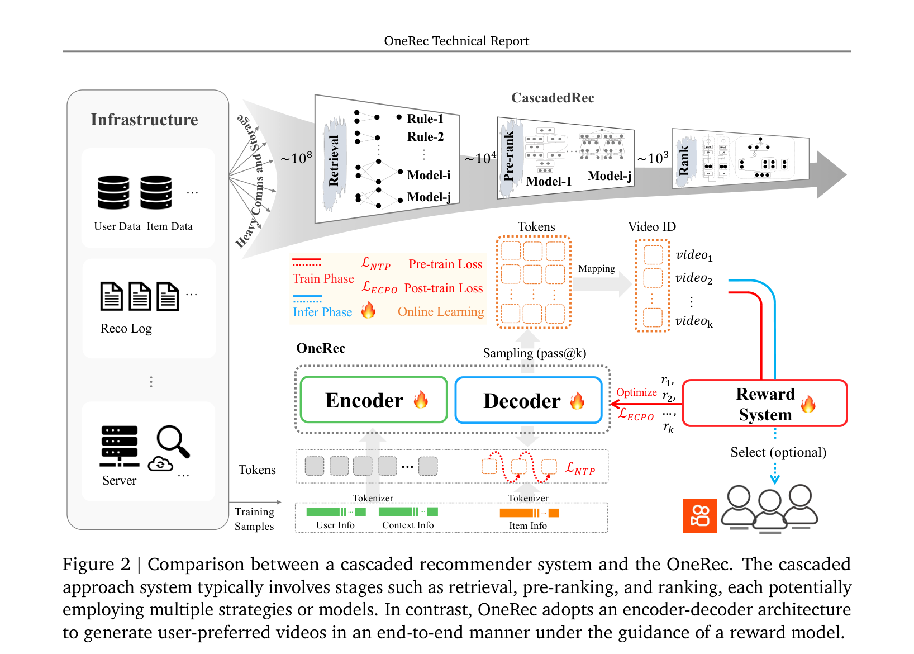

# OneRec Technical Report

- **日期**：2025-06-16
- **来源**：arXiv:2506.13695v4
- **作者**：OneRec Team (Kuaishou), 核心贡献者: Guorui Zhou, Jiaxin Deng, Jinghao Zhang, Kuo Cai, Lejian Ren, Qiang Luo, Qianqian Wang, Qigen Hu, Rui Huang, Shiyao Wang, Weifeng Ding, Wuchao Li, Xinchen Luo, Xingmei Wang, Zexuan Cheng, Zixing Zhang 等
- **发表**：arXiv 预印本（2025），快手技术报告

---

## 缺口：级联推荐走到了工程效率的死角

OneRec 的前作（arXiv:2502.18965，已入库为 paper-OneRec.md）已经证明了"单模型替代级联漏斗"在离线和在线都可行。但那个版本只回答了"能不能"，没回答"能不能撑住"。技术报告填的缝是：

**工业级推荐系统替换为端到端生成模型后，算力效率、运营成本、scaling 上限和 RL 对齐到底行不行？**

具体来说，前作留下三道未解之题：

1. **算力浪费**：传统级联推荐超过 50% 的资源花在通信和存储上，训练 MFU 仅 4.6%、推理 MFU 仅 11.2%，远低于 LLM 的 ~40%。换成生成模型后 MFU 能不能追上来？
2. **Scaling 边界未知**：前作只验证了 0.05B→1B 的 scaling，FLOPs 提升 10× 后 scaling law 是否仍然成立？语义 ID 输入能否替代稀疏嵌入？Codebook 扩展和推理采样扩展的回报如何？
3. **RL 对齐的工程落地**：前作用 DPO 做偏好对齐，但 DPO 需要构造偏好对，在工业场景不稳定。技术报告转向 ECPO（Early Clipped GRPO），并引入了 format reward 和 industrial reward——RL 在推荐里到底能不能系统性工作？

这三道缝背后是一个更大的隐忧：如果生成式推荐的 OPEX 降不下来、scaling 不上去、RL 不稳定，那"端到端替代级联"就只是一个学术 demo，无法成为工业范式。

---

## 增量

OneRec 技术报告让我们知道了：**端到端生成式推荐不仅能跑通，还能把训练 MFU 从 4.6% 提到 23.7%、OPEX 压到传统流水线的 10.6%，并在快手主场景 25% QPS 上把 App Stay Time 提升 0.54%~1.24%**——这是从"可行性验证"到"工业可行性"的关键一跃。

---

## 核心机制图



上图对比了传统级联推荐（上半部分 CascadedRec）和 OneRec（下半部分）的整体架构。左侧级联系统从 User/Item Data 出发，经 Retrieval → Pre-rank → Rank 逐级筛选，每阶段独立模型、独立优化目标。右侧 OneRec 把整个过程压缩为 Tokenizer → Encoder → Decoder 单条流水线，Reward System 在线引导偏好对齐，推理时 Beam Search 生成后可选 RM Selection 精选。

下面用 ASCII 速写画出技术报告版本的核心数据流和新增模块：

```
┌──────────────────────────────────────────────────────────────────────┐
│                    OneRec 技术报告版核心数据流                         │
│                                                                      │
│  ┌─────────────────────── Tokenizer ──────────────────────────┐      │
│  │                                                              │      │
│  │  视频 → miniCPM-V-8B → 1280 tokens M                       │      │
│  │              ↓ QFormer (4层, 4 query tokens)                │      │
│  │         M̃ = 压缩表示 (4×512)                                │      │
│  │              ↓                                               │      │
│  │  协同信号对齐: L_I2I (item对比) + L_caption (LLaMA3解码)     │      │
│  │              ↓                                               │      │
│  │  RQ-Kmeans → SID (3层, 如 (3,4,1))                         │      │
│  │  ※ 前作用 Balanced KMeans → 本版改 RQ-Kmeans                │      │
│  └──────────────────────┬──────────────────────────────────────┘      │
│                         │                                            │
│  ┌──────────────────── Encoder ────────────────────────────────┐     │
│  │                                                              │     │
│  │  四路多尺度行为:                                             │      │
│  │  · User Static (1×d)    ← uid/gender/age                    │      │
│  │  · Short-term (20×d)    ← 最近20次交互                      │      │
│  │  · Positive-feedback (256×d) ← 高互动序列                    │      │
│  │  · Lifelong (2000×d)    ← 10万历史→层次KMeans压缩→QFormer  │      │
│  │                                                              │      │
│  │  z = [hᵤ; hˢ; hᵖ; hˡ] + e_pos → L_enc层 Self-Attn        │      │
│  └──────────────────────┬──────────────────────────────────────┘      │
│                         │ KV                                        │
│  ┌──────────────────── Decoder ────────────────────────────────┐     │
│  │                                                              │     │
│  │  输入: [BOS] s¹ s² s³  (pointwise, 逐item生成)             │      │
│  │  ※ 前作用 session-wise → 本版改 pointwise                   │      │
│  │                                                              │      │
│  │  CausalSelfAttn → CrossAttn(看Encoder) → MoE FFN            │      │
│  │  · 0.935B: 24专家/Top2 (Decoder内)                          │      │
│  │  · 2.633B: 24专家/Top4 (Encoder+Decoder)                    │      │
│  │  · Loss-free load balancing (DeepSeek策略)                   │      │
│  │                                                              │      │
│  │  训练: LNTP = Σ -log P(sⱼ₊₁ | s[BOS], s¹, ..., sⱼ)        │      │
│  └──────────────────────┬──────────────────────────────────────┘      │
│                         │                                            │
│  ═══════════════ Post-Training (在线) ═══════════════             │
│                         │                                            │
│  ┌──────────────── RSFT (50% session过滤) ──────────────────┐       │
│  │  同 NTP Loss, 但 LR 衰减: sparse=1e-4, dense=8e-5        │       │
│  └──────────────────────────────────────────────────────────┘       │
│                                                                      │
│  ┌──────────────── RL (1% 用户采样) ────────────────────────┐       │
│  │  外部推理服务生成512条 → Reward Model打分                   │       │
│  │  ① Preference Reward (P-Score): 神经网络学习个性化融合分    │       │
│  │  ② Format Reward: 合法SID→A=1, 非法→丢弃(防挤压)          │       │
│  │  ③ Industrial Reward: 病毒内容降权 α·r                     │       │
│  │  ECPO优化: 早期裁剪负优势的策略比, δ=0.1                    │       │
│  │  ※ 前作用 DPO → 本版改 ECPO                                │       │
│  │  每1000步通过MQ同步参数到推理服务                            │       │
│  └──────────────────────────────────────────────────────────┘       │
│                                                                      │
│  推理: Beam Search → Pass@K → (可选) RM Selection                   │
└──────────────────────────────────────────────────────────────────────┘
```

---

## 与前作 paper-OneRec (2502.18965) 的关键差异

技术报告与前作是同一系列，但差异显著，不只是"补充实验"那么简单：

| 维度 | 前作 (2502.18965) | 技术报告 (2506.13695) |
|------|-------------------|----------------------|
| **Tokenizer** | Balanced KMeans (标准RQ-VAE后处理) | RQ-Kmeans + 协同感知多模态对齐 (miniCPM-V-8B → QFormer → I2I+Caption Loss) |
| **SID 输入** | 仅用 SID 作为输入/输出 | 新增 Semantic Identifier Input 分析，2.6B 时 SID 输入 ≈ 稀疏嵌入，但参数/通信/序列长度更优 |
| **生成范式** | Session-wise (一次生成一页) | Point-wise (逐 item 生成) |
| **偏好对齐** | DPO (构造偏好对) | ECPO (Early Clipped GRPO，on-policy RL) |
| **Reward System** | 单一 RM 打分 → best/worst DPO | P-Score (神经网络个性化融合) + Format Reward + Industrial Reward，三路联合 |
| **模型规模** | 最大 1B (Dense) | 最大 2.633B (MoE, 24专家/Top4) |
| **MFU** | 未报告 | 训练 23.7% / 推理 28.8% |
| **OPEX** | 未报告 | 传统流水线的 10.6% |
| **Scaling 验证** | 0.05B→1B (4 档 Dense) | 0.015B→2.633B (2 Dense + 2 MoE)，含 Feature/Codebook/Inference 三个额外维度 |
| **RL 实验** | DPO 消融 | 采样效率/搜索空间/搜索策略/参考模型/P-Score/Format/Industrial 七组消融 |
| **部署规模** | 主场景小流量 | 25% QPS + 本地生活 100% QPS |

**最重要的三个变化**：(1) 从 session-wise 退回 point-wise——简化了训练但牺牲了 session 内连贯性建模；(2) 从 DPO 转向 ECPO——RL 比 DPO 更适合工业在线学习；(3) Tokenizer 从纯内容特征升级为协同感知多模态——这是 SID 质量的根本提升。

---

## 白话方法：从作坊到工厂

前作把 OneRec 比作"主厨一条龙配菜"，技术报告则是"主厨开了连锁店"。

**前作（主厨一人配菜）**：一位主厨看着客人的偏好，一口气配好一整桌菜（session-wise），然后请美食评论家从 128 桌候选里挑 best/worst 做 DPO 对比学习。

**技术报告（中央厨房规模化生产）**：中央厨房要供应上千万客人，核心挑战从"能不能做出好菜"变成"能不能大规模、低成本、稳定供应"。

- **SID Tokenizer（食材分级）**：以前只看食材外观分类（纯内容特征），现在把"哪些食材经常被同一客人点"（协同信号）也纳入分类标准。用 miniCPM-V-8B 看食材的视频（多模态），再用 QFormer 把 1280 个描述压缩成 4 个核心特征，然后对比学习让经常共现的食材在特征空间里靠拢。最后 RQ-Kmeans 分级贴标签（粗→细三层编码）。
- **Encoder（客户画像压缩）**：四路画像——基本属性、近期偏好、高互动记录、终身历史。终身历史有 10 万条记录，用层次聚类压到 2000 条代表性记录，再 QFormer 压到 128 个 token。
- **ECPO（主厨的自我纠正）**：不用 DPO 的"好坏对比"了，改成"边做边调整"。每做一道菜，评论家打分，分数高于平均的强化、低于平均的弱化。关键改进：对低分菜品的"弱化"加了个安全阀（early clipping），防止模型为了回避差评而极端化输出，导致生成非法 SID（挤压效应）。
- **Format Reward（出品规范）**：RL 训练后模型容易生成不存在的菜品编号（非法 SID），因为负优势会把概率"挤压"到少数 token 上。解法：给合法输出额外奖励，非法的直接丢弃不参与训练。
- **Industrial Reward（商业约束）**：快餐店视频（低质搬运内容）不能推太多，超过阈值就降权。一行代码搞定，不用在级联的每个阶段分别打补丁。

---

## 关键概念（费曼讲解）

### 1. 协同感知多模态表示（Collaborative-Aware Multimodal Representation）

传统做法有两种独立的 item 表示：协同信号（用户点击共现）和多模态特征（视频内容）。它们各有所长又各有盲区。

**协同信号**的特长是"知道什么视频经常被同一个人看"，但它不管内容——可能把一个关于"食品安全"的视频和一个关于"挑蔬菜"的视频关联起来，因为关注健康饮食的人两个都看，但它们在视觉上毫不相似。

**纯多模态**的特长是"知道什么视频长得像"，但它不管行为——可能把一个"卖柠檬"的视频和一个"食品安全"的视频关联起来，因为画面里都有水果，但用户看它们的意图完全不同。

**协同感知多模态**把两者合并：先用多模态模型提取内容特征，再用"行为上经常共现的视频对"做对比学习，把共现视频的特征拉到一起。这样得到的表示既理解内容语义，又捕捉行为模式。

**具体例子**：一个关于"插花艺术"的视频。纯协同信号会把它和"画古风武将"关联（都是艺术爱好者看的），纯多模态会把它和"花图案连衣裙"关联（画面都有花）。协同感知多模态则把它和"中式插花"、"花艺师"关联——既语义相关，又是同一群用户实际会看的。

### 2. ECPO（Early Clipped GRPO）

GRPO 是大模型 RL 训练的标准方法：对一组生成结果算 advantage（标准化后的 reward），正优势增强概率，负优势降低概率。问题在于：负优势可能让策略比 π_θ/π_θ_old 变得非常大（模型拼命远离差结果），导致梯度爆炸。

**ECPO 的改进**：对正优势的项，用标准 PPO 裁剪（1-ε, 1+ε）；对负优势的项，额外加一个上界 1+ε+δ（δ=0.1），即"你最多只能比旧策略多偏离一点点"。这就像给刹车加了 ABS——急刹车时不会锁死车轮，保持可控。

**具体例子**：假设 ε=0.2, δ=0.1。如果一个差结果的策略比是 1.5（新模型比旧模型更倾向生成它，这不合理），标准 GRPO 允许这个比率高到任意值去压低它，ECPO 限制在 1+0.2+0.1=1.3 以内。这样梯度不会爆炸，训练更稳定。

### 3. P-Score（Preference Score）

传统多目标融合是手动加权：`score = w₁·ctr + w₂·vtr + w₃·ltr + ...`。问题：权重是全局固定的，不同用户对"看时长"和"点赞"的偏好完全不同，全局权重必然顾此失彼。

**P-Score**用一个神经网络替代手动加权：多塔结构各学一个目标（ctr/lvtr/ltr/vtr/...），各塔的隐藏表示 + 用户/物品表示送入 MLP，输出个性化融合分。训练时各塔有 BCE 辅助损失，最终 P-Score 用所有目标的联合 BCE 损失。调 w_xtr 可以偏向特定目标，但因为经过了个性化 MLP，不会"拆东墙补西墙"。

**具体例子**：用户 A 看视频喜欢从头看到尾但不爱点赞，用户 B 看几秒就划走但遇到喜欢的会点赞。全局权重下，提高 ltr 权重会让 A 的推荐变差（因为 A 不点赞不代表不喜欢）。P-Score 的 MLP 能学到"A 不点赞但观看完整 = 高 P-Score"，"B 点赞但观看短 = 中 P-Score"，实现个性化平衡。

---

## 餐巾纸速写：从"能跑"到"能扛"

```
前作 (2502.18965) 告诉我们:        技术报告 (2506.13695) 告诉我们:
                                    
  端到端生成 = 可行                   端到端生成 = 可规模化部署
                                    
┌──────────────┐                  ┌──────────────────────────┐
│  1B Dense    │                  │  2.6B MoE               │
│  训练MFU: ?  │                  │  训练MFU: 23.7% (5.2×)  │
│  推理MFU: ?  │                  │  推理MFU: 28.8% (2.6×)  │
│  OPEX: ?     │                  │  OPEX: 10.6%            │
└──────────────┘                  └──────────────────────────┘
       │                                    │
  DPO (离线构造偏好对)                ECPO (在线RL)
       │                                    │
  单一 RM 打分                        三路 Reward:
                                     · P-Score (个性化)
                                     · Format (合法性)
                                     · Industrial (商业约束)
       │                                    │
  SID = Balanced KM                  SID = 协同感知多模态
                                     + RQ-Kmeans
       │                                    │
  Session-wise 生成                   Point-wise 生成
  (一次一页)                          (逐个item, 更简单)
       │                                    │
  小流量验证                          25% QPS + 本地生活100%

核心位移: "能跑通" → "能扛住亿级流量"
         离线验证 → 工业落地全栈方案
         DPO静态对齐 → RL动态对齐 + 约束工程
```

**位移方向**：从前作证明了"端到端生成式推荐可行"，到技术报告证明了"端到端生成式推荐可以大规模工业部署"——关键跨越在于 MFU 追平 LLM、OPEX 压到 1/10、RL 框架从 DPO 升级为可控的 ECPO 三路 Reward 体系。

---

## 证据

### Scaling Law 验证

- **参数 Scaling**：0.015B→0.121B→0.935B→2.633B，loss 随参数量单调下降，FLOPs 提升 10× 后 scaling law 仍然成立
- **Feature Scaling**：加入完整特征工程后 P-Score +28.88%，lvtr +11.34%，wtr +17.89%
- **Codebook Scaling**：码本从 8K 扩到 32K，P-Score +4.75%，lvtr +2.48%
- **Inference Scaling**：Pass@K 从 8→512，P-Score 从 0.0811 到 0.3375（+376%），但 512→1024 收益边际递减
- **Semantic ID 输入**：2.6B 参数下，Semantic ID 输入 ≈ VID 稀疏嵌入性能，但参数更少、通信更低、序列更长

### RL 系统消融

- **采样效率**：RL 在 Pass@32 时 App Stay Time 提升 +0.49%，高于 Pass@512 的 +0.09%，说明 RL 显著提升 top 排名精度
- **搜索空间**：ECPO group size 512 比 128 在 App Stay Time 上多 +0.33%，但 2048 无额外收益
- **搜索策略**：Beam Search 比 Top-k+Top-p 采样在 App Stay Time 上多 +0.60%，因为 SID 的前缀树结构与 Beam Search 天然契合
- **参考模型**：on-policy (当前策略) > off-policy (预训练模型) 在离线 reward 上，但线上提升有限（reward hacking 风险）
- **P-Score Reward**：在快手和快手极速版分别提升 App Stay Time +0.26% 和 +0.22%，且同时提升 Video View
- **Format Reward**：合法性从 <50% 提升到 95%（Random Selection），线上 +0.13% App Stay Time、+0.30% Watch Time
- **Industrial Reward (SIR)**：病毒内容曝光 -9.59%，核心指标稳定

### Tokenizer 对比

RQ-Kmeans vs RQ-VAE（3层 8192 码本）：
- 重构损失 -25.18%
- 码本利用率 100%（3层全部满用）vs RQ-VAE 的 99.63%/99.58%
- Token 分布熵更高（更均匀平衡）

### 在线 A/B 测试

| 场景 | App Stay Time | Watch Time | Video View | LT7 |
|------|--------------|------------|------------|-----|
| 快手 (OneRec+RM) | **+0.54%** | +1.98% | +2.52% | +0.05% |
| 快手极速版 (OneRec+RM) | **+1.24%** | +3.28% | +3.39% | +0.08% |
| 本地生活 | - | GMV +21.01% | 订单 +17.89% | - |

在快手，0.1% App Stay Time 和 0.01% LT7 已具统计显著性。OneRec 目前处理 25% QPS，本地生活已 100% 接管。

### 工程指标

| 指标 | 传统级联 | OneRec |
|------|---------|--------|
| 训练 MFU | 4.6% | **23.7%** (5.2×) |
| 推理 MFU | 11.2% | **28.8%** (2.6×) |
| OPEX | 100% | **10.6%** |
| 推理 GPU | - | NVIDIA L20, TensorRT + MPS, 5× 吞吐 |

---

## 假设

1. **Point-wise 生成的充分性**：技术报告从前作的 session-wise 退回 point-wise，假设逐 item 生成足以捕捉用户偏好。但放弃了 session 内 item 间的连贯性建模，多样性可能依赖后处理
2. **P-Score 的可靠性**：P-Score 本质上仍是一个学出来的打分模型，其个性化融合是否真能实现 Pareto 最优，取决于训练数据的质量和目标权重设置
3. **ECPO 的稳定性**：δ=0.1 的 early clipping 阈值是经验设定，不同业务场景可能需要不同值，论文未给出选择方法论
4. **Semantic ID 输入的等价性**：2.6B 下 SID ≈ VID，但这是在当前码本大小和 item 规模下的结论，item 量继续增长后 SID 碰撞可能打破等价性
5. **部署范围局限**：25% QPS 仅替代了缓存流量（非实时流量），与全实时推荐的对比只在小流量做了验证

---

## 启发

**对我最大的启发是"三路 Reward 体系"的设计**。前作的 DPO 是"好坏对比"的二元判断，技术报告的 ECPO + P-Score/Format/Industrial 则是把推荐系统的"什么才是好推荐"这个问题拆成了三个正交维度：

- P-Score 回答"用户喜不喜欢"（偏好维度）
- Format Reward 回答"生成合不合法"（稳定性维度）
- Industrial Reward 回答"商业上可不可接受"（约束维度）

这照亮了我的一个盲区：我一直以为 RL 在推荐里难以落地是因为 reward 定义不准，但真正的问题是 reward 需要分层——偏好、格式、约束各走各的通道，而不是把所有信号混在一起打分。挤压效应的分析尤其精彩：RL 的负优势会把合法 token 的概率压到和非法 token 同等水平，这解释了为什么加了 RL 后生成质量反而变差——不是 RL 不 work，是 RL 的"回避差结果"和"保持合法格式"这两个目标冲突了。

另一个实用洞察是 **Beam Search >> Top-k 采样**。在 NLP 里 Beam Search 和采样各有优劣，但在 SID 生成里 Beam Search 明显更优，因为 SID 的前缀树结构天然适合 Beam Search 的系统化探索。这说明**生成式推荐的推理策略不能照搬 NLP，要根据 SID 的结构特性定制**。

最后，OPEX 降到 10.6% 这个数字的含金量极高。传统推荐系统超过 50% 的资源花在通信和存储上，OneRec 的端到端架构把这些开销几乎归零。这改变了我对"大模型推荐系统一定更贵"的偏见——**省掉级联阶段的通信和存储开销后，算力集中在一个模型上反而更高效**。

---

## 博导判决

**Accept (Technical Track)**

贡献清晰且务实：把前作的"可行性 demo"升级为"工业全栈方案"。三路 Reward 体系解决了 RL 在推荐中的落地难题，MFU 从个位数追到 20%+ 和 OPEX 压到 10.6% 是硬核工程贡献，多维度 Scaling Law 验证（参数/特征/码本/推理）给社区提供了宝贵的实验数据。

扣分项：从 session-wise 退回 point-wise 是一个倒退，论文没有充分解释为什么；Semantic ID 输入只在 2.6B 上验证了与 VID 等价，更小模型上差距未知；25% QPS 只替代缓存流量，严格来说还未在实时流量上全面验证；Local Life Service 的数据（GMV +21%）缺乏消融，无法判断多少来自 OneRec 架构本身 vs 业务差异。

但作为"生成式推荐从论文到产品"的第一个完整技术报告，工程细节的透明度和实验的系统度都远超同类工作，值得 Accept。
