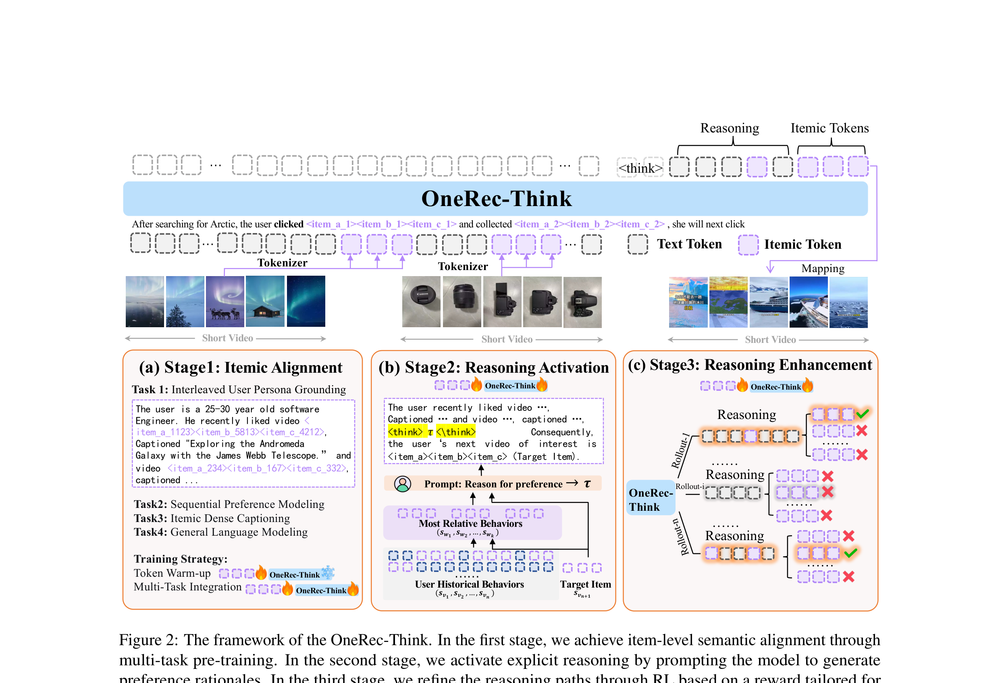

# OneRec-Think: In-Text Reasoning for Generative Recommendation

- **日期**：2025-10-15
- **来源**：arXiv:2510.11639v2
- **作者**：Zhanyu Liu, Shiyao Wang, Xingmei Wang, Rongzhou Zhang, Jiaxin Deng, Honghui Bao, Jinghao Zhang, Wuchao Li, Pengfei Zheng, Xiangyu Wu, Yifei Hu, Qigen Hu, Xinchen Luo, Lejian Ren, Zixing Zhang, Qianqian Wang, Kuo Cai, Yunfan Wu, Hongtao Cheng, Zexuan Cheng, Lu Ren, Huanjie Wang, Yi Su, Ruiming Tang, Kun Gai, Guorui Zhou
- **发表**：arXiv 预印本（2025-11-11 v2），快手技术

---

## 缺口

生成式推荐（OneRec、TIGER、HSTU）把推荐变成了"自回归解码 itemic token"的问题，但这些模型本质上只是隐式预测器，会一口气生成目标 token 序列，完全没有 LLM 最标志性的能力——显式的、可验证的推理路径。推荐领域的推理工作分成两派：显式推理（ReasoningRec、Review-driven 等）只能做判别式任务，隐式推理（ReaRec/SlowThinking）不输出可读文本。**没有一个框架在生成式推荐里同时实现"可解释的推理"和"可扩展的候选生成"。**

更尖锐地说，直接把 CoT 硬接到生成式推荐里是会失效的——后续工作 OneReason 的诊断显示，开思考模式反而不如不思考，原因是 itemic token 语义未对齐（感知地基没打牢）和行为序列太噪（认知地基没打牢）。OneRec-Think 是快手团队第一次系统性地试图解决这个问题的探路之作。

## 增量

**把显式文本 CoT 推理引入生成式推荐，用三阶段训练框架（对齐→激活→强化）让模型学会"先想再推"，在公开数据集上达到 SOTA，在快手线上实现 APP Stay Time +0.159%。**

## 核心机制图



上图展示 OneRec-Think 的三阶段框架：(a) Itemic Alignment 通过四任务预训练把 itemic token 语义对齐到 LLM 文本空间；(b) Reasoning Activation 先用剪枝上下文自举推理，再用噪声序列做上下文蒸馏；(c) Reasoning Enhancement 用 Rollout-Beam 奖励 + GRPO 精炼推理路径。右侧是工业部署的 Think-Ahead 架构。

```
┌─────────────────────────────────────────────────────────────┐
│                  OneRec-Think 三阶段框架                      │
├──────────────────┬──────────────────┬───────────────────────┤
│  Stage 1         │  Stage 2         │  Stage 3              │
│  Itemic Alignment│  Reasoning Act.  │  Reasoning Enhance.   │
│                  │                  │                       │
│  ┌────────────┐  │  ┌────────────┐  │  ┌─────────────────┐  │
│  │ Token Warm │  │  │ Pruned Ctx │  │  │ Rollout-Beam   │  │
│  │ -up: 冻LLM│──│─▶│  自举 CoT  │──│─▶│ Reward + GRPO  │  │
│  │ 只训itemic │  │  │            │  │  │                 │  │
│  │ embedding  │  │  │ ────────▶  │  │  │ τ₁→Beam→R_max  │  │
│  └─────┬──────┘  │  │ Noisy Seq  │  │  │ τ₂→Beam→R_max  │  │
│        ▼         │  │ 上下文蒸馏  │  │  │ ... → 组奖励   │  │
│  ┌────────────┐  │  └────────────┘  │  └─────────────────┘  │
│  │ Multi-Task │  │                  │                       │
│  │ Integration│  │  L_RA 联合优化   │  采样|G|=16路径       │
│  │ 4任务混合  │  │  推理token+目标  │  每条Beam K=32       │
│  └────────────┘  │                  │                       │
├──────────────────┴──────────────────┴───────────────────────┤
│                   Think-Ahead 部署架构                       │
│                                                             │
│   离线: 全模型推理 ──▶ T条推理路径 ──▶ 前两阶itemic prefix  │
│                          (捕获粗意图)                       │
│                                     ▼                       │
│   在线: 轻量OneRec ──▶ prefix约束解码 ──▶ 最后一阶token     │
│                          (实时响应)                         │
└─────────────────────────────────────────────────────────────┘
```

## 核喻：心理咨询师

把 OneRec-Think 想象成一位**心理咨询师**给来访者推荐活动：

- **Itemic Alignment** = 心理咨询师要先学会"听懂来访者在说什么"——如果来访者用方言描述自己的经历，咨询师得先学会这门方言，才能把来访者的故事翻译成专业心理学语言。itemic token 就是"方言"，四任务预训练就是"学方言"的过程。
- **Reasoning Activation** = 咨询师开始练习推理，但先从"简单案例"练起（pruned context，只保留与目标最相关的 k 条行为），学会"因为来访者经历过 A，所以可能会对 B 感兴趣"这样的因果推理，然后再逐步处理"完整但嘈杂的真实案例"（noisy sequence）。
- **Reasoning Enhancement** = 咨询师用督导反馈来精炼推理——不是每个推理路径都靠谱，督导（Rollout-Beam Reward）看的是"在这条推理路径下，beam search 里最好的推荐是什么"，好就加强，差就削弱。
- **Think-Ahead** = 咨询师提前花时间做深入分析（离线推理+前两阶prefix），来访者到来时只需要做最后的快速确认（在线约束解码最后一阶token），既保证了推理深度又不会让来访者等太久。

## 关键概念（费曼讲解）

### 1. Itemic Token 与层级对齐

**从零讲起**：推荐系统要推荐的每个物品（视频、商品），在传统系统里就是一个数字 ID（比如 item #8121）。这个数字对人没有任何意义，对语言模型也没有——它只是个编号。OneRec 体系把这些数字 ID 变成了"itemic token"：每个物品被编码成一组层级 token 序列，比如 `<item_a_8121><item_b_3259><item_c_6391>`，类似于英语里的音节。

**问题**：这些 token 对语言模型来说，开始时也是无意义的符号。模型只知道"这些 token 经常一起出现"，但不知道它们代表什么内容。这就像一个只会英语的人看到汉字——知道某个字经常和某些字搭配，但不理解含义。

**解法**：Itemic Alignment 通过四个任务教模型"理解"itemic token：
1. **交错用户画像**：把 itemic token 和文本描述混在一起训练，让模型学会 `<item_a_8121>` 的含义是"一个关于街头小吃摊的视频"
2. **序列偏好建模**：用 itemic token 做下一项预测，学习协同过滤模式
3. **Itemic 密描述**：给 itemic token，生成文字描述，强化双向映射
4. **通用语言建模**：保持模型基础语言能力

先冻住 LLM 只训 itemic embedding（Token Warm-up），再全部联合训练（Multi-Task Integration）。

### 2. Rollout-Beam 奖励

**从零讲起**：在推荐场景做 RL，最大的挑战是奖励极度稀疏——你采样了 16 条推理路径，每条路径后面 beam search 出 K=32 个候选物品，几乎没有任何一个恰好命中目标物品。如果用标准的"命中=1, 未命中=0"奖励，几乎所有路径的奖励都是 0，模型什么也学不到。

**核心洞察**：推荐中"用户偏好有多效性"——同一个用户可能对多个不同物品都感兴趣，只是碰巧这次点击了其中一个。所以不应该只看"是否命中唯一目标"，而应该看"在这条推理路径引导下，beam search 能找到的最好结果有多好"。

**Rollout-Beam 奖励**就是：对每条推理路径 τ，做 beam search 得到 K 个候选，取候选中与目标 token 匹配度最高的那个作为奖励。这样即使没完全命中目标，部分匹配也能得到正奖励，信号稠密得多。

### 3. Think-Ahead 部署架构

**从零讲起**：推理路径很长（几十到几百个 token），加上后面还有 itemic token 要生成，总延迟远超工业推荐系统的要求（通常 < 100ms）。

**核心思想**：把推理过程拆成"可提前做的"和"必须实时做的"两部分。离线阶段，用完整 OneRec-Think 模型生成 T 条推理路径和前两阶 itemic token（捕获粗粒度用户意图）。在线阶段，只拿这些前缀做约束，用轻量 OneRec 模型快速解码最后一阶 token。因为前两阶 token 已经把搜索空间从全部物品缩小到了一个很小的子集，最后一阶几乎瞬间完成。

## Napkin Sketch

```
以前（OneRec / TIGER）：

  用户行为 ──────────────▶ 一口气生成 <a_x><b_y><c_z>
                            "黑箱"直接输出
                            没有推理，不可解释


现在（OneRec-Think）：

  用户行为 ──▶ 先生成推理文本 ──▶ 再生成 <a_x><b_y><c_z>
               "用户偏好军事         ↑
                题材和国际关系，      推理路径引导
                尤其关注J-35          候选生成
                战斗机..."
                可解释 ✅
```

**框架位移**：从"黑箱预测器"到"推理感知推荐器"——模型不是只学会"映射行为到物品"，而是学会"先用语言解释为什么，再给出推荐"。这个位移的意义在于：推理路径可以被审核、被纠正、被交互式引导，打开了推荐可解释性和可控性的大门。

## 实验

### 公开数据集

三个 Amazon Review 数据集（Beauty, Toys, Sports），对比 7 个 baseline（BERT4Rec, HGN, GRU4Rec, SASRec, TIGER, HSTU, ReaRec）。

| 数据集 | 指标 | OneRec-Think | 最强 baseline (ReaRec) | 提升 |
|--------|------|-------------|----------------------|------|
| Beauty | R@5  | **0.0563**  | 0.0450               | +25.1% |
| Beauty | N@5  | **0.0398**  | 0.0262               | +51.9% |
| Toys   | R@5  | **0.0579**  | 0.0523               | +10.7% |
| Sports | R@5  | **0.0288**  | 0.0268               | +7.5%  |

### 消融实验（Beauty）

| 配置 | R@5 | R@10 |
|------|-----|------|
| Base | 0.0460 | 0.0654 |
| Base + IA | 0.0532 | 0.0735 |
| Base + IA + R | **0.0563** | **0.0791** |

Itemic Alignment 贡献 +1.6%（R@5），Reasoning Enhancement 再贡献 +3.1%。

### 工业在线 A/B

快手短视频推荐，1.29% 流量实验一周：

| 指标 | 提升 |
|------|------|
| APP Stay Time | **+0.159%** |
| Watch Time | +0.169% |
| Video View | +0.150% |
| Forward | +0.758% |
| Follow | +0.431% |

### Itemic Alignment 消融（工业 benchmark）

| 配置 | User Understanding (BertScore) | Short Video Understanding (BertScore) |
|------|-------------------------------|---------------------------------------|
| Qwen3 Base | 0.6588 | 0.6031 |
| + Token Warm-up | 0.6492 | 0.6443 |
| + TW + Multi-Task Integration | **0.7053** | **0.7300** |

Token Warm-up 对文本重的 User Understanding 任务增益有限（因为 LLM 本身就能处理文本），但对纯 itemic 的 Short Video Understanding 任务有渐进增益。Multi-Task Integration 在两个任务上都大幅提升。

## 博导判决

**Weak Accept**

加分项：
- 问题定义清晰：生成式推荐确实缺乏推理能力，这个空白是真实的
- 三阶段框架有逻辑递进：先对齐语义→再激活推理→再强化推理，每一步依赖前一步
- Think-Ahead 部署架构有工程价值，解决了推理延迟的工业部署瓶颈
- Case Study 展示了模型确实在"推理"而不是"事后合理化"（Figure 5 的 beam search 一致性分析）
- 线上 A/B 正向

扣分项：
- **公开数据集实验规模小**：Amazon Review 数据集行为序列短且稀疏，作者自己也承认"we simplify and adapt our approach to achieve a stable yet simplified reasoning capacity"——公开数据集上的推理能力是简化版的
- **思考 vs 不思考的对比缺失**：这是最关键的缺失。OneReason 后来的诊断直接指出 OneRec-Think/OpenOneRec 的思考模式效果≤不思考模式，但本文完全没有展示这个对比。这要么是作者知道但没写，要么是实验设计不够严格
- **Rollout-Beam 奖励的创新度有限**：本质上是把 GRPO 的 group reward 从"是否命中"改成"beam 里最好的命中"，是合理的工程调整但不是方法突破
- **推理质量评估不足**：只有 case study，没有定量的推理质量评估（如推理文本与用户真实偏好的对齐度、推理多样性等）
- **4 任务预训练的必要性未充分验证**：每个任务的独立贡献没有完整消融

## 启发

1. **"推理有用"不是白给的**：OneRec-Think 是第一个在生成式推荐里系统引入 CoT 的框架，但它的后续诊断（OneReason）揭示了一个尴尬事实——思考模式≤不思考模式。这说明光"有推理"不够，推理的**地基**（itemic token 语义理解 + 行为序列认知组织）必须先打牢。这个教训对整个"推荐推理"方向都有警示价值。

2. **Think-Ahead 架构的普适性**：离线推理 + 在线约束解码的思路不限于推荐，任何"计算密集推理 + 实时响应"的场景都可以借鉴。本质是用空间（缓存前缀）换时间（在线解码），和检索系统里的预计算索引是同一思路。

3. **"多效性"作为推荐 RL 的先验**：Rollout-Beam 奖励把"用户偏好有多效性"从论文讨论变成了可计算的奖励信号。这个思路可以推广：任何推荐 RL 的奖励设计都应该考虑"多个正确答案"的问题，而不是只看唯一目标。

4. **对个人工作的启发**：如果你在做推荐推理，OneRec-Think 是必读的前作——不是因为它的方案完美，恰恰因为它暴露了"硬接 CoT 会失效"这个关键问题，直接催生了 OneReason 的感知+认知地基修复。读这篇论文的价值在于理解**为什么简单的 CoT 在推荐里不 work**，而不在于它的方法本身。
