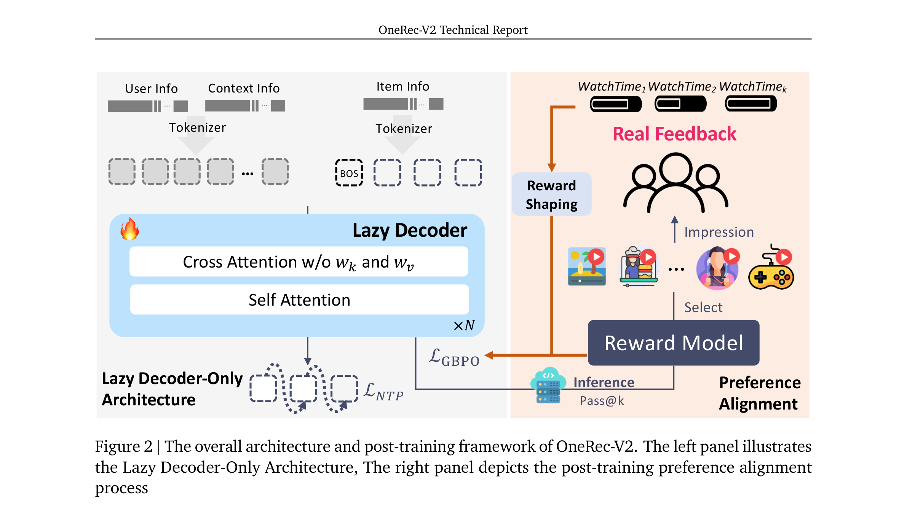
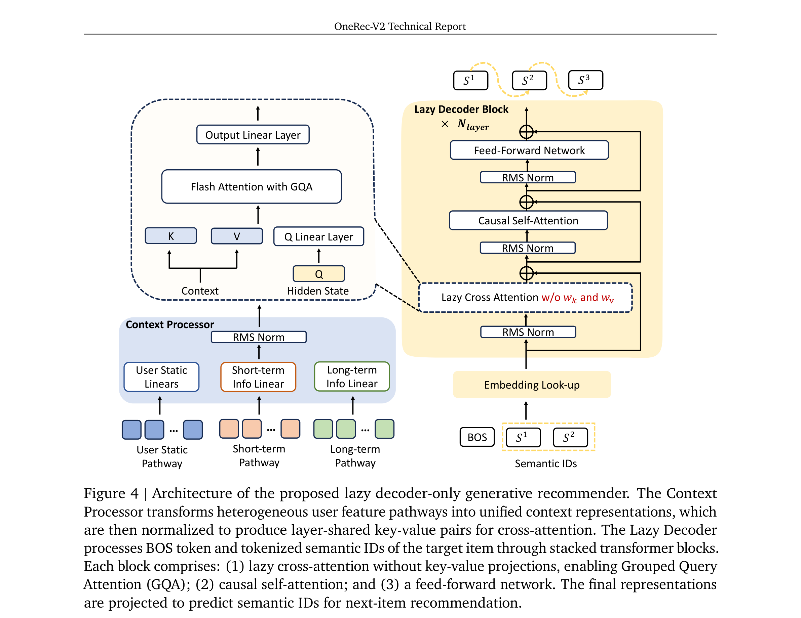

# OneRec-V2 Technical Report

- **日期**：2025-10-28
- **来源**：arXiv 2508.20900
- **作者**：OneRec Team (Guorui Zhou, Hengrui Hu, Hongtao Cheng, Huanjie Wang, Jiaxin Deng, Jinghao Zhang, Kuo Cai, Lejian Ren, Lu Ren, Liao Yu, Pengfei Zheng, Qiang Luo, Qianqian Wang, Qigen Hu, Rongzhou Zhang, Rui Huang, Ruiming Tang, Shiyao Wang, Shujie Yang, Tao Wu, Wuchao Li, Xinchen Luo, Xingmei Wang, Yi Su, Yunfan Wu, Zexuan Cheng, Zhanyu Liu, Zixing Zhang et al.)
- **发表**：arXiv 预印本（2025）

---

## 缺口：97% 的算力花在了不产生损失的地方

OneRec-V1 证明了生成式推荐在工业规模可行：把推荐重定义为自回归生成任务，端到端优化最终目标，MFU 高。但 V1 用的是 Encoder-Decoder 架构，而推荐场景有一个特殊性——用户行为序列很长（N=512），解码目标很短（3 个 semantic ID token）。结果就是：**97.66% 的 FLOPs 花在编码上下文上，只有 2.34% 用在真正产生损失的 target decoding 上**。上下文越长，这个比例越离谱（N=3000 时降到 0.41%）。这意味着如果你想 scale 模型，加进去的算力几乎全被编码吃掉，生成能力没涨。

V1 的 RL 阶段也有问题：只靠 reward model 做 RL。一是不够高效——需要额外算力做 online rollout 和 scoring，只能覆盖 1% 用户；二是 reward hacking——策略学会了钻 reward model 的漏洞，线上效果不涨反跌。

这两个问题有一个共同的根源：**把"编码过去"和"决策未来"混在一起算**。架构上混在两个组件里，算力分配失衡；RL 上混在 proxy signal 里，真人和模型偏好不一致。V2 要做的事情很简单：让编码归编码，决策归决策；让真人反馈归真人，模型猜测归模型。

---

## 增量：Lazy Decoder 让 97% 变成 0%，真人反馈让 reward hacking 归零

**一句话**：OneRec-V2 把 Encoder-Decoder 架构里"编码吃掉 97% 算力"的问题用"懒"解了——Context 只算一次 KV、不做 projection，Decoder 只管 3 个 token 的生成——计算量砍 94%，训练资源降 90%，同等算力下参数从 0.5B 拉到 8B，收敛 loss 严格遵循 scaling law；同时用时长归一化的真实用户反馈替代 reward model 做 RL，配合 GBPO 梯度稳定化，快手主端 App Stay Time +0.467%。

---

## 核心机制图



*Figure 2 全景：左侧 Lazy Decoder-Only Architecture，右侧 Preference Alignment 流程。Context Processor 把异构用户特征压缩成 layer-shared KV 对，Lazy Decoder 只处理 BOS + 2 个 semantic ID token；右侧展示真实用户反馈如何通过 Duration-Aware Reward Shaping 和 GBPO 替代 V1 的 reward model。*



*Figure 4 细节：Context Processor 三条通路（User Static / Short-term / Long-term）经过 Linear 投影后直接拼成 KV 对，跳过所有 $W_k$, $W_v$ 投影矩阵；Lazy Decoder Block 内部依次是 Lazy Cross-Attention（无 KV projection，支持 GQA）→ Causal Self-Attention → FFN/MoE。*

**自绘机制速写（新旧架构对比）**：

```
OneRec-V1: Encoder-Decoder
┌─────────────────────┐   ┌──────────────┐
│   Encoder (0.5B)    │   │  Decoder(0.5B)│
│  Self-Attn × 9 layers│──→│ Cross-Attn   │
│  N=512 tokens        │ KV│ Self-Attn    │
│  97.66% FLOPs       │   │ 3 tokens     │
│                     │   │ 2.34% FLOPs  │
└─────────────────────┘   └──────────────┘

OneRec-V2: Lazy Decoder-Only
┌──────────────┐   ┌───────────────────────────┐
│   Context    │   │    Lazy Decoder (1B)       │
│  Processor   │──→│  Lazy Cross-Attn (no Wk/Wv)│
│  1-time KV   │ KV│  Causal Self-Attn          │
│  ~0% FLOPs  │   │  FFN / MoE                 │
│  (shared)    │   │  3 tokens, ≈100% FLOPs    │
└──────────────┘   └───────────────────────────┘

关键区别：Context KV 只算一次、无投影矩阵、多层共享
         → 18.89 GFLOPs (V2) vs 296.36 GFLOPs (V1)
         → 同等算力下：0.5B → 8B 参数
```

---

## 白话方法：图书馆里的"懒"读者

想象你去图书馆找书。V1 的做法是：每次想推荐一本书，就把整个图书馆的书架重新整理一遍（Encoder），然后从整理好的书架上取书（Decoder）。整理书架花了 97% 的时间，取书只花了 3%。

V2 的"懒"读者不一样。他在进门时花一秒钟扫了一眼分类牌（Context Processor 生成 KV 对），然后直奔目标——只看自己想推荐的那三本书（3 个 semantic ID token）。分类牌是共享的，所有层都看同一块牌，不需要每层重新整理。因为图书馆的书目不会在推荐过程中改变（Context 是静态的），所以扫一眼就够了，不用反复扫描。

至于 RL 阶段的"真人反馈"——之前 V1 是让一个"书评机器人"（reward model）打分，但机器人会被骗：推荐一些看起来很花哨但用户根本不想看的书。V2 直接看读者的借阅时长：你在同类书里读了最久的那本，就是好书。同类怎么分？按时长分桶——因为 3 秒视频的 100% 播放和 5 分钟视频的 10% 播放，含义完全不同。

---

## 关键概念费曼讲解

### 1. Lazy Cross-Attention：为什么可以没有 $W_k$ 和 $W_v$？

普通的 cross-attention 里，encoder 输出要经过 $W_k$ 和 $W_v$ 投影变成 key 和 value，decoder 的 query 通过 $W_q$ 投影后去查询。在推荐场景里，上下文是用户行为序列，**它在一次推荐请求中不会变**——同一个用户的 512 个行为 token，推荐第 1 个 item 和推荐第 10 个 item 时是一样的。

Lazy 的核心洞察：既然 context 不变，为什么要在每一层、每一步重新投影？V2 的做法是让 Context Processor 直接输出适合 attention 的 KV 对（维度对齐到 $G_{kv} \times d_{head}$），多层共享同一组 KV，连 $W_k$、$W_v$ 矩阵都省了。省掉的不仅是计算量——还有激活内存（activations 从 17.63B 降到 1.24B，减少了 93%）。

**类比**：普通 cross-attention 像是每个部门都自己复印一份档案再翻译成自己的格式；lazy cross-attention 是公司统一发一份标准格式的摘要，所有部门直接用。

### 2. Duration-Aware Reward Shaping：3 秒视频和 5 分钟视频能比吗？

短视频推荐中最密集的反馈信号是播放时长。但 3 秒视频的 3 秒播完，和 5 分钟视频的 3 秒就划走，含义天差地别。如果直接用原始播放时长做奖励，模型会偏好推荐长视频——用户即使只看了 3 秒就划走，长视频的绝对播放时长也比短视频的完整播放高。

V2 的解法是**分桶百分位排名**：先把用户历史视频按时长对数分桶（同一数量级的视频放在一组），然后算目标视频的播放时长在自己桶内的百分位。5 分钟视频的 4 秒播放，在自己的桶里排名很低；3 秒视频的 3 秒播放，在自己的桶里排名 100%。这样不同时长视频的"满意度"就可以公平比较了。

**例子**：你看了 100 个短视频，其中 3 秒视频有 20 个，5 分钟视频有 15 个。一个 3 秒视频播了 3 秒，在 3 秒桶里排第 95 百分位 → 高质量正样本。一个 5 分钟视频播了 30 秒，在 5 分钟桶里只排第 40 百分位 → 被过滤掉。

### 3. GBPO：为什么负样本的梯度会爆炸？

在 RL 里，策略比 $\pi_\theta / \pi_{old}$ 衡量"新策略比老策略多大程度改变了行为"。对正样本（好结果），大比例 = 应该加大力度，梯度大是合理的。但对负样本（坏结果），比例理论上应该小于 1——但如果当前概率 $\pi_\theta$ 已经很小了（模型已经不太会推荐这个 item），梯度 $\frac{1}{\pi_\theta}$ 反而会爆炸——模型在"已经不推荐的东西"上花过多力气去压制。

传统 GRPO/ECPO 通过 clipping 解决：比例超出 $[1-\epsilon, 1+\epsilon]$ 的样本直接截断。但 clipping 丢弃了太多样本，收敛慢。

GBPO 的思路是**用 BCE 损失的梯度模式来约束 RL 的梯度**：对负样本，设一个动态上界 $max(\pi_{old}, 1 - sg(\pi_\theta))$，当 $\pi_\theta$ 很小时上界也很小，梯度自然受限。效果：**不丢弃任何样本 + 负样本梯度稳定**。

---

## 餐巾纸速写：从"用力编码"到"聪明偷懒"

```
        以前（V1）                          现在（V2）
 ┌──────────────────────┐      ┌──────────────────────────┐
 │  编码：97% 算力       │      │  编码：≈0%（1次KV，共享）│
 │  生成：3% 算力        │  →→  │  生成：≈100% 算力         │
 │  RL：靠 proxy model   │      │  RL：靠真人播放时长       │
 │  Scale：0.5B 封顶     │      │  Scale：8B，跟 scaling law│
 └──────────────────────┘      └──────────────────────────┘
  位移方向：把算力从"读历史"搬到"做决策"，
           把信号从"模型猜"搬到"用户说"
```

核心位移：**推荐系统的瓶颈不在"理解用户"（编码），而在"做出好决策"（生成）**。V1 把 97% 的算力花在了瓶颈之外。V2 让编码几乎免费，把算力集中到真正产生损失的地方。这不是"减少编码"——而是"编码只需做一次，结果复用到底"。

---

## 证据与结果

**架构对比（1B 参数，N=512）**：

| 架构 | GFLOPs | Activations | 收敛 Loss |
|------|--------|-------------|-----------|
| Enc:Dec=1:1 (V1) | 296.36 | 17.63B | 3.28 |
| Enc:Dec=1:2 | 204.21 | 12.20B | 3.26 |
| Naive Dec-Only | 634.83 | 31.53B | * |
| **Lazy Dec-Only (V2)** | **18.89** | **1.24B** | **3.27** |

Lazy Dec-Only 在损失持平的前提下，计算量降 94%，激活内存降 93%。

**Scaling Law**：从 0.1B 到 8B，收敛 loss 从 3.57 降到 3.19，拟合 $L(N) = 3.13 + 3660/N^{0.489}$，与 Chinchilla scaling law 一致。4B MoE（0.5B active）loss 3.22，优于 2B dense。

**在线 A/B（快手/快手 Lite，4 亿 DAU）**：
- App Stay Time：+0.467% / +0.741%
- Video View：+0.331% / +0.259%
- Like/Follow/Comment 等：全面正向，无跷跷板效应

**用户反馈 vs Reward Model**：
- User Feedback 更偏 App Stay Time（时长指标）
- Reward Model 更偏交互指标（Like/Follow/Comment）
- Hybrid 两者互补，Stay Time + 交互指标兼得

**推理部署**：1B 模型，L20 GPU，延迟 36ms，MFU 62%。

---

## 贡献声明

作者声称两大贡献：（1）Lazy Decoder-Only Architecture，94% 计算缩减 + scaling law 验证 + 8B 扩展；（2）真实用户反馈驱动的偏好对齐，Duration-Aware Reward Shaping + GBPO 梯度稳定化。

---

## 博导判决

**Accept 偏 Strong Accept**

**加分项**：
- 97%→≈100% 的算力重新分配，问题定义精准，解决彻底
- Scaling law 从 0.1B 到 8B 完整验证，为生成式推荐的 scale 方向提供了实证和理论指导
- 真实用户反馈替代 reward model 是正确方向，Duration-Aware Reward Shaping 简洁有效
- GBPO 对负样本梯度爆炸的分析有洞察力，动态上界设计优雅
- 4 亿 DAU 线上 A/B，结果过硬

**扣分项**：
- Lazy Cross-Attention 的"偷懒"有代价：所有层共享同一组 KV，上下文信息只能通过单一投影进入。这相当于信息瓶颈——所有用户历史必须压缩进一组固定维度的 KV 对。论文没有讨论这个瓶颈在大规模、长上下文场景下是否会有损效果
- 缓存关闭实验（Appendix D）暴露了生态系统问题：冷启动视频播放量下降 44.7%、cluster density 增加 11.7%。论文诚实承认了但没有提出解法
- Duration-Aware Reward Shaping 的规则设计（25% 分位数阈值、对数分桶）是手工调参，没有自适应机制

---

## 启发

**对我最有用的一点**：Lazy Decoder 的设计哲学——"静态信息只算一次"——可以迁移到任何 encoder-decoder 架构的推荐系统。不只是 OneRec，任何需要编码长上下文的场景（如 CTR 预估里的用户行为序列、搜索里的 query 扩展）都可以问自己：**我的上下文在推理过程中会变吗？如果不会，为什么要每层重新投影？** 这个思路比具体的 Lazy Cross-Attention 机制更有普适价值。

**盲区照亮**：我一直觉得 Encoder-Decoder 是生成式推荐的自然架构（"编码理解、解码生成"），但 V2 的实验告诉我：**在推荐场景里，编码和解码的 token 数量差了 2 个数量级，Encoder-Decoder 的算力分配天然失衡**。这不是工程优化问题，是架构选择问题。当上下文静态时，decoder-only + 预计算 KV 才是正确抽象。

**一个需要警惕的地方**：V2 在全流量实验中冷启动视频播放量暴跌 44.7%。生成式推荐对"新物品"的不友好可能不是 SID 碰撞问题（DREAM 解决的），而是更根本的**分布固化**——模型学会了少数高分 SID 后就不愿意探索新的。这和 DINOSAUR 在候选生成阶段注入不确定性的思路是同一个问题的不同侧面。
