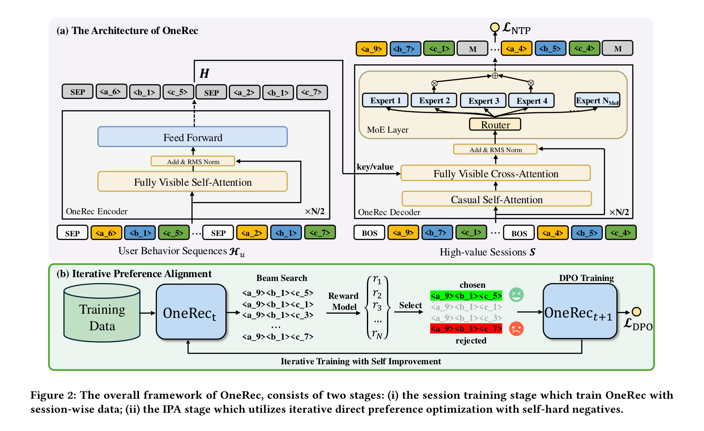

# OneRec: Unifying Retrieve and Rank with Generative Recommender and Preference Alignment

- **日期**：2025-02-26
- **来源**：arXiv:2502.18965
- **作者**：Jiaxin Deng, Shiyao Wang, Kuo Cai, Lejian Ren, Qigen Hu, Weifeng Ding, Qiang Luo, Guorui Zhou
- **发表**：arXiv 预印本（2025），快手技术

---

## 缺口：级联漏斗的天花板

推荐系统的工业实践一直被一个结构性困境锁住：**级联漏斗的上限即全系统上限**。

现有方案把推荐拆成召回→粗排→精排三个独立阶段，每个阶段只管自己那一环的最优。召回选出的候选集决定了粗排能看到的"世界"，粗排筛出的子集又框定了精排的选择范围。一旦召回漏掉了好 item，后面排得再精准也无济于事。各种联合优化尝试（RankFlow、GemNN、ANRF）试图让阶段之间互相通气，但仍然在"漏斗"范式内打补丁，没有真正打破阶段间的信息隔离。

生成式检索（GR）本该是破局者：用自回归方式直接生成 item 的 Semantic ID，绕过 ANN 检索。但现有的 TIGER、LC-Rec、EAGER 等 GR 方法只在召回阶段当 selector，生成精度远不够替代精排。**GR 要替代的不是某一个阶段，而是整条漏斗——这需要从"逐个预测下一个 item"进化到"一次生成一整页推荐"，再配合偏好对齐让它学会"什么样的推荐列表用户真的喜欢"。**

这就是 OneRec 要填的缝：**用单个端到端生成模型替代整条级联流水线**。

---

## 增量

OneRec 让我们知道了：**单个生成模型能替代工业级推荐系统的整条级联漏斗，并且在线上把观看时长拉高 1.6%**——这在十亿 DAU 平台上是惊人的提升。

---

## 核心机制图



上图是 OneRec 的整体框架，分为两阶段：左半 (a) 是 session-wise 生成架构，右半 (b) 是迭代偏好对齐 IPA。Encoder 编码用户历史行为序列的 Semantic ID，Decoder 通过因果自注意力逐 token 生成目标 session 的 SID，MoE 层在扩展参数量的同时只激活 13% 的参数。IPA 阶段用 Beam Search 生成多条候选 session，Reward Model 评分后选出 best/worst 构造 DPO 偏好对，迭代自我改进。

下面用 ASCII 速写画出内部数据流和核心机制：

```
┌─────────────────────────────────────────────────────────────────┐
│                    OneRec 核心数据流                              │
│                                                                 │
│  用户历史 Hᵤ                    目标 Session S                   │
│  ┌──────────┐                   ┌──────────┐                    │
│  │v₁ v₂ … vₙ│                   │v₁ v₂ … vₘ│                    │
│  │  ↓ RQ-KM │                   │  ↓ RQ-KM │                    │
│  │SID序列   │                   │SID序列   │                    │
│  │(s¹,s²,s³)│                   │(s¹,s²,s³)│                    │
│  └────┬─────┘                   └────┬─────┘                    │
│       │                              │                          │
│  ┌────▼──────────────────────────────▼────┐                     │
│  │         Encoder (双向 Self-Attn)        │                     │
│  │     H = Encoder(Hᵤ 的 SID 序列)        │                     │
│  └──────────────────┬────────────────────┘                     │
│                     │ KV 缓存                                   │
│  ┌──────────────────▼────────────────────┐                     │
│  │       Decoder (因果 Self-Attn          │                     │
│  │         + Cross-Attn 看 Encoder)       │                     │
│  │                                        │                     │
│  │   ┌─── MoE FFN ───┐                   │                     │
│  │   │24 Expert, Top2│ ← 只激活13%参数     │                     │
│  │   │Router 门控选路 │                   │                     │
│  │   └────────────────┘                   │                     │
│  │                                        │                     │
│  │   输入: [BOS] s¹₁ s¹₂ s¹₃ [BOS] s²₁ … │                     │
│  │   输出: 逐 token 预测下一个 SID token    │                     │
│  └──────────────────┬────────────────────┘                     │
│                     │                                          │
│              NTP Loss (交叉熵)                                  │
│                                                                 │
│  ══════════════ IPA 阶段 ══════════════                         │
│                                                                 │
│  ┌──────────────────▼────────────────────┐                     │
│  │    Beam Search → N=128 条候选 Session   │                     │
│  └──────────────────┬────────────────────┘                     │
│                     │                                          │
│  ┌──────────────────▼────────────────────┐                     │
│  │     Reward Model R(u, S) 打分           │                     │
│  │  ┌─────────────────────────────┐      │                     │
│  │  │ Target-Aware: eᵢ = vᵢ ⊙ u  │      │                     │
│  │  │ Self-Attn 融合 Session 内交互│      │                     │
│  │  │ 多塔预测: swt / vtr / wtr / ltr│      │                     │
│  │  └─────────────────────────────┘      │                     │
│  └──────────────────┬────────────────────┘                     │
│                     │                                          │
│            ┌────────▼────────┐                                │
│            │ best = argmax r  │ ← chosen                      │
│            │ worst = argmin r │ ← rejected                    │
│            └────────┬────────┘                                │
│                     │                                          │
│              DPO Loss + NTP Loss                               │
│         L = L_NTP + λ · L_DPO (仅 1% 样本)                     │
│                     │                                          │
│              M^{t+1} ← 迭代自改进                               │
└─────────────────────────────────────────────────────────────────┘
```

---

## 白话方法：主厨配菜

想象一家高档餐厅的配菜流程。

**旧方案（级联漏斗）**：食材采购员先从仓库挑出一筐食材（召回），粗加工厨师挑出好的切配（粗排），主厨再精选摆盘上菜（精排）。问题是，采购员挑错了筐，后面再怎么加工也是白搭。而且三个环节各干各的，谁也不知道谁需要什么。

**OneRec（主厨一条龙）**：主厨直接根据客人偏好，一口气配好一整桌菜。不是一道一道想，而是考虑这桌菜的荤素搭配、口味递进、营养均衡——这就对应 session-wise 生成。主厨脑子里的"菜谱知识"靠 MoE 扩容：24 个帮厨各有专长，每次只叫 2 个来帮忙（稀疏激活），既省工钱又见多识广。

**IPA（迭代品菜改进）**：主厨配完一桌菜后，请美食评论家（Reward Model）打分。然后从 128 桌候选中挑出得分最高的那桌当正面教材、最差的那桌当反面教材，告诉主厨"以后多像好的这样配，少像差的那样配"（DPO）。关键是评论家很了解这位客人的口味——用个性化 reward model 评分，而非泛泛而谈。如此反复迭代，主厨越配越对胃口。

**Balanced K-Means（菜品编号）**：给每道菜一个三级编号（菜系→品类→菜名），使得同类菜编号相近，不同类菜编号分明。关键是每个编号下的菜品数量要均匀，不能一个编号下挤了 100 道菜而另一个只有 2 道（这就是"沙漏现象"的解法）。

---

## 关键概念（费曼讲解）

### 1. SID（Semantic ID）：给 item 一套语义门牌号

传统推荐系统给每个视频分配一个随机 ID（比如 video_12345），这个 ID 本身不携带任何语义信息。SID 则通过量化把 item 的多模态嵌入变成一组层级编码，例如 `(a₉, b₇, c₁)`，其中 a₉ 是最粗粒度的语义聚类（比如"美食"大类），b₇ 是中等粒度（"烘焙"子类），c₁ 是最细粒度（具体的某个蛋糕视频）。

**OneRec 的创新**：用 Balanced K-Means 替代标准 RQ-VAE 的 K-Means，强制每个聚类中心分配到等量的 item。为什么？因为标准 RQ-VAE 会出现"沙漏现象"——第一层编码把绝大多数 item 挤到少数几个码字里（因为 K-Means 找到的中心天然不均匀），导致后面的层几乎没有残差可编码。Balanced K-Means 通过"每个中心只认最近的 w=|V|/K 个未分配 item"的贪心策略，让码本容量被均匀利用。

**具体例子**：假设 8192 个视频用 3 层编码，每层码本大小 K=8192。标准 K-Means 可能让第一层的码字 0 包含 5000 个视频，码字 1-8191 只分到零星几个。Balanced K-Means 强制每个码字只管 1 个视频（8192/8192=1），信息密度最大化。

### 2. Session-wise NTP：一次生成一页推荐

传统 GR 是"逐个 item 预测"：先预测下一个视频 v₁，再预测 v₂，以此类推。这种做法有两个问题：一是生成完之后要用启发式规则把结果拼成一页（怎么排？怎么保证多样性和连贯性？全靠手写规则），二是每个 item 独立生成，看不到兄弟 item 之间的关联。

Session-wise NTP 把一整个 session（5-10 个视频）的 SID 拼成一条序列，用 `[BOS]` 分隔不同 item，然后做 next-token prediction：

```
输入:  [BOS] a₉ b₇ c₁ [BOS] a₂ b₁ c₅ [BOS] a₄ b₅ c₇
目标:   a₉ b₇ c₁ [BOS] a₂ b₁ c₅ [BOS] a₄ b₅ c₇ [EOS]
```

关键洞察：**因果注意力机制让同一个 item 内的 token 看到前面的 token（item 内一致性），也让后面 item 的 token 看到前面 item 的全部 token（session 内连贯性）**。模型在训练时就学会了"什么样的 session 结构是好 session"，因为训练数据就是从用户真实浏览中筛选的高质量 session（观看≥5 个、有互动行为等）。

### 3. IPA（Iterative Preference Alignment）：推荐系统的自我博弈

DPO 在 NLP 里用人类标注的偏好对训练，但推荐系统里没有显式偏好标注——用户只看了一次推荐结果，你没法同时知道用户"喜欢"和"不喜欢"什么。OneRec 的 IPA 解法很巧妙：

1. 用当前模型 Mᵗ 做 Beam Search 生成 128 条候选 session
2. 用预训练的个性化 Reward Model 对每条候选打分
3. 取最高分当 chosen、最低分当 rejected，构造 DPO 偏好对
4. 用 DPO loss + NTP loss 联合训练 Mᵗ⁺¹
5. 迭代：Mᵗ⁺¹ 生成更好的候选 → 更准的偏好对 → 更好的 Mᵗ⁺²

**为什么需要 Reward Model 而不是直接用用户行为？** 因为推荐系统只有一次展示机会，不可能同时给用户展示 128 种推荐结果来获取偏好数据。Reward Model 就是"模拟用户"，它能给任意候选 session 打分，解决了正负样本获取的瓶颈。

**1% DPO 比率就够**：实验表明仅 1% 的训练样本做 DPO 对齐就能带来 4.04% 的 max swt 提升，增加到 5% 的边际收益微乎其微，但 GPU 成本翻 5 倍。这是非常实用的工程发现。

---

## 餐巾纸速写：从"漏斗筛选"到"直接生成"

```
以前大家这么想:                    OneRec 说应该这么想:
                                   
┌──────────┐                      ┌──────────────┐
│ 10¹⁰ 候选 │                      │   用户历史    │
│  (全量)   │                      │  SID 序列    │
└─────┬────┘                      └──────┬───────┘
      ↓ 召回                              ↓ Encoder
┌──────────┐                      ┌──────────────┐
│  10⁵ 候选 │                      │  编码表示 H   │
│  (粗糙选) │                      │  (双向理解)  │
└─────┬────┘                      └──────┬───────┘
      ↓ 粗排                              ↓ Decoder + MoE
┌──────────┐                      ┌──────────────┐
│  10³ 候选 │                      │ Session 生成  │
│  (中等选) │                      │ (一口气一整页) │
└─────┬────┘                      └──────┬───────┘
      ↓ 精排                              ↓ IPA 偏好对齐
┌──────────┐                      ┌──────────────┐
│  10² 结果 │                      │ 精准推荐列表  │
│  (精细排) │                      │ (直接可部署)  │
└──────────┘                      └──────────────┘

每阶段独立优化 → 天花板              端到端 → 统一目标
阶段间信息隔离 → 损失累积            一气呵成 → 无中间损耗
逐个预测 → 手工规则拼装             Session-wise → 自动学结构
无偏好学习 → 只能拟合行为           IPA → 主动对齐偏好
```

**位移方向**：从"分阶段筛选（每阶段有独立上限）"到"端到端生成（单模型无上限耦合）"——本质上是用生成范式替代检索范式，用偏好对齐替代行为拟合。

---

## 证据

### 离线实验

在快手大规模工业数据集上，OneRec-1B 在所有指标上全面超越 baseline：

- **vs TIGER-1B**（pointwise 生成）：OneRec-1B 的 max swt 高 1.78%，max ltr 高 3.36%，证明 session-wise 建模优于逐个预测
- **vs 判别式方法**（SASRec/BERT4Rec/FDSA）：OneRec 在 swt 上是 2.6 倍以上的提升
- **IPA 的效果**：OneRec-1B+IPA 相比 OneRec-1B，max swt 再提升 4.04%，max ltr 再提升 5.43%
- **IPA vs 其他 DPO 变体**：IPA 超过所有 7 种 DPO 变体（DPO/IPO/cDPO/rDPO/CPO/simPO/S-DPO），部分变体甚至不如不做对齐的 OneRec-1B

### Scaling Law

从 0.05B 到 1B，OneRec 展现出清晰的 scaling 行为：0.05B→0.1B 提升 14.45%，0.1B→0.2B 提升 5.09%，0.2B→0.5B 提升 5.70%，0.5B→1B 提升 5.69%。这是推荐领域少见的清晰 scaling law 验证。

### 在线 A/B 测试

在快手主场景（数亿 DAU）部署 OneRec-1B+IPA：

| 模型 | 总观看时长 | 平均观看时长 |
|------|-----------|-------------|
| OneRec-0.1B | +0.57% | +4.26% |
| OneRec-1B | +1.21% | +5.01% |
| OneRec-1B+IPA | **+1.68%** | **+6.56%** |

1.68% 的总观看时长提升在十亿 DAU 平台上是巨大的商业价值。平均观看时长 +6.56% 说明推荐质量有了质的变化。

### 部署细节

- 推理时只激活 13% 参数（MoE 稀疏激活）
- Beam Search beam=128
- KV Cache + float16 量化降低 GPU 内存
- DPO 采样服务器与训练服务器分离，异步构造偏好对

---

## 假设

1. **SID 能充分表示 item 语义**：假设 3 层 Balanced K-Means 量化（K=8192）的 SID 空间足以区分所有 item，但碰撞问题（多 item 共享 SID）在本文中未被定量分析
2. **高质量 session 定义合理**：训练数据筛选条件（观看≥5、有互动等）隐式假设了这些 session 代表用户偏好，但这可能引入幸存者偏差
3. **Reward Model 可靠**：IPA 的效果上限取决于 RM 的准确性，而 RM 也是用同一批数据训练的——偏好对的质量受限于 RM 泛化能力
4. **1% DPO 比率的最优性**：实验只验证了 1%-5%，更低比率（0.1%）是否同样有效未验证

---

## 启发

**对我最大的启发是"session-wise 生成"这个抽象**。我之前一直把生成式推荐理解成"把检索问题翻译成序列生成问题"，但 OneRec 告诉我：生成范式的真正优势不在于"生成一个 item"，而在于"生成一个结构化输出"——一整页推荐本身就是一个有内部依赖的序列结构，只有端到端生成才能让模型学会这个结构。

这直接照亮了我的一个盲区：我在设计推荐系统时一直在优化"单个 item 的预测精度"，但从未想过"推荐列表本身的结构"也可以作为一个学习目标。session-wise 生成让模型从"学会预测"变成"学会规划"——这是一个范式的质变。

另一个实用的工程洞察是 **1% DPO 就够**。在工业场景里，偏好对齐不需要大动干戈，极少量对齐样本就能让生成模型发生质的飞跃。这意味着 DPO 的部署成本远比想象中低。

但本文也留下了一个重要未解问题：**互动指标（点赞、收藏）的提升远不如观看时长**。作者自己承认这是局限，未来需要多目标建模。这暗示端到端生成式推荐在"用户深层兴趣"的捕捉上可能还比不上精细化的多目标排序模型——单模型替代整条漏斗的叙事还不够完整。

---

## 博导判决

**Accept**

贡献清晰：首次在工业级场景用单个生成模型替代整条级联推荐流水线，在线 +1.68% 观看时长。三个模块各有实感——session-wise 生成让模型学会规划、Balanced K-Means 解决 SID 沙漏现象、IPA 用自博弈实现偏好对齐。Scaling law 验证和消融实验充分。

扣分项：SID 碰撞问题未定量讨论；互动指标（点赞等）提升有限，多目标建模留白太大；IPA 的 Reward Model 和主模型共享训练数据，偏好对的上限不够清晰。但作为"端到端生成替代级联漏斗"的首次工业验证，贡献足够 solid。
