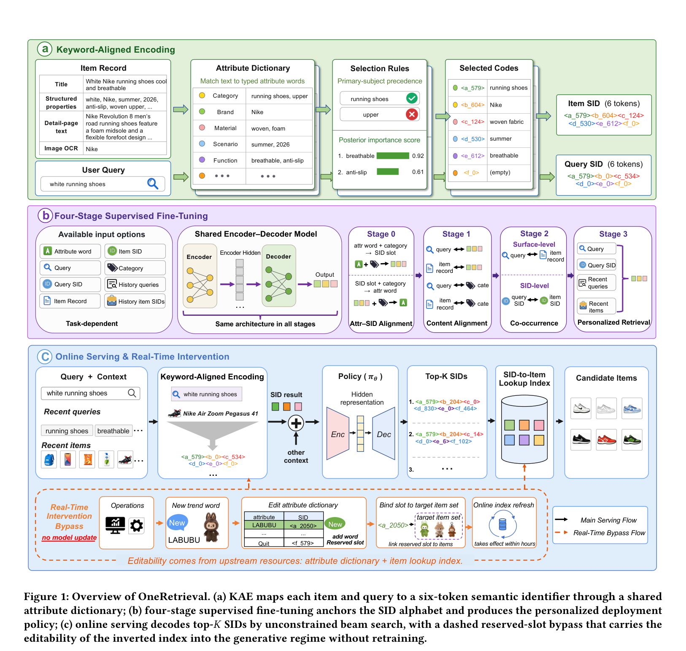
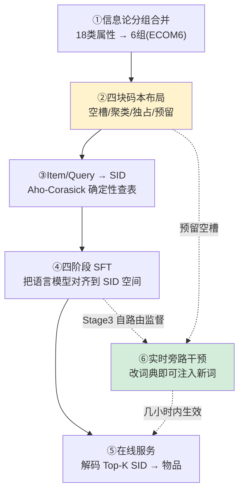

# OneRetrieval: Unifying Multi-Branch E-commerce Retrieval with an Editable Generative Model

- **日期**：2026-06-11
- **来源**：https://arxiv.org/abs/2606.13533
- **作者**：Xuxin Zhang, Ben Chen, Yue Lv, Siyuan Wang, Yupeng Li, Yufei Ma, Zihan Liang, Tong Zhao, Ying Yang, Huangyu Dai, Lingtao Mao, Zhipeng Qian, Xinyu Sun, Chenyi Lei, Wenwu Ou, Kun Gai（快手）
- **发表**：arXiv 预印本 2026

---

# 一、问题：那个转化率最差的检索分支，为什么删不掉？

工业电商搜索的召回阶段，几乎清一色是「多分支」结构：倒排索引分支管字面匹配，稠密向量分支管语义匹配，协同过滤分支管行为匹配，三路各召回一批候选，再用一套**人工调好的融合规则**拼起来送给下游排序。这套结构鲁棒、好调试，但每条分支都有自己的结构性短板——倒排只认字面、看不懂意图，稠密匹配太粗、新内容更新慢，协同有头部偏置、压制长尾和新品。而且三条分支各自独立训练、靠手工融合，无法联合优化，跨分支冗余被当成「鲁棒性的代价」忍下来。

生成式检索（GR）本来是终结这套结构的希望：把检索重新表述成「给定 query，自回归地生成一个物品标识符」，理论上能把整个多分支阶段塌缩成**一个**联合优化的模型。但论文指出，统一卡住的关键，不在召回质量，而在一个被反复忽略的属性——**可编辑性**。

## 1.1 可编辑性悖论：它靠的不是召回好，而是能改

论文给这个现象起了个名字，叫 **Editability Paradox（可编辑性悖论）**。这里先把术语说清楚：**可编辑性（editability）= 运营能否在不重新训练模型的前提下，把一个新冒出来的词（新品、爆款品牌、营销热词，比如 LABUBU、POP MART）绑定到一批指定的物品上，几小时内就在线上生效。**

快手的内部数据显示：倒排索引分支占了相当大的曝光份额，但它的转化率明显低于平台均值。按理说该砍掉。可它砍不掉——因为它**几乎是唯一一条能让运营在几小时内、不动模型就注入一个新词的分支**。它活下来不是因为召回得好，而是因为**能改**。

所以要想用一个模型替掉它，这个模型必须同时做到两件事：召回更强，且可编辑性相当。

## 1.2 为什么现有的 GR 都补不上这一刀

论文把现有 GR 按「标识符怎么构造」分成两类，并指出两类都**结构性地**缺可编辑性——不是没做，是做不了：

- **闭码本（closed-codebook，基于 SID）**：DSI、TIGER、LC-Rec、OneRec、OneSearch 这类，用残差/乘积量化把物品 embedding 压成整数码。每个槽位绑定的是**训练时就固定死的量化 embedding**，新属性词进来无处安放，要加就得连量化器带策略一起重训。
- **开放词表（open-vocabulary，基于 string）**：SEAL、GLEN、GRAM 这类，直接生成物品文本里的自然语言片段。新词能不能被路由到目标物品，**全靠模型自己的泛化**，运营没有任何「把词绑到指定物品集」的显式机制。

> **这就是缺口**：让倒排活下来的那种实时干预能力，在所有 GR 里都没被恢复，所以整个召回阶段始终塌缩不成一个模型——哪怕离线质量已经支持替换。

---

# 二、增量：第三种标识符——可扩展码本

**一句话增量**：OneRetrieval 提出了介于闭码本与开放词表之间的第三种标识符——**可扩展码本（extensible-codebook）**，让「可编辑性」成为标识符方案自带的结构属性，而不是事后打的补丁，从而首次做到「召回质量追平最强 GR baseline + 恢复倒排级实时可编辑性」于一个模型之内。

它的做法可以浓缩成一句话：**把标识符的每一位对齐到一个可解释的「关键属性词」，并在码本里预留一小块空槽，部署后让运营把新词绑进空槽——可编辑性因此落在上游词典里，正是倒排把它放的地方。**

下面先看论文原图建立整体印象，再用流程图拆解内部逻辑。

---

# 三、核心机制（图文同构）

## 3.0 先看整体：论文主模型图



整张图分三个面板，正好对应三件事：**(a) KAE 编码**——把 query 和 item 都映射成 6 个 token 的 SID；**(b) 四阶段 SFT**——训练那个吃 SID 的模型；**(c) 在线服务 + 实时旁路**——主链路解码 SID 召回物品，虚线旁路让运营改词典即可注入新词。

下面这张流程图把内部逻辑抽出来，你建立好这个骨架，往下读的每一节标题都对应图里的一个节点：



接下来六小节，标题与上图 ①~⑥ 节点一一对应。

## 3.1 ①信息论分组合并：18 类属性怎么压成 6 组

内部属性抽取流水线会给物品和 query 的子串打上 18 种细粒度属性类型（entity 实体、brand 品牌、color 颜色、scene 场景、material 材质……）。

**前置定义**：这里的 **SID（Semantic ID，语义标识符）= 一串定长的整数 token，每个 token 来自某一位专属的码本，整串唯一地编码一个物品。** OneRetrieval 的 SID 长度是 6。

为什么是 6 而不是 18？如果一类属性占一位，L=18 会让自回归推理成本线性膨胀，且每位密度被稀释。于是论文把「合并两类到同一位的信息损失」用对称条件熵 `IL(X,Y) = ½[H(X|Y)+H(Y|X)]` 度量（恰好是 variation of information 的一半，是个合法的类间距离），做**凝聚式聚类**：把信息损失累积值对目标组数作图，二阶差分的拐点恰好落在 **6**。其中 entity（实体，即「买的是什么东西」）被单独保留为锚点，因为其他所有属性都挂在它身上。最终得到的 6 组分区命名为 **ECOM6**。

## 3.2 ②四块码本布局：预留块是可编辑性的物理载体

每一位的码本被切成四块（论文 Figure 3b），**第四块「预留块」是整个可编辑性的物理位置**：

- **空槽（empty，索引 0）**：表示这一组没有任何属性词，或词不在词表里。
- **聚类槽（cluster）**：对组内长尾词做 k-means，每个槽是一簇近义词的质心。
- **独占槽（solo）**：高频头部词，大致一词一槽。
- **预留槽（reserved，每位最后 10 个索引）**：**训练时不绑定任何属性词**，部署后才绑新词。每位 10 个、6 位共 60 个预留 token，足够吸收平台一个周级别的热词周期还有余量。

容量按密度非均匀分配：3 个最密的位给 2048，3 个轻的位给 1024，核心槽共 9216 个（记作 L6-D3，即部署配置）。

## 3.3 ③Item/Query → SID：确定性查表，不过神经网络

**前置定义**：**query→SID = 把一条查询文本，通过查词典确定性地转成那串 6-token SID 的过程。** 注意这一步**不经过任何神经网络**——靠的是 Aho-Corasick 自动机在词典上扫描匹配。

流程是：拼接 item 的标题/属性/详情/OCR 文本 → 用 Aho-Corasick 在生产词表上扫出所有属性词 → 每个词归到它的 6 组之一 → 一组里若有多个词，用「主体优先（primary-subject precedence，离线问 LLM 哪个是真正在卖的主体）+ 后验重要度（PV/CTR）」选一个代表 → 代表词映射到码本槽 → 拼接六位得到 SID。query 走完全相同的流程。

> 关键：因为编码是确定性查表，**词占哪个槽完全由词典决定，不由模型挑**——这就为运营保留了完全的控制权，是后面 P3 的根。

## 3.4 ④四阶段 SFT：把语言模型对齐到 SID 空间

主干是 BART-base，词表扩进 9276 个 SID token，串行训练四个阶段（论文 Figure 1b）：

- **Stage 0｜属性-SID 对齐**：教模型「槽位 ↔ 属性词」的双向映射，让 group ℓ 的词被发射到第 ℓ 位。
- **Stage 1｜内容对齐**：把 query/item 的表面文本与其 SID 对齐——**召回质量的主要来源**。
- **Stage 2｜协同共现**：用点击/下单日志，在 SID 级把 `s_q` 和 `s_i` 配对，建立「query-SID → item-SID」的路由——**可编辑性的承重阶段**。
- **Stage 3｜个性化检索 + 预留槽自路由监督**：产出部署策略；并加一小块（约占 Stage 3 的 1e-5）「预留槽自路由」监督，把预留槽当成**与词无关的恒等路由器**来练。

## 3.5 ⑤⑥在线服务与实时旁路：可编辑性如何不重训就生效

在线时（论文 Figure 1c）：query+上下文经同样的确定性编码得到 `s_q`，策略 π_θ 用无约束 beam search 解出 Top-K SID，再经 SID→物品查表索引还原成候选——**请求链路上除策略外不调任何神经模块**。

旁路干预（虚线）：运营把新词 LABUBU 加进词典、占一个预留空槽，再把该槽绑到目标物品集。两处编辑都是增量的，几小时内随索引刷新生效，**策略和码本结构一个都不动**。

下一节专门回答：模型从没见过这个词，凭什么解码时还能正确发射这个预留槽？

---

# 四、为什么不是 X（拦截你最想问的捷径）

到这里你脑子里大概率冒出了几个「那直接……不就行了？」。这一节逐个拦截。

## 4.1 那 GR 直接改「物品→SID」的映射不就行了？

你会想：既然要加新词，把新物品映射到某个 SID 不就完了，何必预留槽这套？

它死在**闭码本的槽位是训练时量化死的**。闭码本里每个槽绑定一个固定的量化质心，新属性词没有对应质心，硬塞进去模型解码时根本不会发射它（从没作为目标见过的 token 只累积负梯度、被抑制）。要改映射，等于要重训量化器+策略。而 OneRetrieval 的预留槽**训练时就作为合法 token 存在于码本字母表里**，所以无需改解码、只改词典。改映射 vs 改词典，差别就在「槽位是不是训练时焊死的」。

## 4.2 那为什么不直接 query→item，非要绕 query→⟨ℓ_v⟩→item 过一趟模型？

你会觉得：让模型去适配规则，是不是多此一举？

不是。这一趟的价值在于**把「可编辑性」和「召回质量」解耦到两个近乎正交的位置**。query→⟨ℓ_v⟩ 这一步是确定性查表（运营可控、可编辑），⟨ℓ_v⟩→item 这一步是模型学到的语义召回（强）。如果直接 query→item 让模型端到端学，新词的路由就又回到「全靠泛化」的老路，运营失去显式控制——这正是开放词表 GR 的病。过模型这一趟，恰恰是为了**让强召回和可控编辑两不耽误**。

## 4.3 那为什么不做层级编码（让品牌槽以实体为条件）？

很自然的扩展：让 ZARA 在「连衣裙」下占 ⟨b_5⟩、在「口红」下占 ⟨b_17⟩，能把每位密度降一个数量级。论文实测了两种层级变体，**都输给了对应的非层级基线**（Order HR@350 分别掉 1.39 和 1.32 点）。三个与配置无关的原因：(1) 条件化把「槽↔义」从函数变成一对多，稀释了 Stage 0 要利用的语言模型先验；(2) 同一属性词在很多实体下复现，条件化把它的训练信号打碎；(3) 自回归在第一位就锁死实体，一错全错，且无约束解码下没有前缀树纠错。所以论文**故意选非层级**。

## 4.4 实验如何证伪「闭码本也能改」

论文做了 RQ-VAE 对照：在完全相同的 L6 布局/训练/评测下，只换编码方式。可编辑性用 **IHR@350（干预命中率）** 衡量。结果 KAE 是 **0.0806**，而 RQ-VAE / RQ-kmeans / RQ-OPQ 分别只有 **0.0025 / 0.0030 / 0.0021**——差一个数量级以上。这些接近零的值只是「偶然码碰撞」，证明闭码本的可编辑性是结构性缺失，不是调参问题。

---

# 五、餐巾纸速写：思想框架的位移

```text
旧世界（多分支并存）：
  query ──┬─→ 倒排分支（可编辑，但召回弱）┐
          ├─→ 稠密分支（召回强，不可编辑）├─ 人工融合 ─→ 排序
          └─→ 协同分支（有头部偏置）      ┘
   可编辑性 与 强召回，分散在不同分支，无法兼得

OneRetrieval（一个模型）：
  query ─→ [确定性查表 query→SID] ─→ [一个生成模型 SID→item] ─→ 排序
                  ↑可编辑性住这儿           ↑强召回住这儿
   两者解耦进同一个模型的两个正交位置 → 可同时拿到
```

**位移**：以前大家默认「可编辑 = 必须保留一条字面分支」，OneRetrieval 说：可编辑性不必绑在「字面匹配」上，它可以是**标识符方案本身的一个结构属性**——只要让标识符的每一位对齐到可解释的属性词、并预留可绑定的空槽。

## 5.1 机制的边界条件：哪些 query 会走预留槽这条路？

读到这你一定会问：**「query→⟨ℓ_v⟩→item」这条路，是所有 query 都走，还是只有特定 query 走？**

答案是**只有特定 query 走**，边界很清楚：

- **正例（触发）**：query 里含有某个**被运营绑过预留槽的新词**（如「LABUBU」）。Aho-Corasick 扫到它 → 归到对应组 → 确定性映射到那个预留槽 ⟨ℓ_v⟩ → 自路由监督让模型把这个前缀映回 ⟨ℓ_v⟩ → 召回绑定的目标物品集。
- **反例（不触发）**：普通 query（如「白色运动鞋」）扫不出任何预留词，它的 SID 全部落在已训练的空槽/聚类槽/独占槽上，走的是正常召回，**根本不碰预留槽**。

换句话说，预留槽这条旁路是「按需点亮」的——没被绑过新词的 query，对它毫无感知。这也是为什么这套机制能加进生产系统而不扰动存量流量。

> 支撑这条边界成立的，是论文 3.4.4 节的三个性质：**(P1) 语法可达**（预留槽训练时就在字母表里，解码时可发射）；**(P2) 与词无关的恒等路由**（Stage 3 自路由监督教会模型「落在 ⟨ℓ_v⟩ 的 query 就解码出以 ⟨ℓ_v⟩ 开头的 item SID」，与具体绑什么词无关）；**(P3) 编码侧确定性**（词占哪个槽由词典定，每个含新词的 query 都呈现同一个单点前缀 ⟨ℓ_v⟩，正好是 P2 训出来要映射的模式）。

---

# 六、实验：每个指标在论证哪个主张

这篇论文的实验设计有一个容易被忽略的精妙之处：**它的核心卖点「可编辑性」本来是没法用现成指标衡量的，所以论文先造了两个新指标，再用它们把论证撑起来。** 看实验前，先弄清「看什么」和「为什么看它」。

## 6.1 先看指标：召回看 HR@350，可编辑性看 IHR / IAR

- **HR@K / MRR@K（召回质量）**：HR@K 是「目标物品落进 Top-K 的比例」，MRR@K 看「排得多靠前」。论文重点看 **HR@350**——因为 OneRetrieval 是**召回分支**，召回的职责是「别漏」（深层覆盖），不是「置顶」（那是排序的活）。所以拿 HR@350 而非 MRR 当主指标，本身就是在说「我对标的是召回，不是排序」。
- **IHR@K（Intervention Hit Rate，干预命中率）**：这是论文**自造的指标**，专为量化可编辑性。算法和 HR@K 完全一样，只把目标换成「一个伪造的、只能通过新注入的码才能召回的物品」——能命中，就证明「新词确实被路由到了指定物品」。**没有这个指标，可编辑性就是一句无法证伪的口号。**
- **IAR@K（Intervention Activation Rate，干预激活率）**：IHR 的「词级」版本，要求的不是「单个伪造物品被召回」，而是「注入的词在 Top-K 里至少激活一次」。它对应真实运营场景（运营是把词绑到**一批**物品，而非一个）。关键作用：**它对任何能路由新词的方法都有定义，所以能让 OneRetrieval 和线上倒排做苹果对苹果的直接对比**。

记住这条对应关系，下面五个 RQ 就清晰了：**HR@350 论证「召回够强」，IHR/IAR 论证「真的可编辑」,二者必须同时成立——这正是论文的中心主张。**

## 6.2 RQ1（Table 2）：召回追平最强 GR，但赢点不在质量

OneRetrieval 的 HR@350（Order 0.5482 / Click 0.6055）和最强 baseline OneSearch（0.5550 / 0.6007）基本打平，Click 还反超；下一名 DPR 差 11 个点以上。但浅层 cut-off 和 MRR 上不如 OneSearch。

**这张表论证的不是「我召回最强」，而是「我在召回深度上够格了」**——把质量这个轴拉平，好把胜负手让给第二个轴（可编辑性）。论文自己点破：两个领跑者在深度上打平，所以决胜轴是 Table 2 量不到的那个。

## 6.3 RQ2（Table 3/4）：用消融论证「L6-D3 三个设计选择都站得住」

这组实验拆三个正交轴，论证部署配置 L6-D3 是 Pareto 最优：

- **长度轴**：HR@350 在 L=6 见顶，而延迟随 L 线性涨，两曲线在 L=6 交叉——论证「SID 取 6 位」是成本-质量拐点。
- **分配轴（Table 3）**：L6-D3 把 2048 容量精准给了 3 个最密的位。质量随总容量单调升，但「容量放哪」比「放多少」更重要——L6-D6 多花 33% 容量才微微超过 L6-D3，论证**密度感知的非均匀分配**是对的。
- **条件轴（Table 4）**：层级编码两种变体都输给非层级基线（Order HR 各掉 1.39 / 1.32 点）——这是**负向消融**，反过来论证「故意不做层级」是对的（对应正文 4.3）。

## 6.4 RQ3（Table 5）：IHR 拉开一个数量级，证伪「闭码本也能改」

这是全文最锋利的一张表。固定相同布局/训练/评测，只换编码方式：

| 编码 | Order HR@350 | Total IHR@350 |
|---|---|---|
| **KAE（本文）** | 0.5452 | **0.0806** |
| RQ-VAE | 0.5075 | 0.0025 |
| RQ-kmeans | 0.5355 | 0.0030 |
| RQ-OPQ | 0.5376 | 0.0021 |

召回质量上 KAE 只是略胜；但 **IHR 上 KAE 高出一个数量级以上**。闭码本那几个接近零的值只是「偶然码碰撞」。**这张表论证的是论文最强的主张：可编辑性是闭码本的结构性缺失，不是调参能补的**——直接回应了正文第四章「为什么不直接改映射」。

## 6.5 RQ3 续（Table 6）：用 IAR 对标线上倒排，给可编辑性定位

把 OneRetrieval 和线上仍在用的倒排，在相同注入词上比 IAR@350：OneRetrieval **0.553**，倒排 0.761（约四分之三），但 OneRetrieval **召回质量翻倍以上**（0.5482 vs 0.2215）。

**这张表论证的是「可编辑性的绝对水位」**：Table 5 只证明「闭码本几乎不可编辑」，但没说 OneRetrieval 绝对值好不好；只有跟「本来就可编辑的倒排」比，才知道它恢复了大部分（四分之三）激活能力，且是在一个召回与转化都强得多的单模型里实现的。

## 6.6 RQ4（Table 7）：留一消融，证明两个目标由不相交的阶段承担

逐个移除 Stage 0/1/2，看两个指标的反应：

- 去掉 **Stage 1**，HR 两个目标都小幅下降——论证 **Stage 1 是召回质量的主要来源**。
- 去掉 **Stage 2**，IHR 从 0.1340 **崩到 0.0030**——论证 **Stage 2 是可编辑性的承重阶段**（它建立了 query-SID→item-SID 路由，正是 P2 所需）。

**这张表论证的是论文的「解耦」主张**：召回质量和可编辑性由近乎不相交的阶段子集承担，所以四个阶段缺一不可、且互不牺牲。

## 6.7 RQ5（Table 8）：在线 A/B，论证「单模型能吃掉多分支」

- **只替倒排分支**：转化显著上升（Order +0.710%†），CTR 基本持平——论证「换上更强召回确实带来转化」（且对照组证明不是「砍掉烂分支」的功劳）。
- **进一步把稠密分支也替掉**：转化无显著变化、CTR 显著上升（+0.821%†）——论证「一个生成模型能替掉近乎整个召回阶段，且不掉转化」。

两层证据合起来，指向论文最终愿景：**召回阶段塌缩成单模型**，去掉人工融合和跨分支冗余，同时把倒排的当日可编辑性带进生成式。

---

# 七、启发：它照亮了我的什么盲区

我以前默认「系统的某个能力 = 某个模块的职责」，比如「可编辑 = 那条字面分支的事」。OneRetrieval 给我的最大启发是一个**重新归位**的视角：一个看似绑定在某模块上的能力（可编辑性），其本质可能是**数据结构层面的一个属性**（标识符里留不留可绑定的空槽），跟模型本身无关。

它把「能力」从「模块」上剥下来，重新安放到「上游词典 + 标识符方案」这个正交位置。这个套路是可迁移的：当我面对「这个旧模块删不掉，因为它身上挂着一个别人替不了的能力」时，正确的问题不是「怎么把这个模块也学进模型」，而是「**这个能力的本质载体是什么，能不能把它从模块剥离、单独安放到一个可控的位置**」。Stage 3 那块只占 1e-5、却撑起整个可编辑性的自路由监督，就是这个思路的极致体现——用极小的训练代价，保住一个本可被梯度抑制掉的「出口」。
