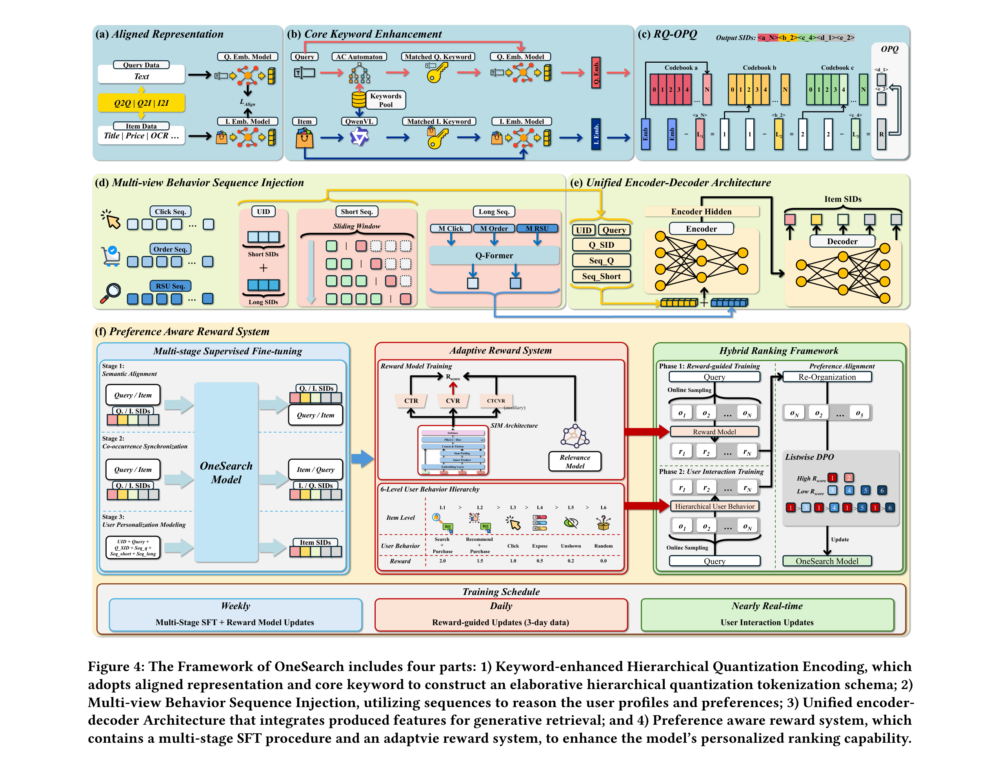

# OneSearch: A Preliminary Exploration of the Unified End-to-End Generative Framework for E-commerce Search

- **日期**：2025-10-22
- **来源**：arXiv 2509.03236v5
- **作者**：Ben Chen, Xian Guo, Siyuan Wang, Zihan Liang, Yue Lv, Yufei Ma, Xinlong Xiao, Bowen Xue, Xuxin Zhang, Ying Yang, Huangyu Dai, Xing Xu, Tong Zhao, Mingcan Peng, Xiaoyang Zheng, Chao Wang, Qihang Zhao, Zhixin Zhai, Yang Zhao, Bochao Liu, Jingshan Lv, Xiao Liang, Yuqing Ding, Jing Chen, Chenyi Lei, Wenwu Ou, Han Li, Kun Gai
- **发表**：arXiv 预印本（快手技术）

---

## 缺口：漏斗的诅咒

电商搜索系统几十年来走的是"粗到细"的多级级联架构（MCA）：召回 ~10^9 → 精排 ~10^4 → 排序 ~10^2。每一级用不同模型、不同特征、不同目标。这套架构算力可控，但带着两个内生顽疾：**碎片化计算**和**目标冲突**。

碎片化计算指的是大部分在线算力花在了通信、存储、特征获取上，真正做数值计算的比例极低（MFU 仅 3.26%）。目标冲突更致命：召回/粗排要"全"，排序要"准"，一个用户真正想要的商品如果在前两级被误杀，后面再精也回不来了。论文里做了一个实验：只保留召回和粗排、去掉排序，订单量直接暴跌 39.14%。这说明排序很重要，但也侧面印证了漏斗的脆弱性。

生成式检索（GR）在推荐和广告领域已经有了工业级落地（OneRec、EGA），但电商搜索迟迟没有，原因在于三个独特挑战：商品标题冗长且噪声大（卖家堆砌无关关键词）、搜索强相关性约束（query 2-3 个词，属性一个不匹配就是问题）、用户潜在搜索意图难推断。纯语义 ID 建模会丢失核心属性，推荐场景那种"闭词汇表生成"在搜索上行不通。

## 增量：用一个模型替代整个漏斗

OneSearch 让我们知道了：**电商搜索可以不做多级过滤，直接用生成式模型端到端输出商品列表，同时在 CTCVR 上显著超越传统 MCA。** 具体来说，+3.22% 订单量、+2.40% 买家数、OPEX 降低 75.40%、MFU 从 3.26% 提升到 27.32%。这是首个工业部署的电商搜索端到端生成式框架。

## 核心机制图



上图是 OneSearch 完整框架，包含四个核心组件。下面用逻辑速写图拆解其内部流转：

```
┌──────────────────────────────────────────────────────────────────────┐
│                      OneSearch 端到端框架                            │
│                                                                      │
│  ┌─ KHQE 编码 ─────────────────────────────────────────────────┐    │
│  │  Query/Item → BGE蒸馏+协同对齐 → 关键词增强 → RQ-Kmeans    │    │
│  │      层级编码(共享语义) + OPQ独立编码(个体属性) = RQ-OPQ SID  │    │
│  └───────────────────────────┬─────────────────────────────────┘    │
│                              ↓ SIDs                                  │
│  ┌─ Mu-Seq 多视角注入 ────────────────────────────────────────┐    │
│  │  UID: 短序列加权衰减∑ → 长序列加权∑ → 拼接为用户ID(10位)  │    │
│  │  显式: 短行为(近clicks/queries) → Prompt文本输入             │    │
│  │  隐式: 长行为(click/order/RSU) → RQ质心聚合 → Q-Former压缩  │    │
│  └───────────────────────────┬─────────────────────────────────┘    │
│                              ↓                                       │
│  ┌─ 统一 Encoder-Decoder ─────────────────────────────────────┐    │
│  │  Encoder: [UID | Query | Q_SID | Seq_q | Seq_short | Seq_long_emb] │
│  │  Decoder: Beam Search → Item SIDs (512路)                    │    │
│  └───────────────────────────┬─────────────────────────────────┘    │
│                              ↓ 候选列表                              │
│  ┌─ PARS 偏好感知奖励 ────────────────────────────────────────┐    │
│  │  训练: 3阶段SFT(语义对齐→共现同步→个性化)                    │    │
│  │       + 自适应奖励(Listwise DPO) + 用户交互反馈              │    │
│  │  奖励: SIM三塔(CTR/CVR/CTCVR) + 相关性放大(10×权重)          │    │
│  │  层级: 搜索购买(2.0) > 推荐购买(1.5) > 点击(1.0)             │    │
│  │       > 曝光未点(0.5) > 同类未展(0.2) > 随机(0.0)           │    │
│  └──────────────────────────────────────────────────────────────┘    │
└──────────────────────────────────────────────────────────────────────┘
```

## 核喻：一套印章系统

把 OneSearch 想象成一个**印章目录系统**。

传统 MCA 就像一个图书馆：先在百万册书中粗筛（召回），再在万册中细选（粗排），最后在百册中精读（排序）。问题在于，粗筛时你只用书名，细选时加了作者，精读时才看摘要。如果你要的书在粗筛时因为书名不响就被扔了，后面再也找不回来。

OneSearch 的做法是给每本书刻一枚**复合印章**。印章有多层：顶层是类目大章（"文学"），中层是子类章（"现代小说"），底层是独立编号章（每本书唯一的属性码）。KHQE 就是这套印章的刻制工艺：RQ-Kmeans 刻层级共享部分，OPQ 刻每本书的独有特征。而关键词增强相当于在印章上额外描红核心词（品牌、颜色、型号），确保"红色圆领衬衫"不会被印章模糊成泛泛的"衬衫"。

Mu-Seq 则是给每位读者建一份**阅读偏好档案**：档案封面是你的 ID 编号（由你最近和历史上读过的书的印章加权组成），档案正文是你最近在读什么（显式短序列），档案附注是你长期偏好的隐含画像（Q-Former 压缩的长序列）。

PARS 是一位**审稿人**，拿着六档评分标准（从"买了"到"完全不相关"），对生成的书单做排序校准。它不仅看点击率，还用 CTCVR（点击后转化率）来避免"看着好但不买"的陷阱，并用 10 倍放大的相关性权重确保搜索的基本约束不被突破。

## 关键概念费曼讲解

### 概念一：KHQE — 为什么单纯用语义 ID 在电商搜索上行不通

语义 ID（SID）是生成式检索的基础：把每个商品编码成一串离散 token，模型就像生成句子一样生成商品 ID。推荐场景这么做效果不错，因为推荐是"闭词汇表"，输入输出都是商品，纯语义 ID 的层级编码足以表达"这类视频你可能会看"。

但电商搜索不一样。搜索有**强相关性约束**：用户搜"银色戒指"，你不能推"金色戒指"，属性差一个字就不行。而传统 RQ-VAE / RQ-Kmeans 的问题是：它们只编码商品间的**共享特征**（同类商品前面的 SID 一样），却丢掉了每个商品的**独有属性**（品牌、颜色、型号等）。结果就是很多相似但不同的商品共用同一个 SID，模型分不出来。

KHQE 的解法是**双轨制**：RQ-Kmeans 负责层级共享语义（大章→中章→小章），OPQ 负责每个商品的独有特征（独立编号章）。关键词增强是在编码前把核心属性词（18 类 NER 抽取：品牌、颜色、材质、风格等）"描红"，让它们在 embedding 空间中权重更高。这样一来，"红色圆领衬衫"和"蓝色 V 领衬衫"在 RQ 层可能共享前缀（都是衬衫），但在 OPQ 层就有不同的独立编码，不会混淆。

实验数据很说明问题：RQ-OPQ 的独立编码率（ICR）从 RQ-Kmeans 的 68.08% 跃升到 91.91%，Recall@10 从 0.2844 提升到 0.3369。

### 概念二：Mu-Seq — 三个视角看用户

传统 MCA 的排序模型用用户行为序列时，是把几千条历史行为拼接成一个超长向量喂给浅层网络。OneSearch 换了三个视角：

**UID 视角**：用户 ID 不是随机分配的哈希值（Tiger 的做法被证明无效），而是由用户最近点击过的商品 SID 和长期行为 SID 加权求和组成。这样每个用户的 ID 本身就编码了行为偏好，长度固定为 10 个 token。

**显式视角**：最近的搜索 query 和点击商品 SID 直接拼进 prompt。这就像给模型看"你昨天搜了什么、买了什么"。短序列还做了滑动窗口增强：从空序列开始，逐步添加行为，让模型学会"只有一条历史时该怎么推荐"。

**隐式视角**：长期行为（点击、下单、RSU 三种序列）太长了（可达 10^3），不可能全塞进 prompt。OneSearch 的做法很巧妙：先找到每个商品在 RQ-Kmeans 中每层的聚类中心向量，然后把同层的质心向量分别求和，得到三个压缩后的行为表示，再用 Q-Former 进一步压缩成一个隐式向量。这样既保留了不同层级的语义信息，又大幅节省了资源。

消融实验证实三个视角都有用：去掉短序列 HR@350 下降 3.79%，去掉长序列下降 2.26%，去掉 UID 下降 1.33%。

### 概念三：PARS — 六档评分与混合排序

生成式模型训练出来后，怎么让它排得更好？OneSearch 没有简单套用 GRPO，而是设计了**两阶段对齐**。

第一阶段用奖励模型。奖励模型基于 SIM（Search-based Interest Model）三塔架构，分别预测 CTR、CVR、CTCVR。关键设计是**自适应加权奖励信号**：用户行为被分为六档——搜索购买（2.0）、推荐购买（1.5）、点击（1.0）、曝光未点（0.5）、同类未展（0.2）、随机（0.0）。分数还要用校准后的 CTR 和 CVR 做自适应调整，避免曝光偏差。相关性得分被 10 倍放大，保证搜索的基本约束。用这个奖励模型对 OneSearch 输出做重排，取排序发生变化的样本做 Listwise DPO 训练。

第二阶段用**真实用户交互数据**做持续学习，尽量接近流式更新。这突破了奖励模型的天花板（奖励模型是 MCA 训练的，所以 OneSearch 最多跟 MCA 打平），让生成式模型有可能超越传统系统的排序能力。

在线 A/B 测试验证了这个设计的有效性：纯 OneSearch 已与 MCA 打平，加上奖励模型选择后，CTCVR 提升 1.78%，订单量提升 3.22%。

## 餐巾纸速写

```
  以前（MCA）                          现在（OneSearch）
  ┌─────────┐
  │ 召回 10⁹ │──→ 碎片化计算
  ├─────────┤     目标冲突
  │ 粗排 10⁴ │──→ 漏斗误杀不可逆
  ├─────────┤     MFU 3.26%
  │ 排序 10² │──→ OPEX 100%
  └─────────┘

       ↓ 位移方向 ↓

  ┌─────────────────────────────┐
  │ OneSearch 端到端生成         │
  │ Query + Behavior → Item List │
  │                              │
  │ KHQE: 关键词增强+RQ-OPQ     │  统一目标
  │ Mu-Seq: 三视角用户建模       │  无漏斗误杀
  │ PARS: 六档自适应奖励对齐     │  MFU 27.32%
  │                              │  OPEX 24.6%
  └─────────────────────────────┘
```

位移的核心：从"多级漏斗逐步淘汰"到"一次生成直接命中"。关键不是去掉漏斗这么简单，而是通过 KHQE 解决搜索特异性的编码问题、Mu-Seq 弥补生成式模型缺乏特征工程的短板、PARS 在排序质量上追赶甚至超越传统系统。

## 启发

**对我有触动的点：**

1. **OPQ 补 RQ 之短**。纯层级编码（RQ-Kmeans / RQ-VAE）丢掉了个体差异性，这在推荐里影响不大（反正推同类视频也行），但在搜索里是致命的。OPQ 的"横向编码"思路让我想到：任何层级化表征都有"共享信息"和"独有信息"的张力，RQ 管"共性"、OPQ 管"个性"，这个组合思路可以迁移到其他需要离散化编码的场景（比如用户画像 tokenization）。

2. **行为序列构造 UID**。随机哈希 UID 被证明无效，而用行为序列加权求和构造 UID 更有效。这提示我：在生成式推荐/检索中，用户的"身份"应该是行为驱动的而非随机分配的，ID 本身就应该承载语义。

3. **两阶段对齐的天花板突破**。奖励模型来自 MCA 的排序模型，所以 OneSearch 用奖励模型训练只能逼近 MCA 的上限。但第二阶段用真实用户交互数据做持续学习，实际上是在用 OneSearch 自己的在线反馈来超越 MCA。这是一个 bootstrapping 的思路：先用旧系统教新系统，再让新系统自我进化。

4. **冷启动意外地好**。OneSearch 对冷启动商品和用户的 CTR 提升分别为 +3.31% 和 +2.50%，高于热启的 +2.34% 和 +1.11%。这说明端到端生成式模型的语义理解和推理能力确实有助于处理长尾和冷启动问题，MCA 的特征工程在长尾上反而更弱。

**存疑的点：** 论文用的是 BART-B 作为基座（参数量至少是 BART 的 100 倍），但没有公开具体参数量。OPQ 的独立编码率虽然高达 91.91%，但 Recall@10 (0.3369) 仍低于 OnlineMCA (0.3440)，只有加上了完整的自适应奖励系统后才在 Recall@350 上超越。这说明 KHQE 编码本身还没有完全弥补离散化的信息损失，PARS 在实际效果中扮演了更关键的角色。
