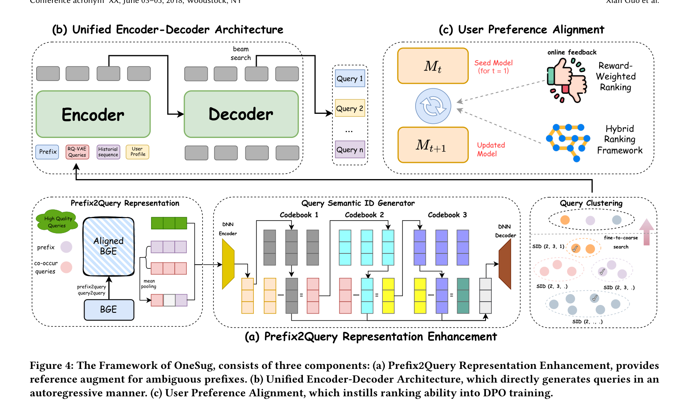

# OneSug: The Unified End-to-End Generative Framework for E-commerce Query Suggestion

- **日期**：2025-06-07
- **来源**：arXiv 2506.06913
- **作者**：Xian Guo*, Ben Chen*†, Siyuan Wang, Ying Yang, Chenyi Lei, Yuqing Ding, Han Li
- **发表**：AAAI 2026（快手技术）

---

## 缺口：级联漏斗吃掉了多少好 query？

电商搜索的 Query Suggestion 模块（你输入"smart"，它补全"smartphone value for money ranking"）沿用了一套已经统治行业十余年的多阶段级联架构（MCA）：召回→粗排→精排，从 10⁸ 个候选 query 一路筛到 16 个展示位。这套架构的致命缺陷不在任何单一阶段，而在**阶段之间的信息断裂**——

1. **上游决定下游上限**：召回阶段用轻量模型（BGE）筛掉大量候选，好 query 在第一关就被丢弃，精排再强也无力回天。
2. **优化目标不一致**：召回优化 recall，粗排优化 pre-ranking AUC，精排优化 CTR。三个 loss 各自为战，系统整体是局部最优而非全局最优。
3. **长尾 prefix 无解**：传统方法依赖 prefix-query 共现统计，对于从未出现过的 prefix 直接哑火。

更深层的问题是：Query Suggestion 和视频推荐有一个本质差异——**它是 open-vocabulary 的**。视频推荐的输入输出都是确定 item（closed-vocabulary），可以用 SID 直接编码；而 query suggestion 的输入是用户敲的半截词（prefix），输出是任意长度的 query 文本。这意味着 OneRec 那套 session-wise 生成 + SID 编码的范式无法直接迁移。

## 增量：一个模型干掉三条流水线，还更快

OneSug 证明了：**在电商 Query Suggestion 场景，一个端到端生成模型可以同时替代召回、粗排、精排三个阶段，且在线效果更优、延迟更低。** 具体地，OneSug 在快手电商平台全流量上线超过一个月，相比在线多阶段级联系统实现了 CTR +2.01%、Order +2.04%、Revenue +1.69%，同时系统响应时间降低 43.21%。

## 核心机制图



上图展示了 OneSug 的三模块架构：(a) Prefix2Query 表示增强模块，用语义和交互相关的 query 丰富短 prefix 的表示，并通过 RQ-VAE 生成层级语义 ID 实现高效聚类检索；(b) 统一 Encoder-Decoder 架构，将 prefix、增强 query、历史序列、用户画像一次性编码后自回归生成 query；(c) 用户偏好对齐模块，用六级行为反馈构造加权偏好对，通过 DPO 让生成模型获得排序能力。

下面用我的方式重画内部逻辑：

```
┌──────────────────────────────────────────────────────────────┐
│                    OneSug 端到端管线                          │
│                                                              │
│  ┌─── PRE 模块 ───────────────────────────────────────┐      │
│  │ "smart" ──→ Aligned BGE ──→ RQ-VAE ──→ SID(2,3,1) │      │
│  │              ↑ 对齐训练      ↑ 量化       ↑ 聚类检索 │      │
│  │   co-occur queries     层级码本      fine-to-coarse │      │
│  │   prefix2query对       4层×512        top-k queries  │      │
│  └────────────────────────┬────────────────────────────┘      │
│                           │ 增强的prefix表示 + 关联queries   │
│                           ▼                                   │
│  ┌─── 统一 Encoder-Decoder ───────────────────────────┐      │
│  │ Encoder: [CLS] prefix [SEP] H_p [SEP] H_u [SEP] U  │      │
│  │                    ↓ cross-attention ↓              │      │
│  │ Decoder: auto-regressive → Query 1, Query 2, ...    │      │
│  │         (beam search, size=32)                       │      │
│  └────────────────────────┬────────────────────────────┘      │
│                           │ seed model M_t                    │
│                           ▼                                   │
│  ┌─── 用户偏好对齐 (RWR + DPO) ──────────────────────┐      │
│  │ 六级行为: Order > ItemClick > Click > Show > NotShow > Rand │
│  │ 加权奖励: r = λ·e^{p_i}, λ ∈ [2.0, 1.5, 1.0, 0.5, 0.2, 0.0] │
│  │ 九种正负对: <Order,Show>, <Click,Rand>, ...         │      │
│  │ 偏好差距: rw_Δ = 1/(r_w - r_l), 越小越难区分      │      │
│  │                                                      │      │
│  │ Pair-wise DPO (带 margin δ):                        │      │
│  │   L = -E[log σ(rw_Δ · max(0, r̂_w - r̂_l - δ))     │      │
│  │        + α log π_θ(q_w|x_u)]                        │      │
│  │                                                      │      │
│  │ List-wise DPO (一对多):                              │      │
│  │   L = -E[log σ(-log Σ exp(rw_Δ · max(0, r̂_l - r̂_w - δ)))│
│  │        + α log π_θ(q_w|x_u)]                        │      │
│  └──────────────────────────────────────────────────────┘      │
│                                                                │
│  在线部署: OneSug_{Bart-B} (beam=32) → 16 queries             │
└──────────────────────────────────────────────────────────────┘

对比传统 MCA:
  召回(BGE) → 粗排(DCN) → 精排(DIN)    ← 三阶段, 三模型, 三目标
  OneSug Encoder → Decoder              ← 一阶段, 一模型, 一目标
```

## 白话方法：一个"速记员+参谋"的合体

想象一个传统公司：你要找一份合适的供应商，得先让实习生（召回）从全城 1 万家里面粗筛出 100 家，再让经理（粗排）选出 10 家，最后让总监（精排）拍板 3 家。每层只看自己关心的指标，实习生选人看地理位置，经理看价格，总监看口碑。问题是：实习生可能在第一轮就把口碑最好但位置稍偏的那家丢了，总监根本没机会看到它。

OneSug 的做法是：**把实习生、经理、总监换成一个"全能顾问"**。这位顾问做三件事：

1. **理解你说啥**（PRE 模块）：你说"苹果"，他不会只想到水果，而是通过查看跟你类似的人搜过什么 query，知道你可能想买 Apple 手机。他先把"苹果"这个模糊需求翻译成一组"你可能想要什么"的参考清单。
2. **直接给你答案**（Encoder-Decoder）：全能顾问一次性综合你的需求、历史偏好、画像，直接给出 16 个推荐 query。不需要层层筛选，不存在中间丢人的问题。
3. **学会你更喜欢什么**（RWR + DPO）：顾问还会根据你最终的选择反馈调整自己的推荐优先级。不是简单的"你点了=好的，没点=坏的"，而是区分六种行为层级：下单>点商品>点query>展示>未展示>随机。同一层级内也有频次加权，让你最常点的排在最前面。

## 关键概念

### 概念一：Prefix2Query Representation Enhancement（前缀→查询表示增强）

电商场景的用户输入通常极短——一个字、两个字。比如"苹果"可以指水果也可以指手机品牌。传统方法只用 BERT/BGE 编码 prefix 本身，语义表示严重不足。

OneSug 的 PRE 模块做了两件事：**对齐**和**量化检索**。对齐是指：先用 ItemCF/Swing 等协同过滤模型从用户行为日志中挖掘出高质量的 prefix2query 和 query2query 对，再用这些对微调 BGE，让它从"懂中文语义"变成"懂电商检索意图"。量化检索是指：对齐后的 BGE embedding 通过 RQ-VAE 生成 4 层×512 的层级语义 ID（SID），推理时用 SID 做 fine-to-coarse 聚类搜索，把计算复杂度从全量匹配降到聚类内匹配。

一个具体的例子：用户输入"苹果"，对齐后的 BGE 不仅编码了"苹果"的语义，还通过 RQ-VAE 的 SID 找到了"iPhone 16 Pro Max"和"苹果烟台红富士"这两类相关 query，把它们作为增强信息喂给下游生成模型。

### 概念二：Reward-Weighted Ranking（奖励加权排序）

DPO 的核心思想是让模型偏好高奖励样本、厌恶低奖励样本。但传统 DPO 只做二元对比（chosen vs rejected），无法捕捉用户行为的细粒度差异。

OneSug 的 RWR 策略把用户行为分成了六个层级，从 Order（下单）到 Rand（随机），每级有不同的基础权重 λ。关键设计是**偏好差距 rw_Δ = 1/(r_w - r_l)**——两个样本的行为层级越接近（比如 Click vs Show），rw_Δ 越大，模型需要花更大力气区分它们。这解决了一个真实痛点：区分"下单"和"随机"很容易，但区分"点击 query"和"展示但未点击"才是提升排序质量的核心战场。

此外，OneSug 把 pair-wise DPO 扩展为 list-wise DPO（一个正样本对多个负样本），配合 margin loss 确保正样本的奖励至少比负样本高 δ。实验证明 list-wise 比 pair-wise 在在线指标上额外提升 CTR +0.23%、Order +0.07%、Revenue +0.20%。

### 概念三：Open-Vocabulary 生成式 Query Suggestion

视频推荐（OneRec）的输出是 item ID（closed-vocabulary），可以用 SID 编码后直接生成。Query Suggestion 的输出是任意文本（open-vocabulary），无法预先编码所有可能 query。这意味着 OneSug 必须用纯文本输入输出，beam search 生成的是 token 序列而非 SID 序列。这个差异看似简单，实则决定了整个系统设计：PRE 模块用 SID 做检索索引（离线），但生成模型直接输出文本 token（在线），两套编码体系各司其职。

## 餐巾纸速写：从"漏斗"到"直管"

```
以前（MCA）：                     现在（OneSug）：

  10⁸ candidates                   prefix + context
       │                                │
  ┌────▼────┐                     ┌─────▼─────┐
  │  召回    │ ← 轻量模型          │ PRE 增强   │ ← SID聚类检索
  │(BGE)    │ ← 优化recall        │(对齐+量化) │
  └────┬────┘                     └─────┬─────┘
       │ 10⁴                            │
  ┌────▼────┐                     ┌─────▼─────┐
  │ 粗排    │ ← 中等模型          │ Encoder-   │ ← 统一编码
  │(DCN)    │ ← 优化pre-AUC      │ Decoder   │ ← 自回归生成
  └────┬────┘                     │(BART/mT5/ │
       │ 10²                       │ Qwen2.5)  │
  ┌────▼────┐                     └─────┬─────┘
  │ 精排    │ ← 重型模型                │
  │(DIN)    │ ← 优化CTR          ┌─────▼─────┐
  └────┬────┘                     │ RWR + DPO │ ← 行为级偏好对齐
       │ 16                      │(SFT→DPO)  │
       ▼                          └─────┬─────┘
  展示 queries                           │ 16
                                         ▼
                                    展示 queries

  三阶段, 三模型, 三目标            一阶段, 一模型, 一目标
  信息逐层丢失                      信息无损传递
  延迟 = 召回+粗排+精排             延迟 = 一次生成
  长尾prefix = 无解                 长尾prefix = PRE增强
```

## 实验：离线碾压，在线真金

**离线实验**（快手电商搜索日志，1亿PV，30天训练+2天测试）：

| 方法 | Click HR@16 | Click MRR | Order HR@16 | Order MRR |
|------|-------------|-----------|--------------|-----------|
| MCA (BGE+DCN+DIN) | 73.89% | 39.95% | 80.71% | 44.03% |
| onlineMCA (真实在线) | 78.61% | 45.97% | 84.55% | 51.85% |
| GRA_SFT | 73.16% | 40.06% | 79.25% | 44.28% |
| GRA_DPO | 75.50% | 41.19% | 81.68% | 45.30% |
| **OneSug_Bart-B** | **82.14%** | **50.55%** | **87.40%** | **56.34%** |
| OneSug_Qwen2.5-3B | 93.37% | 66.31% | 95.13% | 67.40% |

OneSug_Bart-B 超越 onlineMCA（使用数百特征的多召回复杂系统）4.54% MRR。Qwen2.5-3B 版本更是拉开 17.95% 的 MRR 差距。

**消融实验**验证了每个模块的贡献：
- PRE + RWR + list-wise = 完整 OneSug：HR@16=82.14%, MRR=50.55%
- 去掉 list-wise 换 pair-wise：HR@16 -2.52%, MRR -3.23%（多样负样本帮助模型快速学习行为差异）
- 去掉 RWR：HR@16 -2.38%, MRR -5.75%（行为级加权是排序能力的关键来源）
- 去掉 PRE：HR@16 -3.68%, MRR -2.30%（prefix 表示增强对长尾 query 尤其重要）
- 去掉 PRE + RWR = GRA_SFT：HR@16=73.16%, MRR=40.06%（回到基线水平）

**在线 A/B 测试**（快手电商平台全流量，超过1个月）：

| 指标 | OneSug_list-wise |
|------|-------------------|
| 平均输入长度 (IPL) | -1.82% |
| 用户首次点击位置 (TCP) | **-9.33%** |
| CTR | **+2.01%** |
| 订单量 (Order) | **+2.04%** |
| 收入 (Revenue) | **+1.69%** |
| 系统响应时间 | **-43.21%** |

其中长尾 prefix 的 CTR 增益（+3.59%）远大于头部 prefix（+1.15%），验证了 PRE 模块对稀疏 prefix 的增强效果。

**模型更新实验**：OneSug 不日更时的性能衰减（-0.6%）远小于 onlineMCA（-1.1%），用近三天数据只更新 DPO 阶段即可维持有效迭代，工程成本极低。

**特征工程实验**：ID-based 特征（User ID, Prefix ID 等）会严重干扰 OneSug，因为无意义的 ID 会破坏文本序列的语义。Target-aware 和 list-wise 特征需要精心设计的 prompt 才能有效注入，过多会适得其反。

## 启发：端到端生成不只是推荐的事

OneSug 对我的启发有三层：

1. **Open-vocabulary 是生成式检索的新战场**。目前生成式检索/推荐的工作几乎都围绕 closed-vocabulary（item ID）展开。OneSug 证明，在 open-vocabulary 场景（Query Suggestion、广告文案生成等），端到端生成同样可行，甚至收益更大——因为级联架构在 open-vocabulary 场景的信息损失更严重（文本召回比 item 召回更容易丢好候选）。

2. **行为级偏好建模比奖励模型更实用**。OneRec 用 CTR 预估模型做 reward model，需要数百个特征，训练成本高且存在 online data偏差。OneSug 直接用在线系统的六级行为反馈构造偏好对，零额外训练成本。这个思路对任何已有在线系统的团队都可直接复用——你的系统日志就是最好的偏好标注。

3. **SID 的使用方式可以拆分**。OneSug 把 SID 用在离线检索（PRE 模块的 RQ-VAE 聚类搜索），但在线生成走纯文本 token。这个"离线 SID 检索 + 在线文本生成"的双轨设计是一个值得借鉴的模式——SID 的价值不一定在生成端，在检索端同样可以发挥层级量化的优势，同时避免 open-vocabulary 场景下 SID 编码所有可能输出的问题。
