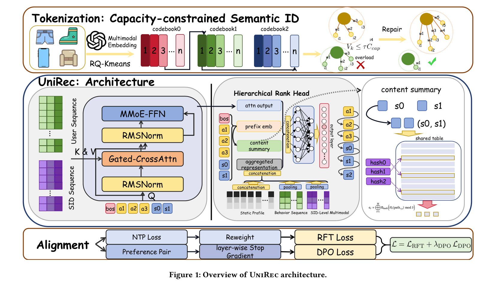

# UniRec: Bridging the Expressive Gap between Generative and Discriminative Recommendation via Chain-of-Attribute

- **日期**：2026-04-30
- **来源**：https://arxiv.org/pdf/2604.12234
- **作者**：Ziliang Wang, Gaoyun Lin, Xuesi Wang, Shaoqiang Liang, Yili Huang, Weijie Bian, Li Zhang, Mingchen Cai, Jian Dong, Guanxing Zhang（Shopee）
- **发表**：arXiv 预印本（投稿 Conference '26，疑似 SIGIR/CIKM 工业赛道）

---

## 缺口：生成式推荐被诟病的「表达力天花板」，到底是真墙还是假墙？

生成式推荐（GR）这两年风很大。TIGER 开了头，OneRec、OneMall、OneSearch 一路把"召回→粗排→精排→重排"这条多阶段判别式漏斗压成一个自回归解码模型。好处显而易见：阶段间目标不再打架、不再有样本选择偏差、误差不再沿漏斗逐级放大。Shopee 自己的线上数据也佐证了这一点——UniRec 端到端延迟 110ms，而传统多阶段流水线要 266ms。

但生成式推荐头上一直压着一句质疑：**它的表达力天生比判别式模型低。** 判别式排序模型打分用的是 `p(y | f, u)`，`f` 是 item 的特征向量，模型能直接做 user×item 的显式特征交叉；而生成式模型解码的是压缩过的 SID token 序列 `∏ p(s_l | s_<l, u)`，在生成路径上**根本看不到 item 侧的任何信号**——它必须在没见到目标 item 特征之前就把生成路径定下来。更要命的是推荐天然是一对多映射：同一段用户行为序列可能对应多个合理的目标 item，这种不确定性在语言模型里不存在（语言里上文基本决定下一个 token），却在推荐里被放大成训练冲突。

于是缺口被精确地框出来了：**这道表达力的差距，到底是建模范式的结构性缺陷（真墙，怎么努力都翻不过），还是仅仅工程实现上的特征覆盖不全（假墙，补上就行）？** 此前没人从理论上回答过这个问题。GRACE 这篇工作虽然也试过"在 SID 前面拼 attribute token"，但它把这当成一个纯经验设计，没给任何理论依据。

## 增量：用贝叶斯公式证明那道墙是假墙，再用 Chain-of-Attribute 把缺的特征补回生成轨迹

UniRec 的核心增量可以浓缩成一句话：**它用贝叶斯定理证明了生成式与判别式推荐的表达力上界相等，差距只来自特征覆盖，并提出 Chain-of-Attribute（CoA）在生成轨迹里把 SID 压缩丢掉的 item 属性补回来。**

这个证明很漂亮，也很简单。判别式打分 `p(y | f, u)`，按贝叶斯展开：

```
p(y | f, u) ∝ p(f | y, u) · p(y | u)
```

`p(y | u)` 与 `f` 无关，所以**按判别式分数排序，等价于按生成式后验 `p(f | y, u)` 排序**。而 `p(f | y, u)` 用链式法则一拆：

```
p(f | y, u) = ∏ₖ p(f_k | f_<k, y, u)
```

这恰好就是对 item 特征做自回归解码。结论随之而来：**一个能访问完整 item 特征 `f` 的生成模型，表达力与判别式模型完全等价。** 那道墙是假的。任何实际差距，只来自近似能力或特征覆盖，而不是建模范式本身。

可是把 item 的全部特征都做自回归解码，延迟扛不住。GR 才用 SID 把丰富语义压成紧凑离散码——这一压缩是有损的，taxonomy、seller、brand 这些判别式模型靠显式交叉吃饭的结构化属性，被折叠进 SID 码里、解码时变成了隐变量。CoA 的做法就是：**在 SID 序列前面拼上 m 个粗粒度属性 token（category、seller、brand），先 speculate（预测属性）再 refine（条件生成 SID）：**

```
p(s | u) = p(a | u) · ∏ p(s_l | a, s_<l, u)
```

它不是把全部特征都解码（那回到了延迟不可行的方案），而是**选择性地把 SID 压缩时丢得最狠的那几个粗粒度属性补回来**，代价只是固定 m 步额外解码。

## 核心机制图：speculate-then-refine 的解码轨迹

论文 Figure 1 给出了 UniRec 的整体架构总览，自上而下三个模块：容量受限的 Semantic ID 分词（Tokenization）、UniRec 主体架构（用户侧双塔 + 层级排序头 + Content Summary）、以及对齐损失（RFT + DPO）。



下面这张速写图把上图中部「解码轨迹」的核心逻辑抽出来，单独画清 speculate-then-refine 的每一步：

```
                  ┌─────────────────────── 用户侧 ───────────────────────┐
                  │  静态画像 hstatic   行为序列 Hseq   SID级多模态 Hmm     │
                  └───────────────────────────┬──────────────────────────┘
                                              │  (作为 Cross-Attn 的 K/V)
                                              ▼
   解码侧 Query：  [ BOS_task | a₁ a₂ ... a_m | s₀ s₁ s₂ ]
                     ▲          ▲                ▲
                     │          │                │
            Task-Cond BOS   CoA 属性链        SID token
            (告诉模型      (先 speculate     (再 refine
             在解谁的任务)   category/seller/   条件生成)
                            brand)
                                              │
                  ┌───────────────────────────┼──────────────────────────┐
                  │           每一步喂给 Rank Head 的输入 x_t：              │
                  │   [ Cross-Attn 输出 q_t | prefix emb | Content Summary │
                  │     c_t（hash 组合特征）| 聚合表示 hagg ]              │
                  │              ↓ SENet + MaskNet                         │
                  │     p(s_t | s_<t, u, c_task) = Softmax(g⁽ᵗ⁾(x_t))      │
                  └───────────────────────────────────────────────────────┘
                                              │
                      训练： NTP ──→ RFT（按GMV价值重加权）
                                  └─→ DPO（购买>点击>曝光，对比对齐）
```

整套架构是 Decoder-Only + Cross-Attention 到用户行为序列 + 逐步 Rank Head。三个工程贡献撑起了"能上线"：

**Capacity-constrained SID（治马太效应）。** 标准 RQ-KMeans 只约束每簇的 item 数量相等，但 item 热度是长尾的——即使每簇 item 数一样，少数高流量 item 也会霸占其码本条目的曝光。Shopee 生产数据触目惊心：top 10% 的 `(s₀, s₁)` 组合吃掉了 **87.9%** 的曝光，相比 s₀ 单层的 33.2% 放大了 2.6 倍。这种「世袭马太效应」让 decoder 把概率质量全压在一小撮 token 路径上。UniRec 在残差量化里引入**曝光加权的容量惩罚**：每簇的曝光负载 `V_k = Σ w_i`，强制 `V_k ≤ τ·C_cap`（τ=1.05），用「先按最近邻分配、再把超载簇的样本挪到最近的欠载簇」的两阶段贪心修复。效果：三层 SID 上 top-1% token 的曝光占比从 RQ-KMeans 的 57.33% 砍到 26.04%。

**Conditional Decoding Context（CDC，治多场景冲突）。** 两个零件。其一 **Task-Conditioned BOS**：把固定的 BOS token 换成一个随任务上下文 `c_task` 学习的 embedding，`c_task` 是「行为目标（click/purchase/cart/cross-border）× 推荐场景（main feed/search/similar/flash sale）」的笛卡尔积。一个统一模型服务多场景时，不加显式条件就会目标互相干扰；BOS 在解码起点就把"这是哪个任务"注入，引导整条生成轨迹。其二 **Content Summary**：层级解码里单个 token embedding 抓不住 token 组合的联合语义，而显式存所有 token pair（如两个 4000 词表层 → 16M 条目）会参数爆炸。UniRec 用 Bloom filter 思路——多个 hash 函数共享一张 embedding 表，把已解码路径 hash 进去，相似 attribute-SID 模式自然产生重叠签名，以可控参数注入组合特征。

**RFT + DPO 联合对齐（治分布匹配≠业务目标）。** NTP 只让模型拟合曝光分布。RFT 按连续业务价值（GMV、观看时长）重加权样本：`(1 + λ·Ã_i)` 乘到 NTP loss 上，高价值交易学得更狠。DPO 则注入离散偏好——`购买(2) > 点击(1) > 仅曝光(0)`，在同一 request 内构造偏好对做对比优化。还有个细节叫 **Layer-wise Stop Gradient**：DPO 只更新最后一层 SID 的 Rank Head，前缀（属性 + 前面的 SID 层）全部 stop-gradient，防止 DPO 把作为条件上下文的前缀预测搞乱。

## 白话方法：先报户口，再上门

把生成式推荐想象成一个快递员要把包裹（目标 item）送到对的人手里，但他手上只有一串压缩过的邮编 SID。

**判别式模型**像是手里同时握着完整地址簿：人是谁、东西是什么品类、哪个商家、什么品牌，一目了然，所以投递很准。

**裸生成式模型（TIGER 那种）**像只背了一串邮编就出门：他得在没看到任何商品信息的情况下，先赌一条投递路线（一步步生成 SID token），赌错了一步，后面全歪——这就是误差沿解码链级联放大。

**CoA 的做法是「先报户口，再上门」**：快递员出门前先大声念一遍粗粒度信息——"这是个【母婴】品类、【XX 商家】、【YY 品牌】的包裹"（speculate 属性链），念完之后，由于同品类同商家的商品在 SID 语义空间里本来就挤在相邻区域，他的投递路线一下子就被收窄了（refine 条件生成 SID）。这就是论文里那个**每步熵减** `H(s_k | s_<k, a) < H(s_k | s_<k)` 的直觉：报了户口，每一步的不确定性都下降，beam search 轨迹更稳，级联失败概率 `P'(error) < P(error)`。

核喻承重检验：报户口=属性链 a；上门路线=SID 解码；同品类挤在相邻区=属性与 SID 的结构相关性（熵减成立的前提）；念错户口会送错=属性预测错误也会传导。每个零件都能映射，类比站得住。

## 关键概念费曼讲解

**概念一：每步条件熵减 `ΔH_l = I(a; s_l | s_<l, u) ≥ 0`。**
熵衡量"还有多少不确定"。条件熵 `H(s_l | s_<l, a)` 是"已知前缀和属性后，第 l 步还剩多少不确定"。论文证明：加了属性 a 之后的熵，永远不大于不加属性的熵，差值恰好等于属性和 SID token 之间的**互信息** `I(a; s_l)`。只要 a 和 s_l 不是条件独立的（实际中成立，因为同品类商品的 SID 本来就相关），这个差值就严格为正。举个例子：让你猜一个商品的 SID 第二位，如果只告诉你第一位 token，你可能要在 4000 个里猜；但如果先告诉你"它是手机壳品类"，候选立刻塌缩到几十个——这几十比四千的不确定性落差，就是熵减。

**概念二：世袭马太效应（hereditary Matthew effect）。**
马太效应是"强者愈强"。在层级 SID 里它会**遗传**：第一层 s₀ 的轻微不均（top 10% 占 33%），到了 `(s₀, s₁)` 组合层就被放大成极端集中（top 10% 占 88%）。因为高频路径在训练数据里反复出现，模型就反复生成这一小撮路径，长尾商品永远轮不到。Capacity-constrained SID 就是在量化阶段提前"限流"，用曝光加权而非 item 计数来约束每个码本条目的负载。

**概念三：Content Summary 的 Bloom filter 式 hash 投影。**
想显式建模 token 之间的笛卡尔积交叉（如 category×SID），但组合数爆炸。Bloom filter 的思路是：用多个不同的 hash 函数把一个组合映射到一张共享的小表上，不为每个组合单独开 embedding。论文用了三个 hash：`H₁=x+y`、`H₂=x·y`、`H₃=p₁x+p₂y`（p 是质数），把任意特征对 (x,y) 投影到共享表 `E_hash`。好处是：属性-SID 模式相似的 item 会产生重叠的 hash 签名，模型能借此泛化到相关组合，而参数只有 `M×S×d_hash`，可控。代价是 hash 碰撞会带噪——但对推荐这种容错场景，这点噪声换来的泛化是划算的。

## 餐巾纸速写：思想框架的位移

```
   旧框架（生成式 vs 判别式 = 两个范式）
   ┌───────────────┐        ┌───────────────┐
   │  判别式排序     │        │  生成式推荐     │
   │  p(y|f,u)      │  天生   │  ∏p(s|s,u)     │
   │  有完整特征     │ ≫ 差距 │  只有压缩SID    │
   │  表达力高       │        │  表达力被封顶   │
   └───────────────┘        └───────────────┘
        「差距是范式的结构性缺陷，认命吧」

                    │  贝叶斯定理一推
                    ▼

   新框架（同一个上界，差的只是特征覆盖）
   ┌──────────────────────────────────────────┐
   │   p(y|f,u) ∝ p(f|y,u) = ∏ p(f_k|f_<k,y,u) │
   │   判别式排序 ≡ 对特征做自回归解码           │
   │                                            │
   │   ⇒ 表达力上界相等！差距 = 特征覆盖不全     │
   │   ⇒ 把丢掉的属性补回生成轨迹（CoA）即可补齐 │
   └──────────────────────────────────────────┘
       「不是范式问题，是工程问题——能补」
```

位移的方向：**从「生成式天生不如判别式，认了」→「两者上界本就相等，差距是可工程化弥补的特征覆盖问题」。** 这一步把一个被普遍接受的"宿命论"翻译成了一个"待办清单"。

## 实验：数字撑得住，但 baseline 偏弱

离线在 Shopee main feed 9 天生产日志（数十亿交互记录）上跑。主结果（全样本，0.05B 模型）：

| 方法 | HR@50 | HR@100 | HR@200 |
|------|-------|--------|--------|
| SASRec | 0.421 | 0.489 | 0.556 |
| TIGER | 0.437 | 0.508 | 0.578 |
| OneRec-V2 | 0.438 | 0.523 | 0.587 |
| **UniRec** | **0.537** | **0.618** | **0.688** |

相对最强 baseline（OneRec-V2）HR@50 +22.6%、HR@100 +18.2%、HR@200 +17.2%。在 order（购买）样本子集上提升更猛，HR@50 从 0.582 → 0.672（+9.0 个点）。

CoA 消融（Table 2）是全文最有说服力的一张表：直接生成 SID（无属性）HR@50 只有 0.458，`L2→L3→SID` 的完整属性链达到 0.537，且属性链越深、s₀@3 的命中率越高（从 0.314 拉到 0.682）——直接验证了"报户口收窄搜索空间"的熵减效应。其它消融：去掉 Capacity-constrained SID，HR@50 从 0.537 掉到 0.481；去掉 Task-Cond BOS 掉到 0.493；去掉 Content Summary 掉到 0.485。三个零件各有贡献，且 d_model 从 64→512 单调涨（0.397→0.557），有 scaling 空间。

线上 A/B（20% 流量）：整体 PVCTR +5.37%、订单 +4.76%、GMV +5.60%；延迟 110ms vs 传统流水线 266ms。

## 博导审稿

**选题眼光（值得做吗？）：好。** "生成式推荐表达力天花板"是这个领域真实存在的、被反复念叨却没人正面回答的质疑。用贝叶斯把它从"宿命"降格成"工程问题"，这个 framing 本身就有价值——它给整个 GR 社区一个理论上的定心丸。真缺口，不是人造的。

**方法成熟度（巧劲还是蛮力？）：理论是巧劲，方法偏蛮力。** 贝叶斯那段证明确实漂亮、确实是巧劲，也是本文的灵魂。但落到 CoA 本身——"在 SID 前拼属性 token"——GRACE 已经做过了，作者自己也承认。本文相对 GRACE 的真正增量是"补了理论解释"，而不是"发明了新机制"。Capacity-constrained SID、CDC、RFT+DPO 这三块都是扎实的工程缝合（曝光加权 KMeans、Bloom hash、reward 重加权都是熟料），属于"把对的零件拼对地方"的蛮力活。整篇是一个"漂亮理论 + 工程大杂烩"的组合，理论部分撑起了它的学术身价。

**实验诚意（baseline 公不公道？）：偏宽松。** 这是最该追问的地方。号称 +22.6%，但生成式 baseline 只放了 TIGER 和 OneRec-V2，且都标注成 0.05B 的小模型——没有跟同样塞了 attribute conditioning 的 GRACE 比！全文反复强调"我们和 GRACE 的区别"，消融里却不见 GRACE 的影子，等于回避了最直接的对手。如果 CoA 的机制和 GRACE 几乎一致，那 +22.6% 里有多少是 CoA 本身、多少是 Capacity-SID/CDC/RFT 这些正交模块带来的，读者无从知道。判别式 baseline 只有 SASRec，也偏弱（没有 HSTU/RankMixer/MTGR 这些它在 related work 里点名的工业强 baseline）。线上 A/B 数字（+5.6% GMV）很扎实，这部分可信度高于离线。

**写作功力：理论段优秀，实验段偷懒。** Introduction 和 3.3 节的逻辑链非常顺，贝叶斯推导清爽。但实验章节明显偷了懒：缺 GRACE 对比、缺强判别式 baseline、Table 里几个数字（如 order 样本上的相对增益声称 +15.5% 但表里对不太上）需要读者自己核。图 1/2/3 在 PDF 里排版混乱（虽不影响理解）。

**一句话判决：Weak Accept。** 理论贡献是真亮点，工业落地数据扎实，但"相对 GRACE 的核心增量是事后理论而非新机制" + "消融刻意回避最强对手 GRACE"这两点，让它够不上 Accept。如果补上和 GRACE 的正面消融、以及对 HSTU/MTGR 的对比，可以升到 Accept。

## 启发：照亮了我的哪个盲区

第一个被照亮的盲区：**我一直默认"生成式推荐表达力低于判别式"是个公理，没想过它可以被证伪。** 这篇用一行贝叶斯就把它翻译成"特征覆盖问题"，这个思维动作很值钱——遇到任何"A 范式天生不如 B 范式"的论断，都该先问一句"这是范式的结构性差异，还是某个可补的覆盖问题？"。很多看似宿命的天花板，拆开看其实是工程债。

第二个对我手上工作的直接启发：**CoA 的 speculate-then-refine 范式本质是"用一个便宜的粗粒度预测，去收窄一个昂贵的细粒度搜索空间"。** 这和我在 DIG-v2 里做的检索/生成其实同构——如果先让模型粗预测一个 coarse bucket（类目/聚类），再在 bucket 内做精细 ranking，理论上每步熵减、beam 更稳。这个"先报户口再上门"的两段式，可以直接迁移到任何"大候选空间 + 自回归/检索"的场景，而且它给了一个可度量的指标（每步条件熵减 = 互信息 `I(a; s_l)`）来判断"这个粗粒度预测到底有没有用"——以前我加 coarse prior 全靠拍脑袋，现在有了熵减这把尺子。

第三个反向警示：**Capacity-constrained SID 揭示的"世袭马太效应"是层级 SID 的通病。** 我之前在 DIG 里用 RQ-KMeans 建 SID 时只盯着重构误差和 item 计数均衡，完全忽略了曝光加权——而曝光不均会沿层级遗传放大 2.6 倍。这是个我量化阶段从没检查过的指标，回头应该把 top-k% 曝光集中度画成洛伦兹曲线看一眼，可能我的长尾召回差就坏在这儿。

横向连接：这篇是 Shopee 继 DRQ（诊断框架 + 解耦量化）之后又一篇 SID 方向工作，且 Capacity-constrained SID 和 DRQ 解决的是同一类"量化失衡"病灶——DRQ 治的是码本利用率/有效维度退化，UniRec 治的是曝光集中的马太效应，两者可以互补。CoA 的"属性引导收窄搜索空间"和 CaLIR（北航&美团，类目引导的潜在推理）走的是同一思路，只不过 CaLIR 用隐式潜在推理、CoA 用显式属性 token；和 OneReason（快手，显式 CoT 思考）则形成"显式属性 vs 显式推理"的对照——UniRec 站在"轻量显式属性"这一侧，比 CoT 更适合电商低延迟检索。这条"如何在生成轨迹里注入额外结构化先验"的主线，已经分化出属性链、潜在推理、CoT 三种形态，UniRec 提供了其中理论最干净的一种。