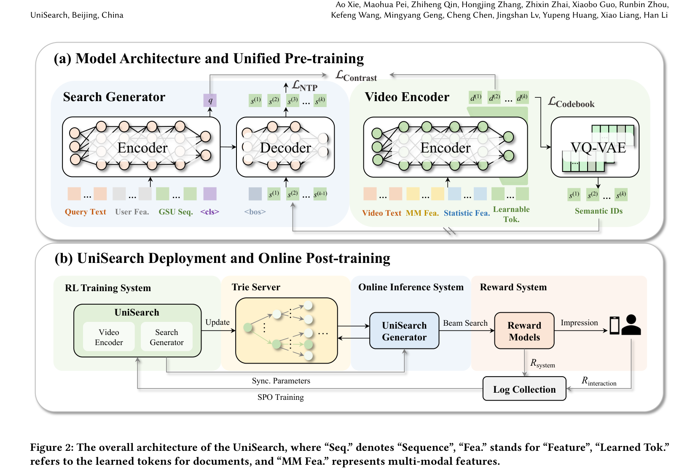

# UniSearch: Rethinking Search System with a Unified Generative Architecture

- **日期**：2025-09-10
- **来源**：arXiv 2509.06887v2
- **作者**：Jiahui Chen, Xiaoze Jiang*, Zhibo Wang, Quanzhi Zhu, Junyao Zhao, Feng Hu, Kang Pan, Ao Xie, Maohua Pei, Zhiheng Qin, Hongjing Zhang, Zhixin Zhai, Xiaobo Guo, Runbin Zhou, Kefeng Wang, Mingyang Geng, Cheng Chen, Jingshan Lv, Yupeng Huang, Xiao Liang, Han Li
- **发表**：arXiv 预印本（ACM 格式，快手）

---

## 缺口：级联搜索的瓶颈与生成式搜索的"伪端到端"

工业搜索走了二十年级联架构：召回→粗排→精排。每个阶段用不同模型、不同目标，级联间信号错位，端到端优化几乎不可能。更致命的是，维护成本和推理延迟随阶段数线性增长。

生成式推荐（OneRec 等）证明了一个模型可以替代整条级联漏斗，但把同样的思路搬到搜索时，大家做的是"伪端到端"：先训练 Embedding 模型做语义编码，再离线聚类（RQ-Kmeans / FSQ / VQ-VAE）生成 Semantic ID，最后训一个 Generator 去预测这些 ID。三个步骤，三个目标，编码器的表征质量与生成器的生成质量互相拖后腿。

搜索场景还比推荐多了一道坎：推荐是"域内映射"（user/item embedding → item），搜索是"跨域生成"（text query → item）。query 是自然语言，item 是多模态视频，语义鸿沟更宽，对表征一致性要求更苛刻。

## 增量：联合训练 Generator + Video Encoder，一个目标统一编码与生成

UniSearch 让 Search Generator 和 Video Encoder 在同一个训练管线里互相增强。Video Encoder 学 item embedding 并用 VQ-VAE 离散化为 Semantic ID，Generator 用 query + 用户特征自回归生成这些 SID。两条支路的梯度流交汇，编码器学到的表征天然适配生成器，生成器的反馈也反哺编码器。加上在线 SPO 偏好对齐和 Trie 约束解码，这套框架在快手直播搜索上线，TPC +3.31%，是快手近年最大单次实验提升。

## 核心机制图



上图是 UniSearch 的双组件架构和统一预训练流程（Figure 2a）。左侧 Search Generator（BART 架构）接收 Query Text + User Features + GSU 行为序列，Encoder 输出 query embedding *q*，Decoder 自回归生成 Semantic ID 序列 s(1)→s(k)。右侧 Video Encoder（BERT 架构）接收 Video Text + 多模态特征 + 统计特征 + Learnable Tokens，输出 k 个 latent embedding d(1)…d(k)，经 VQ-VAE 离散化为 SID。三路损失联合优化：L_Contrast（残差对比学习，query 与 video 对齐）、L_Codebook（VQ-VAE 码本损失）、L_NTP（自回归生成损失）。

```
┌─────────────────────────────────────────────────────────────┐
│                    UniSearch 统一预训练                       │
│                                                             │
│  ┌──────────────────┐         ┌──────────────────┐          │
│  │  Search Generator │         │   Video Encoder   │          │
│  │  (BART Enc-Dec)   │         │   (BERT Uni)      │          │
│  │                    │         │                    │          │
│  │  Query + User     │         │  Video Text + MM   │          │
│  │  Fea + GSU Seq    │         │  Fea + Stat + Tok  │          │
│  │       ↓           │         │       ↓           │          │
│  │  <cls> → q        │←─RCL──→│  d(1)...d(k)      │          │
│  │       ↓           │         │       ↓           │          │
│  │  Decoder → SID    │←─NTP──→│  VQ-VAE → SID     │          │
│  └──────────────────┘         └──────────────────┘          │
│                                                             │
│  L = λ₁·L_Contrast + λ₂·L_Codebook + λ₃·L_NTP             │
│                                                             │
│  ┌──────────────────────────────────────────────┐           │
│  │            在线 SPO 后训练                      │           │
│  │  Beam Search → N 候选 → Reward System          │           │
│  │  R = γ₁·R_system + γ₂·R_interaction           │           │
│  │  SPO (GRPO-style) → 偏好对齐                   │           │
│  └──────────────────────────────────────────────┘           │
│                                                             │
│  推理：Trie 约束 → 只走合法 SID 路径 → Valid Rate 99.8%      │
└─────────────────────────────────────────────────────────────┘
```

## 白话方法：翻译公司 vs 旧式流水线

想象你开了一家翻译公司。旧模式是三个部门串行：A 部门挑出可能相关的文档，B 部门粗筛，C 部门精排。每个部门有自己的 KPI，A 不管 B 的痛，B 不管 C 的难。

后来有人改成"两步走"：先用一个编码员把所有文档编成分类号，再让翻译员根据查询词去猜分类号。但编码员和翻译员互不交流，分类号可能编得翻译员根本猜不准。

UniSearch 的做法是：让编码员和翻译员坐同一张桌子。编码员编分类号时，翻译员实时告诉他"这个号我不好猜"，编码员就调整；翻译员猜号时，编码员也在旁纠偏。两人联合训练，分类号的编法和猜法天然对齐。之后还请用户来打分，翻译员根据用户反馈微调猜号策略（SPO），而一套目录树（Trie）确保翻译员只猜存在的分类号，不会凭空捏造。

## 关键概念（费曼讲解）

### 1. 残差对比学习（Residual Contrastive Learning）

**问题**：用多个 token 编码一个视频时，每个 token 可能学到的语义高度重复（token collapse），导致不同视频的 SID 序列撞车。

**解法**：第 *n* 个 residual token 不从零开始学，而是在前面所有 residual 的累加基础上学增量。数学上，对比学习的 query embedding *q* 要匹配的是 sg(d(1) + … + d(n-1)) + d(n)，即"已经知道的信息 + 新增量"。stop-gradient 让前面的 residual 不被当前步的梯度干扰，每个 token 必须贡献互补信息才能提升匹配度。

**例子**：你在描述一个人。第一个 token 说"男"，第二个不用说"男"了（冗余），在残差框架下它被迫说"高个子"这类补充信息。第三个再补"戴眼镜"。三个 token 加起来构成完整画像，没有冗余。

### 2. Coarse-to-Fine 策略

**问题**：所有 residual token 都做同一个难度的对比任务，容易导致早期 token 学得太细（过拟合难负样本），召回能力反而弱。

**解法**：第一个 token 只做简单区分（in-batch negatives），后续 token 逐步引入 hard negatives（语义相近但不相关的负样本）。这模仿了传统级联架构"先粗后细"的思路，但全部在一个模型内完成。

**例子**：画一幅肖像画。第一步打轮廓，只用区分"这是人不是树"（粗）；第二步画五官，区分"这是张三不是李四"（细）；第三步画细节，区分"张三今天开心还是平静"（更细）。每一步的难度递增，不要求第一步就画出眼睛。

### 3. Search Preference Optimization (SPO)

**问题**：预训练只优化了语义对齐和生成质量，但生成的结果不一定符合用户的真实偏好。用户可能更爱看高质量长视频，而非只是"相关"的视频。

**解法**：在线部署后，Beam Search 生成 N 个候选，Reward System 打分（系统相关性 + 真实用户行为反馈），用 GRPO 风格的优势函数归一化 reward，PPO 风格的 KL 正则防止偏离预训练模型太远。

**例子**：考试前的模拟测验。你做了 N 套模拟题，老师（系统打分）和同学（用户反馈）分别给你打分。SPO 就是让你多练得分高的题型、少练得分低的，但不会让你完全改变学习风格（KL 正则），否则可能捡了芝麻丢了西瓜。

## 餐巾纸速写

```
       以前                               现在
 ┌──────────────┐              ┌──────────────────────┐
 │  Recall模型   │              │                      │
 │  (目标：召回)  │              │   UniSearch          │
 │      ↓        │              │   ┌────────────┐     │
 │  Pre-Rank模型 │     ──→      │   │ Generator   │     │
 │  (目标：粗排)  │              │   │ + Video Enc.│     │
 │      ↓        │              │   │ 联合训练     │     │
 │  Rank模型     │              │   └─────┬──────┘     │
 │  (目标：精排)  │              │         ↓            │
 │      ↓        │              │   SPO 偏好对齐       │
 │  3个目标冲突   │              │         ↓            │
 │  信号逐级丢失   │              │   Trie 约束解码      │
 └──────────────┘              └──────────────────────┘
  目标不一致，维护重               1个目标，端到端
  3个模型推理慢                   1个模型+Trie，高效
```

位移核心：从"多个模型各自为战"到"一个模型内化全部能力"。级联架构的三阶段目标冲突是系统性瓶颈，不是调参能解决的。UniSearch 用联合训练消除目标不一致，用 coarse-to-fine 在单模型内重现先粗后细的效果，用 SPO 在线补上用户偏好这个级联架构也解决不了的最后一公里。

## 实验：工业级验证，历史最大单次实验提升

**离线实验（直播搜索，~500K 候选池）**：

| 模型 | Recall@300 CK | MRR CK |
|------|:---:|:---:|
| 6L BERT + RQ-Kmeans + 6L BART | 64.12 | 14.81 |
| **UniSearch-6L** | **68.17** | **15.36** |
| 12L BERT + RQ-Kmeans + 12L BART | 69.27 | 16.80 |
| **UniSearch-12L** | **70.11** | **15.73** |
| UniSearch-6L w/ SPO | 68.48 | **16.04** |
| UniSearch-12L w/ SPO | 70.25 | **16.97** |

6 层 UniSearch 的 MRR 超越 12 层基线，Recall@300 接近 24 层基线。SPO 主要提升 MRR（排序质量），对 Recall 提升有限。

**消融：CF + RCL 缺一不可**：Plain → +CF → +RCL → Full，CK MRR 从 12.16 → 12.97 → 14.71 → 15.36。CF 提召回但路径塌缩，RCL 解塌缩提精度，两者互补。

**在线 A/B 测试**：

| 场景 | 核心指标 | 提升 |
|------|---------|------|
| 直播搜索 | TPC | **+3.31%**（近年最大） |
| 直播搜索 | CTR | +0.202% |
| 直播搜索 | CQR | -0.382% |
| 短视频搜索 | VPD | +0.213% |
| 短视频搜索 | PVD | +0.993% |

**进一步分析**：TPC 提升的 65.06% 来自长尾 query，58.73% 来自新用户。MCA 在长尾和新用户上语义理解弱，UniSearch 的联合预训练让表征泛化更好。Case study 显示 MCA 对"MOBA游戏"只返回"王者荣耀"（头部霸占），UniSearch 额外返回"英雄联盟""英魂之刃"（多样性）。

## 启发

**1. 联合训练是解决目标不一致的根本方案，不是工程 trick。** 之前总觉得级联架构的目标不一致可以通过 FSLR（Full Stage Learning to Rank）之类的多目标优化缓解。但 UniSearch 证明，把编码和生成放进同一个 loss 里联合优化，效果上限比任何多目标协调都高。这让我重新审视推荐系统里的召回-排序联合训练：如果 SID 的编法不参与端到端梯度流，再好的排序模型也只能在次优表征上做次优决策。

**2. Coarse-to-Fine 是把级联架构的"先粗后细"智慧内化到单模型的关键设计。** 直接让所有 token 对齐同一目标的 Plain 方案，recall 和排序都差。加入 CF 后排序提升但路径塌缩，加入 RCL 解塌缩。CF+RCL 的组合是一种通用的"渐进式解耦学习"范式，可能适用于任何需要多粒度表征的生成任务。

**3. 在线 SPO 是生成式搜索落地的必选项，不是可选项。** 预训练只保证"语义相关"，但用户满意度是多维的（相关性 + 质量 + 多样性 + 时效性）。SPO 把现有精排模型当 Reward System，把真实用户行为当额外 reward，用 GRPO 在线迭代。这套"预训练 + 在线 SPO"的范式与 OneRec-V2 的"预训练 + 在线 RL"如出一辙，正在成为快手生成式系统的标准交付模式。

**4. Trie 约束解码是工业部署的安全绳。** 没有 Trie 时有效路径率只有 51.3%，近半数生成是无意义的空结果，这在生产环境不可接受。Trie 把有效路径率拉到 99.8%，同时提升了 Recall 和 MRR。对于直播搜索这种候选池高频变化的场景，动态 Trie 更新机制也是工程上的重要设计。

**5. 局限性坦诚且有方向。** 作者指出当前 point-wise beam search 限制结果多样性，未来要探索 list-wise 生成。这与 OneRec-V2 的 session-wise 生成方向一致，暗示快手的下一个迭代可能是"搜索场景的 session-wise 生成"。更细粒度的 reward 方法（如 per-token reward）也是值得追踪的方向。
