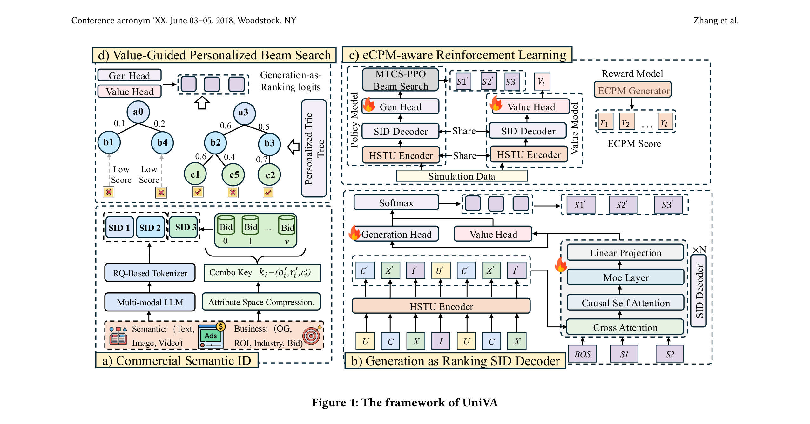

# Unified Value Alignment for Generative Recommendation in Industrial Advertising

- **日期**：2026-05-07
- **来源**：arXiv:2605.05803
- **作者**：Xinxun Zhang, Yuling Xiong, Jiale Zhou, Zhengkai Guo, Zhennan Pang, Junbang Huo, Jingwen Wang, Xuyang Sun, Enming Zhang, Jiaguang Jin, Changping Wang, Yi Li, Jun Zhang, Xiao Yan, Jiawei Jiang, Jie Jiang
- **发表**：arXiv 预印本, 2026（腾讯微信视频号）

---

## 缺口：语义对齐够了，价值对齐在哪里？

生成式推荐（Generative Recommendation, GR）把推荐重构成了"下一个 token 预测"问题：给每个物品分配一个语义 ID（SID），然后自回归地生成 SID 序列。在电商和内容推荐上，这条路线已经跑通了——GPR、OneRec、MTGR 等系统证明了端到端生成可以替代传统的多阶段级联排序。

但广告推荐不是内容推荐。广告推荐必须同时优化两个东西：用户兴趣（语义匹配）和商业回报（eCPM、GMV）。现有 GR 管线从"语义中心"出发构建，商业价值只是在某个环节打了个补丁——tokenization 只管语义相似，解码还是生成概率主导，线上服务靠后置排序模块兜底。价值信号被碎片化地塞进三个不同的阶段，没有一个统一的管道把它们串起来。

作者把这个问题叫做**价值不一致（value inconsistency）**，具体表现为三个断裂：

1. **SID 词表对价值不敏感**：语义相似的广告，出价可能差一个数量级，但它们被塞进同一条 SID 路径
2. **解码被语义概率统治**：自回归解码按生成概率剪枝，高商业价值的 SID 路径在早期就被砍掉了
3. **线上服务对价值视而不见**：beam search 按语义似然扩展，商业上有潜力的路径根本进不了候选集

一句话：**现有 GR 管线在语义上是一致的，在价值上是断裂的。**

## 增量：把价值信号从"事后补丁"升级为"管线主线"

UniVA 让商业价值贯穿 tokenization、decoding、serving 三个阶段，形成统一的"价值对齐"管线。在腾讯微信视频号的离线评测中 HR@100 相对提升 37.04%，线上 A/B 测试 GMV 提升 1.5%。

## 核心机制图



上图是 UniVA 的整体框架，包含四个核心组件：(a) Commercial SID 将商业属性注入 SID 末层；(b) 双头解码器同时建模生成概率和价值分数；(c) eCPM-aware RL 用强化学习对齐解码与商业回报；(d) 个性化 Trie 树 + 价值引导 beam search 实现高效线上服务。

**我画的机制速写：**

```
┌─────────────────────────────────────────────────────────────────┐
│                     UniVA 价值对齐管线                           │
│                                                                 │
│  ┌──────────────┐    ┌──────────────┐    ┌───────────────────┐  │
│  │  SID 构建     │    │  SID 解码     │    │  线上 Serving     │  │
│  │              │    │              │    │                   │  │
│  │ 旧：纯语义    │    │ 旧：生成概率   │    │ 旧：语义 beam +   │  │
│  │ RQ 全层      │    │ 单头输出      │    │ 后置排序模块      │  │
│  │              │    │              │    │                   │  │
│  │ 新：语义+价值  │    │ 新：双头融合   │    │ 新：Trie 剪枝 +   │  │
│  │ 上层RQ+末层  │    │ Gen+Value     │    │ 价值引导 beam    │  │
│  │ Commercial   │    │ SL+RL联合优化  │    │ 单程生成即排序    │  │
│  └──────┬───────┘    └──────┬───────┘    └───────┬───────────┘  │
│         │                   │                    │              │
│         ▼                   ▼                    ▼              │
│   价值可区分的         价值参与决策的          价值引导搜索的      │
│   token 空间           生成过程               线上解码           │
│                                                                 │
│          三个阶段共享同一个目标：对齐商业价值                      │
└─────────────────────────────────────────────────────────────────┘
```

## 白话方法：价值从"打补丁"到"修地基"

想象一栋写字楼出租。老办法是：先按面积和朝向给房间编号（语义 SID），租户按编号找房间，最后才谈价格——结果谈了半天发现预算不对的房间排了一堆，真正能成交的被漏掉了。

UniVA 的做法是：**编号里就把价格区间写进去**（Commercial SID），然后**带客户看房的人同时判断"你喜不喜欢"和"你买不买得起"**（双头解码），最后**只带你去看预算范围内且你喜欢的房间**（Trie 剪枝 + 价值 beam）。三步都在对齐"需求"和"支付力"，不浪费一步。

## 关键概念（费曼讲解）

### 概念一：Commercial SID——让 token 空间对商业价值有分辨力

**问题**：传统 RQ 把语义相似的广告聚到同一 SID 路径。但"卖手机的广告 A"和"卖手机的广告 B"语义几乎一样，A 出价 5 块，B 出价 500 块。它们 SID 路径相邻，解码器根本分不清谁更值钱。

**解法**：UniVA 把 SID 的最后一层从"语义残差"换成"商业属性压缩 + 出价分箱"。具体分两步：

1. **属性压缩**：优化目标（25 类）、ROI（8 类）、行业（10 类）做长尾压缩，拼成组合键（composition key）
2. **分类-分箱**：每个组合键下的出价做等频分箱，箱数按样本量自适应（样本多的键分更多箱），总词表不超过 2048

这样，**共享同一完整 SID 路径的广告，不仅语义相似，出价也相近**。论文数据显示，路径内出价标准差和范围降低约一个数量级。

**例子**：想象一个图书馆。旧办法是按主题分类（计算机、医学、文学……），同一书架上的书价格可能从 10 块到 1000 块。Commercial SID 相当于在每个主题书架的最底层再按价格区间贴标签——"计算机 / 50-100 元"和"计算机 / 500-1000 元"变成不同的最末级分类。

### 概念二：双头 Generation-as-Ranking——生成即排序

**问题**：传统做法是先生成候选再排序（generate-then-rerank），两步分开。生成阶段按语义概率剪枝，高价值候选可能在生成阶段就被淘汰了，排序阶段根本看不到它。

**解法**：UniVA 在解码器的共享 trunk 上挂两个头：生成头（Gen Head）预测下一个 SID token 的概率，价值头（Value Head）估计该 token 的商业价值分数。两个输出逐元素相加后做 Softmax，形成融合分布：

```
π̃(·|s<l, h) = Softmax(o_gen + o_value)
```

这样**每一步 token 选择都同时考虑语义相关性和商业价值**，不存在"先生成再排序"的信息损失。

**训练方式**：
- **SL 阶段**：生成头用监督学习（next-SID 预测），建立稳定的生成能力
- **RL 阶段**：复用生成头作为策略头，价值头作为 critic，用 eCPM 做奖励信号，MCTS-PPO 做策略优化
- **联合迭代**：SL batch 和 RL batch 交替训练，生成能力和价值对齐同步提升

**例子**：你请了一个猎头招人。旧做法是猎头先按简历筛一轮（生成），然后你面试排序。问题是有能力很强但简历不够"匹配关键词"的候选人，第一轮就被淘汰了。双头做法是猎头同时看"简历匹配度"和"这个人的实际产出潜力"，每一步筛选都把两个信号融合在一起。

### 概念三：eCPM-aware RL——用商业回报做奖励信号

**问题**：监督学习只能学到"用户点击了什么"，学不到"这个点击值多少钱"。广告系统的核心指标 eCPM（预期千次展示收入）是排序阶段的产物，不能直接当训练标签。

**解法**：UniVA 搭了一个高保真的线下模拟器，复制线上排序栈，对每条采样的 SID 路径跑出 eCPM 分数作为 RL 奖励。关键设计：

- **自适应采样**：不再固定 5% 采样率，而是根据历史学习难度和预测熵自适应调整，最高全量
- **奖励归一化**：同一请求内做 z-score 归一化，让策略更新关注相对价值差异而非绝对值
- **MCTS-PPO**：MCTS 做结构化探索（发现低概率但高价值的 SID 路径），beam search 提供稳定的高概率 rollout
- **价值头当 critic**：PPO 的 GAE 优势估计直接用价值头的输出做 baseline

**例子**：训练一个销售团队。纯 SL 像是让销售看历史成交记录学习话术——知道客户买了什么，但不知道哪个客户带来的利润最高。eCPM-aware RL 相当于把每个客户的实际利润反馈给销售，让他们学会优先跟进高利润客户，而不仅仅是"容易成交"的客户。

## 餐巾纸速写：从"语义中心"到"价值对齐"的范式转变

```
        以前（语义中心）                    现在（价值对齐）
    ┌─────────────────────┐         ┌─────────────────────────┐
    │                     │         │                         │
    │  SID = 纯语义编码    │         │  SID = 语义(上层)       │
    │  所有层都是 RQ      │         │        + 商业属性(末层)  │
    │                     │         │                         │
    │  解码 = 生成概率     │         │  解码 = 生成概率        │
    │  单头输出           │         │       + 价值分数(双头)  │
    │                     │         │                         │
    │  训练 = 纯 SL       │         │  训练 = SL + eCPM-RL   │
    │                     │         │                         │
    │  线上 = 语义 beam   │         │  线上 = Trie 剪枝       │
    │       + 后置排序    │         │       + 价值 beam       │
    │                     │         │       (单程生成即排序)   │
    └─────────────────────┘         └─────────────────────────┘

    价值信号：事后补丁                    价值信号：管线主线
    ───→ 被动                            ───→ 主动
    信息损失：生成→排序之间               信息损失：≈ 0
```

**核心位移**：商业价值从"生成完再补"的辅助信号，变成了"从一开始就嵌入"的主线信号。这不是加个损失函数那么简单——tokenization 的词表结构、解码的 token 选择逻辑、线上的搜索策略，三者必须共享同一个价值语义，才能避免信息在阶段间传递时被丢失。

## 证据：离线 + 线上双验证

**离线评测**（腾讯微信视频号广告数据集）：

| 模型变体 | HR@100 相对提升 |
|---------|---------------|
| + Commercial SID | +5.78% |
| + 更深解码器 | +6.10% |
| + MoR | +13.56% |
| + Sparse MoE | +18.40% |
| UniVA (Full) | **+37.04%** |

关键发现：
- Commercial SID 不增加任何参数和计算，仅靠改变 token 结构就带来 5.78% 的 HR 提升——说明"词表里就区分价值"的先验非常强
- 解码器有明确的 scaling trend：MoR 加深度、MoE 加宽度都有收益
- 完整 UniVA 的 37.04% 提升远超各组件之和的简单叠加，说明三者的价值对齐是**互补**的

**价值分析**：
- ValueHR@100 提升 37.01%，wNDCG@100 提升 26.20%
- Commercial SID 后路径内出价标准差和范围降低约一个数量级
- 最优 codebook 大小是 2048，8192 反而因为词表失配而下降——价值建模需要适度词表

**线上 A/B 测试**（2026.3.7-3.11，5% 流量）：

| 版本 | GMV Lift | GMV(normal) Lift |
|------|----------|-----------------|
| v1 (无 Generation-as-Ranking) | +1.03% | +1.17% |
| v2 (含 Generation-as-Ranking) | **+1.50%** | **+1.42%** |

个性化 Trie 树的效果：同 beam width=300 下，Trie 约束产出 300 条有效路径，无 Trie 只有 48 条（16% 有效率）。

## 启发

1. **"词表即先验"的工程直觉**：Commercial SID 的 5.78% 无额外成本提升告诉我，在生成式推荐中，tokenization 不只是"给物品编号"，它是对问题的先验假设。纯语义编码隐含了"语义相似 = 价值相似"的假设，在广告场景下这个假设是错的。**任何做生成式推荐的人，在设计 SID 时都要问自己：我的词表结构对下游目标做了什么假设？**

2. **"生成即排序"避免了信息瓶颈**：双头融合的价值不在于"多了一个价值分数"，而在于**它消除了 generate-then-rerank 的信息瓶颈**。如果生成阶段按语义剪枝砍掉了高价值路径，后面的排序再厉害也救不回来。这个思路对任何"先检索再排序"的系统都有启发——能不能让检索阶段就感知排序目标？

3. **RL 在工业 GR 中的落地范式**：eCPM-aware RL 的关键不是 RL 算法本身（PPO+MCTS 是标准组合），而是**整个 RL 基础设施**：高保真模拟器、自适应采样、奖励归一化、SL-RL 交替训练。这些工程细节决定了 RL 能不能在工业级 GR 中真正 work。

4. **对非广告场景的启示**：虽然 UniVA 解决的是广告场景的价值对齐，但"让目标信号贯穿管线"的思路可以迁移。比如电商推荐中的"利润对齐"、内容推荐中的"时长对齐"——只要是生成式管线中存在目标和 tokenization/decoding/serving 不一致的地方，都可以考虑类似的统一对齐策略。
