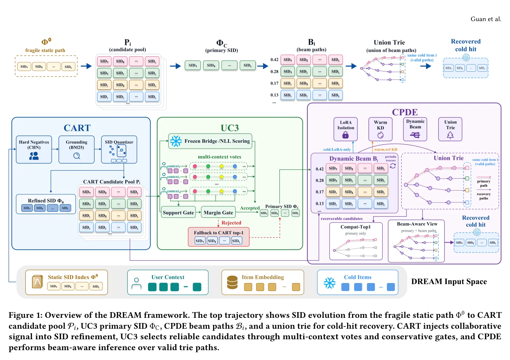
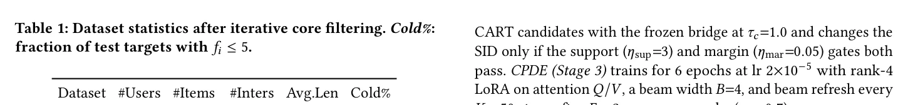
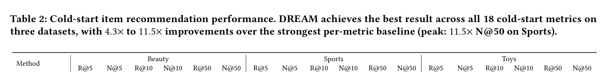
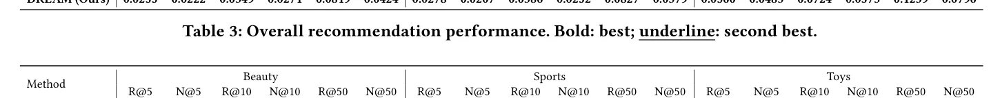
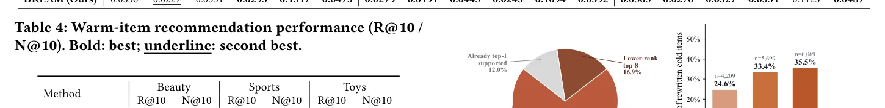
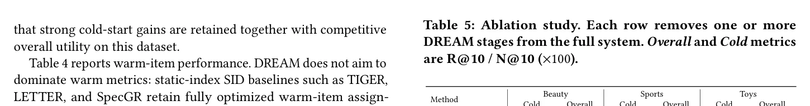
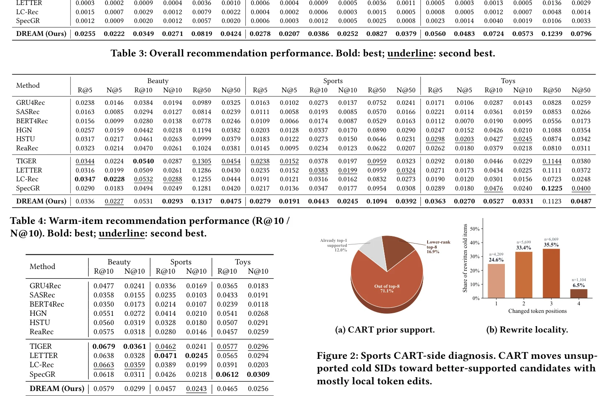
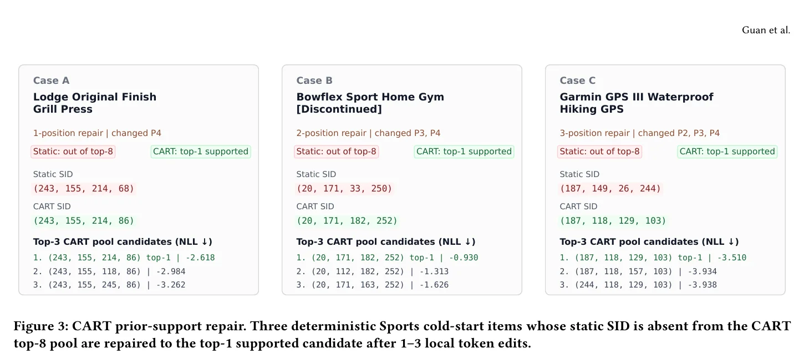
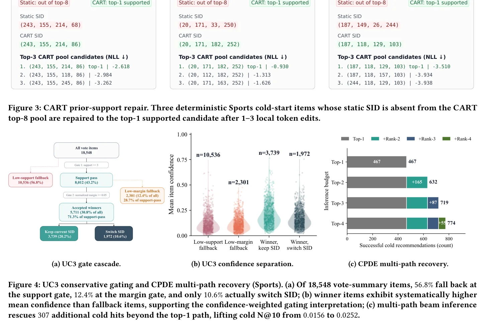

# DREAM: 早期分配映射的动态精炼

**作者**: Liwei Guan, Huanjie Wang, Hongwei Zhang, Linxun Chen, Zhaojie Liu

**机构**: 快手科技 (Kuaishou Technology), 北京, 中国

**原文**: [arXiv:2606.06947](https://arxiv.org/abs/2606.06947)

---

## 摘要

生成式推荐通过将物品检索重新表述为语义ID（SID）的自回归生成来推进物品检索，SID是编码物品语义的紧凑token序列。虽然SID提供了强大的语义先验，但当前基于SID的方法在用户反馈充分观测之前，通过离线分词为每个物品分配一个静态标识符。对于冷启动物品，这种一次性承诺产生了区分度差的编码，生成了错位的路径，这些路径因为相关token在训练中很少被采样而始终无法被修正。我们指出这种早期静态承诺——而非模型容量——是基于SID的生成式推荐中冷启动的根本瓶颈。

为了克服这一瓶颈并弥合分词与生成之间的脱节目标，我们提出了DREAM（Dynamic Refinement of Early Assignment Mappings，早期分配映射的动态精炼），一个通过渐进式精炼解决此缺陷的三阶段框架。首先，一个意图感知的分词器通过反事实对比学习重建SID空间，为每个冷启动物品生成一组行为对齐的多样化候选池。其次，冻结的推荐主干作为评估器，基于多上下文用户支持选择最可靠的候选，无需重新训练。第三，一种动态束搜索机制在整个训练和推理过程中维护多个加权SID假设，防止过早坍缩到单一分配。在三个Amazon基准数据集上的大量实验表明，DREAM在冷启动指标上大幅超越了最先进的生成式和序列化基线方法。

**关键词**: 生成式推荐、物品冷启动、LLMs for Recommendation、物品分词

---

## 1 引言

推荐系统传统上使用级联推荐架构，分别优化候选检索和排序。生成式推荐（GR）则将推荐训练为对物品token序列的下一token预测。每个物品被分配一个紧凑的语义物品ID（SID），即由多模态物品特征的层级量化（如RQ-VAE或RQ-KMeans）产生的离散token序列；然后一个自回归Transformer主干根据用户的交互历史生成目标物品的SID。这种表述将候选生成转化为结构化标识符空间上的自回归解码，通过共享token词汇表实现语义迁移，并在学术基准和工业部署中取得了强大的结果。

尽管有这些进展，冷启动失败在基于SID的生成式推荐和经典基于ID的推荐器之间存在质的区别。在基于ID的序列模型中，冷启动物品通常仍保留在候选集中：它保有物品嵌入并获得相关性分数，尽管当从少量交互中学习时该分数可能不可靠。在基于SID的生成式推荐中，同样的稀疏性可以使物品变得**不可达**而非仅仅是弱评分的：离线分词器在用户反馈被观测之前将每个物品承诺到一条SID路径，而约束解码仅允许已注册的路径。当冷启动物品的分配路径错位时，该物品在训练中被采样得太少而无法获得纠正梯度，且在推理时没有替代路径暴露给解码器。

我们将这一瓶颈称为**早期静态单路径承诺**，并将其分解为三个耦合因素：

1. **无支持分配**：SID仅从内容或预训练信号中选择，没有观测到的交互支持其协同角色。
2. **过早承诺**：监督被绑定到单一分配路径，而冷启动梯度太稀疏无法修复选择。
3. **推理时单路径约束**：约束解码仅注册分配的SID，因此错位的冷启动物品在测试时没有替代方案。

*图1: DREAM框架概览。顶部轨迹展示了SID从脆弱的静态路径到CART候选池、UC3主SID、CPDE束路径、以及用于冷启动命中恢复的联合Trie的演化过程。CART向SID精炼注入协同信号，UC3通过多上下文投票和保守门控选择可靠候选，CPDE在有效Trie路径上执行束感知推理。*

我们将这种解耦实例化为DREAM，一个驱动冷启动物品SID分配经过先验-支持修复、保守承诺和多路径恢复的渐进式精炼框架：

- **第一阶段 CART（协同感知精炼分词）**：执行先验-支持修复，用协同几何监督重建SID空间，为每个冷启动物品暴露一个小型先验支持候选池。
- **第二阶段 UC3（用户条件候选浓缩）**：执行保守承诺，冻结的推荐主干作为零训练成本评估器，仅当置信加权多上下文投票通过显式支持和边距门控时才更新冷启动物品的SID。
- **第三阶段 CPDE（冷保留动态束演化）**：实现多路径恢复，保留幸存的SID替代方案，通过LoRA梯度隔离保护暖物品训练不受稀疏冷更新的干扰。

在三个Amazon基准上，DREAM在所有18个冷启动指标上取得最佳分数（改进范围为4倍到12倍），同时在整体指标上保持竞争力。

**本文主要贡献**:

- **问题表述**：识别出早期静态单路径承诺是基于SID的生成式推荐对冷启动物品的主要结构性瓶颈，将其分解为三个复合因素。
- **保守渐进式精炼框架**：提出DREAM三阶段系统，围绕先验-支持修复、保守承诺和多路径恢复组织。
- **全面实证验证**：DREAM在三个Amazon基准的所有18个冷启动指标上取得最佳结果，改进约4倍到12倍。

---

## 2 相关工作

### 基于SID的生成式推荐与物品分词

生成式检索首先表明检索目标可以作为标识符生成：DSI将文档存储在可微搜索索引中，NCI改进了带文档标识符的神经语料索引。在推荐中，P5用文本提示和物品标识符表述推荐，而TIGER引入RQ-VAE语义ID用于生成式推荐。LC-Rec和LETTER进一步将协同语义和表示对齐适配到基于LLM的推荐。大规模系统如HSTU、OneRec/OneRec-V2和QARM展示了生成式推荐和紧凑物品分词的实用价值。

最近的工作从互补方向改进标识符构建和对齐：CCGen和EAGER注入协同或行为-语义信号；LETTER、USID、DiscRec和RPG学习更自适应、统一、解耦或并行的标识符；ETEGRec、BLOGER、DIGER、DACT和PIT表明token分配可以通过推荐目标、可微更新、持续精炼或个性化上下文来适配。DREAM受到SID分配不必保持静态这一更广泛思想的启发，但它不在单一端到端目标中优化分词器和推荐器；相反，它在先验支持的候选被构建之后隔离冷启动承诺决策。

多视图标识符方法如MINDER、NOVO、Multi-DSI和Pctx进一步表明一个目标可能受益于多个有效标识符。这些方法改进标识符质量、对齐或视图多样性，但大多数仍然在冷启动交互支持可用之前将每个物品承诺到一个主路径。DREAM则将冷启动SID分配视为分阶段承诺问题。

### 冷启动推荐与归纳式生成检索

经典冷启动方法主要改进可迁移表示，同时物品仍保留在全局候选池中：MeLU元学习偏好估计器，DropoutNet模拟缺失交互，CLCRec使用对比对齐，Heater应用随机化训练与专家混合转换，UniSRec学习用于迁移的通用序列表示。归纳式生成检索解决新物品必须被生成器到达的更困难设置；例如SpecGR使用投机解码路由未见物品，GenRecEdit适配模型编辑注入冷启动物品知识。这些方法改进连续表示、归纳路由或模型参数，而非显式修复分词器做出的离散SID承诺、推迟交互支持不足下的承诺、以及在解码Trie中注册多个冷启动路径。

---

## 3 方法论

### 3.1 预备知识

**基于SID的生成式推荐**：设 U 和 I 分别为用户集和物品集。对于一个训练实例，h_u = (i_1, ..., i_m) 是用户 u 的观测交互历史，i* 是下一个物品的真实标签。每个物品 i 关联一个内容嵌入 e_i 并被分配一个长度为 L 的语义ID。SID索引是映射:

    Phi: I -> V_1 x V_2 x ... x V_L

其中 V_l 是SID位置 l 的token词汇表，|V_l| = V_l。因此 Phi(i) = s_i = [t^i_1, ..., t^i_L]。初始静态索引 Phi_0 由RQ-VAE或RQ-KMeans量化器在物品嵌入上离线产生。给定索引 Phi，历史在SID空间中表示为 s_{h_u} = (Phi(i_1), ..., Phi(i_m))，生成式推荐器被训练以最大化目标SID的自回归似然：

    L_rec = - sum_{l=1}^{L} log P_theta(t^{i*}_l | s_{h_u}, t^{i*}_1, ..., t^{i*}_{l-1})    (1)

在推理时，通过前缀Trie的约束解码将每个解码步骤限制为已注册SID的有效延续。

**问题定义**：设 f_i 为包含物品 i 的训练交互数。给定冷启动阈值 n_c = 5，将 I 分为冷启动物品 I_c = {i | f_i <= n_c} 和暖物品 I_w = I \ I_c。在 Phi_0 下，每个冷启动物品在充分交互支持可用之前被承诺到一个SID。目标是产生一个精炼的单路径索引 Phi_C 用于向后兼容解码，以及对每个冷启动物品产生一个小的替代SID集 B_i 用于多路径推理，同时限制暖物品扰动。

### 3.2 框架概览

如图1所示，DREAM通过三个阶段精炼初始索引 Phi_0：

- **CART** 输出CART精炼索引 Phi_R 以及每个冷启动物品 i 的有界先验支持候选池 P_i。
- **UC3** 将冻结桥接模型作为零训练成本评估器，将每个池转换为置信加权投票 {v^(k)_i}，仅当显式支持和边距门控通过时才承诺单路径索引 Phi_C；否则弃权保持CART分配。
- **CPDE** 保留幸存的SID替代方案作为动态束 B_i，通过LoRA隔离冷梯度，并将所有保留路径注册在束感知约束解码Trie T_BA 中用于多路径推理。

为防止上游不精确在阶段间复合，每个阶段通过显式门控步骤解耦：UC3的支持和边距阈值在承诺前过滤低支持重写，而CPDE通过指数移动平均（EMA）更新束权重以抑制噪声单步偏移。

### 3.3 协同感知精炼分词 (CART)

CART在推荐器被要求做最终承诺之前修复冷启动SID路径的先验支持。其角色不是任意重写标识符，而是用协作感知的局部候选池替换内容主导的top-1分配。为使该先验在稀疏性下有用，CART将协同物品表示、意图区分性硬负例和多样性感知量化组合为单一分词目标。

**物品表示**：CART从预计算的物品嵌入 e_i 开始，用一个可学习的逐物品协同残差 r_i（初始化为零）增强它：

    z_i = LN(W_c * e_i + r_i)    (2)

其中 W_c 是线性内容投影，LN 是层归一化。零初始化使早期训练锚定在内容几何中，而 r_i 通过协同几何（L_cal）和反事实硬负例对比信号（L_NCE）逐渐积累交互派生的结构。

**反事实硬负例挖掘 (CHN)**：随机负例对意图级区分过于简单，因此通过两步挖掘意图区分性硬负例：

- 步骤1（反事实生成）：用LLM对每个物品生成保持产品族不变但翻转核心购买意图的描述（如 hydrating -> oil-control; trail-running -> road-running）。
- 步骤2（目录锚定）：用生成描述作为BM25查询检索K个最匹配的真实目录物品：N_i = BM25-top(x_tilde_i, I \ {i}, K)    (3)

选择BM25因为词汇重叠是SID层面混淆性的主要来源。CHN应用于所有物品：暖物品提供校准冷启动物品周围几何边界的密集比较上下文。

**带多样性正则化的SID量化**：用码本 C_l 将每个物品分词为L位置SID。投影 f_q 将 z_i 映射到每位置查询 q_{i,l}，分配logit通过缩放余弦相似度计算：

    l_{i,l,k} = tau_s * (q_{i,l}^T * c_{l,k}) / (||q_{i,l}|| * ||c_{l,k}||)    (4)

使用Gumbel-Softmax采样配合指数退火温度和直通估计器（STE）。多样性正则化器惩罚批次均值分配分布中的集中：

    L_div = (1/L) * sum_{l=1}^{L} (1 - H(a_bar_l) / log V_l)    (5)

其中 a_bar_l = (1/|B|) * sum_i softmax(l_{i,l})，H(.) 是Shannon熵。

**训练目标**：CART用四项训练：

1. **对比 (NCE)**：动量编码器（W_c 和 {r_i} 的EMA）产生一致正键 z_hat^+_i。结合FIFO负队列 Q 和CHN池 N_i，位置平均InfoNCE损失：
   L_NCE = -(1/L) * sum_l log [exp(s_hat_{i,l}^T * z_hat^+_i / tau_n) / (exp(...) + sum_{j in Q union N_i} exp(...))]    (6)

2. **协同对齐 (CAL)**：目标条件CTR任务注入对比学习无法捕获的协同结构。对每个历史物品 j，构建交互特征 f_j = [z_{i_j}; z_{i*}; z_{i_j} - z_{i*}; z_{i_j} * z_{i*}]，通过双层MLP计算注意力权重，预测头输出BCE目标的logit：
   L_cal = BCE(sigma(g([u; z_{i*}; u*z_{i*}])), 1) + BCE(sigma(g([u; z_{j-}; u*z_{j-}])), 0)    (8)

3. **静态锚定**：正则化到现有静态分配以保持SID空间兼容性：
   L_anc = (1/L) * sum_l CE(l_{i,l}, t^0_{i,l})    (9)

4. **完整CART目标**：
   L_CART = L_NCE + L_cal + lambda_div * L_div + lambda_anc * L_anc    (10)

训练后，CART按学习量化器诱导的平均token对数概率对候选SID评分：

    q_CART(s|i) = (1/L) * sum_l log softmax(l_{i,l})_{t_l}    (11)

为每个物品解码K个最高评分SID序列。排名最高的成为新的主分配，完整top-K集形成有界候选池：

    Phi_R(i) = s^(1)_i,  P_i = {(s^(k)_i, p^(k)_i)}_{k=1}^K = TopK_s q_CART(s|i)    (12)

对暖物品仅使用 Phi_R 作为更新的单路径索引；对冷启动物品，完整候选池 P_i 传递给下游承诺和多路径恢复阶段。

### 3.4 用户条件候选浓缩 (UC3)

CART为每个冷启动物品配备了K个排序SID候选的先验支持池 P_i，但池本身不应强制即时承诺。缺失的支持信号是每个候选在真实用户历史下生成时的表现。UC3从冻结桥接模型获取此支持信号：对每个候选SID，计算教师强制负对数似然（NLL），测量模型在给定用户交互历史下逐token生成该候选的可能性。这仅需每个冷启动交互K次前向传播而无需参数更新。

具体地，对每个训练交互 (u, h_u, i)（i 属于冷启动集 I_c），UC3在冻结模型下评估每个候选：

    NLL(s^(k)_i | u, h_u) = -(1/L) * sum_{l=1}^{L} log P_frozen(t^(k)_{i,l} | s_{h_u}, t^(k)_{i,<l})    (13)

UC3首先将这些损失转换为每上下文偏好分布：

    p^(k)_{u,i} = exp(-NLL(s^(k)_i | u, h_u) / tau_c) / sum_{k'} exp(-NLL(s^(k')_i | u, h_u) / tau_c)    (14)

直觉上，每个用户上下文对候选SID投票。但并非每个投票应同等计数：当冻结模型对所有候选分配近均匀概率时，它告诉我们该上下文不具决定性。因此用基于熵的置信度加权每个投票：

    omega_{u,i} = 1 - H(p_{u,i}) / log K    (15)

最终候选分数是置信加权共识：

    v^(k)_i = sum_{(u,h_u) in D_i} omega_{u,i} * p^(k)_{u,i} / (sum omega_{u,i} + epsilon)    (16)

模型置信的上下文具有更大影响，而模糊上下文贡献很少。在异质、高置信用户上下文中得分高的候选反映了与冷启动物品多样使用模式广泛兼容的SID。

UC3仅当支持充分且决定性时才将投票分数转换为承诺。设 k* = argmax_k v^(k)_i，设 v^[1]_i 和 v^[2]_i 为最大和次大投票分数。精炼索引为：

    Phi_C(i) = s^(k*)_i   如果 |D_i| >= eta_sup 且 v^[1]_i - v^[2]_i >= eta_mar
             = Phi_R(i)   否则    (17)

对冷启动物品如上，对暖物品保持 Phi_C(i) = Phi_R(i)。回退情况是在弱支持下的有意弃权：UC3仅当多上下文投票一致改善CART先验时才更新冷启动物品，否则保留更安全的CART top-1分配。

### 3.5 冷保留动态束演化 (CPDE)

即使UC3选择了稳定的单路径，冷启动相关性可能保留残余多路径模糊性。不同用户上下文可以支持CART先验中不同的合理SID，将所有SID折叠为一个top-1路径可以从约束解码Trie中移除可恢复的路由。同时，无限制微调是不可取的：稀疏冷启动梯度方差高，可扰动暖物品生成；密集暖梯度可稀释冷特定适配。CPDE因此将 Phi_C 作为稳定承诺点，保留一小组残余替代方案。

**冷保留梯度隔离**：将rank-r LoRA适配器注入每个注意力层的查询和值投影。处理冷启动样本时，整个骨干（包括所有非LoRA参数）被冻结且其贡献被停止梯度，梯度仅流过低秩适配器矩阵：

    o_cold = sg(W_0 * x) + (alpha_r / r) * B * A * x    (18)

其中 sg(.) 表示停止梯度。对暖物品样本，骨干权重 W_0 和适配器都接收完整梯度流，保持模型的暖物品生成能力。

**动态束**：对每个冷启动物品维护动态束 B_i = {(s^(k)_i, w^(k)_i)}_{k=1}^B，从 P_i 和 Phi_C 初始化。模型用当前束分布加权的软多目标目标训练：

    L_soft = - sum_{k=1}^{B} w_tilde^(k)_i * (1/L) * sum_{l=1}^{L} log p_theta(t^(k)_{i,l} | s_{h_u}, t^(k)_{i,<l})    (19)

暖物品通过从冻结参考模型（UC3桥接检查点的副本）的知识蒸馏保持生成能力，通过教师自身输出熵门控以抑制不确定样本上的蒸馏。完整训练目标：

    L_CPDE = lambda_s * L_soft + lambda_c * L^c_KL + lambda_w * L_KD    (20)

其中 L^c_KL = KL(p_theta || p_ref) 是在SID位置logits上的非对称KL正则化器，将冷启动路径锚定到参考模型；L_KD 是熵门控暖物品蒸馏损失。

预热 E_0 个epoch后，CPDE每 K_e 个优化步骤周期性刷新束权重。对最近优化窗口 W_i 中观测的每个冷启动物品，候选 s^(k)_i 的分数是平均负教师强制NLL：

    score^(k)_i = -(1/|W_i|) * sum_{(u,h_u,i) in W_i} NLL_theta(s^(k)_i | u, h_u)    (21)

CPDE通过动量EMA更新束权重：

    w^(k)_i <- gamma_m * w^(k)_i + (1 - gamma_m) * (alpha_b + score^(k)_i)    (22)

受逐物品置信度度量 conf(i) = sigma(-NLL_best(i) + delta) 门控。当 conf(i) 低时，更新被保留以使束保持稳定直到模型积累更强支持。初始预热期（E_0 epoch）和置信度门控共同防止早期训练中束的过早坍缩。

部署时，LoRA权重被合并到骨干中无额外模型计算成本，每个冷启动物品的所有 B 个保留束路径被预注册在约束解码Trie中以实现多路径推理。

### 3.6 推理

对冷启动物品，DREAM执行多路径推理作为其主要检索机制：所有幸存的束SID被注册在约束解码Trie中，使模型可以通过任何学习路径到达冷启动物品，在不引入额外评分模块的情况下增加检索概率。

推理时，合并后的模型逐token自回归生成下一物品的SID：

    t_hat_l = argmax_{v in V_l} P_theta(v | t_hat_{<l}, s_{h_u})    (23)

通过前缀Trie的约束生成将每个解码步骤限制为已注册SID的有效延续。DREAM从相同的CPDE状态实例化两种Trie配置：

**Compat-Top1**：每个物品保留一条路径，用于与单索引基线的向后兼容比较：

    T_C1 = {Phi_C(i) | i in I_w} union {s_dagger_i | i in I_c}    (24)

其中 s_dagger_i = argmax_{k} w^(k)_i 为最高权重束路径。

**Beam-Aware**：注册每个冷启动物品的所有保留束路径，实现多路径检索：

    T_BA = {Phi_C(i) | i in I_w} union (union_{i in I_c} {s^(k)_i | (s^(k)_i, w^(k)_i) in B_i})    (25)

生成的SID如果匹配该物品的任何注册路径即解析为目标。Beam-Aware作为DREAM的主视图报告，因为它反映了冷启动物品的预期多路径操作模式；Compat-Top1在消融中用于隔离单路径质量与多路径恢复。

---

## 4 实验

### 4.1 实验设置

**数据集**：在三个Amazon产品评论类别上实验：Beauty、Sports and Outdoors（Sports）、Toys and Games（Toys）。应用迭代core-5用户过滤和core-3物品过滤。统一使用冻结的Llama-3-8B提取物品文本嵌入用于初始码本构建，共享RQ-VAE配置 L=4 码本和 V_l=256 码。物品交互次数 f_i <= 5 分类为冷启动，否则为暖物品。

*表1: 迭代核心过滤后的数据集统计。Cold%：测试目标中 f_i <= 5 的比例。三个数据集都表现出极端稀疏性（交互密度低于0.04%）和大量冷启动比例（测试目标的19-24%）。*

**基线方法**：与十种方法比较，分三类：(1) 基于ID的序列模型：GRU4Rec、SASRec、BERT4Rec、HGN、HSTU；(2) 推理增强：ReaRec；(3) 基于SID的生成检索：TIGER、LETTER、LC-Rec、SpecGR。

**评估协议**：标准留一法协议——每个用户的最后交互用于测试，倒数第二用于验证，其余用于训练。报告 Recall@K (R@K) 和 NDCG@K (N@K)（K=5,10,50），在整个物品目录上全排序，分别计算整体、冷和暖子集。

**实现细节**：DREAM遵循LC-Rec的LLaMA-7B设置。CART训练12 epoch（batch 64, AdamW lr 5e-4），带NCE、协同对齐、多样性（lambda_div=0.1）和静态锚定（lambda_anc=0.5）损失；8,192条目FIFO队列，K=8反事实硬负例。UC3评分K=8个CART候选（tau_c=1.0），支持门 eta_sup=3，边距门 eta_mar=0.05。CPDE训练6 epoch（lr 2e-5），rank-4 LoRA在注意力Q/V上，束宽B=4，每K_e=50步刷新束，E_0=2预热epoch（gamma_m=0.7）。

### 4.2 冷启动性能

*表2: 冷启动物品推荐性能。DREAM在三个数据集的所有18个冷启动指标上取得最佳结果，相比每指标最强基线提升4.3x到11.5x（峰值：Sports上N@50的11.5x）。*

关键发现：

**(1) DREAM在每个冷启动指标上都是最佳方法**——所有三个数据集六个指标的18个单元格。相比最强基线的提升范围从4.3x到11.5x：冷R@5分别提升4.3x（Beauty）、9.0x（Sports）和4.5x（Toys），而冷N@50在相同数据集上分别提升7.2x、11.1x和6.6x。增益在数据集、指标和排序深度上一致，确认是DREAM的渐进式精炼管道而非数据集特定调优驱动了改进。

**(2) 静态SID瓶颈冷启动物品**：在基线中，HSTU和ReaRec——基于ID的序列模型——一致提供第二好的冷启动性能，而基于SID的生成基线很少保持竞争力。这表明主要困难不是自回归推荐本身，而是冷启动物品在用户反馈观测前继承的静态SID分配的质量。

**(3) 基于SID的基线在冷启动物品上崩溃**：TIGER、LETTER、LC-Rec和SpecGR在所有三个数据集的冷R@10上保持接近零。即使LC-Rec注入协同信号到骨干训练中也无法恢复冷启动物品，因为该增强在索引构建之后应用，无法修复上游有缺陷的SID分配。

### 4.3 整体效用和暖物品权衡

*表3: 整体推荐性能。粗体：最佳；下划线：第二佳。*

**(1) Sports是最强的整体成功案例**：DREAM在所有六个指标上超越所有基线，提升17.2%（R@5）、25.7%（N@5）、15.7%（R@10）和23.1%（N@10）。

**(2) Beauty在整体保持竞争力的同时在冷启动上大幅受益**：获得最佳N@10、R@50和N@50，同时在R@5上与LC-Rec差距3.2%以内，在R@10上与TIGER差距1.7%以内。

**(3) Toys也显示强大的整体性能**：在6个整体指标中5个取得最佳结果，同时达到beam-aware冷N@10 = 0.0573。

*表4: 暖物品推荐性能（R@10 / N@10）。粗体：最佳；下划线：第二佳。*

DREAM不追求在暖指标上占主导地位：静态索引SID基线如TIGER、LETTER和SpecGR保留完全优化的暖物品分配，而CART重写索引必然扰动一些暖SID。权衡保持可控且数据集依赖：Sports上暖R@10（0.0457）在最强暖基线LETTER（0.0471）的3.0%以内，而其冷R@10比最强冷基线高10x以上。

### 4.4 消融研究

*表5: 消融研究。每行从完整系统中移除一个或多个DREAM阶段。整体和冷指标为 R@10 / N@10 (x100)。*

所有冷和整体指标为 R@10 / N@10 (x100)。移除所有DREAM阶段（LC-Rec骨干）产生接近零的冷启动性能，而仅添加CART（"w/o UC3 & CPDE"）已经提供主导性的第一次修复，冷N@10分别在Beauty、Sports和Toys上相比骨干提升约10x、44x和22x。UC3进一步精炼冷启动质量，完整DREAM系统配合Beam-Aware多路径解码在所有指标上取得最佳结果。值得注意的是，Compat-Top1在所有数据集上与"w/o CPDE"行保持接近，确认Beam-Aware增益是附加的多路径恢复而非对上游回归的补偿。

### 4.5 机制诊断

以下诊断追踪了早期静态承诺的三个复合因素（无支持分配、过早承诺、推理时单路径约束），并展示每个DREAM阶段如何解决其针对的特定因素。

*图2: Sports CART侧诊断。(a) CART先验支持：71.1%在top-8之外，16.9%为低排名top-8，仅12.0%已是top-1支持；(b) 重写局部性：93.5%的重写仅修改1-3个token位置。*

**冷启动失败源于静态SID承诺，而非模型容量不足**：在Sports上，静态基线在暖排序信号上保持可见（暖N@10=1.99），而对应的冷NDCG值接近零（冷N@10=0.03，约70x差距）。骨干本身并非全局弱的；是冷路径在骨干有机会积累行为支持之前就断裂了。

**CART提供第一次也是最大的修复**：CART导出每个冷启动物品的top-K候选池（K=8）。继承的静态SID对71.1%的冷物品在top-8池之外，仅12.0%已是top-1支持。CART重写了88.0%的冷top-1 SID，且在被重写的冷启动物品中80.8%从top-8池之外移向池中排名最高的候选。93.5%的重写仅修改1-3个token位置——修复是局部的而非任意的。Sports冷N@10从0.03上升到1.20（43.9x）。

*图3: CART先验-支持修复。三个确定性Sports冷启动物品案例，其静态SID不在CART top-8池中，被修复为top-1支持的候选，仅需1-3个局部token编辑。*

案例展示了典型的修复模式：
- Case A (Lodge Grill Press): 1位置修复，仅改变P4位置 (243,155,214,68) -> (243,155,214,86)
- Case B (Bowflex Sport Home Gym): 2位置修复，改变P3和P4 (20,171,33,250) -> (20,171,182,252)
- Case C (Garmin GPS III): 3位置修复，改变P2、P3、P4 (187,149,26,244) -> (187,118,129,103)

**UC3仅在支持决定性时承诺新SID**：在Sports上，89.4%的冷启动物品保持其CART SID。图4a追踪了这种保守行为的两门级联。在18,548个投票汇总物品中：56.8%（10,536）在支持门回退，12.4%（2,301）在边距门回退；仅5,711个物品达到获胜者状态。获胜者状态不意味着SID变化：3,739个获胜者重新确认当前CART SID为最强选项；仅1,972个物品（10.6%）实际切换SID。获胜者物品系统性地具有比回退物品更高的平均置信度。

*图4: UC3保守门控和CPDE多路径恢复（Sports）。(a) UC3门控级联：56.8%支持门回退，12.4%边距门回退，仅10.6%实际切换SID；(b) 获胜物品展示系统性更高的平均置信度；(c) 多路径束推理在top-1路径之外挽救307个额外冷启动命中，将冷N@10从0.0156提升到0.0252。*

**CPDE通过多路径推理恢复冷启动物品**：Beam-Aware将所有幸存束SID注册在同一前缀Trie中，接受生成与任何注册路径匹配即为命中。在Sports上，多路径束推理挽救了467个top-1路径之外的307个额外成功冷推荐，占所有成功冷推荐的39.66%；累积束预算到Top-2达632，到Top-3达719，增益集中在早期排名。Sports冷N@10从Compat-Top1的1.56上升到Beam-Aware的2.52。

**总结**：三个诊断共同闭合了静态承诺的循环：每个DREAM阶段经验性地解决了它设计针对的因素，阶段级消融显示冷启动质量单调增益同时保持竞争性整体效用。

---

## 5 结论

基于SID的生成式推荐中的冷启动失败不仅是表示学习失败，也是**承诺时机失败**：静态分词器在足够的行为支持存在之前将稀疏观测物品绑定到单一SID路径，而约束解码使差的路径难以训练和恢复。DREAM通过使SID接口逐步可修订而非固定来操作化这一观点：

- **CART** 用先验支持候选修复无支持分配
- **UC3** 仅在决定性多上下文支持下承诺
- **CPDE** 保持残余有效路径可用于多路径推理

在三个Amazon基准上，DREAM在所有18个冷启动指标上取得最佳结果，同时保持竞争性整体效用。消融研究和机制诊断将增益与预期因果链对齐：先验-支持修复、保守承诺和附加多路径恢复。

在本文研究的离线物品冷启动设置内，这些结果提出了生成式推荐的更广泛原则：**语义标识符应被视为支持条件的检索接口，其可靠性可以随着行为证据的积累而改善，而非在学习开始之前固定的不可变物品名称。** 这一视角也指向自然的下一步：将渐进式SID精炼扩展到物品证据、用户兴趣和目录组成在部署后持续演化的设置。

---

## GenAI使用声明

作者使用ChatGPT辅助英语语言润色和清晰度导向的措辞修订。使用OpenAI Codex调试实验相关代码和诊断脚本。作者审查并最终确定了所有论文内容、实验结果和主张。

---

## 参考文献

[1] Bai et al. 2026. BLOGER: Bi-Level Optimization for Generative Recommendation. SIGIR '26.
[2] Bengio et al. 2013. Estimating or Propagating Gradients Through Stochastic Neurons.
[3] Cheng et al. 2016. Wide & Deep Learning for Recommender Systems.
[4] Covington et al. 2016. Deep Neural Networks for YouTube Recommendations.
[5] Deng et al. 2025. OneRec: Unifying Retrieve and Rank with Generative Recommender.
[6] Ding et al. 2026. Inductive Generative Recommendation via Retrieval-based Speculation. AAAI '26.
[7] Feng et al. 2026. DACT: Drift-Aware Continual Tokenization for Generative Recommendation.
[8] Finn et al. 2017. Model-Agnostic Meta-Learning for Fast Adaptation.
[9] Fu et al. 2026. DIGER: Differentiable Semantic ID for Generative Recommendation.
[10] Geng et al. 2022. P5: Recommendation as Language Processing.
[11] Grattafiori et al. 2024. The Llama 3 Herd of Models.
[12] Guo et al. 2017. DeepFM.
[13] He et al. 2020. Momentum Contrast (MoCo).
[14] Hidasi et al. 2016. GRU4Rec.
[15] Hou et al. 2025. RPG: Generating Long Semantic IDs in Parallel.
[16] Hou et al. 2022. UniSRec.
[17] Hu et al. 2022. LoRA.
[18] Jang et al. 2017. Gumbel-Softmax.
[19] Kang & McAuley. 2018. SASRec.
[20] Lee et al. 2022. RQ-VAE.
[21] Lee et al. 2019. MeLU.
[22] Li et al. 2024. LLMs for Generative Recommendation: A Survey.
[23] Li et al. 2025. Generative Recommendation from a Tri-Decoupled Perspective.
[24] Li et al. 2023. MINDER.
[25] Lin et al. 2025. USID.
[26] Liu et al. 2025. DiscRec.
[27] Liu et al. 2025. ETEGRec.
[28] Liu et al. 2024. Multi-DSI.
[29] Luo et al. 2025. QARM.
[30] Ma et al. 2019. HGN.
[31] Maddison et al. 2017. The Concrete Distribution.
[32] Rajput et al. 2023. TIGER.
[33] Robertson & Zaragoza. 2009. BM25.
[34] Shen et al. 2026. GenRecEdit.
[35] Sun et al. 2019. BERT4Rec.
[36] Tan et al. 2024. IDGenRec.
[37] Tang et al. 2025. ReaRec.
[38] Tarvainen & Valpola. 2017. Mean Teachers.
[39] Tay et al. 2022. DSI.
[40] Touvron et al. 2023. LLaMA.
[41] Volkovs et al. 2017. DropoutNet.
[42] Wang et al. 2026. PIT.
[43] Wang et al. 2024. LETTER.
[44] Wang et al. 2022. NCI.
[45] Wang et al. 2024. CCGen.
[46] Wang et al. 2024. EAGER.
[47] Wang et al. 2023. NOVO.
[48] Wei et al. 2021. CLCRec.
[49] Yuan et al. 2023. Where to Go Next for Recommender Systems?
[50] Zhai et al. 2024. HSTU.
[51] Zheng et al. 2024. LC-Rec.
[52] Zhong et al. 2025. Pctx.
[53] Zhou et al. 2025. OneRec-V2.
[54] Zhou et al. 2018. DIN.
[55] Zhu et al. 2020. Heater.
