# OneReason 技术报告

- **原标题**：OneReason Technical Report
- **作者**：OneRec Team
- **来源**：https://arxiv.org/pdf/2606.06260
- **翻译日期**：2025-06-08

---

## 摘要

OneRec 系列的生成式推荐模型（Generative Recommendation Models）已广泛部署于多个真实业务场景，包括短视频、直播、广告和电商。然而，这些生成式模型只能从规模化优势（Scaling Advantage）中获益，其推理能力难以被激活，因为我们无法仅用物品标记（Itemic Tokens）构建有意义的思维链（Chain-of-Thought, CoT）序列。受大语言模型（LLM）领域中"先思考再回答"推理范式成功经验的启发，我们开展了初步研究（即 OneRec-Think、OpenOneRec）以探索生成式推荐中的推理能力。然而，我们注意到一个出乎意料的现象：思考模式（Thinking Mode）相比非思考模式（Non-Thinking Mode）并未展现出优势。

借鉴多模态语言模型中关于 CoT 鲁棒性的最新发现，我们认为推荐系统中有效推理依赖于两个因素：感知（Perception），即将物品标记锚定到其底层语言语义的能力；以及认知（Cognition），即将用户行为序列重组为连贯的潜在兴趣点的能力。因此，我们提出 OneReason，包含：（1）预训练阶段的强物品标记感知能力；（2）SFT 阶段面向推荐任务的三级认知增强 CoT 格式；（3）RL 阶段的"先专精后统一"训练策略以增强思考能力。

借助上述技术，OneReason 成功实现了在快手多个真实业务基准测试中思考模式优于非思考模式的效果。此外，我们观察到一个有趣的现象：在多个领域中，用 CoT 监督数据替换非 CoT 推荐数据可以提升非思考推理的性能。这表明 CoT 监督的某些收益可能迁移到直接解码中，尽管当前证据是行为层面的，尚不能确定该效果来自压缩、推理还是两者的交互。最后，我们系统性地呈现了一系列推理基准测试和设计洞察，并将开源 OneReason-8B 和 OneReason-0.8B 模型以促进生成式推荐模型的研究。

---

## 1. 引言（Introduction）

近年来，基于 Transformer 的大语言模型（LLMs）将机器智能的前沿推向了前所未有的水平。在大规模计算和先进训练方法的驱动下，LLMs 展现出两个令人兴奋的特性，指引我们构建更强大的模型：

- **预训练中的规模化特性（Scaling Property）**：当模型规模、训练数据和计算资源扩大时，收敛损失遵循规律性的、可外推的衰减趋势 [Kaplan et al., 2020; Hoffmann et al., 2022]。随着规模化推进，多个基准测试的评估分数同步提升，展示了模型卓越的语义理解和泛化能力。

- **后训练中的推理特性（Reasoning Property）**：在预训练之后，后训练阶段通过高质量的监督微调（SFT）和强化学习（RL）进一步解锁和精炼模型的高级能力 [Ouyang et al., 2022; Shao et al., 2024; Yu et al., 2025; Zheng et al., 2025]。在这些后训练技术的驱动下，LLMs 学会遵循 CoT 风格的程序 [Kojima et al., 2023; Wei et al., 2023]，形成"先思考再回答"的推理范式。该范式显著增强了其解决复杂深层问题的能力，如 OpenAI o1 [Jaech et al., 2024] 和 DeepSeek-R1 [Guo et al., 2025] 系列所示。

受 LLMs 的规模化和推理特性启发，我们深感好奇：这两个特性能否被进一步利用以推动工业推荐系统的能力边界。在这一动机驱动下，我们开展了一系列探索工作。对于规模化特性，我们的 OneRec V1/V2 系列生成模型 [Zhou et al., 2025b; c] 已在工业推荐场景中验证了规模化特性，为快手贡献了显著的业务收益。对于推理特性，我们认识到仅由推荐数据驱动的 OneRec 模型无法自行解锁推理能力。由于 OneRec 模型完全在纯物品序列数据上训练，它只学习了扁平的转移模式，没有任何底层逻辑思考轨迹。为激发推理能力，我们最近的模型 OneRec-Think [Liu et al., 2025] 和 OpenOneRec [Zhou et al., 2026] 探索了引入交错的物品-文本推荐数据和通用领域推理数据。在这两个模型中，我们成功观察到"先思考再回答"模式可以泛化到推荐任务，使我们能够检视模型的底层逻辑并理解用户兴趣以及下一物品预测背后的原理。然而，我们也注意到一个出乎意料的现象：**思考模式在推荐基准测试上相比非思考模式并未展现出显著优势**。

为探究这一意外现象的根本原因，我们转向多模态大语言模型（MLLM）文献，其中观察到了惊人相似的推理模式脆弱性。[Sun et al., 2026b] 揭示，当文本和视觉模态对齐不充分时，模型倾向于机械地"阅读"表面视觉文本而非真正推理底层视觉语义，这有力地表明深度跨模态对齐是真正思考的前提条件。延伸这一洞察，[Zhou et al., 2025a] 系统性地调研了 MLLMs 中从感知到认知的路径，并得出结论：没有首先建立模态间稳健的感知对齐，高级交互推理就无法涌现。在此对齐基础上，[Jiang et al., 2025b] 进一步证明，即使模态已对齐，推理鲁棒性仍然脆弱，除非 CoT 轨迹本身经过精心结构化——具体而言，采用逻辑连贯的、从粗到细的推理格式以防止幻觉和过度思考。

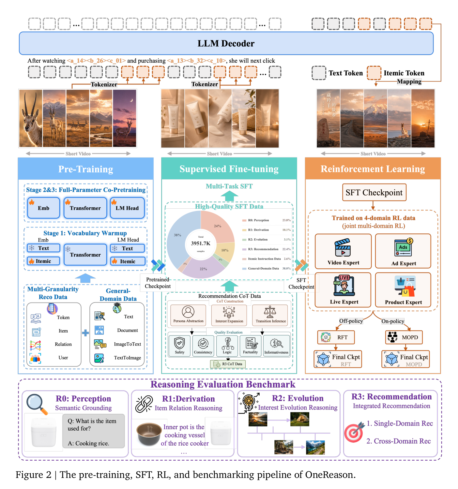

综合来看，这些工作汇聚于解锁真正推理能力的两个本质且互补的支柱：（i）感知中的模态对齐（Modality Alignment in Perception），它锚定感知并防止模型在空洞的表面信号上运作；（ii）认知中的 CoT 质量（CoT Quality in Cognition），它提供连贯的从粗到细的推理轨迹，并在对齐就位后实现忠实的先思考再回答过程。

对于生成式推荐，如图 3 所示，这些洞察带来了明确的启示：使模型真正思考用户兴趣需要两方面：（1）物品模态与自然语言模态之间的深度感知对齐，使物品标记成为可引用、可组合的语义单元而非不透明的标识符；（2）推荐特定的、

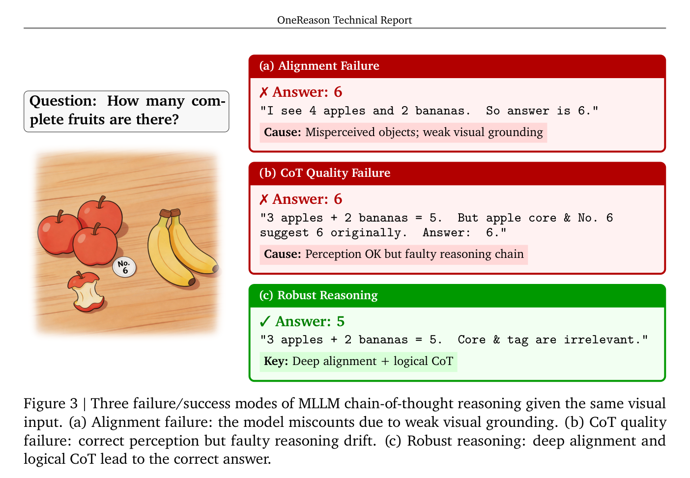

逻辑流畅的认知 CoT 结构，设计用于在此对齐基础上对用户历史和物品属性进行审慎推理。这两个维度作为构建强大推理模型的基石，我们在其中显式地加强文本-物品对齐并设计定制的从粗到细推理格式，使模型真正具备面向推荐的思考能力。

鉴于上述分析，我们提出 OneReason，一个具有真正推理能力的推荐基础模型。具体而言，为获得更好的物品感知能力，我们收集复杂多样的从粗到细对齐预训练语料，将新插入的物品标记与文本标记对齐到同一语义空间。为获得更好的推理认知能力，我们精心设计标准化的思考结构以确保 CoT 质量并构建 SFT 语料。此外，在预训练和 SFT 之后的模型基础上，我们发现思考模式在多领域混合 RL 下仍然不如非思考模式，但在 RL 限制于单一领域时始终优于后者。这一对比促使我们采用"先专精后统一"的 RL 策略——我们首先进行领域聚焦的 RL 以在每个领域内充分释放思考模式的收益，然后应用拒绝采样微调 [Yuan et al., 2023] 或多教师在线策略蒸馏（Multi-Teacher On-Policy Distillation）[Xiao et al., 2026] 进行跨领域平衡和精炼。OneReason 的整体训练流程如图 2 所示。同时，我们还做出了一个有趣的观察：在相同训练 token 数量下，添加推荐 CoT 监督可以在多个领域中提升非思考模式的性能（见图 1 右下面板）。我们将此视为 CoT 轨迹中某些监督信号可能迁移到直接解码的行为证据，而非 CoT 普遍必要或机制已被识别的证明。

为评估我们模型在推荐场景中的推理能力，我们引入 OneReason-Bench，一个精心策划的面向推理的推荐基准测试集合。该基准测试沿多个轴组织，旨在以全面和结构化的方式评估推理能力，并在指导和验证我们的模型开发中发挥了核心作用。如图 1 所示，我们的 OneReason 模型在该基准测试中取得了优越的性能，展示了其稳健的推理能力。为促进生成式推荐模型的研究，我们将向公众开源 OneReason-8B 和 OneReason-0.8B 模型及其他微调相关材料。

## 2. 推理设计哲学（Reasoning Design Philosophy）

在详细描述架构和训练方案之前，我们首先概述推荐推理的设计原则：什么是推荐中好的 CoT 轨迹？在涉及数学、代码或符号逻辑的经典 LLM 推理任务中，通常假设存在维持任务约束并应用相关世界知识来逐步逻辑回答问题的中间步骤。与具有单一正确答案的经典推理任务不同，推荐同时允许多个合理物品，且底层用户意图从不可直接观察；它必须从一长串历史物品标记序列中推断（其中每个完整序列代表某个物品）。因此，推荐推理是溯因的（Abductive）而非演绎的（Deductive）：它需要假设潜在兴趣点，建模它们如何随时间演化，并用它们来证明为什么特定候选物品适合当前上下文。换言之，推荐 CoT 应该选择相关行为作为假设的兴趣点，将它们压缩为可解释的偏好，建模这些兴趣之间的时间转移，最终将推断的偏好状态与推荐物品关联。

这一区别驱动了我们的训练和评估设计。我们将推荐推理分解为沿两个维度的四个诊断能力：（1）感知（R0），将物品标记锚定到其语义内容；（2）认知（R1-R3），在坚实的感知基础上构建逐步深入的推理。

- **R0：感知（Perception）**。通过显式语义内容解释物品模式是基础能力；没有它，用户行为不可解释。
- **R1：推导（Derivation）**。从单个物品语义推理到物品间关系，通过常识或知识关联；没有它，潜在兴趣无法从嘈杂的交互历史中提取。
- **R2：演化（Evolution）**。将同一潜在兴趣的物品作为时间过程进行推理；没有它，长期、短期和周期性偏好无法建模。
- **R3：推荐（Recommendation）**。连贯推理以在所有服务领域（如短视频、直播）产生高质量决策。

紧随其后的章节将此层次结构操作化为评估工具，使从预训练（第 4 节）到后训练（第 5、6 节）再到部署（第 9 节）的轨迹可以在每一步都对照相同的诊断轴进行衡量。

## 3. 推理推荐的基准测试设计（Benchmark Design for Reasoning Recommendation）

将基准测试置于模型描述之前是刻意为之的：四粒度预训练（第 4 节）、压缩后推理的 SFT（第 5 节）和先专精后统一的 RL（第 6 节）各自由 OneReason-Bench 的 R0-R3 层揭示的特定差距所驱动。因此，基准测试的功能不是排行榜，而是一个测量协议，用于证明、监控并最终验证每个下游设计选择。

虽然 OpenOneRec [Zhou et al., 2026] 中的 RecIF-Bench 拓宽了推荐基础模型的评估，但其推理评估仍然粗粒度且诊断性不足。为解决这一问题，我们开发了 OneReason-Bench，将 RecIF-Bench 扩展为多级推理评估。

### 3.1. 任务分类体系（Task Taxonomy）

OneReason-Bench 将面向推理的基准测试任务组织为渐进层次结构：感知（R0）、推导（R1）、演化（R2）和推荐（R3）。这些推理层从语义锚定进展到关系和时间推理，最终到集成推荐任务。表 1 总结了分类体系，示例见图 4。

**统一任务形式化**。所有任务被形式化为序列生成 $Y = F(X)$，其中 $X$ 结合了任务指令 $I$ 和上下文 $C$（如物品模式、用户画像或交互历史）。目标 $Y$ 可以是物品模式、答案选项、自然语言响应或结构化演化链，使 R0-R3 任务共享统一的生成式评估协议。

*Table 1 | Task taxonomy of OneReason-Bench organized across four reasoning layers.*

#### 3.1.1. R0：感知（Perception）

感知将物品模式锚定到显式语义内容，为更高级推理和推荐提供语义基础 [Zheng et al., 2024a; Zhou et al., 2026]。我们用三种任务类型实例化此层：

- **物品理解（Item Understanding）**：给定物品 $i$，模型生成其自然语言描述，从物品模式中解码物品语义。
- **物品模式锚定（Itemic Pattern Grounding）**：给定自然语言描述，模型将其锚定到对应物品。
- **物品问答（Item QA）**：给定物品 $i$ 和基于内容的多选选项 $O_a$，模型选择正确选项，评估其能否使用物品语义回答针对性问题。

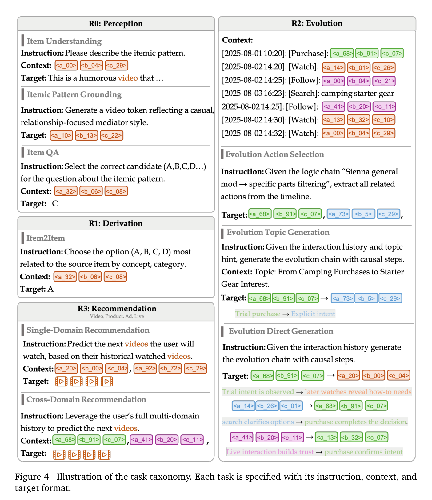

#### 3.1.2. R1：推导（Derivation）

在感知基础上，推导评估模型能否从单个物品语义推理到物品间关系（基于常识或知识关联）。

- **物品到物品（Item2Item）**：给定源物品 $i$ 和候选物品集 $O_{item}$，模型选择最匹配目标物品间关系的物品。

#### 3.1.3. R2：演化（Evolution）

演化评估模型能否将用户兴趣作为时间过程而非静态偏好画像进行推理。我们设计了三个自主性递增的任务变体，从提取主题相关行为到生成主题引导或完全自主的演化链：

- **演化行为选择（Evolution Action Selection）**：给定历史 $H$ 和指定兴趣主题 $t$，模型识别与该主题逻辑相关的历史行为 $A$。
- **演化主题生成（Evolution Topic Generation）**：给定历史 $H$ 和指定兴趣主题 $t$，模型生成描述该兴趣如何发展的演化链 $E_t$。
- **演化直接生成（Evolution Direct Generation）**：仅给定历史 $H$，模型在无主题引导下自主生成有效的兴趣演化链 $\{E\}$。

此层评估关于用户行为的多跳、时间结构化推理，提供从物品级推理到上下文感知推荐的桥梁。

#### 3.1.4. R3：推荐（Recommendation）

虽然前述任务聚焦于特定的 R0-R2 能力，真实推荐场景通常要求模型灵活组合感知、推导和演化能力。因此我们引入集成推荐任务以评估模型在实际推荐设置中的整体推理能力。我们在两种设置下评估：

- **单领域推荐（Single-Domain Recommendation）**：给定用户画像 $P$ 和用户在目标领域（短视频、广告、电商或直播）的交互历史 $H_d$，模型预测用户将参与的下一批物品。
- **跨领域推荐（Cross-Domain Recommendation）**：给定用户画像 $P$、用户的多领域交互历史 $H$ 和指定目标领域 $d$，模型预测该领域的下一批物品。

详细构建流程、R3 数据统计和与现有推荐基准测试的比较见附录 B.1 和 B.2。

### 3.2. 评估协议（Evaluation Protocols）

我们采用一组任务特定指标来覆盖推荐准确性、问答正确性、兴趣演化推理和开放式生成质量。

**文本生成指标**。对于物品理解任务，我们复用 OpenOneRec [Zhou et al., 2026] 中引入的 LLM-as-a-Judge 协议，不修改其指标定义。

**选择指标**。对于单答案选择任务（如物品问答和物品到物品），我们报告准确率（Accuracy）。对于多答案选择任务（包括演化行为选择），我们报告在预测集和真实集上计算的 F1。

**演化生成指标**。演化主题生成和演化直接生成通过行为-逻辑分数（Action-Logic Score）系列评估。该指标系列结合了生成链与真实演化链之间的行为对齐以及对应推理陈述之间的逻辑对齐。这些指标的详细实现见附录 B.4.2。

**推荐指标**。对于推荐和物品模式锚定任务，我们报告 Pass@$K$ 和 Recall@$K$。Pass@$K$ 表示至少一个真实目标是否出现在 top-$K$ 生成输出中，而 Recall@$K$ 衡量在 top-$K$ 列表中恢复的真实目标比例。生成的物品模式首先解码为物品 ID，然后在物品粒度上计算指标。

### 3.3. 通用智能健全性检查（General-Intelligence Sanity Check）

遵循 OpenOneRec [Zhou et al., 2026]，我们还保留了通用智能健全性检查套件，覆盖 MMLU-Pro [Wang et al., 2024] 等通用任务，以确保推荐专业化不以牺牲通用推理或指令遵循能力为代价。

诊断轴（R0-R3）和通用智能护栏就位后，我们准备描述 OneReason-Bench 旨在评估的训练栈。下一节从感知基础——物品标记化和四粒度预训练数据——开始，R0 直接探测该基础，每个更高阶能力都建立在其上。

## 4. 预训练流程（Pre-Training Pipeline）

本节详述我们的预训练方法。我们首先在第 4.1 节描述物品标记器。第 4.2 节随后介绍我们的核心贡献：一个四粒度数据体系，层次化地整合推荐语料与通用领域数据以实现深度模态对齐。第 4.3 节系统性地消融每个粒度以量化其对模型整体性能的具体贡献。最后，第 4.4 节概述将此数据设计操作化的三阶段训练方案，从词汇预热到全规模训练。

### 4.1. 物品标记器（Itemic Tokenizer）

为获得紧凑且语义锚定的物品嵌入，我们在物品理解任务上联合训练多模态编码器和解码器 LLM。编码器集成了视觉 Transformer（ViT）[Radford et al., 2021] 和从开源 Qwen3-VL [Qwen3 et al., 2025] 初始化的 LLM，以及音频编码器 [Vyas et al., 2026]。它将丰富的内容信号——包括封面图片、视频帧、文本描述和音频——蒸馏为紧凑的稠密嵌入。为以端到端方式优化物品嵌入，我们将嵌入作为软前缀（Soft Prefix）添加到单独的解码器 LLM 前，后接物品的文本描述。

我们通过 RQ-KMeans [Luo et al., 2025] 量化这些嵌入。我们使用三层码本（Codebook），每层包含 8192 个码字。每个物品因此由一个物品模式表示，包含一个领域感知的起始标记和三个子标记。例如，物品模式格式为：

`<|domain_begin|><a_5028><b_6733><c_2559>`

其中 domain 是我们四个推荐场景的 video（视频）、prod（商品）、ad（广告）或 living（直播）之一，或通用领域多模态数据的 sid。与 OpenOneRec [Zhou et al., 2026] 不同，我们去掉了尾部结束标记。这减少了物品模式消耗的整体上下文长度，为对我们思考范式至关重要的推理轨迹留出更多容量。

### 4.2. 预训练数据（Pre-Training Data）

先前的生成式推荐工作，包括 OneRec-Think 和 OpenOneRec，按任务类型组织预训练数据——物品描述、用户行为序列和画像-文本交错——并混合进行联合训练。虽然这建立了物品模式与自然语言之间的基本映射，

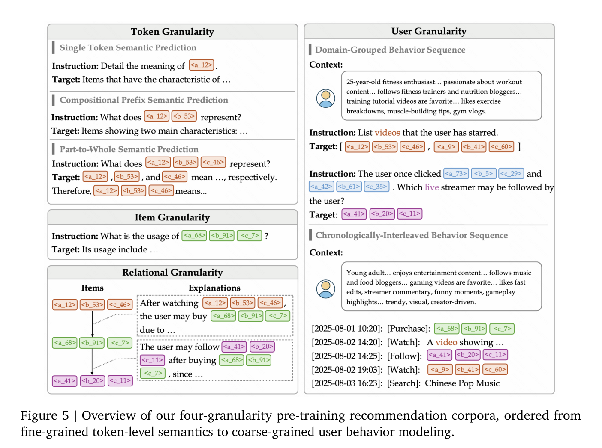

但它留下了三个结构性缺口。首先，物品和用户的语义表达趋于同质化，限制了模型遇到的语言多样性并削弱了表征鲁棒性。其次，数据组织停留在任务层面，没有显式建模物品标记内部的细粒度语义层次或物品间的关系逻辑。第三，用户行为建模依赖于狭窄的条件范式，其中完整用户画像映射到完整行为序列，限制了模型在多样推荐上下文中泛化的能力。

为解决这些缺口，我们将预训练语料重构为四个渐进粒度，从微观标记语义到宏观用户行为。这种层次化设计沿三个轴系统性地扩展文本与物品模态之间的对齐：更广泛的表达多样性；从子标记组合到物品间关系的显式结构推理；以及更丰富的用户建模条件模式。

#### 4.2.1. 推荐语料（Recommendation Corpora）

为实现文本与物品模态之间深度无缝的融合，如图 5 所示，我们将预训练语料结构化为四个渐进粒度：

- **标记粒度（Token Granularity）**数据聚焦于单个或组合的子物品标记语义，在最细粒度实现模态对齐。
- **物品粒度（Item Granularity）**数据将物品模式与文本模态对齐。它将跨模态融合推进到完整物品层面，利用多视角任务和多样化物品来源将完整物品模式与全面文本描述匹配。
- **关系粒度（Relational Granularity）**数据通过自然语言解释物品间的连接。它总结关联物品的兴趣转移逻辑，使协同信号能够编码到文本表征和模型参数中。
- **用户粒度（User Granularity）**数据通过使模型在统一的个性化用户上下文下理解和生成多模态内容来完成彻底的跨模态融合。

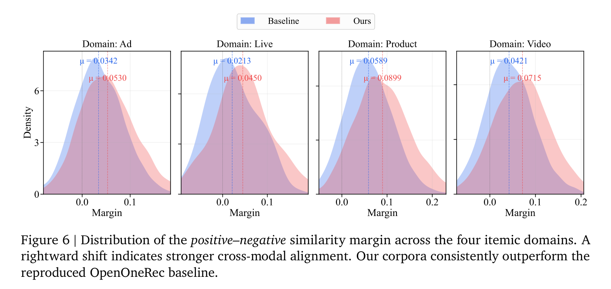

关于四粒度数据的详细构建方法、消融实验和训练方案，请参见原文第 4.2-4.4 节及附录 C。

---

## 5. SFT 流程（SFT Pipeline）

在预训练建立了物品标记与文本标记之间的语义对齐之后，SFT 阶段在此感知基础上构建结构化的推荐认知能力。SFT 数据按照 R0-R3 层次组织，每一层对应一种特定的推理能力。

### 5.1. R0：物品感知数据（Itemic Perception Data）

R0 数据确保模型能够将物品标记锚定到其语义内容。它包括物品理解（从物品模式生成自然语言描述）、物品模式锚定（从描述映射到物品模式）和物品问答（基于物品内容回答多选题）三类任务。

### 5.2. R1：推导数据（Derivation Data）

R1 数据训练模型从单个物品语义推理到物品间关系。物品到物品（Item2Item）任务要求模型在候选集中选择与源物品最匹配的目标物品。

### 5.3. R2：演化数据（Evolution Data）

R2 数据训练模型将用户兴趣作为时间过程进行推理。包括演化行为选择、演化主题生成和演化直接生成三个自主性递增的任务变体。

### 5.4. R3：推荐推理数据（Recommendation Reasoning Data）

#### 5.4.1. 推荐推理轨迹的构建

推荐推理轨迹（CoT）的构建遵循三阶段压缩-推理协议：人格抽象（Persona Abstraction）、兴趣扩展（Interest Expansion）和转移推断（Transition Inference）。

**人格抽象（Persona Abstraction）**。人格抽象的目标是将稀疏且嘈杂的行为证据压缩为紧凑、可解释的先验。给定用户画像和交互历史，教师模型识别最可能的用户原型，或在用户不符合任何预定义类别时总结定制化画像。该抽象是一个软的、类型化的用户状态而非确定性标签：它缩小了可能的兴趣方向集合，但最终推断仍必须基于观察到的行为。此阶段通过将高维行为日志转换为少量偏好因子（如家庭消费需求、游戏技能提升、直播购物敏感度、食物偏好、健身目标或共享设备模糊性）来减少转移判断的搜索空间。表 7 给出了代表性的中文人格抽象案例及英文分析。

**兴趣扩展（Interest Expansion）**。在人格抽象之后，模型执行兴趣扩展，使轨迹不会过早地锁定单一解释。此阶段从兴趣演化类型压缩开始：它从近期轨迹证据中识别类型化的模式（Motif），如搜索触发的需求、从宽泛类别到具体参数的细化、从内容到产品的场景延续、或直播/商品/广告/视频行为之间的跨领域回响。然后将这些模式展开为一小组候选下一兴趣假设。这样，兴趣扩展既足够宽泛以表示推荐不确定性，又足够紧凑以防止轨迹被原始行为标记淹没。

我们使用四个启发式规则保持扩展的广泛性和证据基础性：行为动机（解释信息性行为背后的意图，特别是搜索查询）；时间敏感性（尊重事件顺序并解释后续行为如何从先前行为演化）；转移覆盖（当用户似乎从一个主题转向另一个时，保留合理的前后方向作为候选）；噪声衰减（降低常规补货、随机消费、重复曝光和一次性行为的权重）。

具体而言，兴趣扩展要求推理轨迹达到证据支持的最细可靠粒度。如果历史支持对特定手游的兴趣，轨迹不应停留在通用游戏类别；如果用户反复参与某种戏曲流派，轨迹应提及该流派而非仅"传统文化"。为校准此阶段应有多宽泛，我们在 SFT 轨迹构建期间变化兴趣扩展宽度 $n$ 并评估四个领域的思考模式推荐质量。图 8 显示了一致的模式：保持扩展紧凑（$n \in \{1, 3, 5\}$）始终优于更宽的宽度如 10 或 20。

**转移推断（Transition Inference）**。以下约束使最终判断面向决策且防泄漏：证据优先（由重复行为、主动搜索或近期密集交互支持的候选方向获得更高权重）；转移桥接（轨迹应解释从早期证据到后期意图的桥梁，有效桥梁包括反馈、瓶颈、认知细化、场景延续、参数缩窄或需求完成）；粒度校准（最终判断应尽可能具体到证据允许的程度）；冲突解决（当多个方向合理时，轨迹比较它们与人格先验、近期行为、长期兴趣和目标领域的契合度）；泄漏控制（推理必须写成答案未知的形式，不得复制目标标题或暴露目标物品 ID）。

通过人格抽象、兴趣扩展和转移推断，合成的 CoT 变得紧凑、细粒度且面向决策。前两个阶段对行为历史去噪并组织假设空间，最后阶段通过复用 R1 桥接推理和 R2 演化推理来比较候选转移。

#### 5.4.2. 推理轨迹的质量评估

推荐推理轨迹的质量沿五个互补维度评估：安全性（Safety，检查 CoT 轨迹是否直接暴露目标内容）；一致性（Consistency，评估轨迹结论是否与预期推荐目标对齐）；逻辑性（Logic，衡量轨迹是否展示可迁移和可泛化的推理）；事实性（Factuality，确保轨迹准确反映观察到的用户历史）；信息性（Informativeness，评估推理是否提供有用且具体的推荐指导）。

图 9 总结了这五个维度的得分分布和均值画像。安全性得分最高（4.94），表明轨迹很少泄漏目标信息；事实性（4.09）次之；一致性（3.66）、信息性（3.53）和逻辑性（3.51）相对较低但仍在可接受范围。

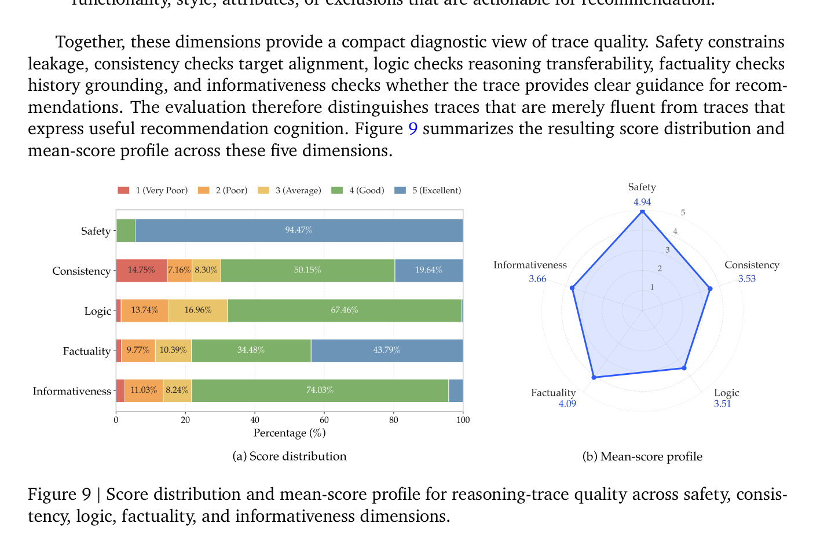

### 5.5. 物品指令数据（Itemic Instruction Data）

物品指令数据改善了当物品标记显式出现在输入上下文中时的指令遵循行为。它通过确保物品标记丰富的输入保持指令可控性来补充压缩-推理骨干，而非被自动解释为推荐推理提示。我们观察到预训练模型在此类设置中经常表现不稳定：模型可能忽略请求的任务、解释特定物品标记的含义，或隐式地将输入重新解释为用户兴趣分析问题。

为解决此问题，我们构建了以物品标记为基础的任务执行专用指令微调数据集。主要任务组包括：转换与编辑（在物品标记和自然语言之间转换）；检索与选择（根据时间、行为、属性约束检索物品标记）；匹配与分类（将自然语言描述与候选物品标记匹配）；比较与聚合（比较物品标记或标记组）；生成与验证（基于物品标记链接内容生成描述）；指令控制（训练模型即使在物品标记作为干扰上下文出现时也遵循用户指令）。

最终物品标记指令数据集包含约 103.0K 个样本。

### 5.6. 通用领域数据（General-Domain Data）

为保持通用指令遵循能力并缓解推荐导向 SFT 期间的过度专业化，我们纳入了 StepFun 发布的公开 Step-3.5-Flash-SFT 数据集作为通用领域数据源。经过保守预处理后，最终语料包含约 150 万高质量 SFT 样本，混入训练数据以维持广泛的指令遵循能力。通用领域数据因此作为推荐认知周围的稳定器，防止模型过拟合到物品标记推理格式。

总体而言，此 SFT 阶段在对齐的物品感知之上构建结构化推荐认知：R0 锚定物品标记，R1 提供证据基础的推导，R2 提供时间演化监督，R3 组合这些能力用于下一交互预测。由于 R3 轨迹仍是教师生成的，尚未通过推荐结果反馈优化。下一阶段通过面向推荐的 RL 闭合此循环。

---

## 6. RL 流程（RL Pipeline）

SFT 阶段之后，模型已获得通用语义理解、指令遵循能力和初步的推荐导向推理能力。然而，SFT 主要使模型模仿教师生成的推理轨迹，性能仍主要受限于教师模型的能力。由于模型已接触大规模推荐数据并发展出强大的推荐能力，自然的下一步是检验模型能否超越模仿，通过自我探索进一步提升推荐推理。

然而，对于支持跨领域多样任务的基础推荐模型，直接在混合领域数据上应用 RL 可能导致跨领域干扰，因为不同领域通常涉及不同的用户意图、物品语义和奖励景观。为缓解此问题，我们采用"先专精后统一"策略。如图 10 所示，我们首先通过 RL 在每个推荐领域分别优化模型，得到四个专精于领域特定推荐推理的教师模型。然后我们研究两种方法将这些领域特定能力整合为一个统一模型：拒绝采样微调（RFT）和多教师在线策略蒸馏（MOPD）。

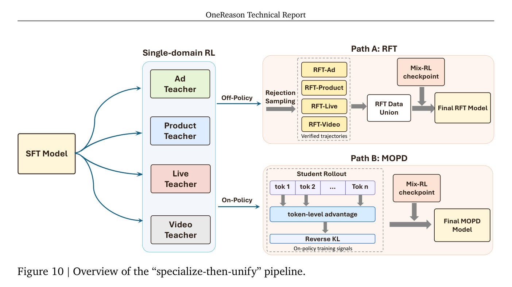

### 6.1. 面向推荐的强化学习（Recommendation-oriented RL）

我们首先使用 GRPO [Shao et al., 2024] 在每个推荐领域分别优化模型，模型生成轨迹并根据预测正确性接收结果反馈。

**面向推荐的 GRPO**。对于用户 $u$ 及其上下文（查询）$q$，模型将其作为输入并采样一组推荐 rollout，每个 rollout 由推理轨迹和生成的物品标记组成。形式化地，令 $\mathcal{G}_u = \{(\text{CoT}_{u,i}, \mathbf{c}_{u,i})\}_{i=1}^G$ 表示为用户 $u$ 采样的 $G$ 个 rollout 组，其中 $\text{CoT}_{u,i}$ 是生成的推理轨迹，$\mathbf{c}_{u,i}$ 是对应的物品标记。每个 rollout 由结果奖励 $R_{u,i}$ 评估，衡量生成的物品标记是否匹配目标推荐。GRPO 然后在同组内归一化奖励以获得相对优势：

$$\hat{A}_{u,i} = \frac{R_{u,i} - \text{mean}\{R_{u,k}\}_{k=1}^G}{\text{std}\{R_{u,k}\}_{k=1}^G + \delta}$$

其中 $\delta$ 是为数值稳定性添加的小常数。模型被优化以增加高优势 rollout 的概率。

**Rollout 设计**。虽然 GRPO 是增强推荐推理有效性的强大工具，但直接将其应用于推荐任务仍面临实际挑战。推荐任务的本质——模型从巨大候选空间中预测用户兴趣——导致固有的低命中率，需要足够大的 rollout 规模以获得有用的奖励信号。这对推理增强推荐尤其昂贵，因为每次推荐前都有推理轨迹。

为解决此问题，我们设计了针对推荐导向 RL 的两阶段 rollout 策略。如图 11 所示，核心思想是将推理成本分摊到多次推荐上。对于每个用户 $u$，我们首先采样 $N$ 条推理轨迹 $\{\text{CoT}_{u,i}\}_{i=1}^N$。以每条推理轨迹为条件，模型并行生成 $K$ 个物品标记序列 $\{\mathbf{c}_{u,i,j}\}_{j=1}^K$。这产生 $N \times K$ 个有效推荐 rollout，同时仅生成 $N$ 条推理轨迹。由于额外扩展仅限于短物品标记，奖励覆盖率在有限的额外计算和内存开销下显著提升。

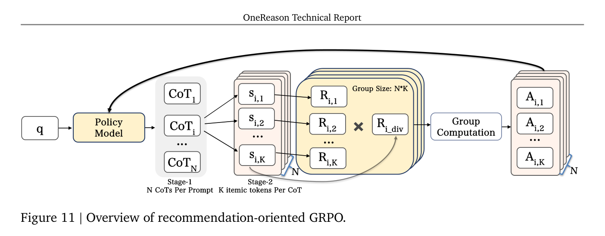

**奖励设计**。推荐任务聚焦于集合级优化，模型应检索一组相关物品而非仅优化单一预测。由于用户兴趣通常是多面的，理想的推理轨迹应覆盖满足用户兴趣的多样相关物品。因此，给定两阶段解码过程产生的 $N \times K$ 个 rollout，我们为每个 rollout 分配混合奖励，同时考虑物品级准确性和每条推理轨迹引发的推荐多样性：

$$R_{u,i,j} = R_{\text{rule}}(\mathbf{c}_{u,i,j}) \cdot R_{\text{div}}(\text{CoT}_{u,i})$$

其中 $R_{\text{rule}}$ 是基于规则的准确性奖励（当生成的物品标记匹配真实目标时为 1），$R_{\text{div}}$ 是多样性奖励，鼓励同一推理轨迹下的不同推荐覆盖不同物品。

**优化稳定性设计**。为进一步稳定稀疏推荐奖励下的 GRPO，我们应用样本级重要性重加权方案。由于只有少部分 rollout 命中真实目标，大多数 rollout 获得零奖励并贡献负相对优势。不进行重加权时，这些大量未命中样本可能主导聚合梯度并推动策略向过度保守的更新方向发展。我们为每个 rollout 根据其命中状态分配标量权重：命中时权重为 1.0，否则为 $\beta < 1$。

**消融研究**。图 13 展示了两阶段 rollout 设计的消融结果：两阶段 rollout 通过复用每条生成的推理轨迹跨多个物品标记序列，大幅减少了每步训练时间，同时性能结果显示一致的增益。图 14 展示了多样性奖励的消融：鼓励同一推理轨迹下后续物品标记序列的多样性有助于模型检索更广泛的潜在物品集合，在较大 $K$ 值时改进更为显著。图 15-16 分别展示了阶段式裁剪（Stage-wise Clipping）和负样本降权的消融，两种设计都有助于更稳定的训练和更好的性能。

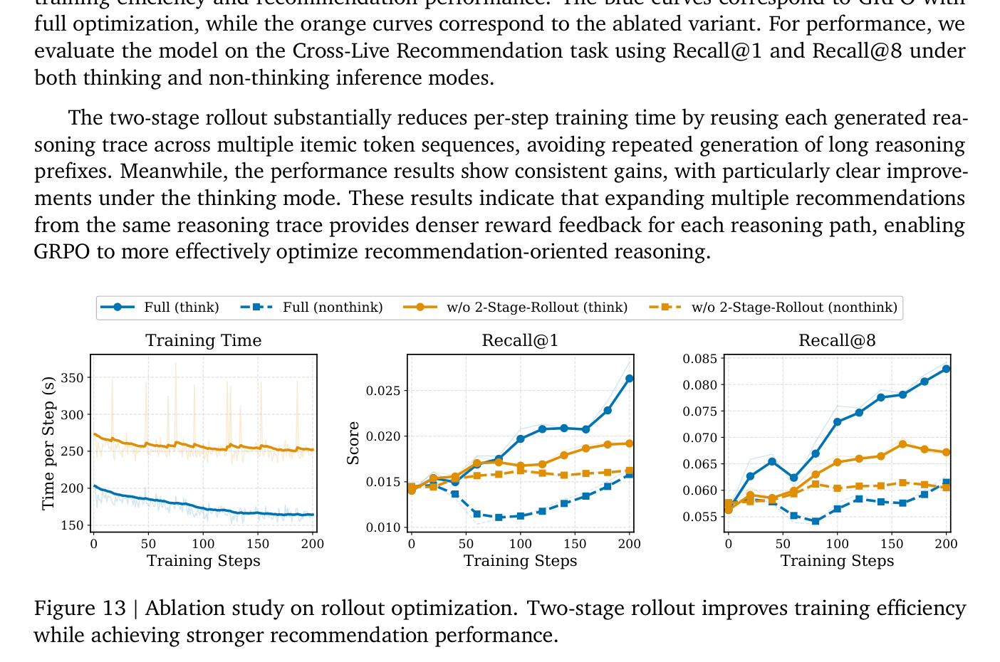

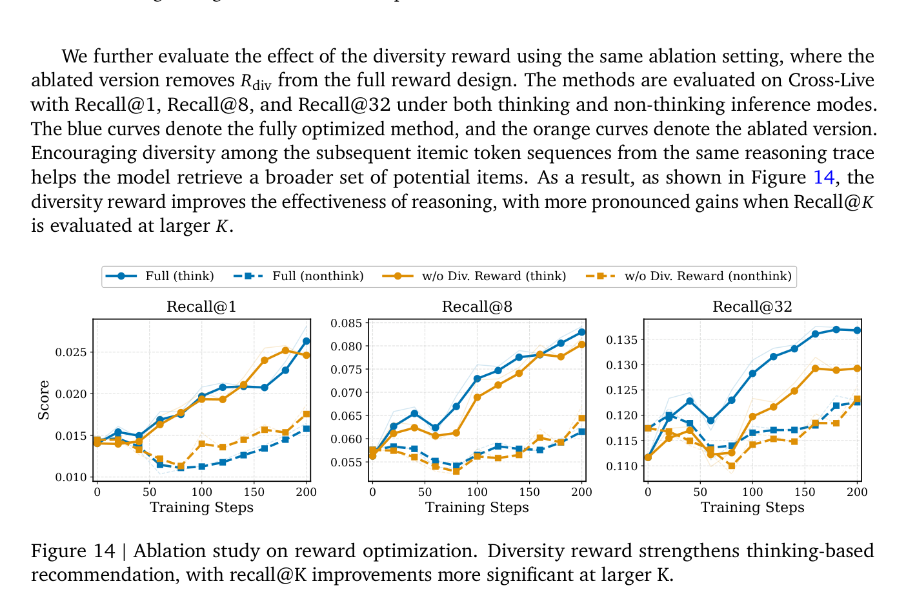

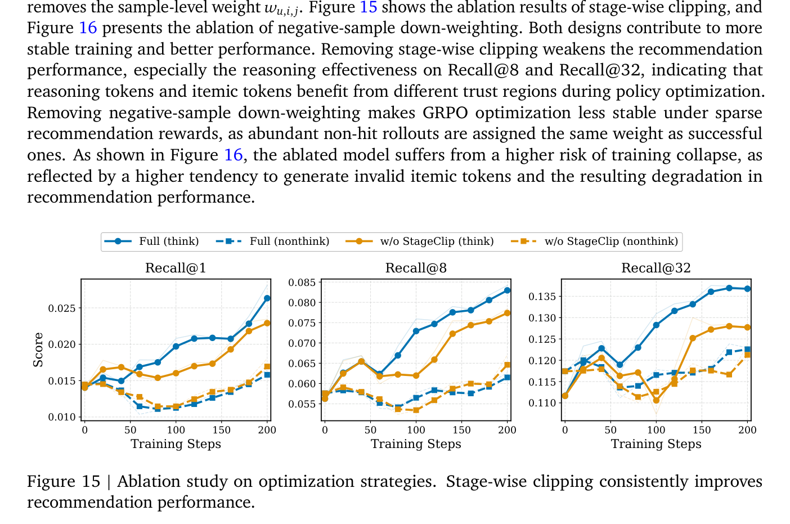

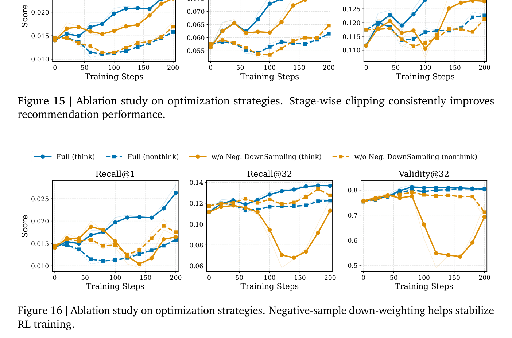

### 6.2. 拒绝采样微调（Rejection Fine-Tuning, RFT）

RFT 通过在领域专精教师模型采样的经验证高质量推理轨迹上微调模型来整合领域特定能力。图 17 展示了 RFT 相对于混合领域 RL（Mix-RL）在 Recall@K 上的相对增益。RFT 在 Recall@1 上并不总是改进，特别是在 Cross-Product 和 Cross-Live 上，但随着 $K$ 增大，RFT 在各领域一致展现更强优势。这一趋势表明 RFT 更少聚焦于锐化单一顶部预测，而更有效地改善候选覆盖率——这更符合推荐的目标。

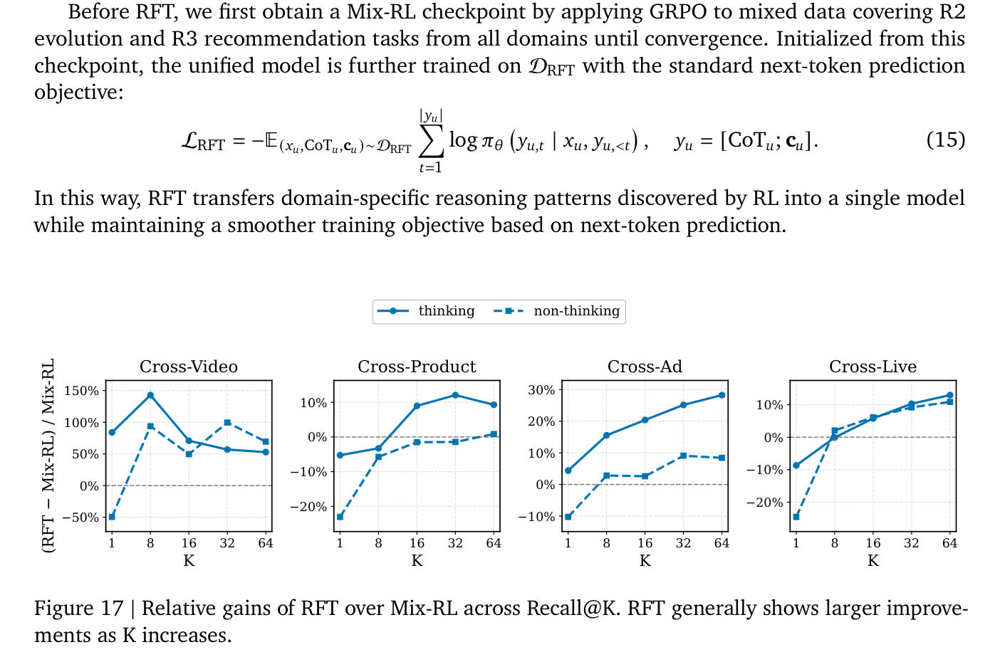

### 6.3. 多教师在线策略蒸馏（Multi-Teacher On-Policy Distillation, MOPD）

本节介绍多教师在线策略蒸馏，以在线策略方式将四个领域的专精能力整合到统一的学生模型中。我们采用蒙特卡洛 RL 公式化，即对数概率比仅在学生自身每步采样的标记上评估。教师因此仅需在采样标记处提供单点对数概率，无需提供完整词汇分布。

**MOPD 目标**。形式化地，令 $\mu_\theta$ 表示部署在推理引擎中用于轨迹生成的学生行为策略，$\pi_\theta$ 表示在训练引擎中被主动优化的策略。对于给定提示 $x$，我们首先采样完整 rollout $y = (\text{CoT}; \mathbf{c}) \sim \mu_\theta(\cdot | x)$。基于 $x$ 所需的特定能力领域，我们将提示路由到对应的领域专家教师 $\pi_{\text{domain}_i}$。在自回归两阶段 rollout 的每个时间步 $t$，我们定义反向 KL 目标下的标记级蒸馏优势：

$$\hat{A}_{\text{MOPD},t} = \text{sg}\left[\log \pi_{\text{domain}_i}(y_t | x, y_{<t}) - \log \pi_\theta(y_t | x, y_{<t})\right]$$

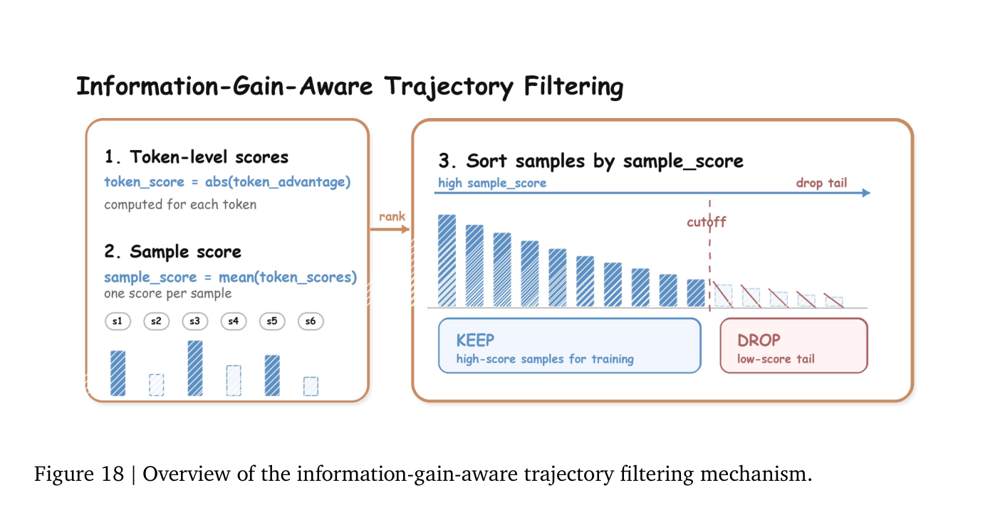

**优化：信息增益感知的轨迹过滤**。生成式推荐固有地面临巨大物品候选空间和高度稀疏的用户兴趣信号。在在线策略训练中，这转化为轨迹 rollout 期间极低的命中率。当将 MOPD 应用于此类环境时，统一对待所有采样 rollout 会导致严重的梯度稀释问题。为解决此问题，我们采用信息增益感知的轨迹过滤机制。我们利用标记级优势差距作为信息增益的无标签指标，动态丢弃低信息轨迹，迫使学生聚焦于最不相似和最具信息量的 rollout。

给定训练批次 $\mathcal{B}$ 和目标信息增益比率 $\rho$（如 $\rho = 0.8$），我们按信息性得分降序排列所有采样 rollout，确定覆盖目标信息增益比率的最小前缀长度 $M$，仅保留前 $M$ 个轨迹用于优化。

**性能分析**。如图 19(a) 所示，所提出的训练范式在所有评估领域产生严格正向的性能增益。值得注意的是，相对改进随 $K$ 增大而扩展。图 19(b) 显示学生在 $K \leq 16$ 时与教师完美对齐或超越教师，但在 $K > 16$ 时仍存在差距——这是反向 KL 目标的基本理论限制。

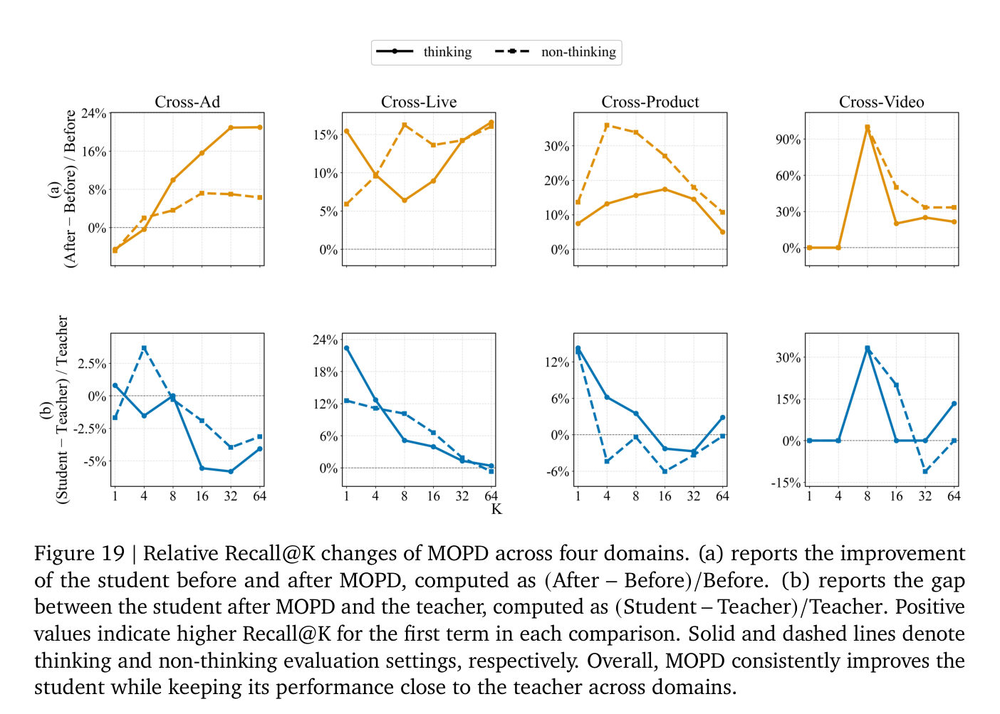

**消融研究**。图 20 展示了信息增益过滤对 MOPD 性能的影响：IG 过滤在大多数领域和评估设置中带来一致增益，特别是在较大 $K$ 值时。图 21 展示了策略梯度损失：无过滤的 MOPD 表现出更大方差和陡峭的初始下降，而有过滤的 MOPD 显著抑制梯度噪声，实现更平滑稳定的收敛。图 22 展示了不同学生选择的影响：所有三种学生（SFT、SFT→RFT、SFT→Mix-RL）都能从 MOPD 训练中受益，表明教师的上限限制了 MOPD 改进的程度。

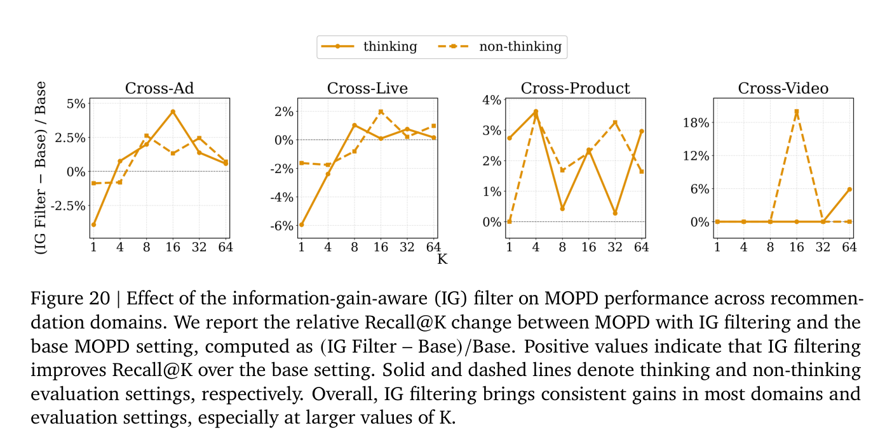

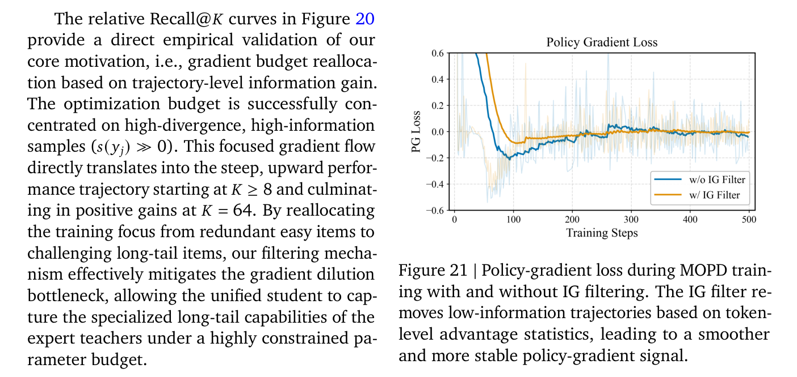

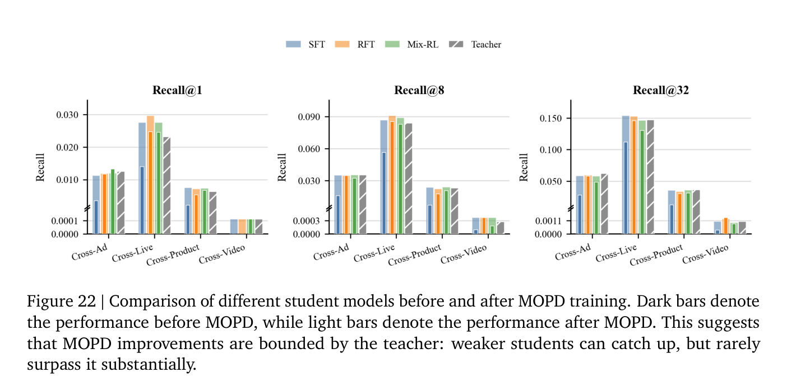

### 6.4. 比较与讨论

本节比较五种优化策略的推荐准确性：SFT 检查点、混合领域 RL、领域特定 RL、RFT 和 MOPD。评估在跨领域推荐设置下进行。

如表 9 所示，所有后 SFT 优化方法在所有领域和指标上都大幅超越 SFT 基线，表明从自我探索中学习可以进一步增强超越监督模仿的推荐性能。然而，直接在 RL 期间混合所有领域并不一致地达到最佳性能。与领域特定 RL 相比，混合领域 RL 通常产生较弱的性能，表明异质领域可能引入冲突的优化信号。

两种知识整合方法提供互补收益：RFT 实现强大且稳定的增益，特别是在 Cross-Video 上；MOPD 表现有竞争力并在若干设置中获得最佳结果。总体而言，这些结果支持"先专精后统一"策略的有效性。

我们进一步比较 MOPD 和 RFT 两种整合范式，有以下发现：

- MOPD 和 RFT 展现领域特定优势。MOPD 在 Product 和 Live 领域取得优越性能，甚至显著超越 Live 教师。相反，RFT 在 Video 和 Ad 领域一致产生边际且稳定的优势。
- RFT 一致保证思考模式在所有领域和 $K$ 值上优于非思考模式。相比之下，MOPD 在思考和非思考模式的改进高度同步。

这一分歧由推荐任务的极端奖励稀疏性和两种范式的不同采样动态驱动：RFT 通过离线执行多次 rollout 并严格仅保留产生正确结果的轨迹来绕过探索瓶颈，蒸馏出 CoT 与正确推荐逻辑对齐的"黄金"推理路径；MOPD 依赖在线策略蒸馏，持续对齐学生在所有 rollout 上的生成分布与教师，这种持续蒸馏整体校准了基础的提示到物品语义嵌入，因此非思考能力本身被大幅增强。

---

## 7. CoT 分析（CoT Analysis）

本节通过四个定量标准系统性地分析推荐推理轨迹的质量。

**标准 1：对数似然提升（ΔLL）**。我们定义 $\Delta LL = \log p(y_{\text{GT}} | x, c) - \log p(y_{\text{GT}} | x)$，其中 $x$ 表示输入上下文，$c$ 表示生成的 CoT，$y_{\text{GT}}$ 是真实目标物品模式。正的 $\Delta LL$ 表明以 CoT 为条件增加了模型对正确目标的似然，负值则表明 CoT 分散了模型对历史基础物品模式证据的注意力。

如图 23 所示，SFT 模型在所有领域一致产生负 $\Delta LL$ 值，表明其生成的 CoT 倾向于分散模型对真实目标预测的注意力。相比之下，RFT 模型在所有四个领域实现正 $\Delta LL$ 值，证明 RFT 阶段显著提升了生成 CoT 对真实目标预测的正向贡献能力。

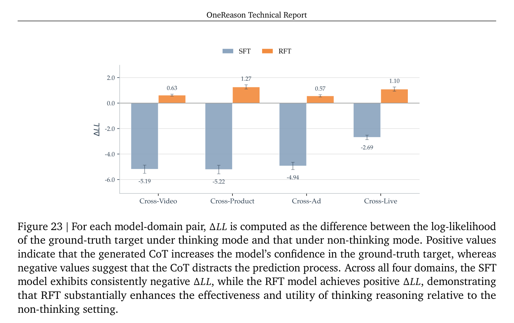

**标准 2：沿 CoT 的对数似然递进**。高质量推理轨迹应随推理过程展开逐步增强模型对真实目标的置信度。如图 24 所示，在思考模式设置下，逐步纳入分段 CoT 前缀一致地改善了两个模型的真实目标条件对数似然。RFT 模型展现出更早的饱和行为，仅在几个推理段后即达到接近最优的似然，这表明并非所有生成的推理标记对预测贡献相同，大部分预测增益可通过缩短的 CoT 实现。

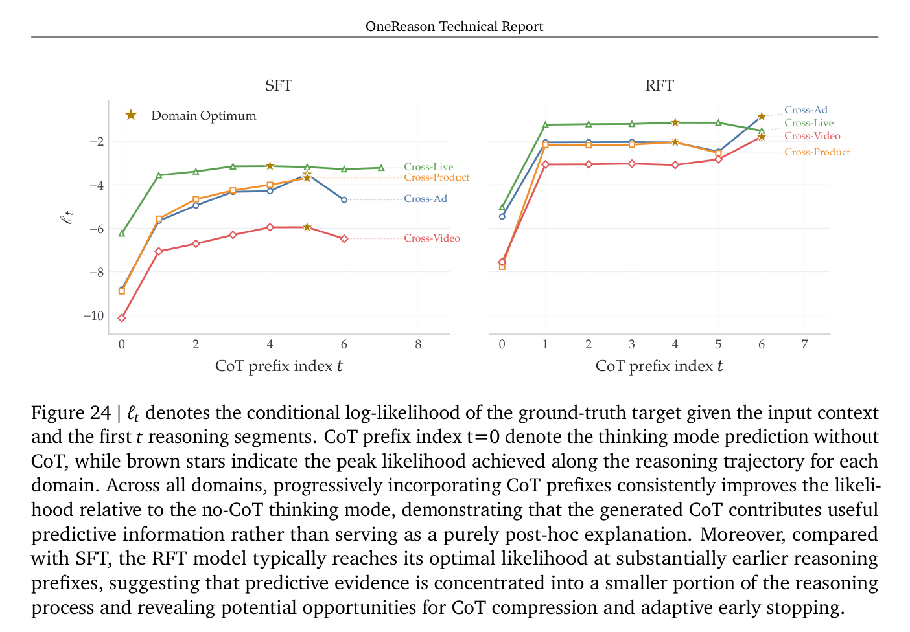

**标准 3：物品合法性**。CoT 中引用的每个物品模式都应对应物品语料库中的有效标识符。如表 11 所示，$\gamma_{\text{legal}}$ 在 SFT 和 RFT 的所有四个领域均已饱和至 1.00。

**标准 4：历史基础性**。在合法物品模式中，我们进一步检查它们是否出现在用户的交互历史中。在 Cross-Video 和 Cross-Ad 上，RFT 相比 SFT 收紧了 $\gamma_{\text{hist|legal}}$（分别 +2.50 pt 和 +4.27 pt）。在 Cross-Live 和 Cross-Product 上，RFT 则表现出适度下降，这与表 9 中 RFT 在这两个领域相对 Mix-RL 的增益较小一致。

**定性说明：SFT vs. RFT 在同一用户上的对比**。我们展示了一个代表性用户案例，SFT 和 RFT 模型在相同输入上下文上产生了显著不同的推理轨迹。该用户是一名 18-23 岁的男性学生，近期交互历史以战术射击直播、智能手机评测和零食购买为主；真实目标是一个关于《三角洲行动》装备的视频——一个需要跨 IP 泛化而非简单历史回放的目标。

SFT 轨迹停留在表面 IP 层面（和平精英→更多和平精英），每个分支都以用户已大量消费的现有 IP 命名，没有抽象到潜在类别轴。最终结论是用户最强历史信号的 IP 内回放。

相比之下，RFT 模型产生的推理轨迹以目录基础的定量先验开头（[游戏] = 69.57%），将候选空间从单一 IP 提升到潜在类别轴（"战术射击"），然后通过弱但历史支持的广告点击信号桥接到《三角洲行动》。关键差异不是词汇润色而是抽象层次：SFT 在表面 IP 名称上推理，而 RFT 在潜在类别轴上推理，因此能够从观察证据桥接到历史中仅弱暴露的目标 IP。

---

## 8. 实验（Experiments）

### 8.1. 性能比较

**基线**。我们在四个跨领域推荐任务上将 OneReason 与代表性基线进行比较，按物品表示方式分组：

- **基于 ID 的方法**：物品由传统物品 ID 表示，包括 SASRec 和 HSTU。
- **基于文本的方法**：物品由自然语言稠密描述表示。此组在零样本协议下评估通用 LLM（Qwen3-8B/32B/235B-A22B、DeepSeek-V3.2、Claude-Opus-4.6、Gemini-3-Preview、GPT-4o-mini、GPT-5.4），LLM 生成潜在相关物品描述，然后通过 Qwen3-Embedding-8B 编码并进行近似最近邻检索。
- **基于物品标记的方法**：物品由物品标记表示，包括 TIGER、LC-Rec 变体和 OneReason 变体。

**推荐性能**。基于表 14 的评估结果，我们强调 ID 基和文本基基线性能有限的主要原因：

- 冷启动敏感性：传统 ID 基模型在跨领域评估中挣扎，因为 33.69% 的目标物品 ID 在训练中未见过；相比之下，仅 11.55% 的目标物品模式未见过。
- 文本基 LLM 推荐的局限：更先进的通用 LLM 不一定产生更好的推荐，表明推荐能力与通用智能或模型规模不可靠相关。其欠佳表现源于协同信号的缺失和基于 ANN 的描述到物品检索引入的误差。
- OneReason 预训练的效果：LC-Rec 结果表明我们的 OneReason 预训练检查点为物品标记推荐提供了强大的语义基础。

**非推荐性能**。表 15 在 OneReason-Bench 上评估 R0-R2 能力。两个发现突出：RFT 思考模式有助于更高级推理（在 R1-R2 上改善平均性能）；OneReason 使紧凑物品标记具有竞争力（即使在输入信息劣势下，OneReason 在 R2 套件的部分任务上超越若干更大的先进 LLM）。

**通用智能健全性检查**。表 16 显示，在思考模式下，OneReason 在四个代表性基准测试（MMLU-Pro、GPQA-Diamond、MATH-500、GSM8K）上保持了其 Qwen3-8B 骨干的通用推理和指令遵循能力，提供了推荐导向训练不会灾难性降低通用能力的初步证据。相比之下，LC-Rec 变体在所有基准测试上遭受实质性退化。

### 8.2. 思考监督对非思考模式的增益

虽然第 5.4.1 节的推荐 CoT 数据旨在提供紧凑、证据基础的推荐推理而非直接优化非思考解码，我们观察到一个重要的下游现象：思考监督可以改善直接推荐，即使在推理时显式推理轨迹被抑制。

我们首先进行控制的 token 对齐实验。比较两种设置：(i) 在 100K unCoT 样本上继续 SFT；(ii) 在 40K CoT 样本和 50K unCoT 样本的混合上继续 SFT。两种设置对齐到相同的 0.25B token 训练预算。表 17 显示，在相同 token 预算下，用 CoT 数据替换部分 unCoT 数据在 Cross-Video、Cross-Product 和 Cross-Live 上改善了非思考性能。

我们进一步进行样本数控制的混合比例扫描。在固定 100K 推荐样本预算下，变化 CoT 和 unCoT 样本的比例。图 25 显示响应曲线并非简单单调，大多数领域展现清晰的中间最优点。Cross-Video 在平衡混合附近达到最佳结果，Cross-Product 偏好更 CoT 重的混合，Cross-Ad 则曲线更平坦且最佳点更靠近 unCoT 侧。

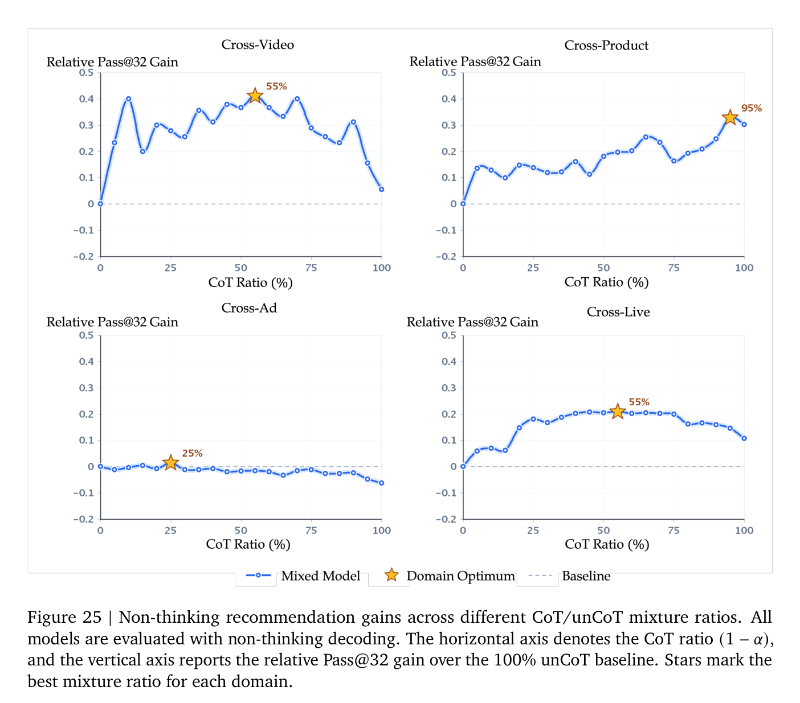

我们将此现象解释为两种监督之间的平衡。unCoT 数据匹配非思考推理格式并直接教模型将用户上下文映射到目标物品标记。CoT 数据提供额外训练信号，包含两个组分：压缩信号（教模型从长行为历史形成紧凑用户兴趣状态）和推理信号（教模型从压缩状态和支持证据连接到目标领域决策）。一个合理假设是，从 CoT 监督中学到的部分紧凑用户状态构建和证据选择偏差仍反映在模型参数中。然而，更多 CoT 数据并非总是更好——CoT 轨迹比 unCoT 答案更长，过多 CoT 训练可能削弱最终目标监督的密度。最佳混合在 CoT 推理信号和 unCoT 直接目标信号适当平衡时获得。

总体而言，这些实验揭示了思考监督对非思考推荐的有用但领域依赖的效果。高质量思考监督可以在适当混合比例下改善大多数领域的直接非思考推荐，但 Cross-Ad 表明 CoT 并非普遍有益。这使 CoT 数据作为推荐基础模型潜在数据飞轮的一部分具有价值。

---

## 9. 部署（Deployment）

在快手 App 快速增长的本地生活广告场景中，我们成功部署了 OneReason。在严格的延迟、强基线和物品可交付性约束下，系统实现了稳定的在线部署，并在快手本地生活广告场景中贡献了最显著的业务提升之一。

### 9.1. 工业场景适配

给定强大且高性能的 OneReason 基础模型，高效地将其适配到特定工业场景成为关键挑战。值得注意的是，快手本地生活广告场景不包含在 OneReason 训练数据中。为此，我们提出了标准化且可复用的持续训练流程，实现快速领域适配。

### 9.2. 工业场景在线部署

由于 LLM 的规模和推理系统的限制，直接部署 OneReason 进行实时推荐仍面临显著的延迟和计算成本挑战。我们提出了 OneReason 的新在线架构——"快慢思考"（Fast-Slow Thinking）架构，并进一步引入在线增量训练策略以确保模型性能。

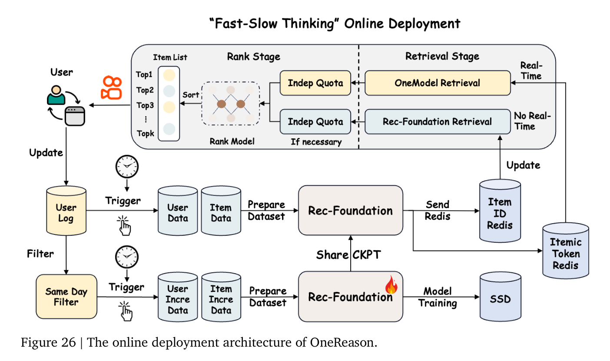

**"快慢思考"架构**。该架构避免完全依赖实时推理，而是引入快（在线）和慢（近线）协作机制，持续将 OneReason 的知识和推理能力注入系统，同时保持低延迟和稳定增益。工作流程包括：

- 步骤 1：流程设计——构建解耦的近线检索流程，不参与早期竞争，而是集成到下游排序模型中与实时 OneRec 输出联合打分。
- 步骤 2：数据集触发——定期聚合分布式数据作业以构建用户行为、画像和物品内容数据。
- 步骤 3：离线推理——加载最新 OneReason 检查点离线预测用户最可能的下一物品标记，然后解码为物品 ID。
- 步骤 4：在线服务——解码的物品 ID 通过离线推理作业写入 Redis，形成在线服务的候选池。

**在线增量训练策略**。在线平台持续引入新物品，用户兴趣和意图也随时间演化。因此需要增量训练机制使 OneReason 适应长期业务演化。包括预训练增量训练（定期在新引入物品上进行持续预训练）和 SFT 增量训练（从用户日志构建每日增量训练数据）。

**OneReason 的两种应用范式**：

- 慢流程：OneReason 直接用于检索，利用用户画像和历史交互序列预测下一物品标记，解码为候选物品列表。
- 快流程：OneReason for OneRec，利用 OneReason 输出增强推荐，将最相关物品标记转换为嵌入表示，在 OneRec 中引入专用 Thinking Token 以整合这些信号。

### 9.3. 在线实验

我们进行了为期 10 天的在线 A/B 实验，在快手 App 本地生活场景的子部分部署 OneReason，使用 5% 流量分配。如表 18 所示，直接使用 OneReason 进行检索和使用其增强实时 OneRec 都在在线 A/B 实验中产生显著改进。组合两种范式实现最佳结果：Impressions +10.332%，Revenue +8.234%，对应快手平台数亿元人民币的年化商业收入。此外，OneReason 实现了 ROI > 5。

---

## 10. 相关工作（Related Works）

随着人工智能的快速发展，利用 AI 重塑工业系统已成为工业界和学术界的主要方向。推荐系统越来越多地采用 LLM 以改善用户体验和业务表现。最近的生成式推荐框架（如 OneRec 系列）展示了强大的建模能力、可扩展性和系统效率。然而，大多数现有方法仍停留在 System-1 单次推理范式内。受 OpenAI O1 和 DeepSeek R1 等推理导向基础模型的启发，研究者开始探索"先思考再生成"范式。

在第一个方向上，TIGER 是生成式推荐的早期工业工作，引入基于 RQ-VAE 的物品标记并将推荐框架化为端到端生成任务。HSTU 进一步用 Transformer 骨干替代传统多阶段流程。OneRec 系列将此范式工程化为统一的预训练和后训练框架。

在第二个方向上，研究聚焦于通过将 LLM 适配到推荐数据来构建推荐基础模型。LC-Rec 表明 LLM 可通过物品 ID 对齐和指令微调理解推荐语义。RecGPT 系列进一步使用 LLM 进行用户意图建模。OpenOneRec 是重要前驱，提出了新颖的"先思考再推荐"范式。

在传统生成式推荐模型中，研究者早期就通过引入显式或隐式推理机制来整合 LLM 的推理能力。由于生成式推荐在推荐空间内运作且缺乏显式 CoT 范式，大多数现有方法采用潜在推理。与这些方法不同，OneReason 的目标是构建工业可部署的 GFM 范式，实现直接基于推理的推荐决策并具有可衡量的在线影响。

---

## 11. 结论与未来工作（Conclusion & Future Work）

在本工作中，我们提出 OneReason，一个将大语言模型和推荐系统连接为单一模型的推理基础模型，实现"有智慧的推荐"。具体而言，我们进行了广泛的修改：（1）在预训练阶段，我们利用内容理解任务而非对比监督来获取离散物品标记，并使用 578B token 对齐物品标记和文本标记语义空间；（2）在 SFT 阶段，我们设计了标准化的从粗到细、逻辑连贯的 CoT 结构以确保思考轨迹的质量；（3）在 RL 阶段，我们进行"先专精后统一"的训练策略以提升思考模式能力，同时平衡多服务间的性能。

借助这些技术，据我们所知，OneReason 是第一个在下游推荐基准测试中思考模式一致优于非思考模式的工作，表明推理可以转化为真实的推荐增益。更有趣的是，我们还发现用思考 CoT 数据替换普通 unCoT 数据可以在若干领域改善非思考推理。这表明 CoT 监督的某些收益可以迁移到直接解码，但压缩与推理之间的因果分离需要进一步消融。此外，我们提出 OneReason-Bench，将面向推理的基准测试任务组织为渐进层次结构以指导模型迭代。对于工业部署，我们提出快慢思考架构，通过近线慢思考和在线快思考的协作持续将 OneReason 的知识注入推荐流程，贡献了显著的业务增益。

未来，我们将探索：（1）更稳定的在线增量学习机制；（2）更定制化的解码和生成策略以适应业务约束；（3）从"先思考再回答"迈向具有规划和工具调用能力的智能体推荐基础模型。我们相信，随着模型压缩、推理基础设施和硬件效率的持续进步，推荐基础模型将成为推荐链的核心组件，逐步推动向智能体推荐架构的演进。

---

**致谢**

感谢 Gaoguo Sun、Peng Zhang、Lixing Zhao、Xinyu Zhang、Xinyue Zhang、Xun Zheng、Zheng Wang 对数据收集和深刻建议的贡献。

