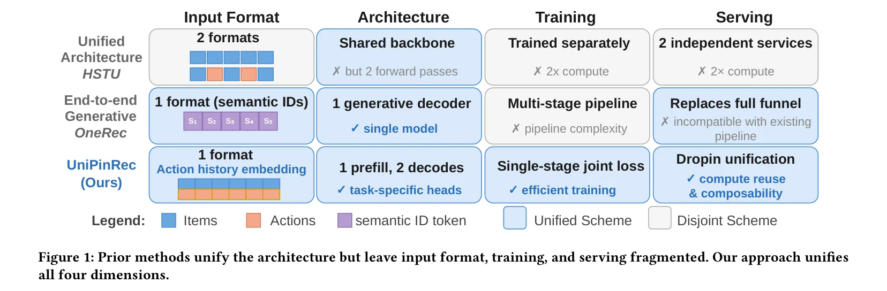
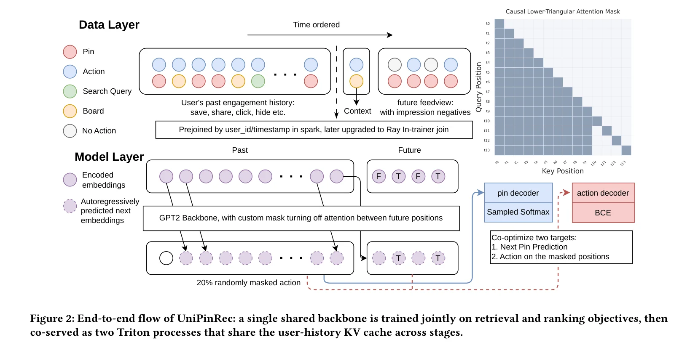
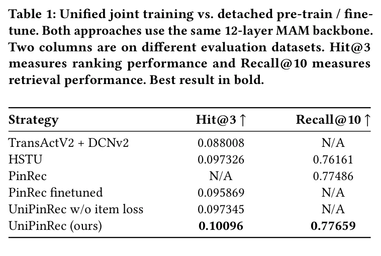
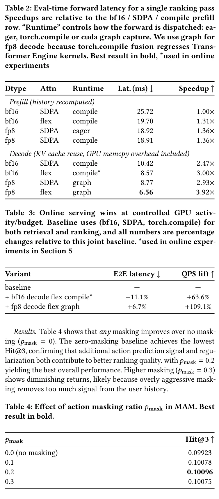
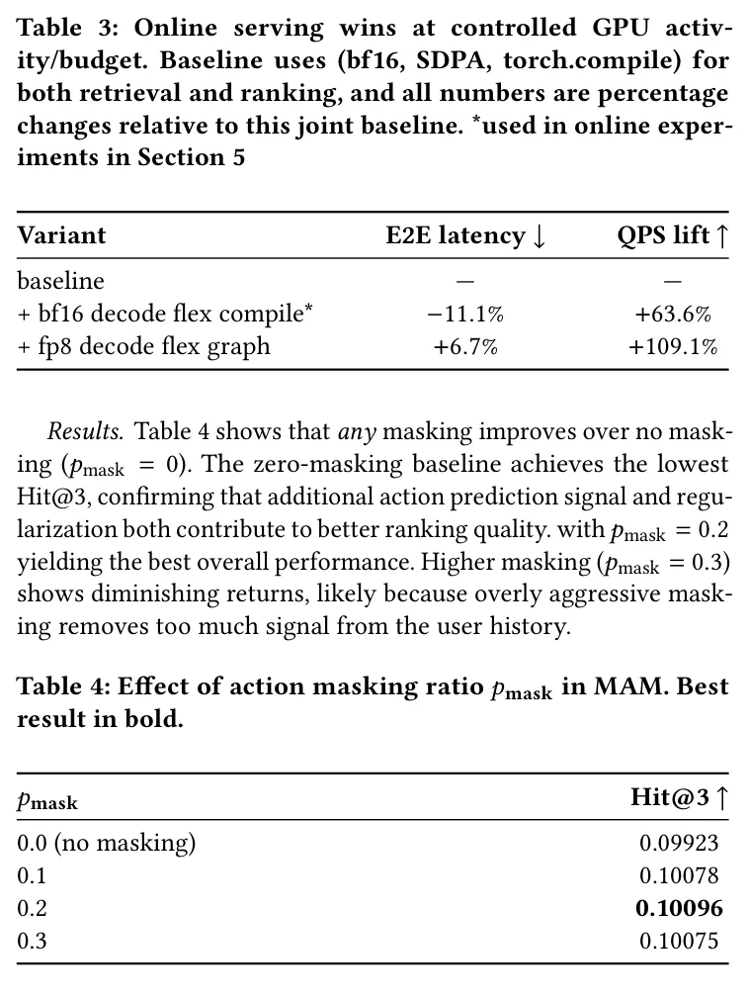
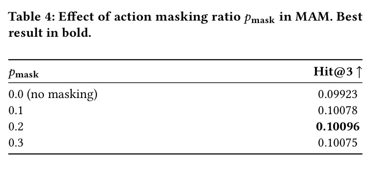
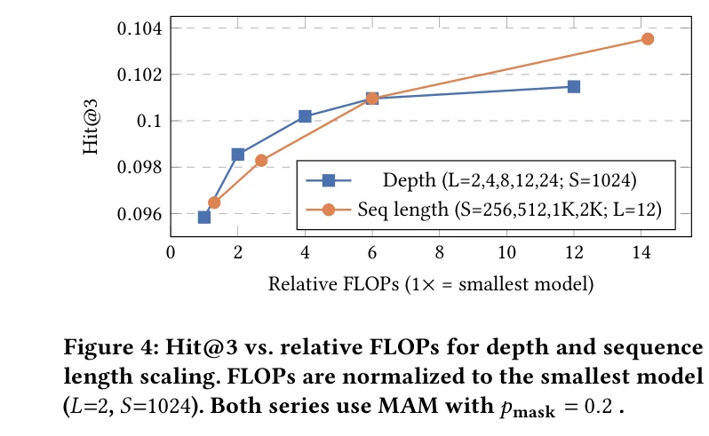
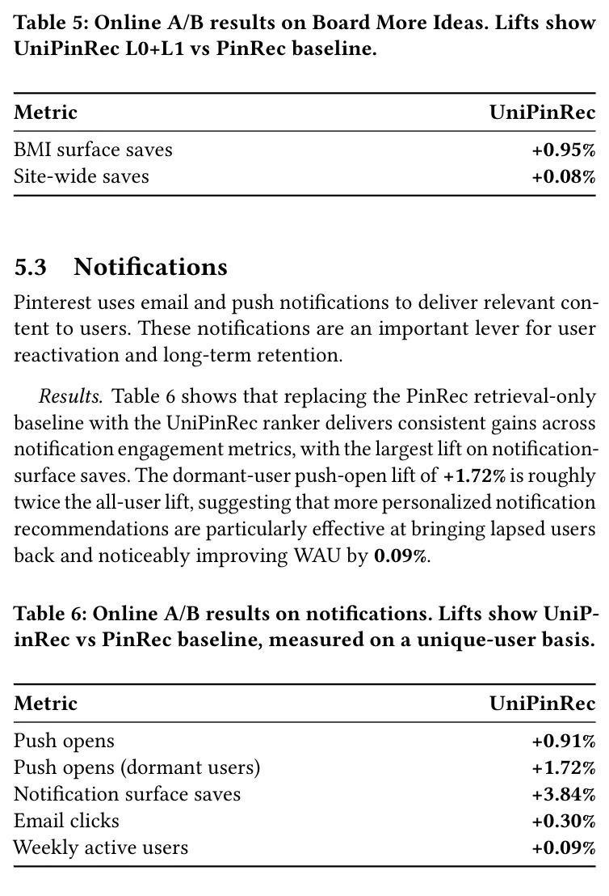
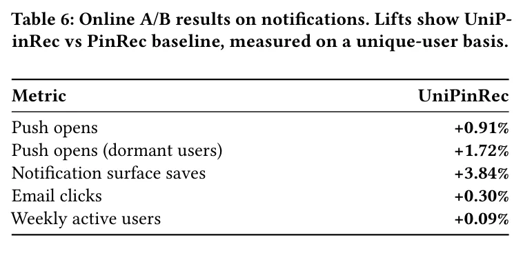

# UniPinRec：在Pinterest规模上统一生成式检索与排序

- **原标题**：UniPinRec: Unifying Generative Retrieval and Ranking at Pinterest Scale
- **作者**：Hanyu Li, Yi-Ping Hsu, Aditya Mantha, Prabhat Agarwal, Laksh Bhasin, Jialu Wang, Hongtao Lin, Bella Huang, Yaxin Li, Xinyi Li, Chuxi Wang, Kousik Rajesh, Hooshmand S. Razaghi, Shunyao Li, Zongyue Qin, Jaewon Yang, James Li, Dhruvil Deven Badani, Jiajing Xu, Charles Rosenberg
- **来源**：https://arxiv.org/abs/2606.00422
- **翻译日期**：2026-06-09

---

## 摘要

现代推荐系统主要将检索和排序作为独立模型进行训练，尽管两者越来越依赖于编码相同用户行为数据的大型Transformer，导致参数、计算和服务成本的重复。先前的工作统一了模型架构，但未统一完整流水线：输入格式、训练流程和服务栈在各阶段之间仍然是碎片化的。

我们提出UniPinRec，在Pinterest实现了检索与排序的全栈统一（Full-stack Unification）：一种输入格式、一个模型、一个训练阶段，部署在现有服务基础设施中。共享的Transformer将用户行为序列编码为与候选项无关的表示，通过任务特定头分支为检索（近似最近邻点积，ANN Dot-product）和排序（交叉注意力，Cross-attention）。三个关键思想使其成为可能：（1）掩码行为建模（Masked Action Modeling, MAM）消除了交错排列，在不加倍上下文长度的情况下实现权重共享；（2）混合训练样本（Blended Training Examples）将行为序列与信息流曝光列表配对，以联合满足两个目标；（3）跨阶段KV缓存共享（Cross-stage KV Cache Sharing）将检索阶段的用户历史计算复用于排序，相比服务两个独立模型降低了总浮点运算量。

部署在Pinterest核心场景中，UniPinRec带来了约+1%的在线互动提升，同时端到端服务延迟降低11.1%，QPS提升63.6%。据我们所知，这是首个覆盖输入、模型、训练和服务的全栈检索与排序统一系统，部署在生产推荐系统中。

**关键词：** 生成式推荐、统一检索与排序、KV缓存复用

---

## 1. 引言（Introduction）

现代工业推荐系统 [1, 7, 23] 构建为多阶段漏斗：候选生成从数百万的语料库中检索数千个物品，排序使用更丰富的特征对这些候选项评分，混排组装最终页面。每个阶段使用各自的架构、目标和训练数据独立训练。这种分离带来了根本性的代价：检索和排序都从相同的用户行为数据中学习表示，却无法跨阶段共享参数或传递学到的信号。

基于Transformer的序列模型作为每个阶段的主导骨干网络的出现 [8, 9, 20, 29, 32]，使这种冗余更加突出。当两个阶段都由编码相同用户行为历史的大型Transformer驱动时，重复成为低效率的主要来源：体现在参数、训练计算和服务成本上。这创造了一个具体的机会：将两个阶段统一为一个模型，对用户只编码一次，从共同的表示服务两个阶段，并实现信号共享——排序监督信息指导检索，检索更广泛的语料库曝光正则化排序 [9, 20]。

我们将这一目标称为全栈统一（图1）：不仅共享模型架构，还共享整个流水线，包括输入格式、训练和服务基础设施。在本文中，我们实现了全栈统一并将其部署在Pinterest的生产环境中。

**为何全栈统一困难。** 三个挑战阻止了先前工作实现这一目标。（1）使用模式分歧（Usage Divergence）：尽管骨干架构已经趋同，计算范式仍然不同：检索必须在毫秒级延迟下对数百万候选项评分（例如通过ANN点积评分 [1]），而排序对数百个候选项评分，可以承担更丰富的逐候选项计算（例如交叉注意力 [7, 32]）。（2）训练复杂性（Training Complexity）：检索和排序使用不同的目标（全语料库上的采样softmax与小曝光集上的二分类），但先前关于下一行为预测的工作 [7, 24] 已经表明这些任务可能是互补的。然而，现有的统一模型诉诸多阶段流水线（预训练、微调、强化学习对齐）来调和它们，增加的复杂性本身就阻碍了全栈统一。（3）服务和运维挑战（Serving and Operational Challenges）：统一模型必须以比分别部署更低的成本服务，以证明变更的合理性；另一个理想属性是与现有候选生成器（如关键词、热门内容）的可组合性，保留确定统一程度的灵活性，以及独立地对每个阶段进行A/B测试和回滚。这些挑战在很大程度上尚未被探索；极少有系统在生产中部署了统一的检索-排序模型 [10, 20]。

**为何现有方法不足。** 现有方法分为两大方向（图1）。第一个方向提出跨阶段的统一架构。HSTU [32] 使用共享Transformer范式，但检索（非交错）和排序（交错）需要不同的输入格式，因此各阶段独立训练，无法共享计算。OnePiece [9] 增加了统一的多任务训练，但仅被部署为检索模型或排序模型，从未从一个统一模型同时服务两个阶段。简言之，这些方法共享了架构，但距离全栈统一仍然很远。

第二个方向提出端到端生成方法，完全绕过漏斗。OneRec [10] 和 OneRanker [20] 通过语义ID的自回归解码生成候选项，从构造上实现了统一。然而，完全替换生产漏斗使得与现有候选源的组合更加困难，并丧失了逐阶段的运维控制能力。

**我们的方法。** 我们的设计原则是组合现有的、经过验证的组件（ANN索引、交叉注意力排序、KV缓存），而非引入新机制，使统一模型成为现有生产基础设施中的直接替换。统一不仅仅是优雅性目标：单独的排序器将重复检索已经执行的昂贵用户历史编码。通过共享这一计算，UniPinRec以边际成本增加排序能力，使其能够在与仅检索相同的延迟预算内实现排序。

UniPinRec通过三个设计选择实现这一点。第一，掩码行为建模将排序监督添加到用于检索的同一非交错用户序列中。第二，混合训练样本和联合损失在单一阶段中训练检索和排序。第三，跨阶段KV缓存共享让排序复用检索阶段的用户历史计算，在保持模块化服务的同时避免重复的Transformer计算。

这些选择共同实现了全栈统一：两个阶段使用相同的输入格式、单阶段联合训练，以及在现有服务基础设施内部署。

**实验结果。** 统一模型在保持检索召回率并降低服务成本的同时增加了排序能力，这种组合在没有模型/系统协同设计的情况下是不可能实现的。在离线评估中，UniPinRec的排序Hit@3比生产排序器提升了+14.8%，同时匹配了生产检索的召回率。

由于UniPinRec通过共享骨干网络耦合了检索和排序，最自然的增量上线方案从L0侧开始：我们将检索与L1轻量排序作为单一服务（L0+L1）发布，并将L2精排作为后续扩展。这保持了下游排序器/混排器不受影响，并在早期获得干净的A/B归因。

尽管离线排序提升被下游排序器/混排器衰减，它仍然带来了一致的互动增益：Board More Ideas保存量+0.95%，Notifications推送打开量+0.91%。在服务方面，跨阶段KV缓存复用等优化带来了超过3倍的总排序前向传播加速（表2），在生产环境中实现了-11.1%的端到端延迟降低和相对于朴素分别部署+63.6%的QPS提升（表3）。

---

## 2. 相关工作（Related Work）

**基于Transformer的推荐架构。** HSTU [32] 建立了以Transformer为主导骨干的生成式推荐新范式，后续工作扩展了容量 [8, 18, 25, 29, 30]，改进了多任务优化 [5, 28, 31, 35]，或进一步将该思想产品化 [13, 15]。OnePiece [9] 在Shopee的级联排序中应用了共享骨干上的统一多任务训练。RelayGR [22] 实现了跨流水线阶段的KV缓存复用，但假设模型是独立训练的。这些方法中的每一个都实现了部分统一——无论是在架构（HSTU、OnePiece）、训练（OnePiece）还是服务（RelayGR）方面——但没有一个端到端地统一了输入、模型、训练和服务。

**端到端生成方法。** OneRec [10]、OneRanker [20] 和 GPR [33] 用通过自回归解码生成候选项的生成模型替代了级联流水线。这一范式已被扩展到统一搜索与推荐 [6, 12, 26]，并在多家公司部署 [13, 19, 21, 36]。除了基础设施方面的考虑，近期工作 [11, 27] 表明，使用语义ID的生成式检索相对于密集检索（Dense Retrieval）并非明显优势，原因在于有损压缩、生成目标的低效性以及冷启动失败，同时token关系被记忆在参数内部，而非委托给外部可扩展索引——在外部索引中，嵌入相似性是自然保持的。

---

## 3. 方法论（Methodology）

### 3.0.1 背景（Background）

UniPinRec 构建于 PinRec [1] 之上，后者是一种生成式检索模型（Generative Retrieval Model）。每个物品由预训练的物品嵌入 Omnisage [3] 和基于 CLIP 的多模态嵌入 [4] 表示，搜索查询使用预训练的搜索嵌入 [2]。这些特征通过一个多层感知机（MLP）投影为 L2 归一化的嵌入向量。给定用户的正向交互历史 $H(u,t_{max})$，PinRec 将嵌入序列输入一个因果解码器（Causal Decoder-only Transformer），并使用基于批内负样本和随机负样本的采样 softmax 损失进行训练：

$$L_s(\hat{i}_{u,t}, i_{u,t+1}) = -\log \frac{\exp s(\hat{i}_{u,t}, i_{u,t+1})}{\exp s(\hat{i}_{u,t}, i_{u,t+1}) + \sum_{i_n \in N} \exp s(\hat{i}_{u,t}, i_n)} \tag{1}$$

其中 $s(\hat{i}_{u,t}, i_c) = \lambda \cdot \hat{i}_{u,t}^\top i_c - \log Q(i_c)$ 是频率校正的相似度，$Q(i_c)$ 是候选项 $i_c$ 的估计采样概率（通过 Count-Min Sketch 计算），$N$ 是负样本集合。模型的优化目标是最小化历史中所有位置上 $L_s$ 的平均值。

**章节导引。** 本节剩余部分依次解决引言中提出的各项挑战：第 3.1 节通过掩码动作建模和联合损失解决架构与训练的分歧问题；第 3.2 节描述使联合训练在大规模场景下可行的数据基础设施；第 3.3 节通过跨请求的 KV 缓存共享解决服务部署与运维挑战。

### 3.1 将 PinRec 重构用于排序（Reformulating PinRec for Ranking）

将 PinRec 扩展至排序任务需要三项变更：

（1）目标函数：模型不再最大化全语料库上的下一物品似然，而是需要在一个小的曝光集合上预测每个候选项的动作概率。

（2）监督信号：监督从基于物品嵌入的 softmax 转变为每种动作类型 $c \in \{1,...,C\}$（点击、收藏、隐藏等）的二元标签，使用逐头二元交叉熵（Binary Cross-Entropy）进行训练。

（3）数据：训练样本必须包含曝光负样本（已展示但未产生交互的物品），而不仅仅是正向交互（详见第 3.2 节）。

#### 3.1.1 掩码动作建模（Masked Action Modeling）

核心问题在于如何将动作预测表述为序列学习问题，使得排序目标可以共享检索骨干网络。HSTU [32] 的方法在物品之间交错插入动作令牌以确保动作预测是候选感知的，但这会使上下文长度翻倍，并破坏与检索模型输入格式的兼容性。

我们提出掩码动作建模（MAM）：将动作沿特征维度与每个物品嵌入拼接，并在训练过程中随机掩码，既保持了因果性（模型无法在预测之前看到动作），又不会膨胀序列长度。类似的掩码-预测思想出现在 [16] 中用于信息流曝光场景。据我们所知，我们是首个将动作监督直接应用于检索所用的用户序列骨干网络的工作。这使得排序可以在同一前向传播中完成，同时通过更密集的逐位置梯度提升检索质量。

**（1）输入表示。** 我们不在每个物品后交错插入专用的动作令牌，而是通过线性层将动作多热向量 $a_i$ 编码为稠密嵌入，并沿特征轴与物品表示拼接，然后送入输入投影器。投影器将拼接后的表示映射到 Transformer 的隐藏维度。

**（2）掩码策略。** 对于用户已观测历史（过去）中的位置，每个动作以概率 $p_{mask}$ 独立掩码。对于候选（未来）位置，动作始终被掩码（所有 $j$ 的 $m_j = 0$），因为在推理时候选项的动作是未知的。

当某一位置被掩码时，其动作类型输入被替换为专用的 [MASK] 类别（附加在动作词表上的额外 one-hot 维度），使模型能够区分"动作未知"与"未执行动作"。

这保证了无信息泄露。输入掩码（$m_i=0$）将 $a_i$ 替换为 [MASK] 令牌，因果注意力将位置 $i$ 限制为 $\{0,...,i\}$，因此隐藏状态满足：

$$z_i = f_\theta(\tilde{\Phi}_i, \{\tilde{\Phi}_t\}_{t<i}), \quad \tilde{\Phi}_i \perp\!\!\!\perp a_i \text{ when } m_i = 0 \tag{2}$$

确保 $h_{\psi_c}(z_i)$ 仅依赖于 $\Phi_i$ 和 $\{(\Phi_t, m_t \odot a_t)\}_{t<i}$。

**（3）注意力模式。** Transformer 处理拼接序列 $[\tilde{\Phi}_1, \ldots, \tilde{\Phi}_n, || \tilde{\Phi}'_1, \ldots, \tilde{\Phi}'_k]$ 时采用改进的因果掩码（图 2，右上角），遵循 [32] 中的 M-FALCON 模式：过去位置保持标准因果注意力；每个候选位置 $n+j$ 可以关注所有过去位置 $1, \ldots, n$，但被阻止关注其他候选项。所有候选位置共享固定的位置 ID、信息流视图类型和时间戳，以确保无偏打分。由于候选项之间不能相互关注，掩码将注意力开销从 $O((n+k)^2)$ 降低至 $O(n^2 + nk)$；我们通过 Flex Attention [14] 实现这一稀疏性，该方法将块稀疏模式编译为融合的 CUDA 内核。此模式还支持跨阶段的 KV 缓存共享（第 3.3.3 节）：检索阶段缓存 $O(n^2)$ 的历史计算，排序阶段以 $O(nk)$ 的边际成本复用它。

**（4）训练目标。** 序列中的过去部分 $\tilde{\Phi}_1, \ldots, \tilde{\Phi}_n$ 保持与检索模型输入相同的长度和位置结构，并实际用于检索：相同的下一物品预测目标应用于这些位置。$k$ 个候选物品 $\tilde{\Phi}'_1, \ldots, \tilde{\Phi}'_k$ 附加在过去部分之后，整个序列在单次前向传播中处理。这实现了与检索模型的完全参数共享。模型通过两个联合优化的损失进行训练：

（a）下一物品预测损失（检索目标）：与第 3.0.1 节中的采样 softmax 损失相同，应用于每个未掩码的过去位置：

$$\mathcal{L}_{item} = \frac{1}{|H|} \sum_{t \in H} L_s(\hat{i}_{u,t}, i_{u,t+1}) \tag{3}$$

（b）动作预测损失（排序目标）：在每个动作被掩码的位置，模型需要独立预测每种动作类型。对于每种动作类型 $c \in \{1, \ldots, C\}$，专用的 MLP 头 $h_{\psi_c}$ 产生一个标量 logit，逐头权重 $w_c$ 控制其贡献。分别对过去（掩码的）和未来（始终掩码的）位置施加损失项：

$$\mathcal{L}_{action} = \sum_{c=1}^{C} w_c \left[ \frac{1}{|\mathcal{M}_{past}|} \sum_{i \in \mathcal{M}_{past}} \ell_{BCE}(h_{\psi_c}(z_i), a_i^{(c)}) + \frac{1}{k} \sum_{j=1}^{k} \ell_{BCE}(h_{\psi_c}(z'_j), a'^{(c)}_j) \right] \tag{4}$$

其中 $C$ 是动作类型数量，$z_i$ 是位置 $i$ 处 Transformer 的隐藏状态，$h_{\psi_c}$ 是动作类型 $c$ 的 MLP 头，$a_i^{(c)}$ 是位置 $i$ 处动作 $c$ 的二元标签，$\mathcal{M}_{past} = \{i: m_i = 0\}$ 是被掩码的过去位置集合，$w_c$ 是超参数调节的标量权重，用于平衡每种动作类型（如收藏、点击、隐藏）之间以及与下一物品预测损失之间的贡献。

总损失为：

$$\mathcal{L} = \mathcal{L}_{item} + \mathcal{L}_{action} \tag{5}$$

**（5）相对于交错方式的关键优势。**

（a）无上下文长度膨胀：序列长度与检索模型保持一致。

（b）完全权重共享：排序模型可以直接从检索检查点初始化。

（c）去噪正则化：随机掩码促使模型在动作不可用时依赖物品内容，提高推理时的泛化能力。

### 3.2 数据基础设施（Data Infrastructure）

联合训练引入了单任务模型中不存在的数据需求：每个训练样本必须同时包含用户的交互历史（用于检索目标）和带有负样本结果的完整曝光列表（用于动作预测目标）。现有的检索数据集和排序数据集都无法同时满足这两个约束。在大规模场景下构建这种统一格式是全栈统一的前提条件。下面我们描述如何构建和提供这些样本。

#### 3.2.1 以信息流视图为中心的数据集构建（Feedview-centric Dataset Construction）

一个关键的数据设计选择使我们的工作区别于以往的序列推荐系统。检索模型通常在仅包含动作的序列（按时间排列的交互记录）上训练 [1, 10, 32]，而排序模型在曝光日志（展示给用户的完整列表，包含交互和无动作的结果）上训练 [9, 15]。此前关于统一模型的工作未讨论如何构建同时满足两个目标的训练数据；联合训练需要两者兼备：检索目标需要正向动作历史来预测下一物品，而排序目标需要完整的曝光列表来学习。

我们通过以下方式弥合这一差距：将每个训练样本构建为过去动作序列与未来信息流视图（来自后续请求的完整曝光列表，附带交互标签）的配对。具体而言，序列中每个位置是一个（Pin，展示面，动作，时间戳）元组，其中动作涵盖模型预测的交互词表（仅曝光、点击、收藏、分享、隐藏等）。由于交互事件相对于曝光天然稀疏，训练流水线对未交互的信息流视图进行下采样（保留 10%）以放大稀有交互类别。评估流水线不进行下采样，使用随机化回放数据集，保留自然的无偏分布。这也通过反映真实流量分布而有利于检索。

#### 3.2.2 Ray 训练器内连接（Ray In-trainer Join）

我们通过使用 Ray [17] 分布式数据加载层在训练器内执行桶连接（Bucket Join），消除了离线连接引入的用户动作历史扇出问题。用户动作序列和信息流视图记录作为独立的 Iceberg 表维护，每个表按用户 ID 进行哈希分桶，在训练时在内存中连接。这完全避免了数据重复，并使上下文长度、采样比率和过滤条件成为训练时可调参数，而非数据生成时的固定参数。

### 3.3 服务基础设施（Serving Infrastructure）

图 3 展示了本节描述的端到端协同服务拓扑。

统一模型只有在能够替代两个独立模型且不会使服务成本翻倍的情况下，才能真正实现效率收益。我们的模型设计/训练协议的两个特性使这成为可能。首先，非交错架构和统一协同训练（第 3.1.1 节）保证了相同的模型权重，并产生与候选项无关的用户表示，可以缓存一次并在各阶段间复用。其次，检索和排序阶段共享相同的物品嵌入空间，因此无需维护独立的候选表示。

#### 3.3.1 背景（Background）

我们构建于生产环境中的 PinRec [1] 服务栈之上，该栈使用 Triton 集成（Triton Ensemble）来组装用户历史、运行自回归检索，并通过 CPU 托管的 Faiss 索引执行近似最近邻（ANN）查找。

#### 3.3.2 整体服务设计（Overall Serving Design）

UniPinRec 保留了该栈的大部分结构，并在 Faiss 下游附加一个新的排序节点。排序节点消费 ANN 的候选集以及一个 KV 缓存槽标识符（详见下文第 3.3.3 节）。它不重新处理完整的用户历史，而是运行增量前向传播：仅处理候选令牌，回溯关注 KV 缓存历史以产生每个候选项的动作概率。

ANN 索引已存储每个 Pin 的嵌入向量（嵌入器 MLP 的输出，在索引构建时计算）。我们使用 Faiss.search_and_reconstruct，在单次调用中同时返回候选 Pin ID 及其存储的嵌入。这些预嵌入向量直接作为排序阶段的候选令牌。这消除了候选侧额外的嵌入器前向传播和特征获取，并保证检索和排序阶段对相同的表示进行打分。

#### 3.3.3 跨阶段 KV 缓存共享（KV-cache Sharing Across Stages）

我们 Transformer 中的主要开销是编码用户的动作历史（$n$ 个令牌，$O(n^2)$ 自注意力）；对该历史评分 $k$ 个候选项仅需 $O(nk)$。我们通过将 PinRec 的逐请求 KV 缓存（第 3.3.1 节）扩展至跨阶段和跨进程，在排序阶段完全避免了 $O(n^2)$ 的开销：排序直接关注缓存的历史 KV 而无需重新编码。我们进一步阻止候选项之间相互关注，遵循 M-FALCON [15] 的身份掩码设计，使每个候选项的得分独立于批次组成。排序的净开销为 $O(nk)$。

检索和排序作为独立的操作系统进程运行，拥有独立的 CUDA 上下文，这在基于微服务的服务栈中是典型做法。跨进程朴素序列化 KV 张量会引入 GPU-主机-GPU 的往返传输，主导延迟。我们改为预分配一个 GPU 内存池，两个进程将其映射到各自的地址空间，使排序进程可以直接读取检索写入的 KV 状态，无需 CPU 到 GPU 的数据传输。

因此，每个检索副本分配一个预设大小为 $[L, S, H, n, D]$（层数、槽数、KV 头数、过去序列长度、头维度）的 GPU 内存池，在启动时将其存储的 CUDA IPC 句柄导出到每实例文件，排序进程打开这些句柄并将相同的物理 GPU 分配映射到自己的地址空间。

槽以轮询方式复用，每个排序消费者在前向传播期间将每个请求的过去 KV 从映射池中的对应槽复制到自己的解码缓存中。

#### 3.3.4 FP8 量化（FP8 Quantization）

为进一步提升服务效率，我们采用混合精度 FP8 训练和推理。我们使用来自 Transformer Engine 库的融合模块，将层归一化、线性投影和激活函数组合为单个内核，避免中间的全精度物化。训练使用混合 FP8 格式，前向传播采用 E4M3，反向计算采用 E5M2，使前向激活和反向梯度在精度与动态范围之间保持适当平衡。量化带来了 0.5% 的离线指标下降，我们认为这是效率收益的合理权衡。

---

## 4. 结果（Results）

我们围绕三个研究问题来组织实验结果：

- RQ1：我们能否训练出一个同时具备召回与排序能力的统一模型？
- RQ2：我们能否将召回模型与排序模型协同服务，从而实现最小化的计算冗余？
- RQ3：我们能否让这个统一模型成为现有生产级推荐系统的易扩展组件？

### 4.1 训练统一的召回与排序模型（Train a Unified Retrieval and Ranking）（RQ1）

我们证明了生成式推荐范式可以扩展到排序模型。这要求满足：(1) 跨阶段的架构兼容性，以支持参数共享；(2) 同时采用召回与排序目标进行联合训练，以实现任务间的信号共享。

**基线与训练策略。** 我们将 UniPinRec 与多个基线及训练方法进行对比：

TransAct V2 + DCNv2 [24]：同期训练的生产排序模型，是一个基于 Transformer 的模型，包含长用户序列以及其他特征交叉模块。

HSTU [32]：最先进的统一召回与排序模型，采用动作与物品交错方式 [34]。我们在召回与排序两个任务上评估 HSTU，使用统一的交错范式，并匹配相同的有效序列长度。

PinRec [1]：生产召回模型，是一个采用下一物品预测（采样 softmax）训练的 12 层 Transformer。仅服务召回；不具备排序能力。

PinRec finetuned：序列化训练方法，以上述快照（PinRec）为起点，通过添加动作预测目标进行排序微调。关键在于，物品嵌入器在微调过程中必须保持冻结，以维持与预训练召回模型的 Faiss 索引在部署时的兼容性。

UniPinRec w/o item loss：一个仅排序的变体，仅使用动作预测损失进行训练，采用与统一模型相同的 MAM 架构。该消融实验通过移除召回目标，分离出联合训练所带来的影响。

UniPinRec（本文方法）：采用掩码动作建模的统一模型，在召回与排序中均使用相同的非交错序列格式。同时采用下一物品预测（召回）与动作预测（排序）损失进行联合训练。物品嵌入器可训练，并从两个目标中同时受益。

**结果。** 表 1 显示，与专用基线相比，UniPinRec 在召回（Recall@10）与排序（save Hit@3）两个任务上均取得了具有竞争力的性能。我们使用 Board More Ideas 信息流数据进行训练和评估。

在召回方面，UniPinRec 的 Recall@10 与 PinRec 持平，并有 +0.2% 的边际提升，这表明采用排序目标进行联合训练不会损害召回质量。这对部署至关重要：统一模型可以作为生产召回系统的即插即用替代方案。

在排序方面，尽管 UniPinRec 在单一模型中同时处理召回与排序，但它仍以 14.7% 的优势超过了配备专用特征交叉模块的同期生产排序模型 TransActV2+DCNv2。在相同上下文长度预算下，UniPinRec 也优于 HSTU。重要的是，UniPinRec 优于仅排序的变体（UniPinRec w/o item loss），这表明联合召回目标进一步提升了排序质量。尽管 PinRec 微调方法以一个强大的召回模型为起点，但其表现仍不及联合训练。冻结嵌入器的约束阻止了模型为排序而调整物品表示，而联合训练则允许嵌入器同时从两个任务中学习。这一差距表明，仅有架构兼容性是不够的，联合优化对于充分发挥统一训练的优势是必要的。

### 4.2 协同服务召回与排序模型（Co-serve a Retrieval and Ranking Model）（RQ2）

统一主干只有在不被当作两个互不相关的模型来服务时，才能宣称在效率上取得了胜利。排序前向传播中的主要计算开销来自对用户历史的自注意力；当召回与排序被分开服务时，这一开销在每次请求中会被支付两次。我们的统一设计在召回阶段对历史编码一次，并将得到的键和值作为后续排序阶段的 KV 缓存复用，从而将排序转化为一个解码步骤——候选物品从一段冻结的历史中进行注意力计算，而非进行完整的预填充。

我们在表 2 中测量了这种复用所带来的影响，实验在 NVIDIA L40S 上进行（B=8，n=992，k=656，L=12），变动了三个正交的杠杆：激活数据类型（bf16 与采用 Transformer Engine 融合矩阵乘法的 fp8）、注意力实现（SDPA 与自动调优的 flex attention），以及运行时（eager Python 调度、torch.compile，或 CUDA graph 捕获）：

- KV 缓存复用（从预填充到解码）约带来 2.4 倍提升。
- 采用 Transformer Engine 矩阵乘法的 fp8 与 CUDA graph 捕获相对于 bf16+compile 带来 1.25 倍提升。
- Flex attention 在任意数据类型之上稳定贡献 1.3 倍提升。

这三个杠杆在很大程度上是正交的，因此叠加使用可获得最高的端到端 3.92 倍提升。

我们进一步在线上条件下对 bf16 与 fp8 的最佳组合进行了基准测试，结果见表 3。我们观察到 fp8 内核的一个主要权衡是：必须等待并累积请求以形成更大的批大小，以满足 Transformer Engine 的形状约束——即展平后的前导维度 [B*S, D] 必须是 8 的倍数，这主要约束了召回前向传播中 S=1 的自回归步骤。其结果是 QPS 提升但延迟增大。在所报告的线上实验中，我们使用了 bf16，但计划在后续步骤中采用 fp8。

### 4.3 消融实验（Ablations）

#### 4.3.1 MAM 中掩码比例的影响

掩码动作建模（MAM）中的一个核心设计选择是掩码概率 $p_{mask}$，它控制着训练过程中用户序列里历史动作被随机掩码的频率。我们通过在相同数据和超参数下训练 $p_{mask} \in \{0.0, 0.1, 0.2, 0.3\}$ 的变体来消融该选择，同时保持所有其他架构决策不变。

**结果。** 表 4 显示，任意掩码都优于不掩码（$p_{mask} = 0$）。零掩码基线取得了最低的 Hit@3，证实了额外的动作预测信号与正则化都对更好的排序质量有贡献，其中 $p_{mask} = 0.2$ 取得了最佳的整体性能。更高的掩码（$p_{mask} = 0.3$）显示出收益递减，这可能是因为过于激进的掩码从用户历史中移除了过多信号。

#### 4.3.2 模型扩展的影响

我们研究模型容量如何在两个维度上影响排序性能：Transformer 深度与序列长度。理解这些权衡对部署至关重要，因为这两个维度都会影响模型质量、训练成本与服务延迟。

**结果。** 我们在固定序列长度为 1024 个 token 的条件下训练不同深度（2、4、8、12、24 层）的模型，并在固定 12 层模型的条件下变动序列长度（256、512、1024、2048 个 token）。两个维度均采用 $p_{mask} = 0.2$ 的 MAM。图 4 显示，性能在两个扩展轴上都持续提升，表明统一模型尚未在容量上饱和。然而，二者的成本影响存在显著差异：深度的计算成本随线性增长，而序列长度则因注意力而产生平方级成本。这使得序列长度在延迟敏感的应用中成为更严重的瓶颈，尽管两个维度都显示出持续的质量提升。更长序列带来的显著增益表明，序列压缩技术是一个有前景的方向，可以在更低成本下捕获更长上下文所带来的质量收益。

---

## 5. 线上 A/B 实验（Online A/B Experiments）（RQ3）

我们通过受控的 A/B 实验在生产环境中评估 UniPinRec，将统一模型与生产召回基线 PinRec [1] 进行对比。这验证了全栈统一是否能够在真实流量中带来参与度提升，同时保持实用的服务效率，并回答了第三个研究问题——我们能否将这种高度模块化的扩展应用于现有的生产推荐系统。

### 5.1 实验设置

**部署配置。** 我们对比候选生成器的两种设置，二者均向下游阶段返回 K（<3000）个候选：

基线（PinRec）：生产召回模型通过 ANN 搜索生成 K 个候选，直接传递给下游排序阶段。

UniPinRec：统一模型首先通过 ANN 搜索过量获取候选（L0），随后立即使用带动作预测的排序头（L1）对其进行排序，并将排序后的前 K 个候选返回给下游阶段。

值得注意的是，在线上实验中，我们用统一的 L0 + L1 打分服务替换了召回阶段，并仍将精炼后的候选发送给基于 TransAct V2 [24] 的下游生产排序器，以严格验证指标提升。这也意味着离线提升将被衰减和稀释。

我们在两个生产场景上运行 A/B 实验：Board More Ideas（L0 过量获取比例约为 2 倍）与 Notification（L0 过量获取比例约为 3 倍）。这两个场景每天均服务数百万用户。

### 5.2 Board More Ideas

Board More Ideas（BMI）推荐锚定到用户画板的 Pin。为实现这一点，我们扩展了 UniPinRec，使其支持将 Board 作为一种新的序列模态，超越了 Pin 与搜索查询。

**结果。** 表 5 显示，UniPinRec 相对于 PinRec 基线提供了强劲的参与度提升，场景 save 提升 +0.95%，表明统一的召回与排序方法相比单独召回显著提升了候选质量，同时带来 +0.08% 的全站提升，证实了更好的 BMI 推荐对整体平台参与度产生了积极影响。

### 5.3 Notifications

Pinterest 使用电子邮件和推送通知向用户传递相关内容。这些通知是用户再激活与长期留存的重要杠杆。

**结果。** 表 6 显示，用 UniPinRec 排序器替换仅召回的 PinRec 基线，在通知参与度指标上带来了一致的增益，其中通知场景 save 的提升最大。沉默用户的推送打开提升 +1.72%，约为全体用户提升的两倍，这表明更个性化的通知推荐在召回流失用户方面尤其有效，并显著将 WAU 提升了 0.09%。

---

## 6. 结论（Conclusion）

我们提出了 UniPinRec，这是首个部署于生产推荐系统中的召回与排序全栈统一方案。在实验上，统一模型达到了生产召回的召回率，保持了超过专用排序器的排序质量，并在提升 QPS 的同时削减了端到端延迟，挖掘出此前漏斗所遗漏的候选，并在线上转化为净参与度的胜利。

UniPinRec 目前统一了召回与上层漏斗排序，这一环节的主干冗余最为严重。它尚未替换 L2 排序器，后者在分数校准、训练数据日志记录与运维工具方面具有额外的基础设施依赖，超出了本工作的当前范围。我们采取渐进式上线的方式，并计划在后续步骤中将统一工作扩展至 L2 阶段，并横向扩展到更多场景（搜索、广告）。

在架构上，UniPinRec 与检索增强生成（RAG）相呼应：主干负责构建查询，ANN 索引充当非参数化记忆，排序器则通过相同的缓存上下文生成动作概率。这种类比提示我们可以借鉴 RAG 文献中的方法，例如迭代检索与学习式检索深度控制，作为未来的研究方向。

先前的统一模型已经证明召回与排序可以共享一个架构。UniPinRec 则表明，那个更难的问题——统一输入格式、训练与服务基础设施——在今天的生产环境中同样是可解的。

---

## 参考文献（References）

[1] Prabhat Agarwal, Anirudhan Badrinath, Laksh Bhasin, Jaewon Yang, Edoardo Botta, Jiajing Xu, and Charles Rosenberg. 2025. PinRec: Outcome-Conditioned, Multi-Token Generative Retrieval for Industry-Scale Recommendation Systems. arXiv preprint arXiv:2504.10507 (2025).

[2] Prabhat Agarwal, Minhazul Islam SK, Nikil Pancha, Kurchi Subhra Hazra, Jiajing Xu, and Chuck Rosenberg. 2024. OmniSearchSage: Multi-Task Multi-Entity Embeddings for Pinterest Search. In WWW '24.

[3] Anirudhan Badrinath, Alex Yang, Kousik Rajesh, Prabhat Agarwal, Jaewon Yang, Haoyu Chen, Jiajing Xu, and Charles Rosenberg. 2025. OmniSage: Large Scale, Multi-Entity Heterogeneous Graph Representation Learning. In KDD '25.

[4] Josh Beal, Eric Kim, Jinfeng Rao, Rex Wu, Dmitry Kislyuk, and Charles Rosenberg. 2026. PinCLIP: Large-scale Foundational Multimodal Representation at Pinterest. arXiv:2603.03544.

[5] Yang Cao, Changhao Zhang, Xiaoshuang Chen, Kaiqiao Zhan, and Ben Wang. 2025. xMTF: A Formula-Free Model for Reinforcement-Learning-Based Multi-Task Fusion in Recommender Systems. In WWW 2025.

[6] Jiahui Chen et al. 2025. UniSearch: Rethinking Search System with a Unified Generative Architecture. arXiv preprint arXiv:2509.06887.

[7] Xiangyi Chen, Kousik Rajesh, Matthew Lawhon, et al. 2025. PinFM: Foundation Model for User Activity Sequences at a Billion-scale Visual Discovery Platform. In RecSys.

[8] Zhimin Chen et al. 2026. Massive Memorization with Hundreds of Trillions of Parameters for Sequential Transducer Generative Recommenders. In ICLR.

[9] Sunhao Dai et al. 2025. OnePiece: Bringing Context Engineering and Reasoning to Industrial Cascade Ranking System. arXiv preprint arXiv:2509.18091.

[10] Jiaxin Deng et al. 2025. OneRec: Unifying Retrieve and Rank with Generative Recommender and Iterative Preference Alignment. arXiv preprint arXiv:2502.18965.

[11] Yijie Ding et al. 2026. How Well Does Generative Recommendation Generalize? arXiv:2603.19809.

[12] Vianne R. Gao et al. 2025. SynerGen: Contextualized Generative Recommender for Unified Search and Recommendation. arXiv preprint arXiv:2509.21777.

[13] Ruidong Han et al. 2025. MTGR: Industrial-Scale Generative Recommendation Framework in Meituan. In CIKM.

[14] Horace He et al. 2024. Flex Attention: A Programming Model for Generating Optimized Attention Kernels. arXiv preprint arXiv:2412.05496.

[15] Lars Hertel et al. 2025. Efficient User History Modeling with Amortized Inference for Deep Learning Recommendation Models. In WWW 2025.

[16] Yanhua Huang et al. 2025. Towards Large-scale Generative Ranking. CoRR abs/2505.04180.

[17] Philipp Moritz et al. 2018. Ray: A Distributed Framework for Emerging AI Applications. In OSDI 18.

[18] David Pardoe et al. 2026. CADET: Context-Conditioned Ads CTR Prediction With a Decoder-Only Transformer. arXiv preprint arXiv:2602.11410.

[19] Zhengyang Su et al. 2026. STATIC: Vectorizing the Trie. arXiv preprint arXiv:2602.22647.

[20] Dekai Sun et al. 2026. OneRanker: Unified Generation and Ranking with One Model in Industrial Advertising Recommendation. arXiv preprint arXiv:2603.02999.

[21] Yijia Sun et al. 2026. GRank: Towards Target-Aware and Streamlined Industrial Retrieval with a Generate-Rank Framework. In WWW 2026.

[22] Jiarui Wang et al. 2026. RelayGR: Scaling Long-Sequence Generative Recommendation via Cross-Stage Relay-Race Inference. arXiv preprint arXiv:2601.01712.

[23] Xue Xia et al. 2023. TransAct: Transformer-based Realtime User Action Model for Recommendation at Pinterest. In KDD 2023.

[24] Xue Xia et al. 2025. TransAct V2: Lifelong User Action Sequence Modeling on Pinterest Recommendation. In CIKM '25.

[25] Bencheng Yan et al. 2026. Unlocking Scaling Law in Industrial Recommendation Systems with a Three-step Paradigm based Large User Model. In WSDM.

[26] Huimin Yan et al. 2025. IntSR: An Integrated Generative Framework for Search and Recommendation. arXiv preprint arXiv:2509.21179.

[27] Liu Yang et al. 2024. Unifying Generative and Dense Retrieval for Sequential Recommendation. arXiv preprint arXiv:2411.18814.

[28] Xiao Yang et al. 2025. MTMD: A Multi-Task Multi-Domain Framework for Unified Ad Lightweight Ranking at Pinterest. In AdKDD at KDD.

[29] Yufei Ye et al. 2025. FuXi-α: Scaling Recommendation Model with Feature Interaction Enhanced Transformer. In WWW 2025.

[30] Yufei Ye et al. 2025. FuXi-β: Towards a Lightweight and Fast Large-Scale Generative Recommendation Model. arXiv preprint arXiv:2508.10615.

[31] Jun Yuan, Guohao Cai, and Zhenhua Dong. 2024. A Parameter Update Balancing Algorithm for Multi-task Ranking Models in Recommendation Systems. In ICDM.

[32] Jiaqi Zhai et al. 2024. Actions Speak Louder than Words: Trillion-Parameter Sequential Transducers for Generative Recommendations. In ICML.

[33] Jun Zhang et al. 2025. GPR: Towards a Generative Pre-trained One-Model Paradigm for Large-Scale Advertising Recommendation. arXiv preprint arXiv:2511.10138.

[34] Luankang Zhang et al. 2025. Killing Two Birds with One Stone: Unifying Retrieval and Ranking with a Single Generative Recommendation Model. In SIGIR '25.

[35] Yukun Zhang et al. 2026. SMES: Towards Scalable Multi-Task Recommendation via Expert Sparsity. arXiv preprint arXiv:2602.09386.

[36] Yanyan Zou et al. 2026. GenRec: A Preference-Oriented Generative Framework for Large-Scale Recommendation. In SIGIR.
