OneTrans: Unified Feature Interaction and Sequence Modeling with One Transformer in Industrial Recommender

https://arxiv.org/pdf/2510.26104

说到scaling law，大家的第一反应应该都是生成式。诚然，模型越大，越容易过拟合，所以泛化性更强的模型上限会更高。

还有没有其他探索scaling law的启发式思路呢？统一特征、统一模块应该是共识之一，因为这样对硬件友好，更容易扩展参数，以达到增加算力的目的。

OneTrans其实和RankMixer很像，都是：
1. 统一序列和非序列特征。只不过两者刚好相反，rankmixer是将序列特征视作非序列特征，onetrans是将非序列特征视作序列特征（的target）。
2. 统一模块，在判别式模型中堆叠。两者也是相反，rankmixer堆叠特征交叉模块，onetrans堆叠attention模块。

要说两者的优劣吧，我觉得：
1. rankmixer工程上更容易扩展，毕竟直接干掉了transformer，但特征的组合可能很关键；
2. onetrans更容易迁移到其他业务上，毕竟很多业务的收益来源主要是序列；
3. 美团的MTmixAtt可能是两者的折中。

字节的风格还是偏务实的，不愿意去硬蹭生成式的概念。很多模型，明明不是GR，非要去蹭GR的概念。说实话，现在的生成式有点像推荐领域的“石墨烯”，是不是往里面加个“屎”都能号称提效？

本文只是笔者对onetrans的浅显解读，更多理解请看作者本人的讲解：
https://zhuanlan.zhihu.com/p/1967720826364212891

# 1 背景

统一序列特征和非序列特征是本文的主要卖点，之前的方法是将序列建模和特征交互作为独立模块分离引入了两个主要限制。作者认为这样存在两个问题：
1. 模块分离限制了信息的双向交流流；
2. 模块分离会打乱执行过程并增加延迟，影响扩展参数。

OneTrans的做法有点像大号的LHUC、PEPNet，把非序列特征直接作为target的补充信息，加到序列建模里去。所以上面作者画的图也很形象，去掉了橙色的MLP层，把蓝色的“Sequence Modeling Block”扩大，就成了OneTrans。

说实话，我觉得“统一序列特征和非序列特征”这个出发点有点小。因为统一序列特征和非序列特征本文并不是第一个做的，rankmixer、homer这些统一模型基本都是这么做的，rankmixer直接声称去掉attention能在不损失精度的情况下扩展scaling law，homer针对特征异质性进行了专门的处理，在target和序列里都加入了非序列特征，相比之下onetrans的融合就没什么特色了。

# 2 方法

## 2.1 特征&分词

特征分为序列特征和非序列特征（包括：user特征、item特征和上下文特征）。

- **非序列特征（NS）**。连续特征和离散特征分别分桶embedding和one-hot embedding。

两种Tokenizer方式。

Group-wise Tokenizer：先分组，再mlp（rankmixer的方式）
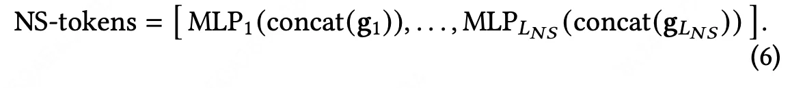

Auto-Split Tokenizer：先mlp，再分组
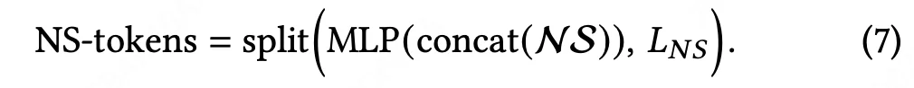

- **序列特征（S）**。

n个多行为序列：
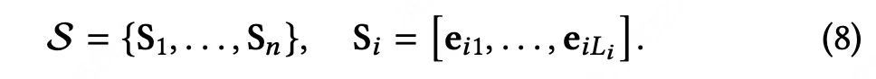

每一类行为过一个共享的mlp进行对齐：
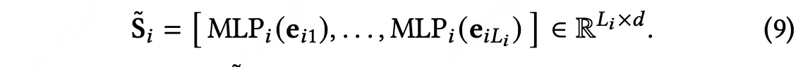

再对序列进行token化，方式有2种：1）按时间排列：按时间交错所有事件，并带有序列类型指示符；2）按行为类型排列：按事件影响连接序列，例如，购买→加入购物车→点击，在序列之间插入可学习的[SEP]标记。消融结果表明，当时间戳可用时，时间戳感知规则优于按影响排序的替代方案。

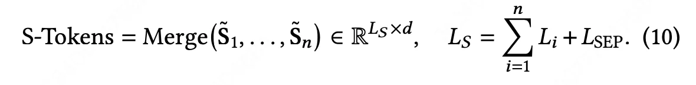

（又不是NTP任务，为啥要加个[SEP]？作为bias么，也不是说一个causal窗口一个独特的[SEP]啊）

## 2.2 OneTrans Block

序列特征按照时间顺序排（没有时间按照行为类型排），非序列特征放在最后，以此顺序进行Causal Attention。就相当于非序列特征作为target的扩充（sideinfo），参加target attention计算。

在计算attention时，序列特征共享一组QKV（毕竟都是item id），非序列特征每组特征一组QKV：
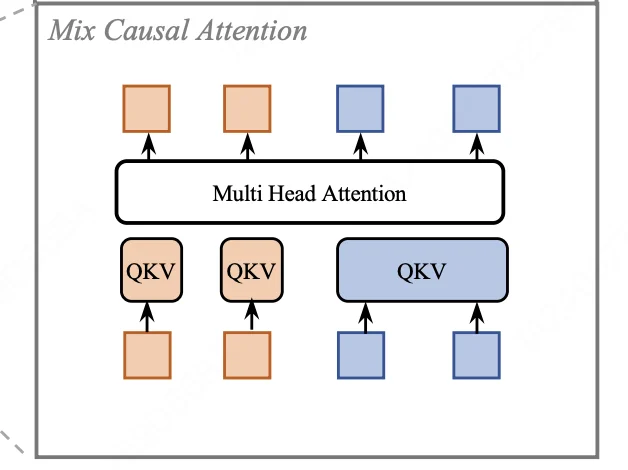

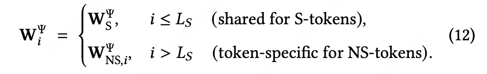

FFN层也一样，序列特征共享一组QKV（毕竟都是item id），非序列特征每组特征一组QKV：
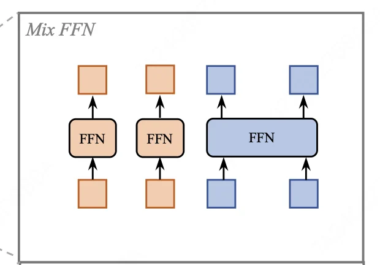

## 2.3 序列金字塔
那么长序列（千级别、万级别）肯定不是每个item都有用，所以就压缩。（6层，从长度1190线性压缩到12）

# 3 实验

6层onetrans block，每个token emb维度256，multi head为4.

- 离线auc：
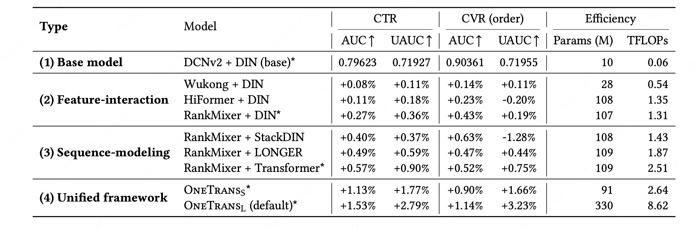
看上去本文是将rankmixer当作不带序列的特征交叉网络了。

- 消融实验，[SEP]还是效果影响最大的。
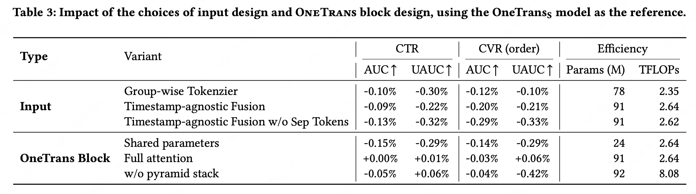

- scaling law：把rankmixer按在地上摩擦。
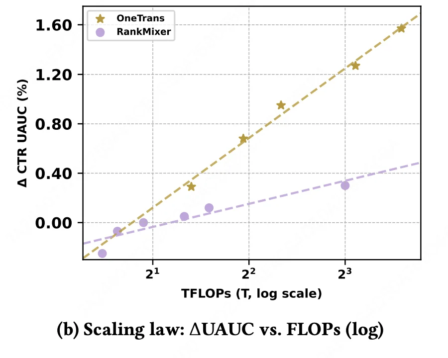

- 线上也是把rankmixer按在地上摩擦。
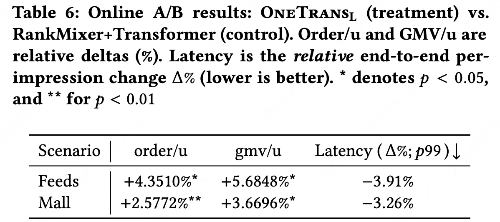
