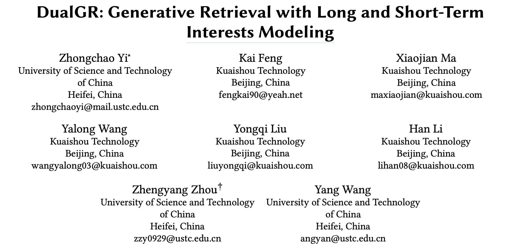

DualGR: Generative Retrieval with Long and Short-Term Interests Modeling
https://arxiv.org/pdf/2511.12518

快手双列信息流的工作。看名字里的“Dual”，还以为是美团双流GR之流的文章，其实是decoder增强，值得一读。

decoder是GR的核心，是真正的生成模块。判别模型可以将target作为输入得到很精确的预估，而生成模型看不到target，所以将其他信息作为decoder的输入（条件）来增强生成过程。比如：请求粒度生成将候选集作为生成条件、pinrec将行为作为生成条件、搜索的GR往往将query作为生成条件、onerec-think将LLM的推理作为生成条件，本文从历史行为中sim出相关行为作为生成条件。

其实onerec-think的推理文本也是基于历史行为做sim的，只不过本文在（多层sid的）每一步生成时都做了sim。

但本文在训练时用target做sim，推理时拿不到target信息只能全量参与不做sim，个人比较担心存在较大的训练-推理不一致问题。

# 1 背景

现在GR的问题：
1. 长短兴趣干扰。多兴趣在生成时缺乏显示的控制，当稳定的偏好和短暂的热点共存时，注意力和梯度可能会相互稀释，使生成变得不稳定，打破相关性-多样性平衡。
2. 上下文噪声和长历史约束。SID一般都是多层的（3层居多），越靠后的层（level-2/3）越容易被噪声干扰。同时，在检索的严格延迟预算下，如果没有在交互之前进行类别级别的粗略筛选，使用长历史记录将变得不可行。（p.s.没太懂，decoder在生成level-2时，会将level-1对长序列再计算一次attention吧，这应该就是一种粗筛吧？）
3. 缺少负面反馈。工业日志包含许多曝光未点击样本，现在的GR方法缺少对这种负反馈的建模，这阻碍了非兴趣方向的及时淡出，从而降低了解码质量和覆盖效率。

# 2 方法

包括三个部分：长短期双流、基于sim的生成、和曝光感知的NTPloss。
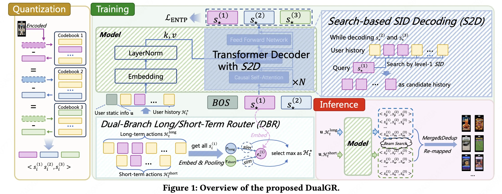

## 2.1 长短期双流

只对长短期序列的第一层sid: $s^{(1)}$进行计算：

训练时用ground-truth的第一层sid：$\mathbf{e}_{\star}^{(1)}$，对长短期序列的第一层sid进行相似度计算，从历史行为中检索出最相近的top-K$\mathcal{H}_{t}^{\star}$：

将检索出的top-K $\mathcal{H}_{t}^{\star}$ 作为输入的一部分：
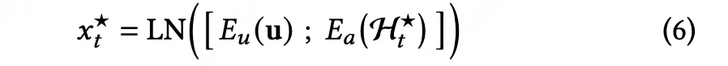

推理时没有ground-truth只能全量参与：
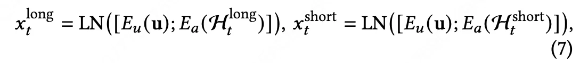

相当于训练时只用检索出来的部分序列，推理时用全部序列。

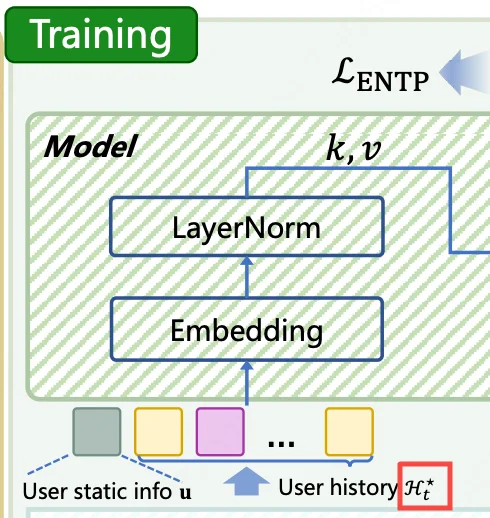

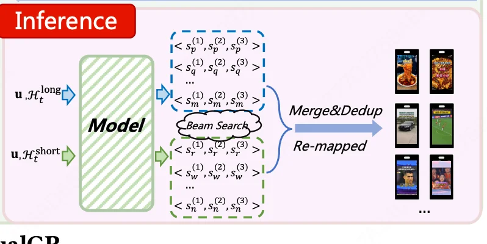

## 2.2 基于sim的生成

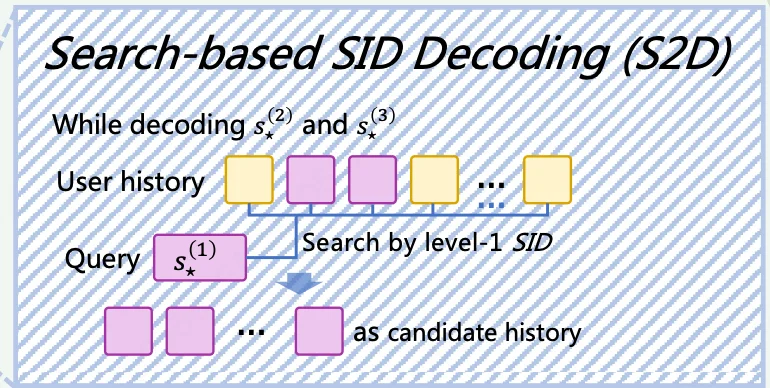

训练时只检索和ground-truth第一层sid相关的行为：
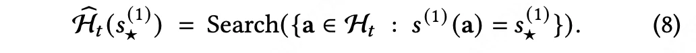

然后生成后面的sid：

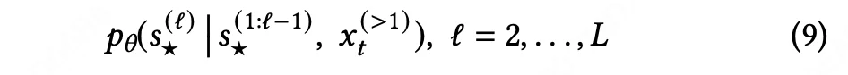

推理时同样没有ground-truth，只能全量参与（感觉这样得到的只能是用户平均兴趣）。

## 2.3 曝光感知的NTPloss

只对第一层sid的预估值$p^{(1)}$施加一个曝光未点击损失，$c_i=1$表示点击，$1-c_i=1$表示曝光未点击：
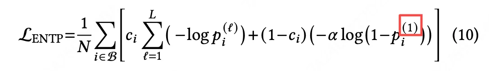

# 3 实验

离线效果：

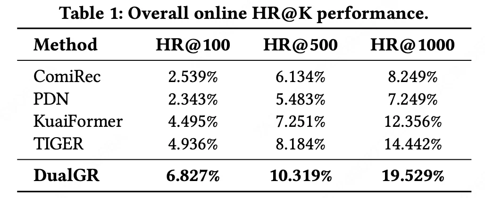

在线AB：
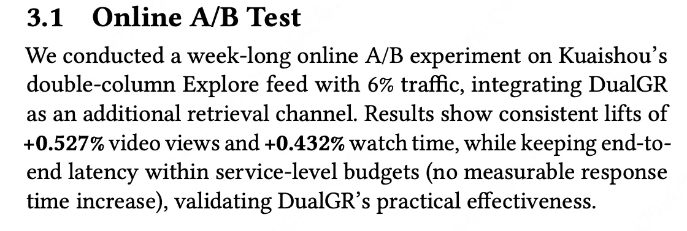
