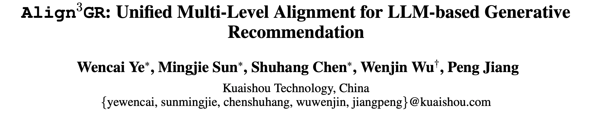
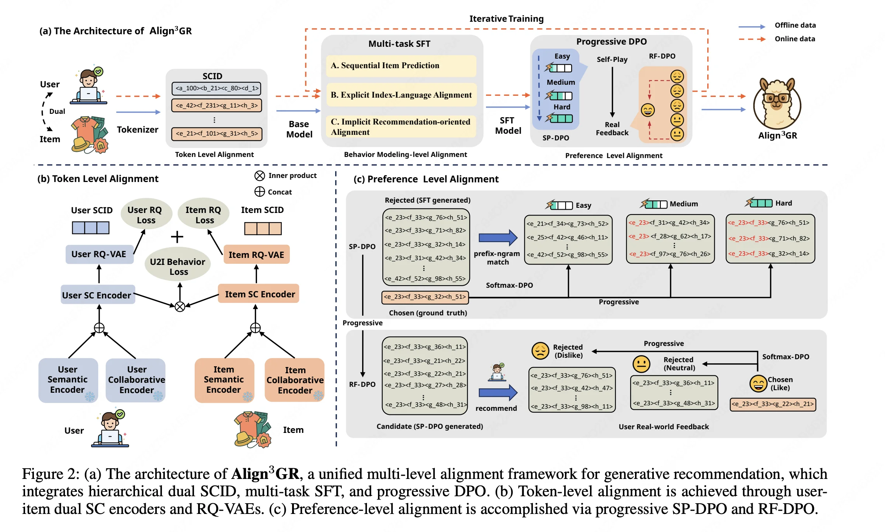
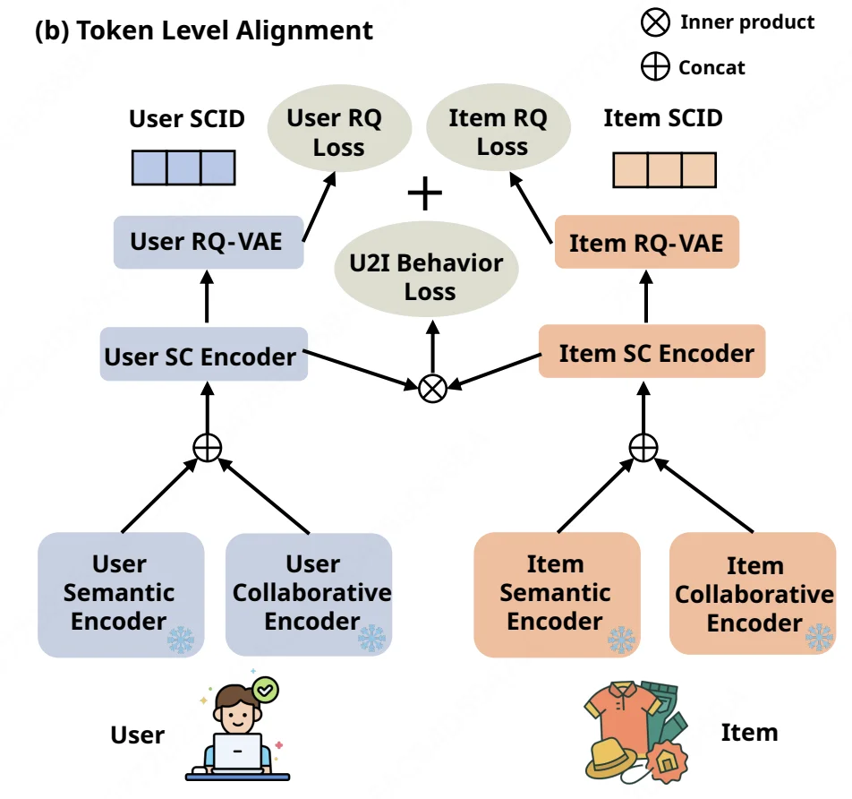
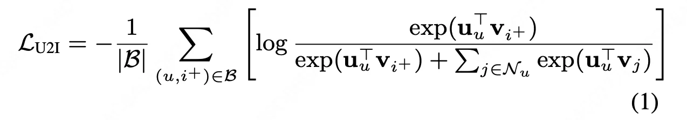
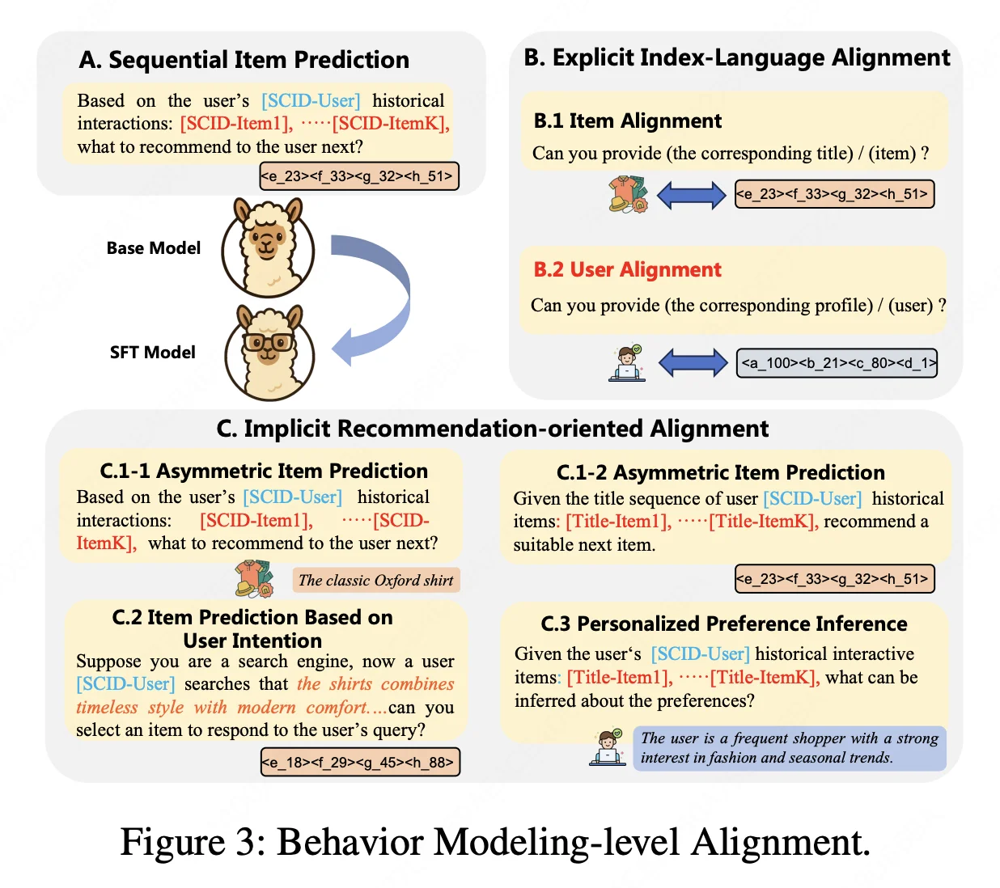
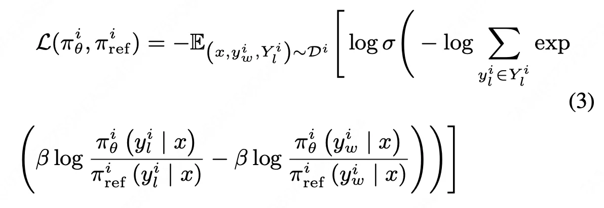
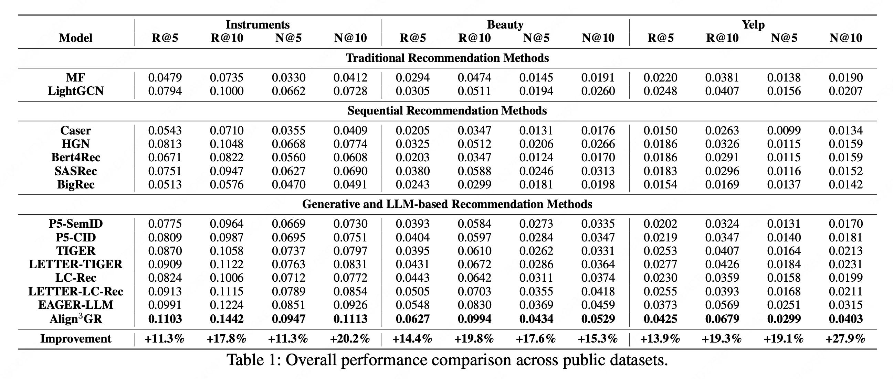
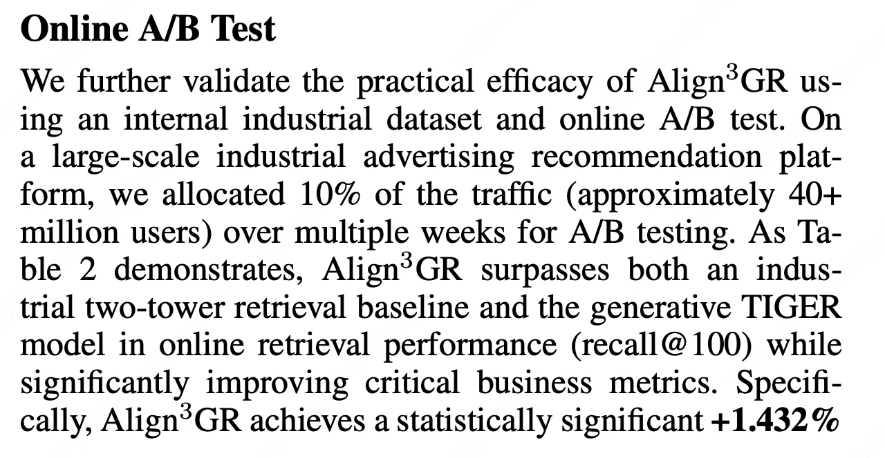

Align3GR: Unified Multi-Level Alignment for LLM-based Generative Recommendation

https://arxiv.org/pdf/2511.11255

都在搞llm as rec，一开始是直接上文本prompt，用llm提取item的emb作为特征；后来为了用上llm的推理能力，给llm输入用户文本的行为序列，再加上一些lora微调/蒸馏对齐下游任务。现在主流的对齐方式是：不用llm的tokenizer，给item单独搞一套tokenizer，比如腾讯的LC-Rec、谷歌的PLUM、快手的onerec-think、以及本文的Align3GR。

说实话，搁以前我肯定不信llm在效果上能as rec，现在我想通了，不仅是llm as rec，所有的生成式模型，效果好就替精排甚至全链路、效果不好就只作为特征或者一路召回，成本低就端到端、成本高就离线缓存，生成emb的就接ANN、生成SID的就直接检索。生成式的应用大致就是这样，看效果灵活应用。

# 1 方法

直接讲方法吧。本文从tokenization、SFT、RL三个层面对llm进行下游任务的对齐。

## 1.1 tokenization

和DAS一样，用双塔模型引入协同信息，相当于简化版的DAS，省去了去偏loss。

（扩参数要避免过拟合，就要保证模型的泛化性，提高泛化性最简单的方式就是降维。tokenizer采用hard方式降维--缩小生成空间，简单粗暴。传统的SASRec其实就是一种soft的方式，按理说soft的方式上限会更高，可能难度太大了吧。）

## 1.2 SFT
和LC-Rec一样，设计了多个任务进行对齐，prompt如下：

## 1.3 RL

SFT依赖有限的监督信号，缺乏探索，难以适应复杂业务。为了解决这一问题，引入了具有self-play DPO（SP-DPO）和真实世界反馈（RF-DPO)的渐进式DPO。

渐进式DPO：相比DPO分了多阶段，先学简单的，再学难的。

怎么分多阶段呢？

- SP-DPO：使用前缀分层。我理解SID不是有3层么，SP-DPO先让模型预估准第一层，再预估准第二层、第三层。
- RF-DPO：使用用户真实反馈分层，不喜欢->中立->喜欢。

# 2 实验

基于Llama2-7B lora微调。

在线AB，广告收入提升1.432%，在召回阶段，不知道是端到端还是离线缓存，更新频率多少。

