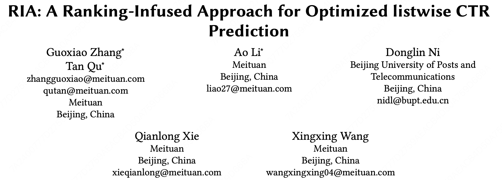
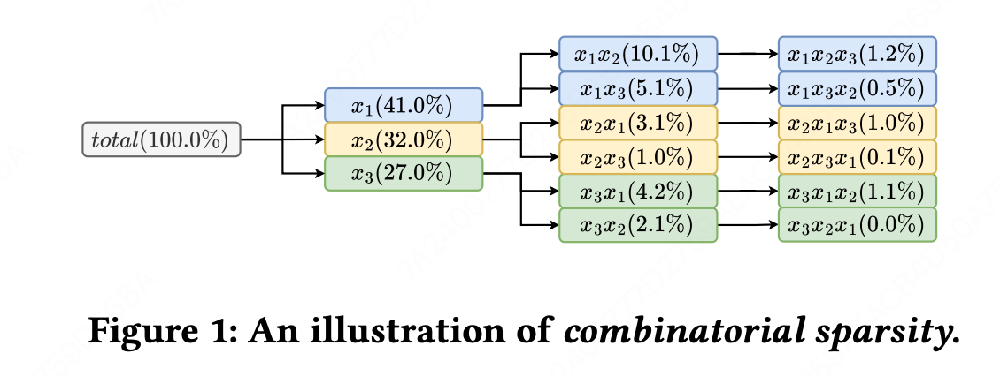
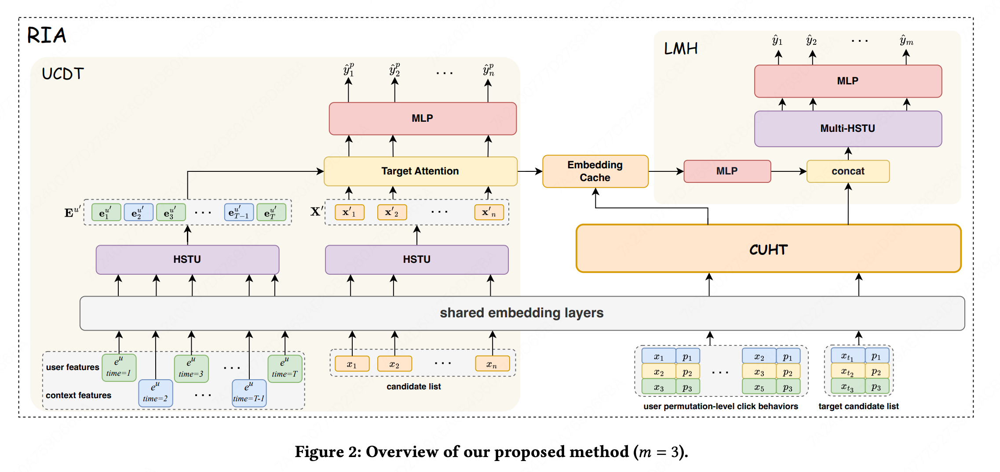
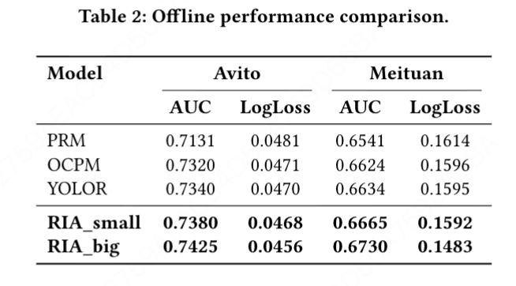
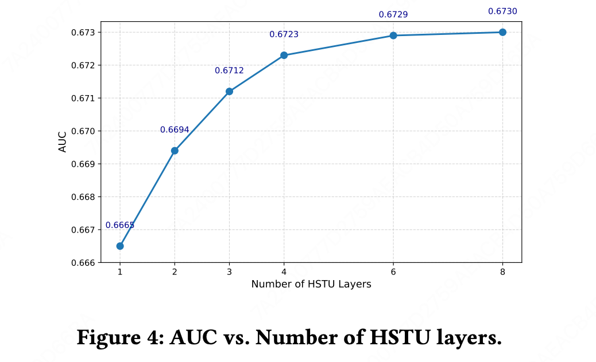
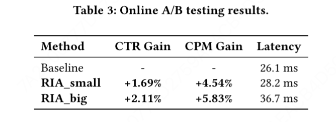
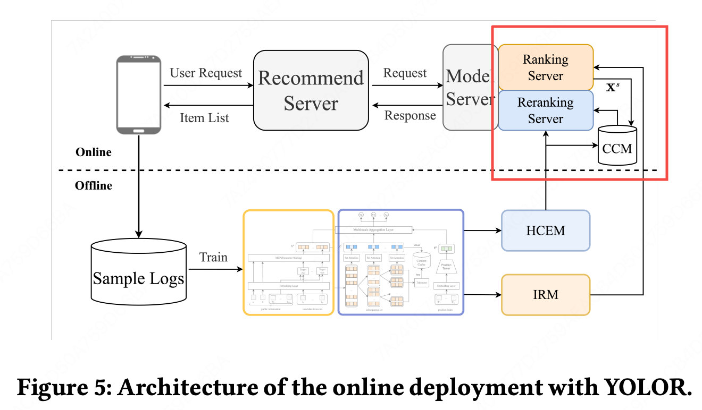

RIA: A Ranking-Infused Approach for Optimized listwise CTR Prediction

https://arxiv.org/pdf/2511.21394

评估式重排，少见。

# 1 背景

这篇文章提出重排的两个问题：

第一：组合稀疏问题。重排要建模列表内的共现关系，pointwise的曝光还算丰富，但组合就比较稀疏了，而且还得考虑绝对位置信息，那就更稀疏了。

第二：链路不一致问题。

# 2 方法

模型图如下，左边精排、右边重排，用一个embedding cache连接。

方法很简单，核心是embedding cache模块，将pointwise 和 上下文特征缓存起来。

（感觉没解决组合稀疏问题啊，我还以为会用SID解决呢。）

# 3 实验
离线：

（本文一个评估式重排模型，和pier只比OCPM不比FPSM，和yolor只比auc不比hit rate是吧。）

还有scaling law。

在线：（没看到本文是几选几）

针对本文提出的问题一：组合稀疏。yolor的解法是：将上下文信息分解为pointwise、相对上下文信息、绝对位置信息，这样起码能缓解部分稀疏性，比如ab在第一二位置和ab在第三四位置能共享相对上下文信息。本文认为yolor存在两个问题：1. yolor隐含地假设位置和上下文之间的条件独立性，2. yolor是评估式重排方法，无法处理组合爆炸问题。可这俩问题本文也没解决啊。

针对文本提出的问题二：链路不一致。确实，从重排往前整合链路是一个路子，但好像yolor的online部署就是这样。

