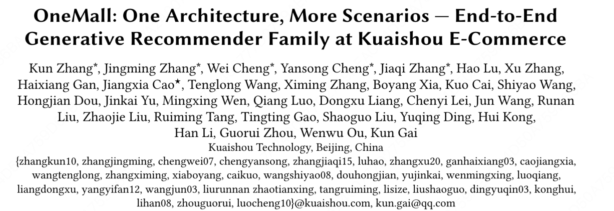

OneMall: One Architecture, More Scenarios — End-to-End Generative Recommender Family at Kuaishou E-Commerce

https://arxiv.org/pdf/2601.21770

我感觉onemall团队挺务实的，不强行搞链路one model，搞多场景的召回one model，吃多场景收益。再精排指引召回，吃一点链路一致性收益。

# 1 背景

本文先总结了在nlp领域LLM的scaling law为什么能成功：

1. 利用大数据量/模型参数的统一的NTP pre-training任务；

2. post-training 强化任务使模型行为更紧密地符合人类品味；

3. 各种并行技术。

能否在推荐系统中复现大型语言模型在预训练/训练后的演变轨迹？这是一个具有挑战性的开放问题，因为推荐系统（RecSys）和LLM在任务定义上并不完全一致。当前推荐系统分为两个阶段：生成式检索（Generative retrieval）和判别式排序（Discriminate ranking），因此业界的扩展也基本基于这两种技术路线：

1. **精排模型的scaling。** 最典型的长序列，用级联GSU/ESU架构，将序列扩展到终身级别。但局限也很明显：不平衡的计算（大量的计算在序列上）、复杂度高难并行。字节的rankmixer走的就是这条路。

2. **召回模型的scaling。** 

