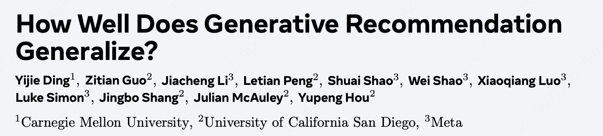

How Well Does Generative Recommendation Generalize?

https://arxiv.org/pdf/2603.19809

推荐两篇研究SID泛化性和记忆性（个性化）的文章，一个是meta的这篇，另一个是字节的Farewell to Item IDs: Unlocking the Scaling Potential of Large Ranking Models via Semantic Tokens，meta偏分析，字节偏应用。

# 总结

一般认为，生成式推荐（GR）之所以更好是因为SID的泛化能力比item id更强。meta这篇文章就是做了一些实验分析，把这个假设验证了一下。结论就是：
1. GR本质上还是在做记忆，所谓"item 级泛化"本质上是"token 级记忆"；
2. GR 确实更能泛化，但 item ID 模型更能记忆；两者互补，自适应集成可以双赢。

但是，话又说回来，懂得都懂，我们期待的GR=SID的泛化+scaling law的记忆。在大模型的scaling law下，SID记忆性差的弱点能被弥补吗？

可惜的是本文并没有进行的明确scaling实验。本文只是说，TIGER这种共享前缀的属性，会导致记忆性被稀释。虚惊一场，没有否定scaling law，scaling 还是有探索空间的。

> 原文："TIGER predicts through prefix transitions that are shared by many items. Thus, its ability to memorize specific item transitions can be diluted."

# 记忆与泛化的定义

记忆与泛化可以用下面一张图表示：
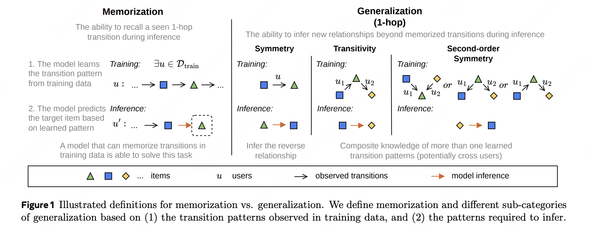

记忆：从itemA->itemB

**记忆型：**
- A->B在训练集出现过.

**泛化型：**不是记忆型，但可以由已见过的 transition 组合推断出来，细分四类：
- 对称型：见过 B→A → 推断 A→B
- 传递型：A→B、B→C → 推断 A→C
- 2跳对称型：A→x→B 和 C→x→B → 推断 A→C 类关系
- 多跳型：如 i_{t-2}→i_t 出现过，本文将多跳上线设置为4，因为超过4就很难学习了。

**未分类：**
- 上述都不满足,通常是训练集没见过的 item，或超过4跳的模式

# 实验1: 记忆 vs 泛化的性能分析

模型选择TIGER（SID-based GR）vs SASRec（item ID-based），都用 cross-entropy loss 训练，配置对齐。

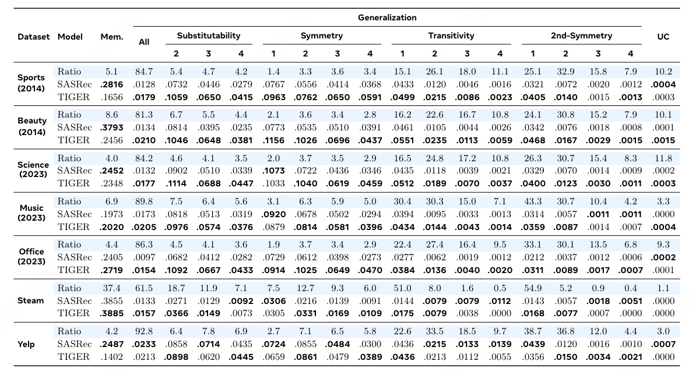

结论：
1. **SASRec负责记忆，TIGER负责泛化。**
在记忆型数据上，TIGER 显著劣势，但在泛化数据上又显著优势。且SASRec主要在局部上下文上进行泛化，而TIGER对于较长跳跃的泛化保持更为稳健。
2. **转化难度。**
记忆样本的转化难度低，泛化样本的转化单独高，越多跳难度越高。首先，两个模型在记忆方面的整体表现都显著高于泛化方面，反映了泛化超出观察到的转换的固有难度。然后，比较不同泛化类别的表现，两种模型在可替代性和对称性上的表现优于传递性和二阶对称性。在每个泛化类别内，随着跳跃距离的增加，两种模型的表现都单调下降。这表明相邻项目的转换比远距离的转换具有更大的影响。
3. **数据比例分析。**
数据集中泛化型占比远大于记忆型，这解释了为什么 TIGER 整体上能赢。

# 实验二：Token 级机制分析

**问题：为什么 TIGER 泛化好、记忆差？**

作者借鉴了LLM的方法：在LLM中，通常通过n-gram相关性来评估记忆。比如item的sid长度为L，那它的前n个码本就是它的n-gram前缀。

下图是一个2-gram前缀的例子：item id还需要靠2跳泛化才能从蓝色方块跳到黄色圆圈，SID直接靠记忆就能从蓝色方块跳到黄色圆圈。
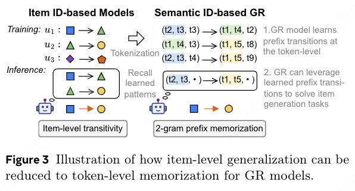

本文统计了所有泛化样本（4跳以内）的缀记忆token，用的是256*3的SID：
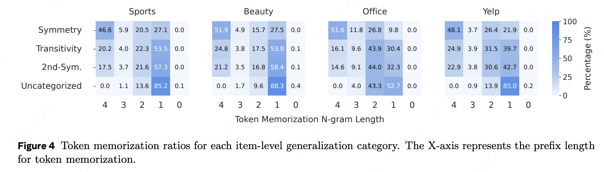

实验结果：

1. 只有不到1%的0-gram 样本，也就是说99% 的样本对SID来说都是见过的，可记忆的；
2. 未分类样本几乎全部只能归约到 1-gram（最弱的prefix匹配），这解释了为什么它们最难预测。对称型表现出更高的4-gram记忆率，所以对称型最简单。

**结论：TIGER 的"泛化"本质是靠 token prefix 的记忆来实现的，不是真正的从未见过的模式组合。**

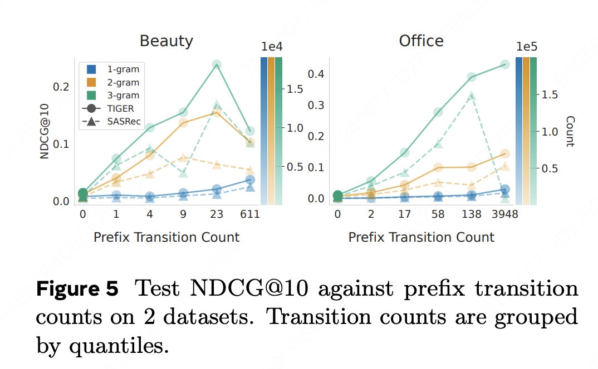
作者还对比了前缀一致出现次数和效果的关系，上图，看同样颜色的就行。当count很小时，sasrec和tiger的效果都很差，count增大tiget的效果就好起来了，但是1-gram的效果一直很差。

**结论：Token 记忆支持越多，泛化越好**

**问题：为什么TIGER的记忆性不如SASREC呢？**

作者进行了以下实验：
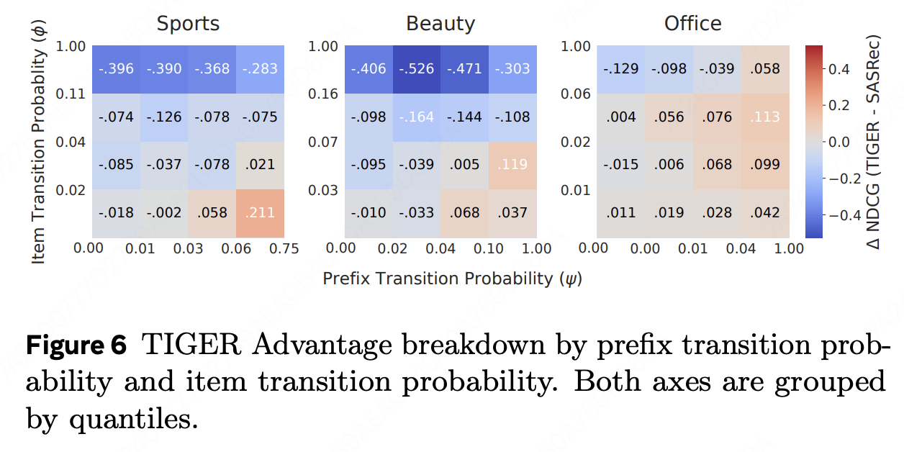

对记忆型 instance，同时观察两个概率：

- ϕ = item transition 概率（[i_{t-1}→i_t] 的条件概率）
- ψ = prefix transition 概率（[pref_n(i_{t-1})→pref_n(i_t)] 的条件概率）

实验结果：
- 当 ϕ 高但 ψ 低时（= 特定 item pair 经常一起出现，但它们的 prefix 被很多其他 item 共享），TIGER 相对 SASRec 损失最大。
- 相反，当 ψ 较高时，TIGER甚至可能胜过SASRec，这表明TIGER的项目记忆性能仅在标记记忆一致时才强劲。

**结论：Token记忆会稀释item记忆。** TIGER 把概率质量分散给所有共享同一 prefix 的 item，没法集中给那一个特定的 item_B。

机制验证：为了进一步巩固假设，作者改变标记记忆比率（通过改变码本大小 V），并衡量由此产生的性能变化。
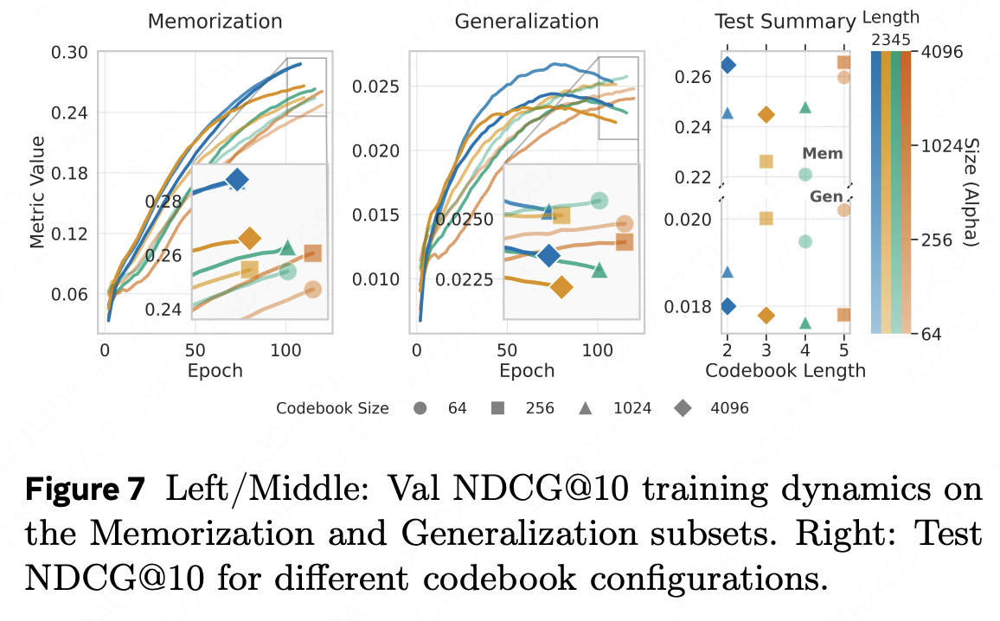

实验设计：固定SID长度 L∈{2,3,4,5}，对每个 L 测试两种码本大小 V（大 vs 小），其他全部对齐（模型大小、训练计算量）

逻辑：V 越小 → 更多 item 共享相同 prefix → token memorization ratio 越高

**实验结果：码本越小，泛化性越强，反之记忆性越强。**
- 小 V → 泛化 +10.24%，记忆 -7.62%
- 大 V → 泛化 -10.24%，记忆 +7.62%

这个结论在所有SID长度下都一致。

# 实验三：自适应集成
问题：能不能同时要鱼和熊掌？

核心思想：估计一个数据实例能被记忆的概率，并使用这个概率来调整每个实例的item id和SID的相对权重。

方法：maximum softmax probability (MSP)指标
- 直接用item id based模型对所有item的最大预估值作为置信度（记忆倾向）指标，再sigmoid归一化到0-1；
- q和τ都是超参数。

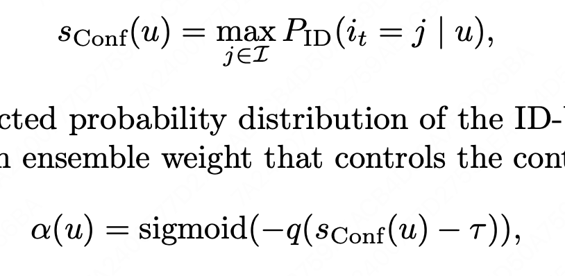

最终分数：α × SASRec_score + (1-α) × TIGER_score

验证 MSP 有效性：

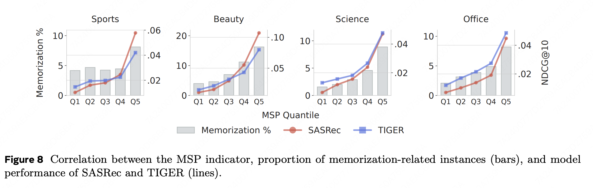

- 按 MSP 分位数分组，MSP 越高的组里记忆型样本占比单调递增；说明MSP和记忆型正相关。
- MSP 高的组 SASRec 更强；MSP 低的组 TIGER 更强；符合假设。

最终性能（Table 4，7个数据集）：

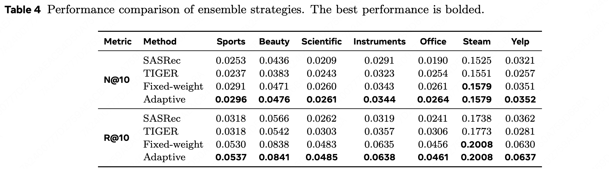

