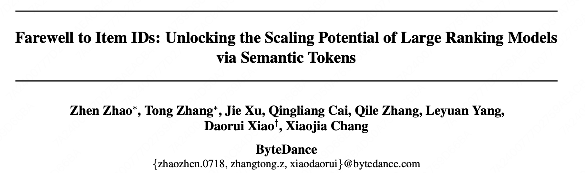
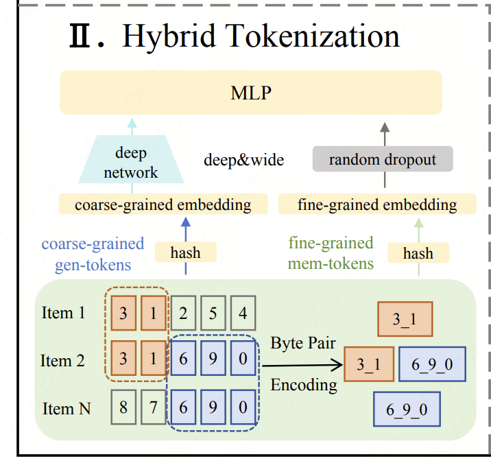
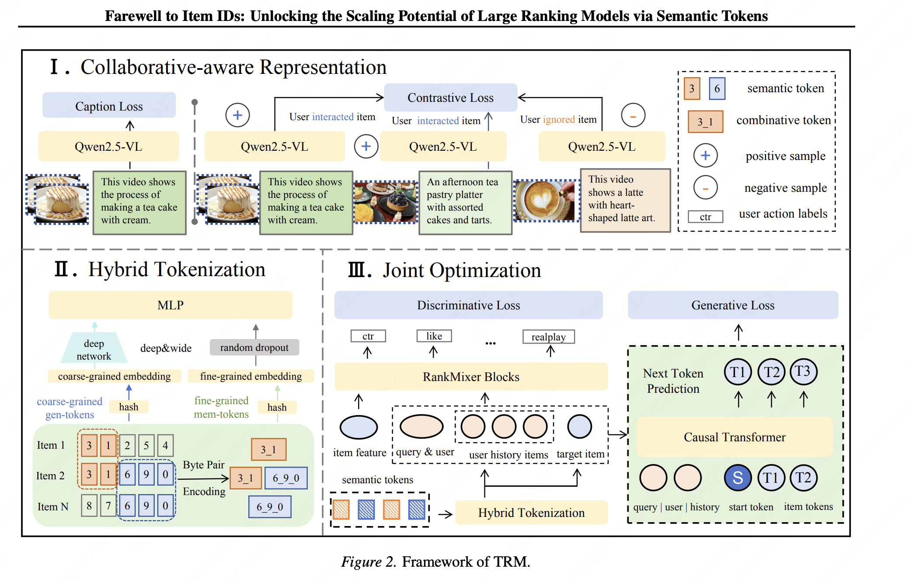
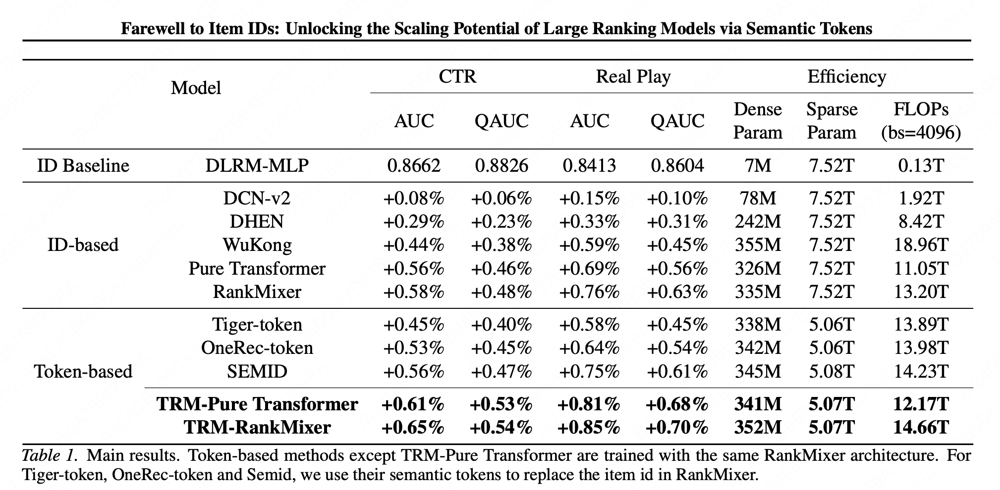
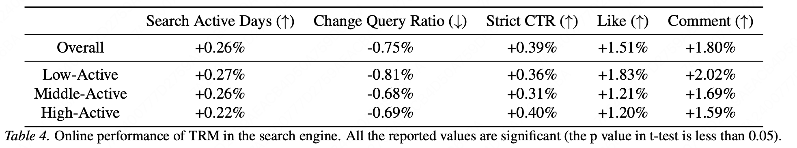

Farewell to Item IDs: Unlocking the Scaling Potential of Large Ranking Models via Semantic Tokens

https://arxiv.org/pdf/2601.22694

字节还是比较稳重的，没有像快手或者其他公司那样搞one系列，还是老老实实的迭代精排模型，比如这篇，SID在精排模型中的应用。

# 1 方法
直接讲本文最核心的贡献点。

**Hybrid Tokenization with Generalization–Memorization Trade-off**

**问题：** 直接用 RQ-KMeans token 替换 item ID，高频老 item 的 AUC 反而下降（Figure 3）。

**根因分析：**

残差量化是粗粒度聚类，无法学习 token 的组合知识。

token A = "蛋糕"，token B = "蜡烛"

但 A+B 应该隐含"生日派对"，单个 token 学不到这个组合语义

**解法：**

Byte Pair Encoding (BPE) 生成组合 token（Mem-token）。比如下图中item2的sid是[3,1,6,9,0]，其中[3,1]和[6,9,0]是高频组合，就让这些高频组合分配独立可学习 embedding。

双 token 体系：
- Gen-token（泛化 token）= RQ-KMeans 标准 semantic token，负责跨 item 知识共享，新/长尾 item 表现好
- Mem-token（记忆 token）= BPE 组合 token，记忆高频 item 的细粒度行为模式，老/热门 item 表现好

再用deep&wide模型学习最终的emb。

当然本文也有协同感知的多模态表征、判别 + 生成联合优化这些模块，但个人认为不是最核心的贡献点。完整模型图如下：

# 2 实验

离线：

在线：

本文本质上仍是群体记忆，Gen-token 和 Mem-token都是基于SID的，没有解决 SID 冲突问题（两个 item 共享相同 SID 序列）。