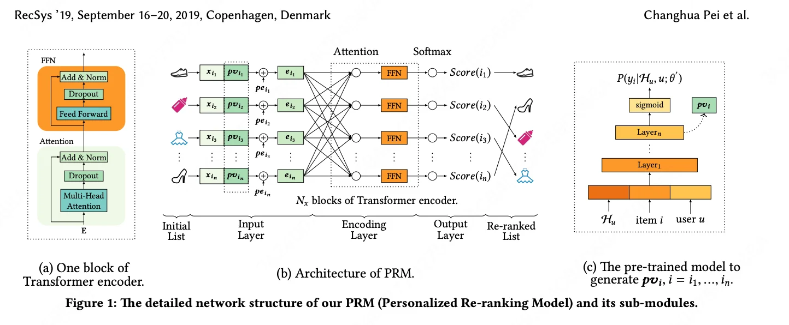
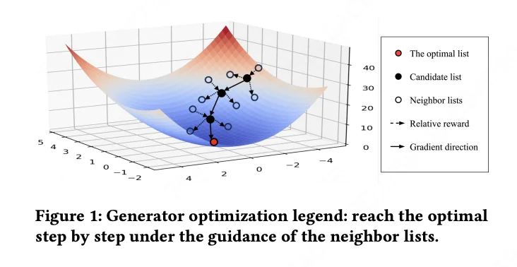
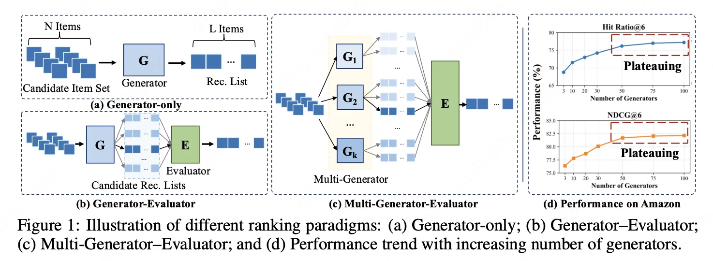
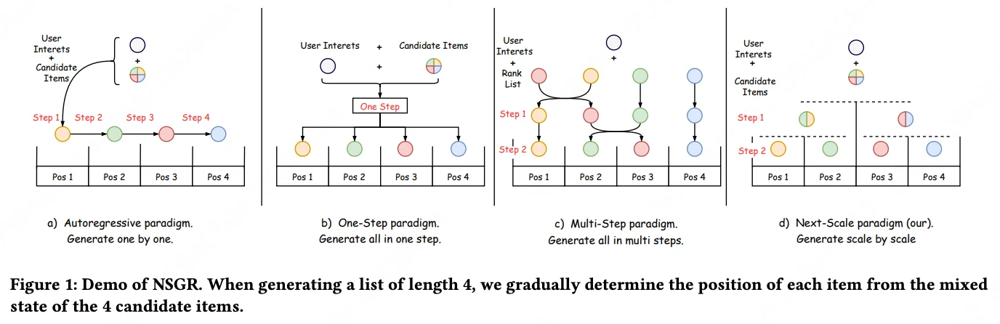
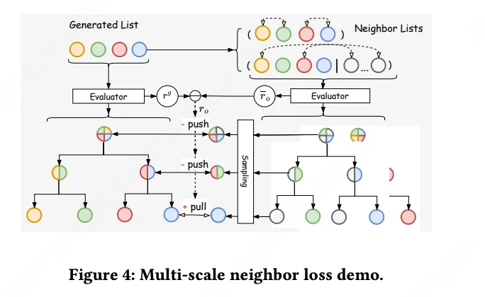
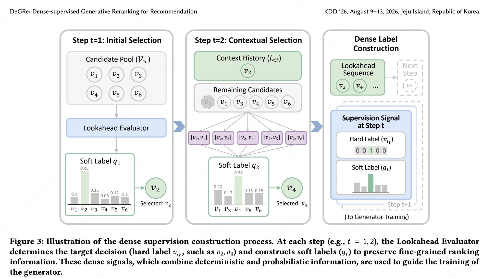

# 生成式重排的进化：从相对 Reward 到稠密监督

从 NLGR 开始，用列表间的相对 reward 作为其在排列空间中的指引，已经成了生成式重排的标配。

这句话背后，是过去一年多里四篇论文走过的一条清晰的演化路径。它们分别来自美团和阿里，解决的是同一个问题——推荐系统最后一关的重排序——但每一篇都在前一篇留下的裂缝里打进了新的楔子。

---

## 问题的起点：排列空间里的迷失

重排序的任务听起来简单：从 ranking 阶段给出的 N 个候选里，选出最优的 L 个，并确定它们的展示顺序。但这个"最优"藏在一个指数级大的排列空间里——12 个候选选 6 个，排列数就有 P(12,6) ≈ 66 万种。

早期方法（PRM、DLCM）的做法是：用 Transformer 对候选集编码，然后贪心地逐个打分排序。这套路有个根本缺陷，被后来的论文反复引用，叫做"evaluation-before-reranking"——模型在评估之前就已经排好序了，无法感知列表内部的组合效应。把商品 A 排第一，会影响用户对商品 B 的感知；这种依赖关系，贪心打分完全捕捉不到。

于是研究者引入了生成器-评估器范式：评估器学会给任意排列打分，生成器负责在排列空间里搜索高分序列。这个框架的问题是目标不一致——评估器优化的是"准确估值"，生成器优化的是"找到好序列"，两者的损失函数天然对不上，而且在线要同时部署两个模型，延迟高。

这就是四篇论文共同面对的战场。

---

## NLGR：第一个用相对 reward 破局的人

**论文**：NLGR: Utilizing Neighbor Lists for Generative Rerank（WWW 2025，美团）

NLGR 的核心洞察是：生成器和评估器目标不一致，根源在于评估器给的是绝对分数，而生成器需要的是方向——"我现在的列表往哪个方向改，能变得更好？"

解法是引入邻居列表（Neighbor List）。对生成器当前输出的列表 $L_o$，通过位置互换或候选替换，构造出一批邻居列表 $\{L_1, L_2, \ldots\}$。用评估器分别打分，然后计算相对 reward：

$r_j = r_j - r_o$

这个差值才是真正有用的信号——它告诉生成器，把第 $j$ 个位置换成另一个商品，列表价值会增加还是减少。生成器的训练目标变成：让自己的输出比所有邻居都好。

生成策略上，NLGR 也做了创新：放弃了逐个生成的自回归方式，改用基于采样的非自回归生成，允许生成器从当前列表直接跳到任意邻居列表，探索效率大幅提升。

在美团外卖平台的 A/B 测试（5 周，2023 年 12 月至 2024 年 1 月）中，NLGR 相比 PRM 基线 CTR 提升 3.25%，GMV 提升 3.06%。

NLGR 的贡献是奠基性的：它第一次把"相对 reward"引入生成式重排的训练，把目标不一致问题从"无解"变成了"可以这样解"。但它的局限也很明显：邻居列表是当前列表的局部扰动，探索范围被锁在了当前解的邻域里，容易陷入局部最优。

---

## GoalRank：把相对 reward 升格为理论原则

**论文**：GoalRank: Group-Relative Optimization for a Large Ranker（ ICLR 2026，快手）

GoalRank 做了一件更有野心的事：它不满足于"相对 reward 有效"这个经验观察，而是要从理论上回答"为什么有效"，以及"能不能把评估器彻底去掉"。

核心定理是：对于任意有限的多生成器-评估器系统，总存在一个足够大的单生成器模型，其策略对最优排序策略 $\pi^*$ 的近似误差更小——而且随着模型规模增大，误差单调递减，即存在 scaling law。

这个定理的实践含义是：评估器不是必须的，一个足够大的生成器可以把评估器的能力内化进去。

训练方法上，GoalRank 从理论推导出了 Group-Relative Optimization 原则。对每个用户，采样一组候选列表 $\mathcal{B}_u$，用离线训练好的奖励模型打分，构造参考策略：

$\pi^{\text{ref}}(l \mid \mathcal{B}_u) = \frac{\exp\left((\hat{r}(l) - \bar{r}_{\mathcal{B}}) / \sigma_{\mathcal{B}}\right)}{\sum_{l' \in \mathcal{B}_u} \exp\left((\hat{r}(l') - \bar{r}_{\mathcal{B}}) / \sigma_{\mathcal{B}}\right)}$

这个参考策略是组内相对的——它不关心绝对分数，只关心这批列表里谁比谁好、好多少。生成器的训练目标是让自己的输出分布对齐这个参考策略。

相比 NLGR，GoalRank 的进步在两个维度：第一，探索空间从"当前列表的邻域"扩展到了"任意采样的列表组"，不再受局部扰动的限制；第二，有了理论保证，知道这个方向是对的，而不只是经验上有效。

在某短视频平台（日活超 5 亿）的两周 A/B 测试中，GoalRank 全面超越了原有的多生成器-评估器框架，并已全量上线。

GoalRank 留下的问题是：奖励信号仍然是列表级的标量，每条序列生成完之后才能得到一个反馈。生成过程中每一步的决策——第 3 步选了商品 C 而不是 D，对最终奖励的贡献是多少——模型仍然不知道。这就是信用分配问题。

---

## NSGR：换一个生成范式，在每个尺度上都加监督

**论文**：Next-Scale Generative Reranking: A Tree-based Generative Rerank Method at Meituan（2026，美团）

NSGR 的切入点不是奖励信号的粒度，而是生成范式本身。

它观察到现有生成范式的两个极端：自回归方法（逐个生成）有局部视野，但缺乏全局感知；一步生成方法（一次输出所有位置）有全局视野，但缺乏局部精细建模。NSGR 提出了第三条路：next-scale 生成，像二叉树一样从粗到细地确定排列。

具体来说，对于长度为 $m$ 的列表，NSGR 分 $K = \log_2 m$ 步生成。第一步把所有候选分成"前半"和"后半"两组；第二步在每组内再分；以此类推，直到每个位置都确定。这个过程同时具备全局视野（每步都看到所有候选）和局部精细度（越到后面，决策粒度越细）。

训练信号上，NSGR 继承了 NLGR 的相对 reward 思路，但做了"多尺度"扩展——Multi-Scale Neighbor Loss（MSNL）。树的每个内部节点都对应一个 scale，每个 scale 都独立接收一次来自评估器的相对 reward 信号。对于长度 4 的列表，树有 7 个节点，就有 7 组监督信号。

这比 NLGR 的单一列表级信号更密，但本质上仍然是列表级的相对比较，只是在树的不同层级上重复施加了多次。

在美团外卖平台（CPS 业务）的 8 周 A/B 测试中，NSGR(20)——候选集大小为 20——相比 YOLOR 基线 CTR 提升 2.89%，GMV 提升 3.15%，已全量上线。

---

## DeGRe：把信号密度推到极限

**论文**：DeGRe: Dense-supervised Generative Reranking for Recommendation（KDD 2026，阿里淘宝）

DeGRe 是这条��化路径目前走得最远的一步。它直接把信用分配问题作为主攻目标，答案是：把奖励信号从列表级推进到每步每个候选的价值分布。

整个框架分三个阶段，核心思想是离线-在线解耦：把计算密集的探索搬到离线，把探索结果蒸馏进轻量的在线生成器。

**离线阶段**：训练一个 Lookahead Evaluator，基于累积回归（Cumulative Regression）——把"这个子序列最终能带来多少点击"这个连续值回归问题，分解为一组有序二元分类问题：$P(V \geq k \mid l_{1:t}) = \sigma(O_{t,k})$。这个设计让评估器能对任意长度的子序列估值，包括从未曝光过的子序列。(但这种序列评估的方式明显是贪心的做法)

有了评估器，用 beam search（beam size B=8）在未曝光的排列空间里主动搜索高价值序列，得到合成序列集 $\mathcal{T}_{syn}$。

**稠密标签构建**：对 $\mathcal{T}_{syn}$ 里每条序列的每一步 $t$，构建两种信号。硬标签是 beam search 在这一步实际选的商品（one-hot）；软标签是对所有剩余候选用评估器估值做 softmax，得到一个 $N$ 维概率分布：

$$q_t(v_i) = \frac{\exp(\hat{V}([l_{< t}; v_i]))}{\sum_{v_j \in V_u \setminus l_{< t}} \exp(\hat{V}([l_{< t}; v_j]))}$$

这个软标签保留了"次优选择有多次优"的信息——不只是告诉生成器"你应该选 $v_2$"，还告诉它"$v_1$ 比 $v_3$ 好，$v_3$ 比 $v_5$ 好"。

序列之间还有价值差异，用 softmax 加权：$w_l = \exp(\hat{V}(l)/\tau_w) / \sum_{l'} \exp(\hat{V}(l')/\tau_w)$，让高价值序列贡献更大的梯度。

最终生成器的训练损失：

$$\mathcal{L}_{Gen} = \sum_l w_l \cdot \sum_t \left[ \mathcal{L}_{CE}(v_{i_t}, P_{\theta,t}) + \alpha \cdot \mathcal{L}_{KL}(q_t \| P_{\theta,t}) \right]$$

**在线阶段**：评估器不上线，生成器单次贪心解码，延迟增量仅 14.8ms。

在淘宝闪购的 8 天 A/B 测试（2% 流量）中，DeGRe 相比点级融合基线 GMV 提升 3.75%，相比 PRM 的 0.76% 高出近 5 倍。

---

## 四篇论文的演化脉络

把这四篇放在一起，可以看到一条清晰的演化轨迹，沿着两个维度同时推进。

**第一个维度：奖励信号的粒度**

NLGR 用的是位置级相对 reward——对每个位置，比较换与不换的差值。GoalRank 用的是列表级相对 reward——对一组列表，比较彼此的相对优劣。NSGR 用的是多尺度列表级相对 reward——在树的每个节点上都做一次列表级比较。DeGRe 用的是步级价值分布——每一步都有一个 $N$ 维软标签，直接告诉生成器候选空间里每个商品的相对价值。

信号粒度越来越细，信用分配问题被解决得越来越彻底。

**第二个维度：探索空间的范围**

NLGR 在当前列表的局部邻域里探索，容易陷入局部最优。GoalRank 通过随机采样扩大了探索范围，但仍然受限于采样分布。NSGR 通过树形结构在全局和局部之间取得平衡。DeGRe 用 beam search 主动在未曝光空间里挖掘，探索范围最广，也最彻底地解决了启发式标签偏差问题。

| 论文 | 奖励粒度 | 探索范围 | 在线架构 | 核心创新 |
|------|---------|---------|---------|---------|
| NLGR | 位置级相对 reward | 局部邻域 | 生成器单独上线 | 相对 reward 破目标不一致 |
| GoalRank | 列表级相对 reward | 随机采样组 | 生成器单独上线 | 理论证明 + scaling law |
| NSGR | 多尺度列表级 reward | 局部邻域（多尺度） | 生成器单独上线 | 树形 next-scale 生成范式 |
| DeGRe | 步级价值分布 | 未曝光全局空间 | 生成器单独上线 | 稠密监督蒸馏 |

有一个细节值得注意：四篇论文在线上线的都只有生成器，评估器/奖励模型只在离线训练阶段存在。这个"离线-在线解耦"的设计哲学，从 NLGR 就已经确立，DeGRe 把它推到了极致——评估器做的事情越来越多（从打分到 beam search 探索），但在线推理越来越轻（单次贪心解码）。

---

## 三个值得追问的问题

这条演化路径还没有走到终点。

### **相对 reward 的下一步是什么？**

回顾这四篇论文，相对 reward 的演化方向是一致的：粒度越来越细，从列表级到位置级，再到步级价值分布。DeGRe 已经把信号密度推到了每步每个候选都有一个概率值。但这条路还能继续走吗？

这里有一个根本的张力需要先说清楚：**信用分配越细，逐步决策的理论错位就越大**。

NLGR、GoalRank、NSGR 的相对 reward 信号来自完整列表的评估器打分。评估器拿到的是一个完整排列，输出的是整体价值。这个整体价值天然包含了所有位置之间的相互影响——第 $t$ 个位置选了谁，对前面位置的组合效应也已经算进去了。生成器学的是"哪个完整列表更好"，不需要在生成过程中做逐步的前向决策，所以不存在"用子序列价值做前向剪枝"的问题。

另一个极端是 PRM（Personalized Re-ranking Model，RecSys 2019）。PRM 用 Transformer 对整个列表双向编码，self-attention 让每个商品的表示都融合了所有其他商品的信息，然后同时输出每个商品的点击概率，一次性排序。PRM 的信号粒度是商品级的，但它根本没有逐步生成的概念——它不做前向决策，所以也不存在理论错位。代价是完全没有信用分配：模型不知道"第 3 步选了商品 C 而不是 D，对最终结果贡献了多少"。

DeGRe 试图填补这个空白，引入累积回归把列表价值分解到每一步。但正是这个分解操作引入了新的问题。累积回归估的是 $\hat{V}([l_{< t}; v])$——给定已选子序列 $l_{< t}$ 再加上候选 $v$，这个子序列最终能带来多少点击。这是一个后向价值函数：它评估的是"已经选了这些商品的子序列有多好"。但 beam search 用它来做的是前向决策——在第 $t$ 步比较所有剩余候选，选出子序列价值最高的那个。这里隐含了一个假设：$\hat{V}([l_{< t}; v_i])$ 越高，选了 $v_i$ 之后后续的最优路径也越好。这个假设并不成立。真正用于前向决策的应该是 Q 值：$Q(l_{< t}, v_i) = \mathbb{E}[\text{最终价值} \mid l_{< t}, \text{第}t\text{步选}v_i, \text{后续最优}]$，它要求对后续所有可能路径取期望，而后向价值函数对此视而不见。

一个具体的反例：假设候选集里有三件互补商品 A、B、C（比如手机、手机壳、充电器），单独看任意两件的组合价值都很高，但三件同时出现时用户只会买一件，总价值反而下降。在第 1 步，$\hat{V}([\text{A}])$ 和 $\hat{V}([\text{B}])$ 可能都很高，beam search 会优先保留包含 A 和 B 的路径。但如果最优解是"A + 非互补商品 D"，这条路径在第 1 步的分数可能低于"A + B"，会被 beam search 提前剪掉。累积回归无法感知到"选了 B 会挤占 C 的位置"这种后续影响，因为它只看子序列本身，不看后续选择空间的变化。beam search 缓解了贪心解码的局部最优问题，但并没有消除这个理论错位。

这是"把相对 reward 做得更细"这条路的内在天花板：粒度越细，信用分配越精确，但全局最优和局部决策之间的裂缝也越大。稠密监督的另一个代价是：监督信号越稠密，生成器就越忠实地复现评估器的决策逻辑，包括那些错误的部分，性能上限被评估器的能力锁死了。

这个问题在候选集分布发生变化时会更加明显。稠密监督下��生成器的每一步决策都是被软标签手把手教出来的，学到的是"在已知候选集上如何选"，而不是"如何理解商品之间的关系"。当新品类上线、冷启动商品进入候选集，生成器缺乏足够的归纳偏置来泛化，因为它从来没有被要求独立推理过。

除了粒度，四篇论文在另一个维度上的分歧同样值得关注：**拿什么列表来做对比**。

NLGR 选的是邻居列表——对当前生成列表做局部扰动（换一个位置、替换一个商品）。这个选择的问题是探索范围被锁死在当前解的邻域里，当初始列表质量很差时，所有邻居都是差解，相对 reward 全部接近零，梯度消失，训练崩溃。

GoalRank 选的是全空间随机采样——从整个排列空间里随机抽一批列表组成对比组。这解决了局部最优的问题，但带来了新的麻烦：排列空间里绝大多数列表都是平庸的（价值分布近似正态，高价值序列只占尾部很小一段），随机采样命中高价值列表的概率本来就低。GoalRank 用的是组内相对 reward，只要组内有相对高分的列表就有正向信号，但当生成器训练到后期、已经能稳定产出高质量列表时，随机采样的对比组和生成器输出之间的 reward gap 越来越小，信号越来越弱，训练效率急剧下降。

NSGR 选的是多尺度邻居——在树的每个节点上分别构造局部扰动，同时覆盖全局（根节点的扰动影响整个列表）和局部（叶节点的扰动只影响相邻两个位置）。这是一个折中，但本质上仍然是邻域扰动，只是扰动的粒度更丰富。

DeGRe 的选择完全不同：它不做随机采样，也不做邻域扰动，而是用评估器引导 beam search，每一步展开所有剩余候选，沿着评估器认为最优的方向定向挖掘，最终选出的 B 条序列都是高价值的正样本。这个设计绕开了"负样本稀疏"和"局部最优"两个问题——但代价是完全依赖评估器的判断，评估器的偏差会被无损地传递进训练数据。

这四种选择背后是同一个两难：随机性越高，探索越充分，但正向信号越稀疏；确定性越高，信号越密集，但探索越受限。目前没有一篇论文找到真正令人满意的平衡点。

另一个方向是：与其把相对 reward 做得更细，不如让它覆盖更广。目前四篇论文的相对 reward 都是在候选集内部比较，没有跨请求、跨用户的对比信号。如果能引入跨列表的对比——比如"同一个用户在不同时刻看到的两个列表，哪个更好"——相对 reward 就能捕捉到更长时间尺度的用户偏好，而不只是单次请求内的组合效应。这个方向目前还没有论文正面探索。

### **评估器在未曝光空间的可靠性**

所有的评估器，包括DeGRe 的 Lookahead Evaluator， 都是在历史曝光数据上训练的，但它的目标是探索"未曝光空间"。这里有一个潜在的分布偏移：评估器对从未曝光过的序列的估值，是否足够可靠？如果评估器在未曝光空间有系统性偏差，beam search 挖出来的"高价值序列"可能并不真的高价值，稠密监督信号就会把错误的方向蒸馏进生成器。

这个问题在四篇论文里都没有被正面回答。它可能是下一篇论文的起点。

### **生成器-only 框架的业务适应性**

GoalRank 指出：生成器-only 框架在应对频繁变化的业务目标时灵活性不足。当 GMV 权重调整、新品类上线、节假日促销改变用户行为分布时，一个把评估器能力蒸馏进去的生成器，能否快速适应？这是工业落地时绕不开的问题。

三个问题指向同一个核心张力：评估器和生成器之间的知识传递，到底应该传多少、传多细、传多快？这个问题的答案，将决定生成式重排下一个阶段的形态。

生成式重排的故事还在继续写。
