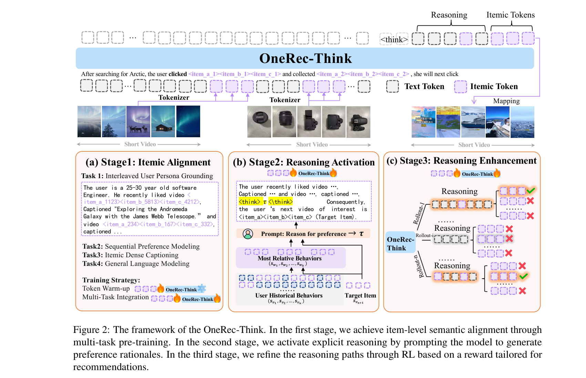
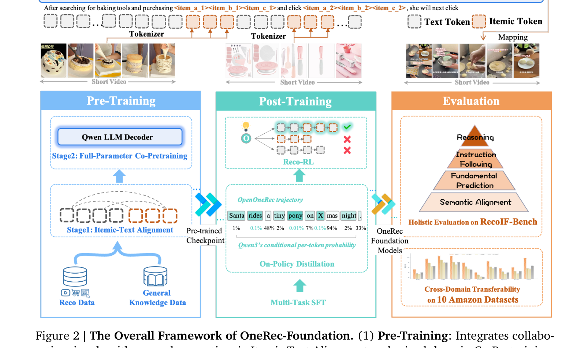
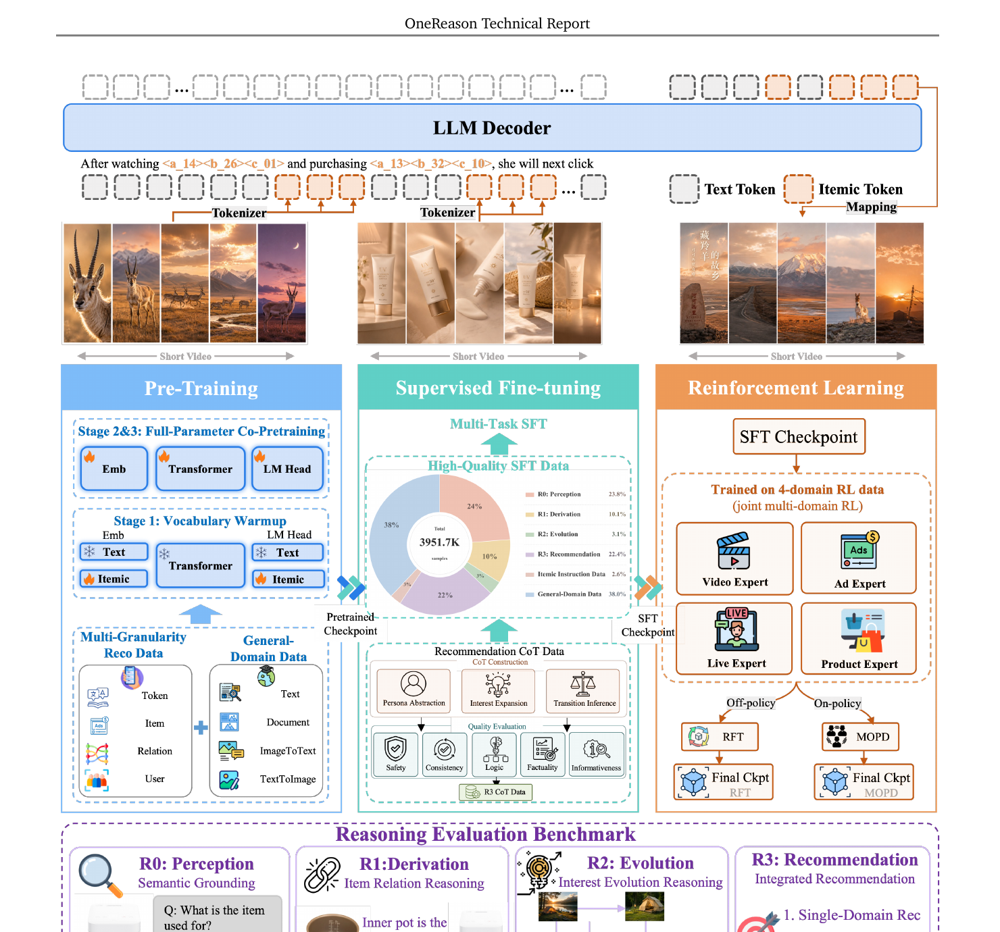
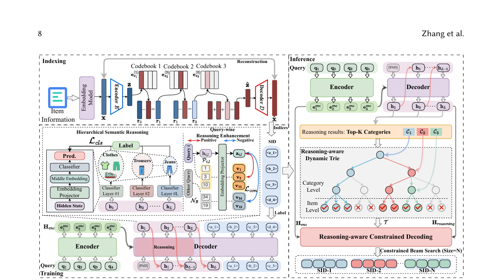
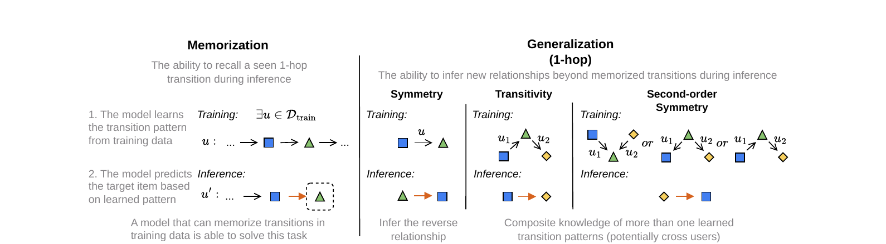

# 推荐系统到底存不存在"思维链"?

> 最近精读了快手 OneReason、北航&美团 CaLIR,又顺着它们的参考文献把人大 ReaRec、LARES、STREAM-Rec 等一串工作捋了一遍。读到最后,我心里冒出一个越想越站得住的判断,先把它放在开头(**这是作者观点,不是论文里的定论,欢迎拍砖**):**推荐系统大概率并不存在 LLM 意义上的"思维链"——它的内核从头到尾还是协同过滤,而所谓"推理链 / CoT",本质上是借了一个时髦概念,给协同过滤加了一层正则化约束。** 这篇文章会沿着一条逻辑链把这些工作串起来:推理链看着像推荐相比普通监督多出来的额外收益源,但最早一批"硬加 CoT"的方法没吃到、甚至更差;后来的工作诊断出"为什么",给出各自解药——而当你把这些解药拆开看,会发现真正起作用的从来不是"模型在思考",而是"往协同过滤里注入了什么样的约束"。

---

## 一、收益从哪来:推理链是监督学习之外多出来的那块

过去十年的推荐,本质是一个**监督学习的匹配问题**。

给定用户历史行为,模型学一个映射,预测"下一个最可能点击/购买的物品"。无论是双塔召回、序列推荐(SASRec/HSTU),还是近两年的生成式推荐(TIGER 把物品量化成语义 ID,让 Transformer 像写句子一样"续写"出目标物品 ID),训练目标都可以写成同一个东西:

```
最大化 P(下一个物品 | 历史行为)
```

一次前向,一个答案。模型从来不"想",它只是把输入压进一个向量,在物品空间里找最近的点。

**LLM 那边发生了什么?** OpenAI o1、DeepSeek-R1 带来了"think before answer":先生成一段思维链(Chain-of-Thought, CoT),再给结论,复杂任务上提升巨大。这件事告诉我们一个朴素的道理——

> 在"输入→输出"之间插入一段推理,本身就是一块**监督学习吃不到的额外收益**。因为它把一个原本要一步跨过的难映射,拆成了"先归纳意图、再据此决策"的几步可学子问题。

推荐天然适合这套。你连续看了帐篷、登山杖、防晒霜,一个好的推荐应该**先归纳出"这个人在准备户外旅行"这个隐藏意图**,再据此扩展——而普通监督模型没有这个归纳环节,它只会找和这三样最像的第四样。推荐的推理本质是**溯因(abductive)**:从零散行为反推最可能的解释,再决策。

### 但要讲清楚:推荐里 CoT 的收益,本质是"注入了外部信息"

这里要先把一个常见的误解掰开。在 LLM 的算术、常识推理任务里,CoT 的收益很大程度来自"多算几步"——答案本就藏在模型参数里,推理链只是把它一步步算出来,哪怕只加一句 "Let's think step by step"(不给任何新知识)都能涨点。

**但推荐不是这样。** 推荐模型的词汇表全是 itemic token(像 `<a_3721><b_0856>`),它面对的根本不是"知识没调出来",而是**压根不知道"这个物品是什么、这串行为意味着什么"**。这种情况下,光给它留出"想几步"的空间是没用的——没有外部信息喂进去,它想不出任何新东西。

所以在推荐里,凡是真正有效的 CoT,本质上都在**注入原本不在模型手里的外部信息**:

- **OneRec-Think** 用大 LLM 蒸馏 CoT,注入的是 LLM 世界知识里"这类物品、这种行为序列该怎么解读"的语义;
- **OneReason** 的 R0→R3 阶梯,注入的是感知(物品是什么)→属性→意图层层递进的结构化监督;
- **CaLIR** 用**商品类目层级**当监督,注入的是一棵外部的类目树先验。

它们共同印证了一件事:**推荐里的"推理收益",不是模型自己多想几步想出来的,而是把外部信息(LLM 知识 / 类目结构 / 层级标注)以推理链的形式喂了进来。** 这也是这块收益"监督学习吃不到"的真正原因——普通监督只学 `历史→物品` 的映射,从没机会把"该怎么解读这串行为"的额外信息塞进来。

记住这条主线,后面第三章的"假思考"就好理解了:一旦该注入的信息没真正进去(itemic 嵌入被稀释、链子是空的),CoT 就只剩一个空草稿区,自然吃不到收益。

### 再往前推一步(作者观点):这其实就是给协同过滤加"正则"

如果你顺着上面这条线再想一层,会得到一个更祛魅、也更统一的解释——**我个人越来越倾向这么看,但要声明这是我的判断、不是论文结论:推荐里的"思维链",本质上不是一种新的推理能力,而是给协同过滤模型加的一层正则化约束。**

推荐的内核从矩阵分解、双塔、SASRec 一路到 TIGER,从没变过——都是在拟合"谁和谁共现、谁和谁相似"的协同信号。CoT / 推理链做的事,不是让模型获得了"思考"这种全新能力,而是把外部先验(LLM 语义、类目树、意图层级)以"推理步骤"的形式,作为额外约束项压进了训练目标。从这个角度看,它和 L2 正则、图正则、对比学习辅助损失扮演的是同一个角色:**给协同过滤的解空间加约束,防止它在稀疏数据上乱拟合、并把外部结构灌进去。** 只不过这次的正则项,恰好长得像"一段推理文字"。

这个视角的好处是,它能一口气解释完后面所有现象:**有效的推理链=有效的正则,无效甚至有害的推理链=失效或带噪的正则。** 带着这把尺子往下读,你会发现每一篇工作其实都在回答同一个问题——这层正则,到底加对了没有。

所以推荐圈自然想抄 LLM 的作业:**在出推荐之前,先让模型生成一段 CoT。** 收益看起来唾手可得——可惜,把"留出思考空间"错当成了"加上了一个有效的正则"。

---

## 二、尴尬的现实:最早硬加 CoT 的方法,没吃到这块收益

收益摆在那,可惜不是"加上去就能拿到"。最早一批尝试撞上了同一堵墙。

### 实证一:快手自己的探路工作,"开了思考反而更差"

OneReason 报告里诚实地复盘了这段。在它之前,快手 OneRec 团队先做了两个探路工作 **OneRec-Think** 和 **OpenOneRec**——这俩可不是随手写的 demo,而是认认真真发了论文、还上了线的工业级尝试。但站在 OneReason 复盘的视角回头看,它们都没真正吃到推理链的收益。先把这两个工作讲清楚,后面的诊断和解药才有靶子。

**OneRec-Think(arXiv 2510.11639,《In-Text Reasoning for Generative Recommendation》)。** 它的出发点很合理:像 OneRec 这样的生成式推荐模型,本质是个"隐式预测器"——给定行为序列,直接吐出下一个物品,中间没有任何可见、可控的推理过程,而这恰恰是 LLM 最值钱的能力。OneRec-Think 想把对话、推理、个性化推荐缝进同一个框架,做法分三步:第一步 **Itemic Alignment**,用跨模态的"物品-文本对齐"给 itemic token 做语义锚定,让模型先认识物品是什么;第二步 **Reasoning Activation**,用 Reasoning Scaffolding(推理脚手架)在推荐语境里把 LLM 的思考能力激活起来;第三步 **Reasoning Enhancement**,针对"用户偏好天然有多个正确答案"这个特点,设计了推荐专属的奖励函数。推理的监督信号怎么来?经典的"左手倒右手"——用一个 LLM 生成 CoT,再蒸馏给推荐模型。它还配了个 "Think-Ahead" 架构解决线上时延,论文里报告在公开 benchmark 上拿到 SOTA、快手线上 APP 停留时长 +0.159%。



**OpenOneRec(Zhou et al., 2026)。** 它走得更"基础设施"一些,目标是做推荐基础模型(GFM),正式提出了"先思考再推荐(think-before-recommend)"这一范式,并把预训练数据按任务类型组织——物品描述、用户行为序列、画像-文本交错——混在一起联合训练。它还顺手立了不少评测规矩:RecIF-Bench(拓宽推荐基础模型的评测)、物品理解任务上的 LLM-as-a-Judge 协议、以及一套通用智能健全性检查套件(覆盖 MMLU-Pro 等,保证专业化不以牺牲通用能力为代价)。OneReason 后面的 OneReason-Bench、评测协议,很多都是直接站在 OpenOneRec 肩膀上扩出来的。



两个工作都成功观察到:"先思考再回答"这套模式**确实能泛化到推荐任务上**——模型真的会在输出物品前生成一段像模像样的推理。但接着就撞上了那个反直觉的现象:

> **开了思考模式,推荐效果并不比不思考更好,有时还更差。**

花了更多算力去"想",却没换来更好的结果。更要命的是,后来一篇专门测量 OpenOneRec "思考 / 不思考"差距的诊断工作(Zhang et al., 2026b)把账算清楚了:失效的根子在于 **itemic token 的嵌入被通用文本先验稀释了**——模型在"假装思考",推理那段文字并没有真正接到物品语义和推荐决策上。这说明:推理链这块收益是真的,但**朴素地接一段 CoT 上去,收益不会自己掉下来**。(顺带一提,OneReason 相比 OpenOneRec 还做了个小而关键的改动:砍掉了序列尾部的 end token,把省下来的上下文长度让给推理轨迹。)

### 实证二:电商检索里,显式 CoT 是最差的一档

CaLIR 在电商生成式检索里做了一组干净的对照实验(它的 RQ4),把"在生成物品 SID 之前先显式生成一段类目推理"当作一个基线:

```
CaLIR(隐式潜在推理)  R@100 = 36.15
显式预测类目 SID                28.48
TIGER(无推理基线)              25.98
显式 CoT 推理                   24.05   ← 最差,甚至不如无推理基线!
```

**显式 CoT 不仅没吃到收益,还成了负收益**——比啥推理都不加的 TIGER 还低。

两个实证指向同一个结论:**推理链是收益源,但"朴素加 CoT"这条最直觉的路,吃不到。** 这才是后续所有工作的真正起点。

---

## 三、诊断:为什么收益没掉下来?

收益没吃到,得先搞清楚病因。两篇代表作给出的诊断角度不同,但本质都是同一句话——**推理没有真正落地到决策上**。

**OneReason 的诊断:思考是"假思考",地基没打牢。** 模型生成的 CoT 看起来像在推理,但这段推理没真正影响推荐决策。它把病因归到两块地基:**感知(perception)** 和 **认知(cognition)**。推荐模型的"词汇表"全是 itemic token(像 `<a_3721><b_0856>`),这些 token 的嵌入被通用文本先验**稀释**了,模型连"这个物品是什么"都没认清(感知没打牢),更谈不上在此基础上做有效推理(认知没打牢)。地基是沙子,上面盖的 CoT 自然是空中楼阁。

**CaLIR 的诊断:显式推理链会污染后续生成。** 在生成式检索里,推理链一旦不完整或过窄,会**污染后续的 beam search**;而物品 SID 不像自然语言有语义冗余,**第一个 token 错了就很难救回来**。更糟的是,显式推理逼着模型在检索前就把自己**钉死**在某个离散的中间标签上——多意图查询一旦类目猜窄,就全盘皆输。再加上显式解码 token 带来的高延迟(后面会看到数字),这条路在电商工业场景根本不划算。

> 一句话概括两家的诊断:**"思考"不是一个能直接外接、插上就用的功能模块;它要么需要把感知/认知地基逐层夯实(OneReason),要么需要换一种不污染、不钉死的承载形式(CaLIR)。**

翻译成第一章那把"正则"的尺子:**朴素 CoT 之所以失效,是因为它是个带噪甚至有害的正则项——约束没真正压到协同信号上(假思考),反而扰乱了生成空间(污染 beam)。** 模型确实生成了一段像样的推理文字,但那段文字没起到"约束解空间、灌入外部结构"的作用,等于加了个空转的正则。这也再次说明:重点从来不是"模型有没有在思考",而是"这层约束有没有加对"。

这就引出了分别的解药——而解药的具体做法,正好把"推理 vs 普通监督训练"的区别,在 train 和 infer 两个阶段都暴露了出来。

---

## 四、解药(一):OneReason —— 用 train 阶段的三步夯地基,让显式推理真正有用

OneReason 的路线是**留在显式 CoT 这条路上,但把地基补好**。它的解药全在训练阶段,这也正是它和普通监督训练分道扬镳的地方。

普通监督训练只有一步:最大化 `P(物品|历史)`。OneReason 在训练时多了**三步**(下图从左到右就是这三步:预训练 → SFT → RL,底部还挂着 R0–R3 的诊断标尺):




1. **预训练补感知**:用 578B token 对齐 itemic token 和文本的语义空间,先让模型"认得物品"——这是普通监督训练完全没有的环节,目的就是修"itemic 嵌入被稀释"这个病。
2. **SFT 补认知**:训练数据不再是 `(历史→物品)`,而是 `(历史→推理链→物品)`。它用 R0→R3 的诊断阶梯组织监督(感知→属性→意图→推荐),逐层教模型怎么想。这里需要**额外构造高质量推理链数据**(用多个 GRPO 训出的专家教师蒸馏)。
3. **RL 调思考**:这是和普通监督最大的不同——普通监督**没有 RL 这一步**。OneReason 用 GRPO,**拿推荐效果当 reward,反过来优化模型的推理过程**(specialize-then-unify:4 个专家教师 → RFT/MOPD 统一)。

效果:**第一次让"思考模式 > 不思考模式"在多个真实业务榜单上稳定成立**。还有个漂亮的副产品——用带 CoT 的数据训练后,**连关掉思考的直接推荐都变好了**,说明"教模型思考"的好处会渗进参数里。

一个值得记的边界:OneReason 发现兴趣扩展宽度 n 取 1/3/5 最优,取 10/20 反而变差——**推理链不是越长越好,关键是把噪声挤掉、只留承重证据**(信息瓶颈)。

> **OneReason 揭示的 train 阶段区别:** 普通监督学"输入→输出"的映射;显式推理式训练学"输入→怎么想→输出"的整个过程,代价是要额外提供推理链监督数据,并引入 RL 后训练去优化"怎么想"。

---

## 五、解药(二):隐式潜在推理 —— 换掉会污染的承载形式,把收益从 train 和 infer 同时抠出来

另一条路不修显式 CoT,而是**换承载形式**:既然"说出来"的推理会污染、会钉死、还慢,那就让模型在连续隐状态里"默想",根本不输出推理 token。

下面这张 CaLIR 的整体框架图,正好把这条路的三个阶段画清楚了:左边 Indexing 把商品量化成 SID,中间 Training 用类目层级监督隐状态(Hierarchical Semantic Reasoning + Query-wise Enhancement),右边 Inference 用推理出的 Top-K 类目拼动态前缀树做约束解码。



这条路的源头是 LLM 领域的 **Coconut**(Chain of Continuous Thought, Meta 2024):把 Transformer 最后一层隐状态直接当作"下一步思考"喂回去,在连续空间里推理,不解码成文字。搬进推荐后长出一串工作:

- **ReaRec / Think Before Recommend(人大,2503.22675)**:**首个推荐"推理时计算"框架**。把序列最后隐状态自回归喂回编码器,多算几步再出推荐,配 reasoning position embedding 解耦,把多个 backbone 的性能上限抬高 30%–50%。
- **LARES(人大高瓴,2505.16865)**:depth-recurrent 架构,**不增加参数**就能扩展推理深度,两阶段训练(自监督预训练 + 强化后训练)。
- **STREAM-Rec(2504.09627)**:推荐前做多步慢思考。
- **CaLIR(北航&美团,2606.07075)**:电商检索里,在生成 SID 前插入 L=3 步连续隐状态,并用**商品类目层级**(粗→细)监督这些隐状态,再用约束解码落地。

### 这条路怎么解决"诊断"里指出的病?——分 train 和 infer 看

**train 阶段:给隐状态接上结构化监督,否则照样吃不到收益。**

隐式推理最大的坑是:你光在模型里插几步"空想"的隐状态,模型根本不知道该往里塞什么。CaLIR 的消融实验(RQ2)给了一记响亮警告:

```
TIGER(无推理)                R@100 = 25.98
插了空的推理隐状态但不监督    R@100 = 26.38   ← 几乎没涨!
```

**光给模型留出"想"的空间毫无用处,必须给这些隐状态接上真实、有结构的监督信号。** CaLIR 用类目树当"标准答案"(第 l 步隐状态对齐第 l 级类目,带层级约束掩码),强行让"心算"沿"由粗到细"的意图路径走;LARES 则用自监督的轨迹对齐+步骤对齐来教模型怎么递归精炼。这正是普通监督训练里不存在的东西——**你得为"模型怎么想"专门设计一套监督**。

**infer 阶段:用隐状态"想"而不是用 token"想",还用想出的结论约束生成。**

普通监督的推理极简单:输入过一遍网络,出打分,取 Top-K,**一次前向就结束**,计算量固定、和问题难不难无关。

推理式则引入了**推理时计算(test-time scaling)**:出答案前额外花计算去想几步。关键差异在于"用什么想":

- 显式 CoT 用解码 token 想——慢。CaLIR 测出显式 CoT 要 **0.433s**。
- 隐式潜在推理用隐状态想——快。CaLIR 的潜在推理是**整个 batch 跑一次、所有候选共享、不随 beam size 翻倍**,代价线性 O(BL),只要 **0.296s**(基线 TIGER 0.258s),却比 CoT 快得多、效果还最好。

而且推荐场景还有一招普通监督没有的操作:**用推理出的结论反过来约束生成空间**。CaLIR 用预测出的 Top-K 类目,在线动态拼一棵前缀树,把解码锁在"预测意图"对应的物品里——候选空间从 10^5 压到 10^3。

注意推理深度也不是越深越好:CaLIR 发现 3 步最优,再多反而降——和 OneReason 的宽度信息瓶颈遥相呼应。

> **隐式路线揭示的区别:** train 时要给隐状态接结构化监督(否则空转);infer 时从"一次前向、定额计算"变成"多步隐状态计算 + 用推理结论约束生成",且推理深度可调。

---

## 六、一张表:把整条逻辑钉死

| 维度 | 普通监督训练 | 显式推理(OneReason) | 隐式推理(CaLIR/ReaRec) |
|---|---|---|---|
| **收益来源** | 直接映射,无额外收益 | 推理链拆解难映射 | 推理链拆解难映射 |
| **朴素做法为何吃不到** | —— | 感知/认知地基没打牢,假思考 | 显式链污染 beam、钉死中间标签 |
| **解药在哪个阶段** | —— | 主要在 train | train + infer 都有 |
| **train:训练目标** | P(物品\|历史) | 推理链监督 + RL 后训练 | 主任务 + 隐状态结构化监督 |
| **train:额外数据** | 无 | 高质量推理链(教师蒸馏) | 结构化信号(如类目树) |
| **train:是否用 RL** | 否 | 是(GRPO,推荐效果当 reward) | 部分(如 LARES 的强化后训练) |
| **infer:推理时计算** | 一次前向,定额 | 多步解码出 token(慢 0.433s) | 多步隐状态(快 0.296s) |
| **infer:推理深度** | 不可调 | 可调(CoT 长度,n=1/3/5 最优) | 可调(步数,L=3 最优) |
| **infer:生成约束** | 无 | 推理引导 | 推理结论→约束解码(前缀树) |
| **可解释性** | 弱 | 强 | 弱 |

---

## 七、给从业者的三点启发

**第一,收益源 ≠ 能直接拿到的收益。** 推理链确实是监督学习之外多出来的一块,但"硬加 CoT"会吃不到甚至赔本(OneRec-Think 变差、CaLIR RQ4 显式 CoT 垫底)。引入推理前先问一句:我的"思考"会不会是假思考、会不会污染下游?

**第二,grounding 比 reasoning 本身更重要。** OneReason 的"先打感知/认知地基"和 CaLIR 的"空推理几乎不涨(25.98→26.38)"说的是同一件事:**给模型留出思考空间没用,必须给思考接上真实、有结构、可验证的监督信号或地基。**

**第三,选显式还是隐式,看场景。** 延迟敏感、目标是人造 ID 的检索/召回,隐式潜在推理更划算(快、不污染);需要可解释、做内容理解的场景,显式 CoT 在打好地基后(像 OneReason 那样)才值得。这不是"推理有没有用"的问题,而是"在什么场景、用什么形式承载推理"的问题。

### 还有更冷的一层:连"泛化"本身,都该打个问号

上面这条线索始终隐含一个乐观前提:生成式推荐比传统模型更会"举一反三"。但 CMU / UCSD / Meta 的一篇分析工作《How Well Does Generative Recommendation Generalize?》倒是狠狠泼了盆冷水。他们把每个预测样本按所需能力拆成两类——**记忆**(复用训练里见过的转移模式)和**泛化**(把已知模式组合出没见过的新转移)——发现生成式模型确实在"需要泛化"的样本上更强,传统 item-ID 模型则在"需要记忆"的样本上更强。



真正扎心的是第二层发现:他们把分析从 item 级下沉到 token 级,发现**生成式模型看起来的"item 级泛化",很多其实退化成了 semantic ID 空间里的 token 级记忆**。换句话说,那份看似漂亮的"泛化能力",不少是拆词表后背下的 n-gram 记忆在撑场。这和本文一路讲的"假思考"是同一种警示:**模型看起来在做高级能力、实则只是退化成了低级模式**。好在他们最后给了个务实的结论:记忆与泛化两个路子是互补的,用一个按样本自适应加权的 memorization-aware ensemble 把两者缝起来,整体效果反而更好。

把这个视角叠到推理上:我们期待推理带来的,本质也是一种"泛化"——把理解、组合、推导用到没见过的情境里。但如果连生成式推荐原本的"泛化"都可能是记忆的乔装,那我们就更该警惕:别被"模型生成了一段推理文字"这个表象骗了。真正要验证的始终是同一件事:那份额外的计算/推理,到底是真的带来了泛化,还是只是换个姿势在背诵。

### 我的结论(欢迎拍砖):推荐没有"思维链",只有协同过滤的正则

把开头那个判断在这里收一下口。我个人的结论是:**推荐系统并不存在 LLM 意义上的"思维链"。** 它没有"先理解、再推导、最后决策"的真实认知过程,内核始终是那个老老实实拟合共现/相似结构的协同过滤;所谓推理链,是我们借了 LLM 的概念,给这个内核加了一层正则化外衣。

可能有人立刻拿 MemGen-GR 那个发现反驳:生成式模型在"需要泛化"的样本上确实更强,这不正说明它超出了纯记忆、有了某种推理吗?但恰恰是那篇文章的第二层结论替我把话说圆了——**那份"泛化"很多退化成了 semantic ID 空间里的 token 级记忆**。换句话说,看似的推理能力,拆到底层还是共现统计在起作用,只是换了个更细的粒度。这非但不反对"内核是协同过滤",反而是它的一个佐证。

需要强调的是,**说它"只是正则",绝不是说它没用**——好的正则能实打实涨指标(OneReason 让"思考>不思考"成立、CaLIR 把 R@100 从 25.98 抬到 36.15)。我想破除的只是那层拟人化的浪漫想象:不要以为模型真的学会了"思考",从而对它的可解释性、可靠性抱有不切实际的期待。把它当成"一种把外部结构灌进协同过滤的、恰好长得像推理的正则手段",你反而能更冷静地判断:这层正则在我的场景里,该不该加、怎么加、加多深。

(这是一家之言,定义"思维链"的口径不同,结论可能就不同——如果你有不同看法,我很乐意被说服。)

---

## 八、结语

回到标题那个问题:推荐系统到底存不存在"思维链"?

我的答案是:**严格意义上,不存在。** 推荐没有"先理解、再推导、最后决策"的真实认知;它一直在做协同过滤,而"推理链"是给这个内核加的一层正则——有时加对了(OneReason、CaLIR),有时加错了甚至加坏了(早期硬塞 CoT)。所以这篇文章真正值得记住的一课,不是"加了推理就变好",而是:**别被"模型在思考"这个表象迷住,要去看那层约束到底有没有压到协同信号上。** 最早硬加 CoT 的方法没吃到收益,正是因为那层正则空转了;后来的两条解药——显式路线把感知/认知地基逐层夯实(train 阶段补预训练+SFT+RL),隐式路线换掉会污染的承载形式(train 给隐状态接监督、infer 用隐状态多步计算+约束生成)——本质都是在想办法把这层正则加对、加实。

无论哪条路,它们和普通监督训练的根本区别都落在同一处:**普通监督是"一次前向、定额计算、直接映射";推理式是"先绕几步、计算可调、要为'怎么约束'额外付出训练代价"。** 而这份额外代价能不能换来收益,取决于你有没有把那层约束真正落到决策上——而不是取决于模型有没有"装出在思考的样子"。

(再说一遍:这是作者的一家之言。如果你坚持认为隐空间里的多步计算就配得上"思维链"三个字,那也是一种站得住的口径——欢迎来辩。)

---

> **参考文献(按出现顺序)**
> - Wei et al., Chain-of-Thought Prompting Elicits Reasoning in LLMs, 2022
> - DeepSeek-AI, DeepSeek-R1, 2025
> - Hao et al., Training LLMs to Reason in a Continuous Latent Space (Coconut), arXiv 2412.06769
> - OneReason(快手), arXiv 2606.06260(含对 OneRec-Think / OpenOneRec 的复盘)
> - OneRec-Think(快手), arXiv 2510.11639
> - OpenOneRec / OneRec-Foundation(快手), arXiv 2512.24762
> - Tang et al., Think Before Recommend (ReaRec), arXiv 2503.22675
> - Liu et al., LARES: Latent Reasoning for Sequential Recommendation, arXiv 2505.16865
> - Zhang et al., STREAM-Rec / Slow Thinking, arXiv 2504.09627
> - Fuwei Zhang et al., CaLIR(北航&美团), arXiv 2606.07075
> - Ding et al., How Well Does Generative Recommendation Generalize? (MemGen-GR), arXiv 2603.19809
