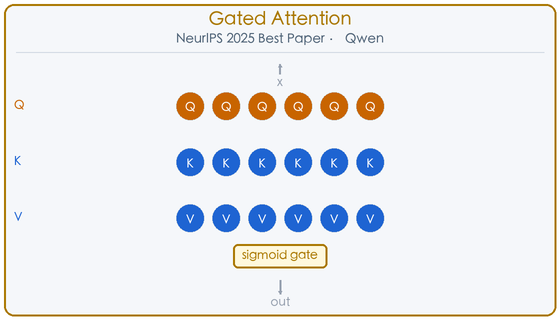
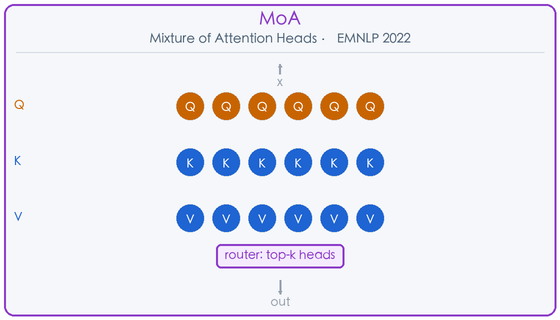
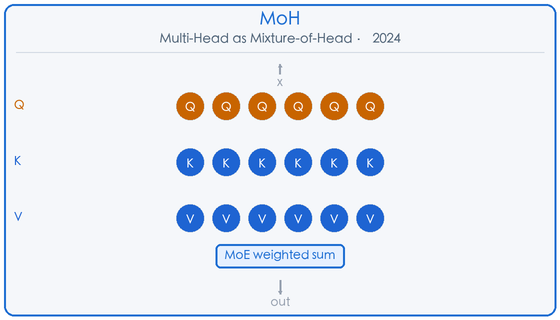
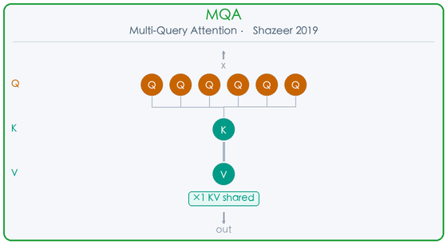
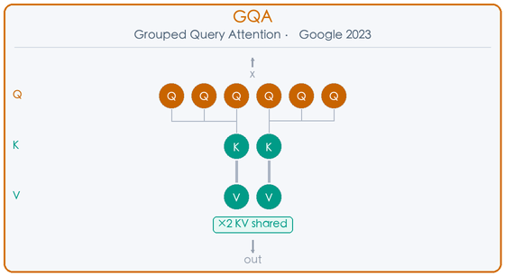
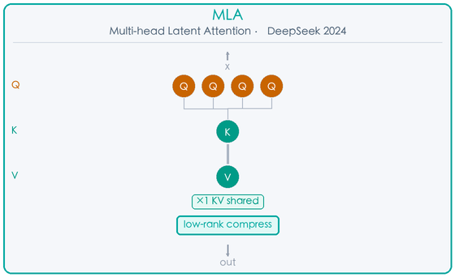
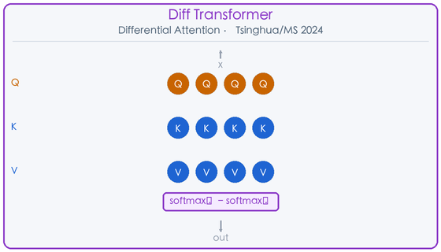
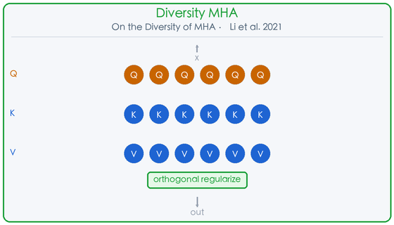

> **深度调研 · 2025**

# 注意力头的进化史 MHA 20+ 变体全景图

> 从 MQA 到 Gated Attention，从稀疏注意力到线性注意力 · 一文梳理 2019–2025 年最重要的注意力机制变体

**20+** 重要变体 ｜ **6** 核心类别 ｜ **7** 年跨度

> Multi-Head Attention（MHA）自 2017 年 Transformer 问世以来，已经历了七年的密集演化。从最初的“多头并行”到如今的“门控稀疏激活”，研究者们从效率、表达力、多样性、推理加速等多个维度对其进行了深度改造。本文系统梳理 20+ 个重要变体，覆盖 Head Gating、KV 压缩、稀疏注意力、线性注意力、条件化与解耦等六大类别。

## 一、七年进化时间轴

- **2019** — **MQA**（Shazeer）：所有 Query 头共享单组 KV，推理加速的起点；**Sparse Transformer**（OpenAI）：首次将注意力复杂度从 O(n²) 降至 O(n√n)；**Voita et al.**：发现大多数注意力头是冗余的，少数"专业头"承担主要功能。
- **2020** — **Longformer**（Allen AI）：滑动窗口 + 全局注意力，O(n) 复杂度；**BigBird**（Google）：全局 + 局部 + 随机三合一，理论证明图灵完备；**Reformer**（Google）：LSH 哈希注意力，O(n log n)。
- **2021** — **DeBERTa**（Microsoft）：内容/位置解耦注意力，GLUE 超越 RoBERTa；**Performer**（Google）：FAVOR+ 随机特征近似，线性复杂度；**Li et al.**：正交性正则化，首次系统研究头间子空间多样性。
- **2022** — **MoA**（Zhang et al.）：MoE 引入注意力头，每 token 动态选 top-k 头；**FiSHformer**（NeurIPS）：有限混合共享头，参数效率优化；**FlashAttention v1**（Dao et al.）：IO 感知分块计算，成为 LLM 训练标配。
- **2023** — **GQA**（Google）：分组 KV 共享，LLaMA 2/3、Mistral 等主流模型采用；**GLA**（Yang et al.）：数据依赖门控线性注意力，与 Mamba 性能相当。
- **2024** — **MLA**（DeepSeek-V2）：低秩 KV 联合压缩，KV Cache 压缩至 MHA 的 1/10；**MoH**（Jin et al.）：头作为 MoE 专家加权，支持 continue-tuning；**SwitchHead**（NeurIPS）：MoE 应用于注意力层；**DCMHA**：动态组合注意力头；**Diff Transformer**（清华/微软）：双 Softmax 差分去噪。
- **2025** — **Gated Attention**（Qwen，NeurIPS 2025 最佳论文）：头专属 Sigmoid 门控，消除 Attention Sink，改善长上下文外推能力。

## 二、六大类别详解

### 🔀 类别一：Head Gating / Head Selection

这一类别的核心思想是：**不同 token 应该激活不同的注意力头**。从离散的 top-k 选择到连续的 sigmoid 加权，研究者们用不同方式实现了"条件化头激活"。

**Gated Attention for Large Language Models** `NeurIPS 2025 Best Paper` `Head Gating`
*Qiu et al.（阿里通义千问团队）· 2025*

> 💡 大白话：给每个注意力头加一个"开关"，这个开关由当前 token 的 query 决定，让模型自己学会哪些头该开、哪些头该关。

Gated Attention 是阿里通义千问团队在 2025 年提出的注意力机制改进方案，荣获 NeurIPS 2025 最佳论文奖。其核心思想极为简洁：在标准 SDPA（Scaled Dot-Product Attention）的输出之后，为每个注意力头引入一个独立的 Sigmoid 门控：
output_h = sigmoid(W_g · q_h) ⊙ SDPA(Q_h, K, V)
门控向量由当前 token 的 Query 线性变换得到，因此是 **token-dependent** 的——不同 token 对不同头的激活强度各异，天然产生动态稀疏性。这与 MoA 的离散 top-k 路由不同，Gated Attention 是连续可微的软门控，训练更稳定。
论文系统对比了 30+ 种门控变体（门控位置、激活函数、归一化方式等），在 15B MoE 和 1.7B 稠密模型上进行了大规模验证。关键发现包括：① 门控能有效消除 **Attention Sink**（注意力集中在少数 token 上的病态现象）；② 改善长上下文外推能力，在 128K 上下文长度下性能显著优于标准 MHA；③ 计算开销极小，仅增加一个线性层，推理延迟几乎不变。
Gated Attention 已被集成到 Qwen3 系列模型中，是目前工业界最具影响力的注意力头改进方案之一。

**Mixture of Attention Heads (MoA)** `EMNLP 2022` `Head Selection`
*Zhang et al. · 2022*

> 💡 大白话：把 MoE（混合专家）的思路搬到注意力头上——维护一个大的头池，路由器为每个 token 动态选 top-k 个头来处理。

Mixture of Attention Heads（MoA）由 Zhang et al. 在 EMNLP 2022 提出，将混合专家（MoE）的核心思想迁移到注意力头层面。标准 MHA 中每个 token 都激活全部 H 个头；MoA 则维护一个更大的头池（如 2H 个头），由一个轻量路由器为每个 token 动态选择 top-k 个头参与计算。
路由器的输入是 token 的 Query 表示，输出是对各头的选择概率。训练时使用辅助负载均衡损失，确保各头被均匀激活，避免路由崩溃。推理时只计算被选中的 k 个头，理论上可将计算量降低至 k/H。
MoA 的关键优势在于：在不增加推理 FLOPs 的前提下，通过扩大头池容量提升模型表达力。实验表明，MoA 在机器翻译、文本摘要等任务上优于同等参数量的标准 MHA，且路由决策具有一定可解释性——不同语义类型的 token 倾向于激活不同的头组合。
MoA 是离散 top-k 选择，与后续的 MoH（连续加权）和 Gated Attention（软门控）形成了一个从离散到连续的设计谱系。

**MoH: Multi-Head Attention as Mixture-of-Head Attention** `arXiv 2024` `Head Selection`
*Jin et al. · 2024（arXiv 2410.11842）*

> 💡 大白话：把 MHA 的输出重写为求和形式，用 MoE 路由机制对各头加权，每次只激活 50%～90% 的头，参数不变、精度持平甚至提升。

Multi-Head as Mixture-of-Head（MoH）由 Jin et al. 于 2024 年提出（arXiv 2410.11842），从数学角度重新审视了 MHA 的输出结构。标准 MHA 的输出是各头输出的简单求和；MoH 将其改写为加权求和，权重由 MoE 风格的路由机制动态生成：
output = Σ_h router(x)_h · head_h(x)
路由权重是连续的（不同于 MoA 的离散 top-k），但在推理时可以通过阈值截断实现稀疏激活，每次只激活 50%～90% 的头。这使得 MoH 既保留了梯度流畅的训练优势，又能在推理时节省计算。
MoH 的另一个重要特性是支持从已有 MHA 模型进行 **continue-tuning**：只需在现有 MHA 权重基础上微调路由器，无需从头训练。论文在 LLaMA3-8B 等模型上验证，以极低的微调成本（约 1% 的训练步数）实现了参数不变、精度持平甚至提升的效果。
MoH 与 SwitchHead（NeurIPS 2024）的思路相近，但 MoH 更侧重于从已有模型迁移，而 SwitchHead 更关注从头训练时的 wall-clock 加速。

### ⚡ 类别二：KV 共享 / 推理加速（MQA / GQA / MLA）

这一类别聚焦于**推理效率**，核心问题是：如何在保持表达力的同时，大幅压缩 KV Cache 的内存占用？

**Multi-Query Attention (MQA)** `2019` `KV 压缩`
*Shazeer · 2019*

> 💡 大白话：所有 Query 头共享同一组 Key 和 Value，KV Cache 从 H 份压缩到 1 份，推理速度大幅提升。

Multi-Query Attention（MQA）由 Noam Shazeer 于 2019 年提出，是 KV Cache 压缩领域的奠基性工作。其思想极为简洁：将标准 MHA 中 H 组独立的 Key/Value 头压缩为 **1 组共享的 KV 头**，所有 Query 头共享同一组 K 和 V。
这一改动对推理效率的影响是革命性的：KV Cache 的内存占用从 O(H·L·d) 降至 O(L·d)（H 为头数，L 为序列长度，d 为头维度），降低了约 H 倍。在自回归生成场景下，KV Cache 的读写带宽往往是推理瓶颈，MQA 的内存节省直接转化为显著的速度提升（通常 2-4×）。
代价是轻微的质量下降：由于所有 Query 头共享同一组 KV，模型的表达能力有所降低，在需要精细区分不同注意力模式的任务上可能表现略差。
MQA 被 PaLM、Falcon 等早期大模型采用。后续的 GQA 在 MQA 和 MHA 之间找到了更好的平衡点，成为当前主流选择。MQA 的核心贡献在于证明了 KV 共享的可行性，为整个 KV 压缩研究方向奠定了基础。

**Grouped Query Attention (GQA)** `Google · 2023` `KV 压缩`
*Ainslie et al.（Google）· 2023（arXiv 2305.13245）*

> 💡 大白话：MQA 和 MHA 的折中——把 Query 头分成 G 组，每组共享一个 KV 头，质量接近 MHA，速度接近 MQA。

Grouped Query Attention（GQA）由 Google 的 Ainslie et al. 于 2023 年提出（arXiv 2305.13245），是目前工业界最广泛采用的 KV 压缩方案。GQA 在 MHA（H 组 KV）和 MQA（1 组 KV）之间引入了一个连续的设计空间：将 H 个 Query 头分成 G 组，每组共享一个 KV 头，共 G 组 KV（1 ≤ G ≤ H）。
当 G=H 时退化为标准 MHA；当 G=1 时退化为 MQA。通过调整 G，可以在质量和效率之间灵活权衡。论文发现，G 取 H/8 左右时，质量已非常接近 MHA，而 KV Cache 压缩比达到 8×，推理速度接近 MQA。
GQA 的另一个重要贡献是提出了从 MHA 模型转换为 GQA 模型的 **uptrain** 方法：将同组的多个 KV 头通过均值池化合并为一个，然后在原始训练数据的一小部分上继续训练，即可恢复大部分质量损失。这使得已有的 MHA 模型可以低成本迁移到 GQA。
GQA 已被 LLaMA 2/3、Mistral、Gemma、Qwen 等几乎所有主流开源大模型采用，是当前 LLM 推理优化的事实标准。

**Multi-head Latent Attention (MLA)** `DeepSeek · 2024` `KV 压缩`
*DeepSeek 团队 · 2024（DeepSeek-V2）*

> 💡 大白话：不存完整 KV，而是把 KV 压缩到低维潜在空间，推理时只缓存潜在向量，再通过矩阵吸收技巧恢复完整 KV。

Multi-head Latent Attention（MLA）由 DeepSeek 团队在 DeepSeek-V2（2024）中提出，是迄今为止压缩比最高的 KV Cache 方案。MLA 的核心思想是对 KV 进行**低秩联合压缩**：不再分别存储 K 和 V，而是将它们联合投影到一个低维潜在向量 c，推理时再从 c 恢复 K 和 V。
c = W_c · x  （低秩压缩，dim(c) ≪ dim(K)+dim(V)）
K = W_k · c,  V = W_v · c  （推理时恢复）
MLA 将 KV Cache 压缩至标准 MHA 的约 **1/10**（DeepSeek-V2 中从 576 维压缩到 512 维的联合潜在向量，实际压缩比约 5-13×，取决于配置）。这使得在相同显存下可以支持更长的上下文或更大的批量大小。
MLA 还引入了解耦的旋转位置编码（RoPE）：将 Q 和 K 分为携带位置信息的部分和不携带位置信息的部分，后者可以被吸收进 W_k/W_v 矩阵，进一步减少推理时的计算量。
MLA 在 DeepSeek-V2（236B MoE）和 DeepSeek-V3 上得到验证，在保持与 MHA 相当质量的同时，大幅降低了推理成本，是目前最先进的 KV 压缩技术之一。

### 🎯 类别三：条件化 / 自适应 MHA

**Differential Transformer（Diff Transformer）** `清华 & 微软 · 2024` `差分注意力`
*Ye et al. · 2024（arXiv 2410.05258）*

> 💡 大白话：用两个 Softmax 注意力图相减，差分操作相互抵消噪声，让注意力更聚焦于真正相关的 token。

Differential Transformer 由清华大学和微软研究院的 Ye et al. 于 2024 年提出，针对标准注意力机制中普遍存在的**注意力噪声**问题提出了优雅的解决方案。
标准 Softmax 注意力会将注意力分数分配给所有 token，包括不相关的背景 token，形成"注意力噪声"。Diff Transformer 的核心思想是用**差分注意力**替代标准注意力：将每个注意力头拆分为两个子头，分别计算 Softmax 注意力分数，然后取差值：
Attn = softmax(Q₁K₁ᵀ/√d) - λ · softmax(Q₂K₂ᵀ/√d)
其中 λ 是可学习的标量参数，初始化为较小值。差分操作类似于信号处理中的差分放大器，能有效抵消公共模式的噪声，突出真正重要的信号。
实验表明，Diff Transformer 在语言建模、长上下文理解、关键信息检索等任务上显著优于标准 Transformer，且对 Attention Sink 现象有天然的抑制作用。在参数量相当的情况下，Diff Transformer 的性能相当于标准 Transformer 参数量的约 1.6 倍。
Diff Transformer 的设计思路与 Gated Attention 有相似之处（都在抑制注意力噪声），但机制完全不同：前者通过差分消噪，后者通过门控稀疏化。

**On the Diversity of Multi-Head Attention** `Neurocomputing 2021` `多样性正则化`
*Li et al. · 2021*

> 💡 大白话：用正则化让各注意力头的子空间尽量正交，减少冗余，提升表达效率。

Li et al. 于 2021 年发表的论文《On the Diversity of Multi-Head Attention》系统研究了 MHA 中注意力头的多样性问题。研究发现，标准 MHA 训练后往往存在大量**冗余头**——不同头学到了高度相似的注意力模式，这既浪费了模型容量，也限制了表达能力。
论文提出了两种促进头多样性的方法：
**① 不一致性正则化（Inconsistency Regularization）**：在损失函数中加入惩罚项，直接最大化不同头的注意力分布之间的差异（如 KL 散度），鼓励各头关注不同的 token 模式。
**② 正交性约束（Orthogonality Constraint）**：在训练时施加软正则化，鼓励不同头的投影子空间尽量正交。正交子空间意味着各头捕获的信息维度相互独立，从而最大化信息利用率。
实验表明，这两种方法都能有效减少头间冗余，在机器翻译、文本分类等任务上提升性能，且正交性约束的效果更为稳定。这项工作为后续的头剪枝（Voita et al.）和头选择（MoA、MoH）研究提供了重要的理论基础：如果头本身就是多样的，那么选择性激活头才有意义。
从更宏观的视角看，这项工作揭示了 MHA 设计中的一个根本张力：增加头数可以提升表达力，但如果头之间高度冗余，增加头数的边际收益会迅速递减。正交性约束是解决这一问题的优雅方案。

### 📐 类别五：线性 / 门控线性注意力

**速览**

- **GLA** Yang et al. 2023 · 数据依赖门控线性注意力 · 与 RetNet/Mamba 性能相当 · 硬件高效并行训练
- **Performer** Google ICLR 2021 · FAVOR+ 随机正交特征近似 Softmax 核 · O(n) · 理论保证近似精度

### 🛠️ 类别六：其他重要变体

**速览**

- **FlashAttention** Dao et al. 2022–2024 · IO 感知分块计算 · 显存 O(n) · 2-8× 实际加速 · LLM 训练标配
- **DeBERTa** Microsoft ICLR 2021 · 内容/位置解耦注意力 · 三种交互矩阵 · GLUE 超越 RoBERTa
- **SwitchHead** Csordás et al. NeurIPS 2024 · MoE 应用于注意力层 · 对 V/W_O 矩阵路由 · wall-clock 加速
- **DCMHA** Xiao et al. 2024 · 动态组合注意力头 · 低秩+对角分解 · 显著提升 LLM 表达能力
- **Voita et al.** ACL 2019 · 发现大多数头冗余 · 少数专业头（句法/位置/稀有词）承担主要功能 · 头剪枝理论基础

## 三、20+ 变体汇总速查表

| 变体 | 作者/机构 | 年份 | 核心机制 | 类别 |
| --- | --- | --- | --- | --- |
| Gated Attention | Qiu et al. (Qwen) | 2025 | 头专属 Sigmoid 门控 | Head Gating |
| MoA | Zhang et al. | 2022 | 每 token 路由选 top-k 头 | Head Selection |
| MoH | Jin et al. | 2024 | 头作为 MoE 专家加权 | Head Selection |
| SwitchHead | Csordás et al. | 2024 | MoE 应用于注意力层 | Head Selection |
| DCMHA | Xiao et al. | 2024 | 动态组合注意力头 | Adaptive |
| FiSHformer | Nguyen et al. | 2022 | 有限混合共享头 | Head Sharing |
| MQA | Shazeer | 2019 | 单 KV 头共享 | KV 压缩 |
| GQA | Ainslie et al. | 2023 | 分组 KV 头共享 | KV 压缩 |
| MLA | DeepSeek | 2024 | 低秩 KV 联合压缩 | KV 压缩 |
| Diff Transformer | Ye et al. | 2024 | 双 Softmax 差分去噪 | 条件化 |
| 正交性 MHA | Li et al. | 2021 | 子空间正交正则化 | 多样性 |
| 头剪枝分析 | Voita et al. | 2019 | 专业头识别与剪枝 | 可解释性 |
| Sparse Transformer | Child et al. | 2019 | strided/fixed 稀疏模式 | 稀疏 |
| Longformer | Beltagy et al. | 2020 | 滑动窗口+全局注意力 | 稀疏 |
| BigBird | Zaheer et al. | 2020 | 全局+局部+随机三合一 | 稀疏 |
| Reformer | Kitaev et al. | 2020 | LSH 哈希注意力 | 稀疏 |
| GLA | Yang et al. | 2023 | 数据依赖门控线性注意力 | 线性/门控 |
| Performer | Choromanski et al. | 2021 | FAVOR+ 随机特征近似 | 线性 |
| FlashAttention | Dao et al. | 2022–2024 | IO 感知分块计算 | 硬件优化 |
| DeBERTa | He et al. | 2021 | 内容/位置解耦注意力 | 解耦 |

---

**每日推荐系统论文追踪**

    调研范围：NLP / 大模型 / 推荐系统 · 覆盖 2019–2025 年 · 20+ 重要 MHA 变体

    © 2025 · 转载请注明出处